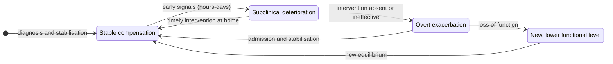
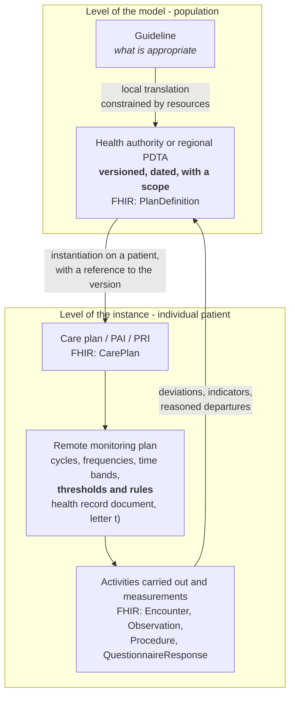
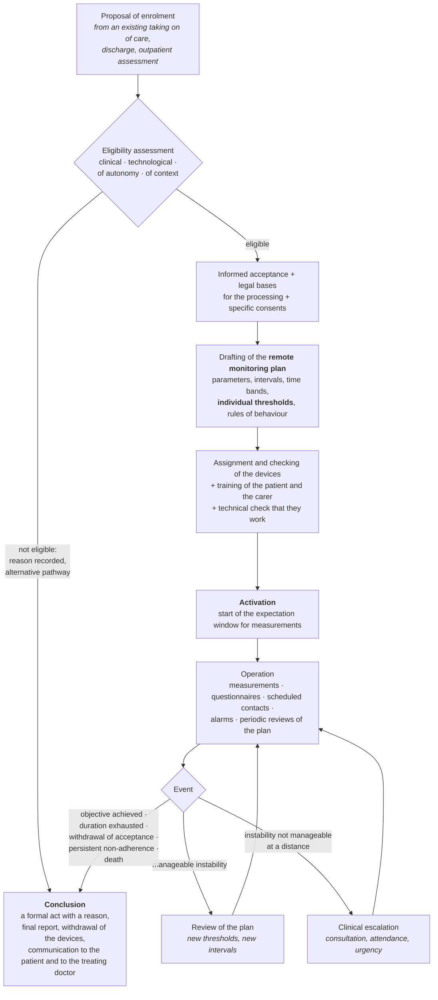
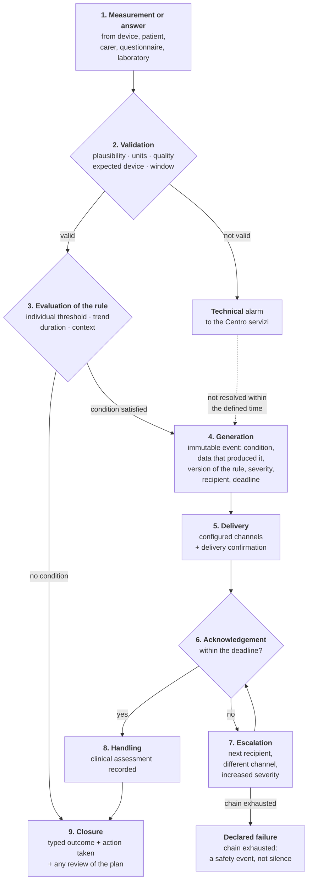
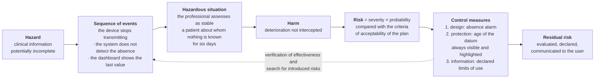

# Care pathways and patient safety

> **Notice.** This is **technical training material for people who write software**. It is not
> clinical material, it is not a guide to medical practice, it is not a care protocol and it
> cannot be used to take, guide or justify decisions about real people. The simplifications
> that follow are deliberate and serve to make comprehensible to a computing professional
> *why* certain design choices are compulsory. A clinician who reads these pages will find
> them pared to the bone: that is intended, and their most useful contribution is to point out
> where the reduction has produced an inaccuracy.
>
> **No value, threshold, score or range reported in this module has prescriptive force.**
> Where figures appear, they are didactic examples marked as such. Whatever has not been
> verified against a primary source in the course of this drafting is marked `[NV]`.

---

## 0. What this module solves

Anyone arriving from computing approaches remote monitoring (telemonitoraggio) with a mental
model that is precise and wrong: *a device produces measurements, a service ingests them, a
rule compares them with a threshold, a channel notifies somebody*. It is the model of an
infrastructure monitoring system - CPU, memory, latency - transplanted onto a human body. It
works until nothing happens, and it fails exactly at the moment when it is needed.

It fails for reasons that are not technical:

- **the threshold is not a constant**, because the same value is normal for one person and
  alarming for another, and for the same person at two different moments;
- **the absence of a measurement is not the absence of information**: it is one of the most
  important pieces of information the system can produce, and treating it as silence is a
  choice with clinical consequences;
- **notifying is not being heard**: an alarm that nobody acknowledges within a defined time is
  not an alarm, it is a log;
- **an alarm that sounds too often stops being an alarm**, and this is not a user-experience
  problem but a documented mechanism for producing harm;
- **computing a score from clinical data** is not a utility function: it is precisely the act
  that qualifies the software as a medical device and determines its risk class.

Module [09 - The body, the parameters, clinical reasoning](09-fondamenti-clinici.md) explains
*what* is measured and how one reasons about an isolated measurement. This module explains
*how care is organised over time* and *how one gets things wrong in medicine*: the two bodies
of knowledge that turn data ingestion into a remote monitoring service, and a usability defect
into a clinical risk.

The organisation of the Italian healthcare system - who delivers, who pays, which territorial
structures exist - is dealt with in module
[01 - The Italian healthcare system](01-sistema-sanitario-italiano.md). The statutory
definitions of the services - televisita (remote consultation), teleconsulto
(specialist-to-specialist consultation), telemonitoraggio, telecontrollo (medical remote
check) - are in module [02 - Telemedicine services](02-prestazioni-di-telemedicina.md). They
are not repeated here: they are cross-referred.

---

## 1. Acute and chronic: two ways of falling ill, two ways of caring

### 1.1 Acute illness

An **acute** illness has an identifiable beginning, a relatively short course and a defined
outcome: recovery, chronicity or death. A pneumonia, a fracture, an appendicitis, a myocardial
infarction. The corresponding model of care is **episodic**: the patient comes into contact
with the system, is diagnosed, treated, discharged, and the contact closes.

This model has a property that computing recognises immediately: it is a **transaction**. It
has a beginning, an end, an outcome, and most of the relevant information is contained within
its boundaries. It is no accident that the historic hospital information systems are built
around the **inpatient admission** and the **outpatient attendance**: discrete units of work,
countable, closable.

### 1.2 Chronic illness

A **chronic** illness has no end. It has a moment of diagnosis - often arbitrary, because the
condition pre-existed its identification - and from there on it accompanies the person for the
rest of their life. Diabetes, arterial hypertension, chronic obstructive pulmonary disease,
heart failure, chronic renal failure, rheumatoid arthritis, many degenerative neurological
diseases.

The properties that matter for whoever designs software are five.

**One does not recover, one controls.** The therapeutic objective is not the elimination of the
disease but keeping the person in a condition of **compensation**: the disease is there, its
effects are contained within tolerable limits, function and quality of life are preserved.
Success is not an event, it is a state that lasts.

**The course is a trajectory, not a sequence of episodes.** The clinical value of a measurement
lies almost always in its **trend**, not in its level. A body weight of 78 kg means nothing;
78 kg in a person who three days ago weighed 75 means something very precise in a patient with
heart failure. A system that keeps the last value and overwrites the previous ones has
destroyed the clinical information while keeping the datum.

**The acute event is inside the chronic condition, not outside it.** A chronic illness
alternates periods of stability with **exacerbations** (or flare-ups, or episodes of
decompensation): rapid deteriorations that may require an admission to hospital. The
exacerbation is the principal determinant of cost and of mortality, and in most cases **it is
preceded by days of measurable signals**. It is the entire economic and clinical rationale of
remote monitoring: anticipating an exacerbation by forty-eight hours can mean an adjustment of
therapy at home instead of an admission.

**The patient is the principal actor in their own care.** In an acute illness the patient
undergoes the treatment; in a chronic one they carry it out. They take medicines every day,
measure parameters, recognise symptoms, decide when to call. This capability is called
**self-management**, it is taught, and the teaching is called **therapeutic education**. It
follows that the interface facing the patient **is not an accessory of the clinical system: it
is a clinical instrument**. A badly designed form for entering measurements by hand does not
produce a poor user experience, it produces wrong data on which somebody will take decisions.

**Care is multi-professional and distributed.** A chronic patient does not have a doctor: they
have a general practitioner, one or more specialists, a named nurse, often a pharmacist, often
a carer, and they cross more than one organisation. None of these parties sees the whole
picture. It is the structural reason why interoperability in healthcare is not a convenience
function (modules [05](05-standard-di-interoperabilita.md), [06](06-fhir-da-zero.md) and
[07](07-fse-e-infrastrutture-nazionali.md)).

### 1.3 Multimorbidity, frailty, complexity

Three notions that get confused and that the data model must keep distinct.

**Multimorbidity** is the coexistence of two or more chronic conditions in the same person. It
is not the sum of the diseases: it is a condition in its own right, because the therapies
interact, the therapeutic objectives come into conflict (lowering blood pressure is good for
the kidney and may make an elderly person fall) and the care pathways, each written for a
single disease, overlap incoherently.

**Frailty** is a condition of reduced functional reserve: the frail person responds to a modest
stressor - a trivial infection, a change of therapy, a short admission - with a
disproportionate and often irreversible deterioration. It does not coincide with age nor with
disease: there are non-frail eighty-year-olds and frail sixty-year-olds.

**Care complexity** adds the non-clinical dimensions: social isolation, economic condition,
housing condition, cognitive capacity, presence or absence of a carer, health and digital
literacy. It is the dimension that determines whether a remote pathway is achievable for that
person, and it must be assessed **before** enrolment (§ 4.2).

> **Immediate design consequence.** A model that represents «the patient's disease» as a single
> attribute does not hold up the domain. The conditions are N, each with its own date of onset,
> its own state of activity and its own pathway; and the non-clinical dimensions are attributes
> of the **person in their context**, not of the disease. In FHIR R4 the conditions are distinct
> `Condition` resources; nothing in this domain is an `enum` on the patient.

### 1.4 Why the healthcare system reorganised itself around chronic conditions

The reason is demographic and arithmetical. An ageing population shifts the care burden from
acute episodes to continuous management: the majority share of health spending and of the
demand for care concerns people with one or more chronic conditions. A system built around the
hospital - that is, around the acute episode - does not hold that burden, because it uses the
most expensive resource it has (the acute inpatient bed) for a problem that resource does not
solve: the bed stabilises an exacerbation, it does not manage a trajectory.

The Italian organisational response is **decreto del Ministro della salute 23 maggio 2022,
n. 77** (the Ministerial Decree of the Minister of Health no. 77 of 23 May 2022), which
redesigns territorial care: Case della comunità, Ospedali di comunità, Centrali operative
territoriali, the family or community nurse, integrated home care. The structure, the standards
and the consequences are described in module
[01, § 8](01-sistema-sanitario-italiano.md). Only one point matters here, and it is the one
that connects the decree to this module:

> **In that design telemedicine is not an alternative channel to the consultation: it is a mode
> of delivery placed inside a pathway.** Remote services live inside an individual care plan or
> a diagnostic-therapeutic care pathway, not as isolated acts.

Everything else in this module follows from here. If the remote service is a node of a pathway,
then the pathway is a first-class entity of the data model (§ 3), entry into the pathway is a
formal act (§ 4), the pathway defines what is measured and when (§ 2 and § 7), and the failure
to carry out what the pathway provides for is itself a clinical fact to be detected (§ 8).

### 1.5 The trajectory: stability, exacerbation, decline

A mental model sufficient for whoever writes code, with the awareness that it is a coarse
simplification of a much more variable reality:

Three observations that the diagram makes evident.

**The useful window is in the state of subclinical deterioration**, the one in which the person
does not yet feel unwell but some parameters have already started to move. It is a window of
hours or days depending on the disease. A system that samples once a week cannot intercept it;
a system that samples every day can, if somebody looks at the datum within a compatible time.

**The return to compensation after an exacerbation is not a return to the starting point.**
Every acute event tends to leave the person at a lower functional level. It is the reason why
preventing an exacerbation is worth much more than treating it well.

**The most dangerous transition is discharge from hospital.** The period immediately following
an admission concentrates a high risk of readmission. It is the moment at which remote
monitoring has the most defensible rationale, and it is also the moment at which the therapy has
just been changed and the patient is least able to manage it.

### 1.6 What changes, for the software, between acute and chronic

| Dimension | Acute model | Chronic model |
|---|---|---|
| Unit of work | the encounter (`Encounter`) | the pathway (`CarePlan` / `EpisodeOfCare`) |
| Life cycle | open, perform, close | open, and stay open for years |
| Value of the datum | the absolute value | the trend over time and the deviation from the individual baseline |
| Principal actor | the professional | the patient, supported by the team |
| Absence of a datum | irrelevant | **it is a datum** (§ 8) |
| Typical error | wrong datum | missing datum, datum not looked at, datum looked at too late |
| Organisational boundary | one organisation | more than one organisation and more than one profession |
| Persistence model | current state | **time series**, with time as a first-class dimension |

The last row is the reason why the project adopts a time-series-oriented database for the
measurements: it is not an optimisation, it is a consequence of the domain.

---

## 2. The target diseases of remote monitoring, and what is measured in each

### 2.1 The criterion: why not all chronic diseases can be monitored at a distance

A condition is a realistic target for remote monitoring when it satisfies **all four** of the
following properties. If one is missing, the service produces data and does not produce health.

1. **There exists a parameter measurable at home** with instruments usable by a non-professional,
   whose value changes *before* the person becomes unwell.
2. **The deterioration has a sufficient latency**: between the first measurable signal and the
   acute event there passes a time compatible with the organisation of the service. If the
   latency is minutes, remote monitoring is not the instrument: the emergency system is.
3. **There exists an effective action** that the team can take at a distance or within a short
   time: change a dosage, bring forward a consultation, order an investigation. An alarm that
   corresponds to no possible action is noise, and moreover it generates anxiety in the patient.
4. **The patient or the carer are able to take the measurement** sufficiently consistently and
   correctly. This is a property of the person, not of the disease, and it is assessed at the
   enrolment stage (§ 4.2).

The fourth criterion is the one projects tend to underestimate, because it is the only one that
does not depend on the technology. It is also the one that decides whether the service works.

### 2.2 Heart failure

**What it is, in two lines useful to a computing professional.** The heart cannot push into the
circulation a quantity of blood adequate to the body's demands. The body compensates by
retaining fluid; the fluid accumulates in the lungs and in the lower limbs; the accumulation
worsens respiratory and cardiac function. The exacerbation - *acute decompensation* - is
typically a crisis of congestion, and congestion **builds up over the course of days**.

**What is measured, and why.**

| Parameter | Why precisely this one |
|---|---|
| **Body weight**, daily, fasting, on the same scales | It is the most direct proxy for fluid retention: a rapid increase in weight, in the absence of dietary change, is **water**, not tissue. It is the measurement for which remote monitoring of heart failure exists. It does, however, require standardised measurement conditions: same time, same scales, same clothing. Without standardisation, the noise exceeds the signal |
| **Arterial blood pressure** | It guides the adjustment of therapy and it intercepts both drug-induced hypotension and the hypertension that aggravates the load on the heart |
| **Heart rate** and regularity of the rhythm | Arrhythmias are both cause and consequence of heart failure |
| **Peripheral oxygen saturation** | An indirect index of pulmonary congestion |
| **Reported symptoms**, gathered with a structured questionnaire: breathlessness at rest or on exertion, number of pillows needed to sleep, swelling of the ankles, fatigue | The symptom often precedes or accompanies the measurement, and is sometimes the only signal available. It must be gathered in structured form (`QuestionnaireResponse`), not as free text, otherwise it is not comparable over time |
| **Adherence** to therapy and to the fluid and salt intake | The most frequent cause of exacerbation is not the worsening of the disease: it is the interruption of, or an error in, the therapy |

**What the system cannot infer.** An increase in weight may be congestion, it may be a
measurement error, it may be a large meal, it may be a different set of scales. The system
detects the deviation and submits it for assessment; **it does not conclude**.

### 2.3 Chronic obstructive pulmonary disease

**What it is.** A persistent limitation of air flow in the airways, not fully reversible,
typically consequent on prolonged exposure to tobacco smoke or to pollutants. The course is
punctuated by **exacerbations**: acute worsenings of the respiratory symptoms, often on an
infective basis, which require a change of therapy and which can lead to respiratory failure.

**What is measured, and why.**

| Parameter | Why precisely this one |
|---|---|
| **Peripheral oxygen saturation** | A non-invasive measurement of the quantity of oxygen carried by the blood. It is the pivotal parameter, and it is also the parameter on which the gravest threshold error described in § 7.10 is committed |
| **Respiratory rate** | It rises early in respiratory deterioration, often before saturation does. It is also the parameter that is hardest to self-measure correctly |
| **Structured symptoms**: change in the cough, colour and quantity of the sputum, breathlessness, use of the as-needed medicine | The exacerbation is defined clinically on the basis of symptoms before it is defined instrumentally |
| **Number of doses of the as-needed bronchodilator** | A proxy for adherence and for instability: increased recourse to the rescue medicine precedes the exacerbation |
| **Heart rate** | It rises in respiratory distress |
| **Body temperature** | It points towards an infective origin |

**What the system cannot infer.** A low saturation may be true hypoxaemia, or it may be cold
hands, nail varnish, movement, incorrect positioning of the sensor, or reduced peripheral
perfusion. Module [09](09-fondamenti-clinici.md) deals with the limits of measurement; here the
design consequence is enough: **every measurement must be accompanied by its quality metadata**
and by a channel for declaring that the measurement is not reliable.

### 2.4 Diabetes mellitus

**What it is.** A disturbance of the regulation of glucose in the blood, through lack of insulin
or through resistance of the tissues to its action. The damage is produced on two different time
scales, and this is the point that concerns whoever designs: **acutely**, through values that
are too low (hypoglycaemia, which can lead to loss of consciousness within minutes) or too high
with metabolic complications; **chronically**, through prolonged exposure to elevated values,
which damages the kidney, the retina, the nerves and the vessels over the course of years.

**What is measured, and why.**

| Parameter | Why precisely this one |
|---|---|
| **Capillary blood glucose** or **continuous glucose monitoring** | Capillary blood glucose is a point in time; continuous monitoring produces a dense series (tens or hundreds of values a day) with derived metrics such as time spent within the target range. The two sources **are not the same datum** and must not be mixed into a single series without qualifying their provenance and method |
| **Glycated haemoglobin** | An indicator of average exposure to glucose in the preceding months. **It is not measurable at home**: it comes from the laboratory and enters the system through integration, not through ingestion from a device |
| **Weight, blood pressure, lipid profile** | Diabetes is managed together with overall cardiovascular risk, not in isolation |
| **Inspection of the foot** | Loss of sensation makes lesions that progress seriously invisible to the patient. It is an assessment that at a distance is done with images and structured questionnaires, with all the limitations that entails |
| **Dose of insulin administered, meals, physical activity** | Without the context, a blood glucose value is almost unusable: the same number means opposite things before and after a meal |

**The critical point for the architecture.** Diabetes is the only one of the five conditions in
which there is an **emergency with a latency of minutes** (severe hypoglycaemia). A remote
monitoring service based on periodic review **is not the adequate channel** for that event, and
the system must say so explicitly to the patient, not leave it to be inferred (§ 6.5). It is
also the condition in which the temptation to suggest a dosage is strongest: doing so moves the
software into a higher risk class and changes the whole regulatory pathway (module
[15](15-regolatorio-da-zero.md)).

### 2.5 Arterial hypertension

**What it is.** A pressure of the blood in the arteries stably higher than is compatible with
the long-term protection of heart, brain and kidney. It is almost always asymptomatic: the
patient does not «feel» high blood pressure, and this is the reason why treatment adherence in
hypertension is structurally low.

**What is measured, and why.**

| Parameter | Why precisely this one |
|---|---|
| **Systolic and diastolic arterial blood pressure**, measured at home according to a protocol (position, preliminary rest, arm, number of consecutive measurements, times of day) | Home measurement has a value of its own, **different** from measurement in the clinic: it removes the white-coat effect and produces an average over several readings. The clinically useful datum is the **average of the measurements over a period**, not the single reading |
| **Heart rate**, taken together with the blood pressure | It guides the choice of the class of medicine and it intercepts arrhythmias |
| **Treatment adherence** | The first cause of apparent ineffectiveness of the treatment |
| **Alarm symptoms**: intense and sudden headache, visual disturbance, focal neurological deficit, chest pain | They do not serve to monitor the hypertension: they serve to recognise that one has left the perimeter of the monitoring and that urgent care is required (§ 6.4) |

**The critical point for the architecture.** Hypertension is the condition in which **showing
the patient every single value** does more harm than good: the physiological variability between
two consecutive measurements is wide, and showing every oscillation with a red or green traffic
light generates anxiety, compulsive repeated measurements and inappropriate calls. The way in
which the datum is returned to the patient **is a clinical decision**, not an interface choice,
and it must be configured by the professional.

### 2.6 Chronic renal failure

**What it is.** A progressive and irreversible reduction of the kidney's capacity to filter the
blood, eliminate waste and regulate water and electrolytes. It is staged on a measure of
function calculated from a laboratory test. In the advanced phases it requires replacement
therapy: dialysis or transplantation.

**What is measured, and why.**

| Parameter | Why precisely this one |
|---|---|
| **Arterial blood pressure** | It is at once cause and consequence of the renal damage; control of blood pressure is the principal instrument for slowing the progression |
| **Body weight** and an estimate of fluid balance | A kidney that does not eliminate produces fluid overload, with the same consequences described for heart failure |
| **Urine output** (the quantity of urine produced), where measurable | A direct indicator of function, but hard to self-measure accurately |
| **Laboratory tests**: creatinine, electrolytes, haemoglobin | Not home-based: they enter through integration. **Serum potassium** is the parameter with the highest potential for acute harm, and it cannot be monitored remotely |
| **Parameters of home peritoneal dialysis**, where present | It is the case in which the home hosts a therapy, not only a measurement: it changes the risk profile and the requirements for continuity of the service |

**The critical point for the architecture.** In this condition the most dangerous part of the
clinical picture **is not measurable at home**. The system must explicitly represent the fact
that what it monitors is a subset of the picture, and that an «all green» profile on the home
parameters **does not mean clinical stability**. It is the clearest case in which a reassuring
dashboard is a risk: it is called *false reassurance* and it is a hazard-related use scenario to
be entered into the risk file (§ 9.8).

### 2.7 Summary table

| Condition | Typical home parameters | Early signal of deterioration | Typical latency of the deterioration | What escapes home monitoring |
|---|---|---|---|---|
| Heart failure | weight, blood pressure, heart rate, saturation, symptoms | rapid weight gain, increasing breathlessness | days (to be verified by `GUIDA`) `[NV]` | intermittent arrhythmias, renal function |
| Chronic obstructive pulmonary disease | saturation, respiratory rate, symptoms, use of the as-needed medicine | increase in cough and sputum, increased use of the as-needed medicine | days (to be verified by `GUIDA`) `[NV]` | real gas exchange (it requires blood gas analysis) |
| Diabetes | blood glucose or continuous monitoring, context (meals, insulin), weight | swings, recurrent hypoglycaemia | **minutes** for hypoglycaemia; years for the complications | glycated haemoglobin, organ complications |
| Hypertension | blood pressure, heart rate, adherence | rising average pressure over several readings | weeks-months | organ damage, acute cerebrovascular events |
| Chronic renal failure | blood pressure, weight, urine output, dialysis parameters | fluid overload | days-weeks (to be verified by `GUIDA`) `[NV]` | **serum potassium**, renal function, anaemia |

> The latencies given are orders of magnitude for didactic purposes, derived from
> pathophysiological logic and not from primary sources verified in the course of this drafting; the `GUIDA` area must complete this verification. `[NV]` They must not be used to size alarm windows: those are clinical decisions of the monitoring
> plan (§ 7.9).

### 2.8 Four design consequences that follow from here already

1. **The catalogue of parameters is configuration, not code.** Five conditions produce different
   and partly overlapping sets of parameters; a multimorbid patient combines them in ways not
   foreseeable in advance. The observable unit is the single parameter with its coding, not a
   profile per disease.
2. **The conditions of measurement are part of the measurement.** Time, position, device, arm,
   before or after the meal, fasting or not. A value without its conditions is not comparable
   with itself over time. In FHIR this information has a precise place and is not free-text
   notes.
3. **Provenance changes the meaning.** Measurement from a device, manual entry by the patient,
   entry by the carer, imported laboratory datum, answer to a questionnaire: five sources with
   different reliability, which must remain distinguishable for ever. A `value` column without a
   `source` is a structural defect.
4. **The system knows less than it seems to.** What is not monitored must be declared, not
   passed over in silence: the clinical interface must make the perimeter of the plan evident,
   because a professional who looks at a green screen under time pressure naturally concludes
   that everything is fine.

---

## 3. PDTA, care plan, individual care plan

### 3.1 What a PDTA is

**PDTA** stands for **percorso diagnostico terapeutico assistenziale**, the
diagnostic-therapeutic care pathway. It is a document that describes, for a given clinical
condition and in a given organisational context, **the expected sequence of the acts** that make
up the taking on of care: who assesses the patient, on what criteria they are included, what
investigations are carried out and at what intervals, which professionals intervene and in what
order, what the decision points are, what the exit criteria are, and with what indicators one
measures whether the pathway works.

The three letters are not redundant, and unpacking the abbreviation helps in understanding the
perimeter:

- **diagnostico** - the investigative part: what is done to establish the condition and to stage
  it;
- **terapeutico** - the treatment part: medicines, procedures, interventions;
- **assistenziale** - the part of continuous care: education, follow-up, support,
  coordination. It is the part that did not exist in a hospital-centred model and it is the part
  inside which telemedicine lives.

A PDTA **is not a guideline**. The distinction is substantive and must be held firm in the data
model:

| | Guideline | PDTA |
|---|---|---|
| Origin | scientific societies, national institutes, international working groups | the organisation that delivers: Region, health authority, network of organisations |
| Object | what it is appropriate to do, on the basis of the available evidence | how *this* organisation achieves what is appropriate, with the resources it has |
| Scope | tendentially universal | **local**: it depends on the facilities, the staff and the services actually available |
| Form | recommendations graded by strength and quality of the evidence | a sequence of activities, responsibilities, times and criteria |
| Effect on the information system | none directly | **it determines what the system must be able to represent** |

A PDTA is therefore the local, organisationally constrained translation of what the guidelines
say in the abstract. Two health authorities in the same Region may legitimately have different
PDTAs for the same disease because one has a dedicated clinic and the other does not.

### 3.2 Who writes it and with what force

The PDTA is drawn up by a multi-professional working group - specialists in the branch, general
practitioners, nurses, pharmacists, rehabilitation professionals, the medical directorate, often
patient representatives - and it is **adopted by a formal instrument** of the organisation: a
regional resolution, a resolution of the health authority, a decision of the medical director.

From this follow three properties the software must respect.

**It is versioned and dated.** A PDTA has a date of adoption, a version, and sooner or later a
revision. A patient enrolled under version 2 must be describable, even years later, in the terms
of that version: if the system keeps only the current pathway, reconstructing after the fact
what was provided for that patient is impossible. It is a requirement of clinical traceability
before it is one of compliance.

**It has a scope of validity.** It applies to a Region, to a health authority, to a network, and
it has a date from which it takes effect. The scope is an attribute of the pathway, not of the
patient.

**It is not self-applying.** The PDTA describes the expected pathway; the individual patient may
legitimately deviate from it, because real clinical practice is never identical to the model.
The **reasoned deviation is the norm, not the exception**, and a system that prevents it or that
makes it costly to record produces two effects, both harmful: the professionals work around the
system, and the documentation loses the reason why the deviation occurred - which is exactly the
most valuable clinical information.

### 3.3 How it is structured

The recurring structure, independently of the disease, is composed of elements that all have a
counterpart in the data model:

1. **Target population and inclusion and exclusion criteria** - who enters the pathway and who
   does not. They are evaluable predicates, not descriptions.
2. **Nodes of the pathway** - the activities provided for: assessments, investigations, contacts,
   educational interventions. Each with an actor, an expected interval and an expected outcome.
3. **Decision points** - the moments at which the pathway forks on the basis of an outcome. It is
   here that a pathway is distinguished from a list of activities.
4. **Responsibilities** - who does what. It typically includes the identification of a named
   professional for continuity (§ 4.5).
5. **Times and windows** - within what time each activity must take place after the event that
   triggers it. They are the constraints that generate the reminders and the failures to comply.
6. **Transition and exit criteria** - when the patient moves to another pathway, when they leave,
   when it concludes.
7. **Indicators** - of process (how many of the activities provided for were carried out on time)
   and of outcome (what happened to the patients). They serve to assess the pathway, not the
   patient.

### 3.4 Why it varies by Region and by health authority

The reason is constitutional before it is organisational: the protection of health is a matter
of concurrent legislation, and the organisation of health services is a regional competence.
Module [01, § 2](01-sistema-sanitario-italiano.md) explains why in Italy there is not «one»
healthcare system but twenty-one, and why this is the dominant constraint for any national
health software.

Applied to pathways, it means that for the same disease there legitimately coexist:

- different entry criteria;
- different follow-up intervals;
- different professionals in the same role (in one Region the case is followed by the
  specialist, in another by the family nurse under supervision);
- different documents produced;
- different parameters monitored, with different periodicities;
- different alerting thresholds.

**None of these variants is an error to be normalised.** They are legitimate configurations of
the same domain. A product that hard-wires only one of them is not «opinionated»: it is unusable
outside the context for which it was written.

### 3.5 Care plan, PAI, PRI, remote monitoring plan: four distinct things

They are terms that circulate as synonyms and are not. Confusing them produces a data model that
cannot represent a real patient.

| Term | What it is | Scope | Who draws it up |
|---|---|---|---|
| **PDTA** | the **model** of the pathway for a condition, in an organisation | population | a working group, adopted by a formal instrument |
| **Care plan** | the **instance** on the individual patient: what has been decided to do for them, with what objectives and on what calendar | individual | the professional or the care team that has taken the case on |
| **PAI - piano assistenziale individuale** (individual care plan) | the plan for the **integrated** taking on of a patient's care, typically a complex patient or one in home care, drawn up by a multi-professional care team; it covers both the health and the social dimension | individual | multidimensional assessment unit / care team |
| **PRI - progetto riabilitativo individuale** (individual rehabilitation plan) | the mandatory container of rehabilitation services, telerehabilitation included (module [02, § 4.7](02-prestazioni-di-telemedicina.md)) | individual | the rehabilitation professional, with the doctor |
| **Remote monitoring plan** | the document that defines *operationally* the monitoring at a distance: cycles, duration, activities per cycle, frequency of the measurements, time band, type of measurement, **alarm thresholds** and **rules of behaviour** in the event of a breach | individual | the responsible professional |

The last one is the one that touches the code directly. Module
[02, § 4.5.4](02-prestazioni-di-telemedicina.md) reports its information content as defined by
**DM 19 novembre 2025** (the Ministerial Decree of 19 November 2025), Annex 1, § 2.24: the
number of cycles, the duration of the cycle, the number of activities per cycle, the frequency
expressed in coded form, the time band, the maximum expected duration of one year, the type of
measurement (intermediated or closed loop), the alarm threshold and the descriptive rules of
behaviour in the event of a breach of the thresholds.

**The remote monitoring plan is, in effect, the runtime configuration of the alarm engine,
written by a clinician and digitally signed.** This sentence is the bridge between everything
that precedes it and § 7: the thresholds are not a configuration file of the system, they are
the content of an individual health document.

### 3.6 Model and instance: the distinction on which everything else depends

The rules that follow from the diagram, and that must be respected without exception:

1. **The model and the instance are different entities.** In FHIR R4 they are `PlanDefinition`
   and `CarePlan`. Merging them makes it impossible to version the protocol and to reconstruct
   what was provided for at the moment of a decision.
2. **The instance carries the reference to the version of the model** from which it was born.
   Not to the model: to the version.
3. **The deviation is representable and can be given a reason.** The care plan may depart from
   the pathway; the departure is a fact to be recorded with its reason, not a validation error.
4. **The feedback of information from the instance to the model is a function, not a side
   effect.** The indicators of the pathway are calculated on the instances; without that
   feedback the PDTA cannot be assessed and the medical directorate has no instruments for
   correcting it.

### 3.7 What it entails for software that has to support more than one

The requirement is: **support N pathways without hard-wiring any of them**. Operationally that
means seven things.

1. **No pathway in the code.** No `PdtaScompenso` class, no `switch` on the disease, no frequency
   constant. The pathway is **data**, loaded, validated and versioned as data.
2. **A language for describing the pathway** expressive enough to represent activities,
   intervals, decision points, responsibilities and criteria, and restricted enough not to become
   an arbitrary programming language executed in production. The boundary is delicate: an engine
   that is too powerful becomes an attack surface and an object impossible to validate for
   regulatory purposes.
3. **Versioning with immutability.** A published version is not modified: it is superseded by a
   new version. The instances in progress stay attached to the version with which they were born,
   and any migration to a later version is an explicit act, decided by a professional and traced.
4. **Scope and tenancy.** Every pathway belongs to a tenant and to an organisational scope
   (constraint **[V4](../11_registri/03-vincoli-fondanti.md#v4)** of the project). The catalogue of pathways of one tenant is not visible to
   the others, and a «national» pathway that applies to everyone is a configuration, not a
   premise.
5. **Validation at load time, not at execution time.** An incoherent pathway - an unreachable
   node, an interval without a unit, a threshold without a parameter, an infinite loop - must be
   rejected at the moment of publication, with a message comprehensible to whoever drafted it,
   not fail when a patient passes through it.
6. **No threshold in the population pathway.** The PDTA may indicate reference ranges and general
   rules, but the threshold that governs a patient's alarm is in **their** plan (§ 7.9). The
   pathway proposes; the individual plan disposes.
7. **Traceability of the why.** For every activity carried out it must be reconstructible which
   node of the pathway it derived from, and for every activity not carried out it must be
   reconstructible whether it was provided for and did not take place (§ 8).

> **The error that costs most dearly.** Modelling the pathway as a state machine hard-wired with
> the names of the phases of a real PDTA. It works beautifully with the first customer, it
> requires a new version of the software for the second, and it becomes unmanageable at the
> third. In a domain in which every Region and every health authority may have its own pathway,
> the configurability of the pathway is not an advanced feature: it is the product.

---

## 4. Taking the case on and enrolment

### 4.1 Taking the case on does not mean «having an appointment»

**Taking the case on** is the formal assumption of continuous clinical responsibility for a
health problem by an organisation or a professional. It has three properties that distinguish it
from a contact:

- **it is continuous**: it is not exhausted by the act, it lasts until it is formally concluded;
- **it assigns responsibility**: it identifies somebody who answers for the continuity, not only
  for the carrying out of the single act;
- **it is formal**: it is born with an instrument and ends with an instrument, both traced.

The natural container in the data model is the **episode of care** (`EpisodeOfCare` in FHIR),
distinct both from the clinical record (which is the repository) and from the pathway (which is
the protocol). Taking the case on is moreover one of the conditions that make the remote consultation (televisita)
admissible, and therefore it is not descriptive information but a **verifiable precondition**
(module [02, § 4.1.4](02-prestazioni-di-telemedicina.md)).

**Enrolment** is the particular case of taking the case on within a structured telemedicine
service, typically remote monitoring. It precedes the diary: an enrolled patient does not
necessarily have appointments, but they have a plan, they have a team and they have an
expectation of measurements.

### 4.2 Who decides, and on what criteria

The decision to enrol a patient in remote monitoring is **a clinical decision**, taken by an
authorised professional within the taking on of care. It is not an administrative decision, it
is not a subscription to a service, it cannot be a self-registration function for the patient. A
system that allows a patient to «activate remote monitoring» without a professional act upstream
is not offering a service: it is producing data with no responsible recipient.

The eligibility criteria are of four kinds, and **all** of them must be satisfied.

**Clinical criteria.** The condition falls among those for which the pathway provides for
monitoring; the patient is at the stage of the disease at which monitoring is useful; there are
no concomitant conditions that make it ineffective or dangerous. It is the most obvious criterion
and it is the only one the software must never assess by itself.

**Technological criteria.** There exists at home sufficient and stable connectivity; the devices
provided for by the plan are available, working, calibrated and assigned (in Italy with a
dedicated document, the *tesserino dispositivi* or device card, which records the unique
identification of the device and the manufacturer - module
[02, § 4.5.4](02-prestazioni-di-telemedicina.md)); there is a device for accessing the
interface; there is a reliable power supply.

**Criteria of autonomy and competence.** The patient or the carer are able to take the
measurement correctly, to recognise the relevant symptoms, to use the interface, to answer a
call. It includes the assessment of cognitive, sensory and motor capacity, and of digital
literacy. The **Modello orientativo AGENAS** (the AGENAS guidance model) for the remote consultation calls
this dimension *verifica della compliance digitale dell'assistito*, the verification of the
patient's digital readiness, and places it as a phase distinct from informed acceptance and from
consent to processing (module [02, § 4.1.4](02-prestazioni-di-telemedicina.md)).

**Contextual criteria.** The presence and reliability of a carer where necessary; housing
conditions; distance from services; the ability to reach a facility if needed. They are criteria
that belong to care complexity (§ 1.3) and that decide whether the remote pathway is achievable,
independently of whether it is clinically indicated.

> **A distinction not to be lost.** **Eligibility** is the check that *this patient* can receive
> *that service* through *that channel*: it is a clinical-organisational assessment. The
> **administrative entitlement to the service** - exemption, cover, right of access - is quite
> another thing, is assessed elsewhere and with other data. They are two distinct checks that
> ordinary language confuses and that the data model must not confuse.

### 4.3 The consents: which ones, and why there is more than one

Enrolment requires distinct expressions of will, with different legal bases, different
revocability and different effects. Module [03 - The clinical datum](03-il-dato-clinico.md)
deals with them in depth and module [02, § 10](02-prestazioni-di-telemedicina.md) summarises the
sector rules. Here the map is enough, along with the reason why unifying them is the costliest
error in the domain:

| Declaration | Nature | Effect of withdrawal |
|---|---|---|
| **Informed acceptance of the telemedicine service** | a clinical act: the patient agrees to receive *that* service through *that* channel | the remote pathway stops and must be reorganised in person |
| **Consent or other legal basis for the processing of the data** | a data protection act, with legal bases of its own; for the purpose of care it is typically **not consent** | if it were consent, withdrawal would block care: that is precisely the reason why it is not used where it is not needed |
| **Consent to the recording of the session** | additional, specific, **per session**, revocable | the recording ceases, with immediate and traced effect |
| **Consent to the presence of third parties** (interpreter, student, carer) | specific per session and per person | the third party is not admitted |
| **Acceptance of the device assignment** | acknowledgement of the handover, of the duties of safekeeping and of the instructions received | return of the device |

Each of these declarations is valid **only in relation to the version of the information text in
force at the time**: a consent that does not refer to a versioned text cannot be demonstrated.

### 4.4 Who follows and who answers

A remote monitoring service without a response is not a service. The operational question - *who
looks at the data, who responds to the alarm, within what time* - has an organisational answer
that the software must represent, not presuppose.

The recurring figures:

- **the professional responsible for the plan**, who draws it up, sets its thresholds and answers
  for it clinically. Typically the specialist doctor or the general practitioner, depending on
  the pathway;
- **the case manager**, the figure who coordinates the taking on of care - frequently a nurse -
  who is the patient's continuous point of contact, monitors the course, carries out the
  scheduled contacts and activates whoever is needed. It is listed among the essential
  micro-services of remote monitoring by DM 19 novembre 2025 (module
  [02, § 6.3](02-prestazioni-di-telemedicina.md));
- **the Centro erogatore** (delivering centre), with health tasks, which manages the **clinical
  alerts**;
- **the Centro servizi** (service centre), with technical tasks - maintenance, accounts, help
  desk, distribution and sanitising of the devices - which manages the **technical alerts**.

The last distinction is statutory and not organisational at discretion: DM 21 settembre 2022 (the
Ministerial Decree of 21 September 2022) separates the two centres and attributes to each a
category of alarms (module [02, § 6.4](02-prestazioni-di-telemedicina.md)). **It is reflected
directly in the authorisation model**: whoever manages the technical alarms must not be able to
access the clinical content, and whoever manages the health alarms must not depend on the
technical shift in order to be reached. It is also the reason why the technical/clinical
classification of an alarm must be an attribute of the alarm and not an inference made at the
moment of notification (§ 7.5).

### 4.5 The declared service hours are a safety requirement

This paragraph states the most important point in the section.

A remote monitoring service declares a **coverage**: the time bands and the days in which there
is somebody who looks at the data and responds to the alarms, and the times within which they
respond. DM 21 settembre 2022 sets, for the regional infrastructures, service levels of **H24
7/7** with acknowledgement and restoration times graded by severity (module
[02, § 6.4](02-prestazioni-di-telemedicina.md)).

The temptation, for whoever arrives from commercial software, is to read the coverage as a
pricing parameter: more coverage, more cost, more value. **In a clinical service it is not like
that, and the reason is structural.**

The moment a patient is enrolled, they are told - explicitly or implicitly - that somebody will
look at their data. From that moment the patient **changes their own behaviour**: they attribute
to the service a surveillance function, and to a certain extent they stop being their own sole
watchman. This phenomenon has a name, it is called **false reassurance**, and it is the reason
why the coverage is an element of safety:

- if the coverage is **declared correctly**, the patient knows that at night they must turn
  elsewhere, and they do so. The service has reduced the risk;
- if the coverage is **declared ambiguously** - or not declared at all, which is the same thing
  - the patient waits for a response that will not come, and delays access to the correct
  channel. **The service has increased the risk compared with the situation in which it did not
  exist.**

A badly declared remote monitoring service is therefore more dangerous than the absence of a
service. It is a textbook case of a **hazard introduced by the device** within the meaning of
ISO 14971 (§ 9.6), and the control measure is not technological: it is informative, and it must
be designed with the same rigour as a technical measure.

The design consequences are precise:

1. **Service hours are a configured attribute of the service**, per tenant and per pathway, with
   time bands, days, public holidays and expected response times. They are not a constant, they
   are not documentation, they are not a sentence in the contract: they are data the system
   knows.
2. **The service hours are visible to the patient and to the carer**, at all times and not only
   at the acceptance stage, with the **current state** («at this moment the service is active /
   is not active») and with the explicit indication of the alternative channel.
3. **The system knows its own hours and behaves accordingly.** If a measurement out of range
   arrives outside coverage, the alarm cannot be generated, notified and considered handled: it
   must be queued under a declared policy, and the patient must receive an immediate response
   telling them what to do now.
4. **A change to the service hours is a traced act**, with its effect declared on the patients
   already enrolled. Reducing the coverage of an active service without informing those enrolled
   is a safety event.
5. **Outside coverage does not mean the system does nothing.** It means the system does not
   promise a professional assessment. It continues to collect, to record, to inform the patient
   of the correct channel, and to make the picture available on reopening.

> **A form of words to use, and not to water down.** «The service does not replace the emergency
> system. Outside the hours indicated, the data are not assessed by a professional. If you feel
> unwell, contact [channel]». It is an informative message, which within the meaning of
> ISO 14971 is a **third-level risk control measure** - hence the weakest in the hierarchy
> (§ 9.6) - and precisely for that reason it must be written, tested with real users and made
> impossible to miss.

### 4.6 The complete cycle

Three points of the diagram deserve attention because they are the ones real systems implement
badly.

**Activation is a precise instant**, not an implicit state. From that moment the expectation of
measurements starts to run, and hence the possibility of detecting an absence (§ 8). A patient
«created» but not activated generates no absences; a patient activated without the device
delivered generates a stream of false absence alarms on the first day.

**The review of the plan is a first-class event**, not a modification of a record. Changing a
threshold means producing a new version of the plan, with author, date, reason and effective
date. An `UPDATE` on a `threshold` column destroys the information needed to reconstruct, six
months later, why an alarm did not fire.

**The conclusion is an act**, with a typed reason. A pathway that goes out because something
stops arriving is not concluded: it is abandoned, which is the worst of the possible conditions,
because nobody is dealing with it and nobody knows that nobody is dealing with it.

---

## 5. Scales and scores

### 5.1 What they are and why they exist

A **clinical scale** is an instrument that transforms observations - measurements, signs,
symptoms, answers from the patient, assessments by the operator - into a **comparable ordinal or
numerical value**. A **score** is the result of that transformation.

They exist for four reasons, all of them pertinent to whoever designs software.

**They make a judgement communicable.** «The patient is in a bad way» is not transferable
between shifts, between wards, between professions. A score is, provided both parties use the
same scale in the same version.

**They make a patient comparable with themselves over time.** It is the most valuable use in
chronic conditions: the change in the score is often more informative than its value.

**They standardise the observation.** A scale forces you to look at all the dimensions it
provides for, including those the operator, under pressure, would have overlooked. It is an
antidote to the error of omission.

**They trigger organisational actions.** Many scales are tied to a protocol: exceeding a value
corresponds to a frequency of reassessment, a level of surveillance, the calling of a particular
figure. It is here that a scale stops being a measurement and becomes a rule - and it is exactly
the point at which the software that calculates it becomes a medical device (§ 5.7).

### 5.2 The properties of a scale, and why none of them is optional

| Property | What it means | Why the software must concern itself with it |
|---|---|---|
| **Validation** | the scale has been studied on a population and its capacity to measure what it claims to measure has been demonstrated | a scale «inspired by» a validated scale **is not** that scale and does not inherit its properties |
| **Reference population** | adults, children, pregnancy, the elderly, patients with specific conditions | applying a scale outside its population produces a number devoid of meaning but authoritative in appearance |
| **Version** | scales are revised; different versions have different items, weights and interpretations | the score without the version of the scale **is not interpretable** |
| **Domain of the items** | each item has permitted values, often not linear | the validation of the items is a requirement, not a convenience |
| **Rule of calculation** | how the items combine; what is done with the missing ones | the treatment of the missing datum is the first cause of a wrong score (§ 5.6) |
| **Rule of interpretation** | which bands of score correspond to which categories | it is the part that most often varies by local protocol and that therefore **must not be hard-wired** |
| **Who administers it** | self-administered by the patient, or administered by a professional | it changes the evidential value and the authorisations, and in some cases it changes the scale itself |
| **Licence** | many scales are protected works, with conditions of use | it is a real constraint on the content distributable in the repository: see the project's terminology policy |

The last row is not a legal detail. The project adopts a policy with differentiated regimes for
third-party terminologies and content (project decisions D31-D34): **a scale cannot be included
in the sources without having verified the primary licence**, and some must be treated as
content acquired by the deployer rather than distributed. Whoever implements a scale opens a
licensing question before they open a coding one.

### 5.3 First example: an early warning score

**Early warning scores** were born out of a very concrete problem: in hospital wards, the
clinical deterioration of a patient is almost always preceded by alterations in the vital signs
in the hours before the serious event, and those alterations were regularly detected and not
recognised as a set. The scale aggregates several vital signs into a single number and ties that
number to a frequency of reassessment and to a level of response.

The most widespread in the English-speaking world is the **National Early Warning Score** in its
second edition (**NEWS2**), published by the Royal College of Physicians of the United Kingdom.
Its structure, which is what matters here:

- it takes a set of basic vital signs - typically respiratory rate, oxygen saturation, systolic
  arterial blood pressure, heart rate, level of consciousness and temperature;
- it assigns to each parameter a partial score according to the band into which the value falls,
  with a score of zero in the band of normality and rising as one moves away from it **in both
  directions**;
- it sums the partial scores;
- it adds an element that has the value of a modifier: if the patient is receiving supplementary
  oxygen, the score is higher for the same saturation, because the same saturation obtained with
  oxygen is a worse condition;
- **it provides for an alternative saturation scale** for patients with chronic hypercapnic
  respiratory failure, whose saturation target is lower than that of the general population;
- it ties the total score to a graded organisational response: the frequency of reassessment, who
  is to be alerted, within what time.

> `[NV]` **The threshold values of the items, the weights, the cut-offs of the total score and
> the levels of response of NEWS2 are not reported in this module**: they must be requested from
> the Royal College of Physicians (original publication) and verified against the relevant
> licence of use. Reporting them in a technical training document would create the very risk the
> module intends to prevent: that somebody copies them into a constant.

Two elements of this structure are general design lessons.

**The existence of an alternative scale for a subpopulation** demonstrates in the field that
«normal» is not a property of the parameter but of the parameter-patient pair. It is the same
principle that at § 7.10 makes a default saturation threshold unacceptable.

**The modifier for supplementary oxygen** demonstrates that the score depends on a contextual
datum that is not a measurement. An engine that calculates scores only on series of measurements
cannot correctly implement scales of this kind: it also needs the states of the patient and the
therapies in progress.

**A warning about use at a distance.** Early warning scores were developed and validated for use
**in the hospital environment**, with parameters taken by professionals on a directly observed
patient. Their transfer to the home, with self-taken measurements and partly missing parameters
(the level of consciousness is not self-assessable by definition), **is not automatically
valid**: it is a change to the intended use of the scale and must be treated as such in the
clinical evaluation and in the risk file.

### 5.4 Second example: a pain scale

Pain is a subjective symptom: there is no instrument that measures it from outside. The
measurement is therefore, by construction, **what the patient reports**, and the scale serves to
make it comparable.

**Verbal numerical scale.** The patient is asked to quantify the intensity of the pain on a scale
from 0 to 10, where 0 corresponds to the absence of pain and 10 to the worst imaginable pain. It
is the most used scale because it can be administered by voice, even over the telephone, and
requires no aids. It is also the most exposed to divergent interpretations: 10 does not have the
same meaning for two different people.

**Visual analogue scale.** The patient indicates a point on a continuous line whose ends are
defined verbally; the measurement is the distance from the left-hand end. It requires a graphic
aid and a greater capacity for abstraction.

**Observational scales for patients who cannot report.** People with severe cognitive impairment,
uncooperative patients, very small children. In these cases the score derives from the
observation of behaviours - facial expression, vocalisation, posture, bodily movements,
consolability - by a trained operator or an instructed carer. They are scales **administered by a
third party**, with different properties from self-administered ones. `[NV]` on the names, the
versions and the cut-offs of the individual observational scales.

**The point that matters for the project.** The pain scale is the case in which the distinction
between self-administered and third-party-administered has immediate effects on the data model:

- **who answered** is a mandatory attribute of the answer, not an incidental metadatum. «7» said
  by the patient and «7» estimated by the daughter are two different data;
- **the scale used** must be recorded together with the value. A `pain_score = 7` without an
  indication of the scale and of its version is a number without a unit of measurement;
- **the change matters more than the level**, as with almost everything in chronic conditions;
- **pain that changes character** - new, different, in a new site, associated with other symptoms
  - is an alarm signal and not a change in score (§ 6.4). A scale measures the intensity of a
  known pain; it does not recognise a new pain.

### 5.5 Third example: a scale of functional autonomy

It measures how much a person is able to do for themselves. In a chronic patient, and especially
an elderly one, functional autonomy is often a stronger predictor of outcome than the diagnosis:
two people with the same disease and a different level of autonomy have profoundly different
prognoses and care needs.

The main families:

- **Basic activities of daily living** (*ADL - activities of daily living*): washing, dressing,
  using the toilet, transferring, continence, feeding. They are the functions whose loss makes
  the direct assistance of another person necessary.
- **Instrumental activities of daily living** (*IADL - instrumental activities of daily living*):
  using the telephone, shopping, preparing meals, keeping house, using transport, **managing
  medicines**, managing money. They are lost before the basic activities, and their assessment is
  therefore more sensitive in the early stages.
- **Autonomy indices with a graded score**, which assign to each function a score according to
  the degree of independence rather than a binary answer, obtaining a finer measure of the
  evolution.

`[NV]` on the official names, the exact items, the weights and the interpretative bands of the
individual scales in this family.

**Why it is directly relevant to remote monitoring.** Among the instrumental activities there are
two that are preconditions of the service: **managing medicines** and **using the telephone**. A
person who is not autonomous in these two functions cannot be enrolled without a carer, and the
level of autonomy conditions the plan more than the disease does. The assessment of autonomy is
therefore part of the eligibility assessment (§ 4.2), and its **change over time** is itself an
outcome to be monitored: a patient who loses autonomy while their parameters remain stable is
getting worse.

### 5.6 The implementation errors that recur everywhere

1. **The missing datum treated as zero.** In almost all scales zero is the value of normality. An
   item not measured that enters the sum as zero produces a *reassuring* score built on ignorance.
   The correct rule is defined by the scale: some allow imputation, others declare the score not
   calculable. A partial score must be marked as such and must never appear as a full score.
2. **Rounding and the numeric type.** Scores calculated in floating point, rounded differently at
   two points in the system, which produce two different values for the same patient on the same
   screen. In integer-score scales, integer arithmetic is the only defensible choice.
3. **The implicit unit of measurement.** A parameter expressed in units different at the source
   from those expected by the scale produces a wrong score with no visible error. The units must
   be explicit and verified at every system boundary, not presupposed.
4. **The version not recorded.** The score must be persisted together with the identifier and the
   version of the scale that produced it, otherwise updating the scale makes the whole clinical
   history incoherent.
5. **The interpretative threshold hard-wired.** The bands of interpretation vary by local protocol
   with the same frequency as PDTAs. Hard-wiring them reproduces the error of § 3.7.
6. **The silent retrospective recalculation.** If the rule changes, historic scores are not
   recalculated: the recorded score is what the clinician saw when they decided. Recalculating
   after the fact rewrites history and makes any reconstruction indefensible.
7. **The score exposed without its items.** A number without the detail of the items that make it
   up is not verifiable by the clinician and is, in practice, unusable in a decision.

### 5.7 Calculating a score is what makes software a medical device

This paragraph is the link between the clinical module and the regulatory module, and it must be
read line by line.

Software that **collects** a clinical datum, **stores** it, **transmits** it and **displays** it
without modifying it performs a function of archiving and communication. Software that
**combines** clinical data according to a rule in order to produce new information - a score, a
risk category, an alarm - is performing an operation of **interpretation**, and the information
it produces is intended to be used for diagnostic or therapeutic decisions.

It is precisely this distinction that governs qualification as a medical device within the
meaning of **Regulation (EU) 2017/745** and classification within the meaning of **Rule 11** of
Annex VIII. Module [15 - The regulatory framework from scratch](15-regolatorio-da-zero.md)
develops the mechanism, the decision tree of the MDCG 2019-11 guidance and the consequences.

For the Telemedic project the question is not open: decision **D26** establishes that the system
declares a medical purpose of its own and accepts classification in **Class IIa**, with a
Notified Body and a certified quality management system, and identifies the **automatic
evaluation of remote monitoring thresholds** as the element that founds the qualification. The
same decision lists **three features that are «one user story away»** from a further increase of
class - alerting on a threshold, playback with image enhancement, assisted reporting - and
requires them to be governed with explicit change control.

The operational rules that follow, and that apply to any score the system calculates:

1. **A score is a regulatory artefact.** Adding the calculation of a scale is not adding a
   feature: it is modifying the device, and it requires the assessment of the impact on the
   classification, on the intended purpose and on the risk file before it hits the backlog.
2. **The intended purpose is the most expensive document to get wrong** (project decision
   **D46**): the difference between «real-time monitoring of vital signs» and «deferred
   collection of parameters for the professional's periodic review» shifts the classification and
   the software safety class. The way in which a score is presented to the user - a proposal to be
   confirmed, or a conclusion - is part of that declaration.
3. **The calculation must be traceable in full.** For every persisted score the following must be
   reconstructible: the identifier and version of the scale; the value of each item; the
   provenance of each item; the missing items and the treatment applied; the rule of calculation
   and its version; the instant of the calculation; the identity of the agent that performed it;
   the interpretative rule applied. It is not telemetry: it is the documentation of an act.
4. **The calculation must be deterministic and reproducible.** Given the same inputs and the same
   version of the rule, the result is identical. No dependency on the clock, on the order of
   arrival or on the state of the process.
5. **The calculation is verified with versioned test vectors**, derived from the original
   publication of the scale, and the tests are part of the requirements-to-tests traceability
   matrix required by IEC 62304.
6. **The score is always attributed to whoever validated it, not to the system that calculated
   it.** The system proposes; clinical responsibility remains with a person, and this attribution
   must be visible in the document and in the audit trail.

---

## 6. Triage, urgency and alarm signals

### 6.1 What triage is

**Triage** is the process by which, in a situation in which demand exceeds the capacity for
immediate response, **the order in which people are assessed** is established. It is not a
diagnosis, it is not a prognosis, it is not a measure of clinical severity in an absolute sense:
it is the assignment of a **temporal priority**.

The concept was born in emergency medicine and is counter-intuitive for whoever arrives from
other domains: triage does not optimise the average wait, and it does not serve the queue in
order of arrival. It orders on the basis of the **risk of deterioration while waiting**. A person
who is very unwell but whose outcome does not change if they wait thirty minutes may legitimately
be assessed after an apparently less serious person whose picture is worsening rapidly.

### 6.2 The structure by codes

Triage is expressed with a **priority code** on an ordinal scale. The Italian reference model for
in-hospital triage has **five levels**, introduced by the national triage guidance that was the
subject of the Accordo Stato-Regioni of 1 August 2019; the exact extremes of the act, the official denominations of the levels and the maximum waiting times associated with each one, not verified against primary sources in this drafting, must be confirmed by the `GUIDA` area. `[NV]` particulars of the
instrument, on the official names of the levels and on the maximum waiting times associated with
each, not verified against a primary source in this drafting.

The general structure, common to all five-level systems:

| Level | Operational meaning |
|---|---|
| 1 - highest priority | a vital function is compromised; immediate access |
| 2 | high risk of compromise in the short term; very rapid access |
| 3 | stable condition with potential to evolve; contained wait |
| 4 | stable condition without risk of evolution; a prolonged wait is acceptable |
| 5 - lowest priority | not an urgent problem, manageable in another setting |

Three properties of this instrument have direct consequences for the software.

**The code can be reassessed.** Whoever is waiting is not frozen: if the conditions change, the
code changes. A model that treats priority as an immutable attribute assigned on entry is wrong;
priority is a series of dated assessments, each with its own author.

**The code is assigned by an authorised professional**, on the basis of an assessment that
includes elements that cannot be digitised - the person's appearance, their colour, the way they
breathe, the way they speak. Computerised instruments to support triage exist, but the decision
remains human and must be recorded as a human decision.

**The triage code is not the priority code of the service.** They are two different objects with
the same colloquial name: the first orders immediate access in an emergency facility; the second
- the one that appears on a prescription and determines the maximum time for delivering a
consultation or a test - belongs to the world of outpatient scheduling and is described in module
[01, § 7](01-sistema-sanitario-italiano.md). Modelling them with the same type produces permanent
confusion.

### 6.3 Teletriage and the boundary that must not be crossed

The **Accordo Stato-Regioni 17 dicembre 2020, rep. atti n. 215/CSR** (the State-Regions Agreement
of 17 December 2020, act no. 215/CSR) expressly excludes *telephone triage* from the perimeter of
telemedicine, and the reasoning is illuminating: directing someone towards the appropriate
pathway **is not delivering a service** (module
[02, § 1.3](02-prestazioni-di-telemedicina.md)).

This exclusion must be read together with the project's domain constraint **[V2](../11_registri/03-vincoli-fondanti.md#v2)**: if the system
**calculates** the priority rather than **recording** it, it enters the perimeter of clinical
interpretation. The correct formulation of the function is therefore: Telemedic records the
outcome of the assessment decided by the professional, with its reason and its time, and does not
infer it.

### 6.4 Alarm signals

An **alarm signal** (in the English-language literature, a *red flag*) is a clinical element -
symptom, sign or combination - whose presence indicates that the picture might **not be** what it
seems, and that a serious and time-dependent condition might be involved.

It has properties that make it different from a value out of range, and these properties govern
the way it must be represented in the software.

**It is not quantitative.** It is not «a parameter above a limit», it is the presence of a
characteristic: a pain that radiates in a particular way, a symptom that appeared suddenly, a
focal neurological deficit, a symptom that appears in an unexpected circumstance. In the data
model it is an **answer to a structured item**, not a measurement.

**It is highly sensitive and poorly specific**, by construction. It is designed not to let the
serious case slip through, accepting that it will often be triggered for nothing. Its statistical
interpretation is at § 7.2: an alarm signal is, in the language of decision theory, an instrument
calibrated to minimise false negatives at the price of many false positives. This is a correct
choice *for a rare and catastrophic event*, and it is the reason why alarm signals must not be
«optimised» to reduce inappropriate activations: that optimisation destroys their function.

**It interrupts the pathway instead of generating an event within the pathway.** A value out of
range produces an assessment inside the service; an alarm signal produces **exit from the
service** towards a channel with a lower latency. It is the difference between an anomaly and a
termination condition.

**It is independent of the channel that detects it.** It may emerge from a questionnaire, from a
sentence written in a chat, from something the patient says during a remote consultation, from a datum
entered by the carer. The system must be able to intercept it from several points of entry with
the same consequence.

`[NV]` **This module does not list disease-specific alarm signals.** Not because they do not
exist - they are standard content in guidelines and in therapeutic education material - but
because their list is clinical content that belongs to the pathway and to the plan, drawn up and
signed by a professional, not to a technical document. The system **configures** them, it does not
**contain** them.

### 6.5 Why a telemedicine system must be able to say «this is not the right channel»

It is the most important safety requirement in the module, and it follows directly from two facts
already established.

The first is statutory: the remote consultation **is not admissible in urgency or emergency**. DM 30
settembre 2022 (the Ministerial Decree of 30 September 2022), Annex B, is explicit in saying that
it must not constitute a reason for delaying interventions in person (module
[02, § 4.1.9](02-prestazioni-di-telemedicina.md)). Teleconsulenza between professionals carries an
express prohibition on being used in place of rescue activities (module
[02, § 4.3.2](02-prestazioni-di-telemedicina.md)).

The second is one of risk, and it is the one stated at § 4.5: a service that the patient perceives
as surveillance, and that is not surveillance at the moment when it is needed, **produces delay**.
The harm is not caused by what the system does, it is caused by what the patient does not do
because they trust the system. In the language of ISO 14971 (§ 9.6) this is a hazardous situation
in every respect, and its control measure must be designed.

The requirement, formulated in a verifiable way: **at every point at which a patient can describe
their own state, the system must be able to recognise that that point is not adequate and redirect
them towards the correct channel, immediately, unequivocally and before any other interaction.**

### 6.6 How it does so without making a diagnosis

This is the part that must be designed with the greatest care, because it is where the regulatory
boundary and the clinical boundary coincide.

**What the system does:**

1. **It presents items configured by the professional** inside the plan or the pathway. The items
   are formulated so as to be comprehensible to a layperson and have been drafted by a clinician.
2. **It recognises that the answer corresponds to an item marked as «exit from the channel»**. It
   is a comparison on a structured item, not an inference.
3. **It interrupts the flow and shows a routing instruction**: which channel to use, on what
   number, with what urgency. The text is configured, not generated.
4. **It records the event**: what was shown, when, to whom, and what the user did afterwards. This
   record is at once clinical documentation and evidence of having complied.
5. **It notifies the team** according to the rules of the plan, without, however, making the
   instruction to the patient depend on the team responding.

**What the system does not do, and must not be able to do:**

- **it does not formulate diagnostic hypotheses** nor show them to the patient. «Your symptoms
  might indicate X» is a diagnosis, and it moreover has significant psychological effects;
- **it does not estimate clinical probabilities** nor grade the urgency with an algorithm of its
  own. Autonomously assigning a priority code is precisely what § 6.3 excludes;
- **it does not decide not to raise the alarm** on the basis of other data. «Saturation is normal,
  so the reported chest pain does not count» is a piece of clinical reasoning, and it is moreover
  wrong;
- **it does not replace the instruction with a contact**. Saying «an operator will call you back»
  instead of «call the emergency number» introduces a dependency which, outside coverage or under
  load, translates into delay.

**The difference between routing and assessment**, in one line: routing answers the question *«is
this channel adequate?»*, assessment answers the question *«what does this person have?»*. The
first is a property of the service, and the service can know it. The second is a reserved clinical
act.

One organisational element must be added that the system must know: in Italy the single European
emergency number is **112**, while for non-urgent medical care there is the harmonised European
number **116117**, provided for by DM 77/2022 among the territorial services (module
[01, § 8.2](01-sistema-sanitario-italiano.md)). The correct channel to route towards **is not
always the emergency service**, and the choice between channels is configuration of the service,
by territory and by time of day, not a hard-wired value.

---

## 7. Alarms and thresholds: the theory that whoever arrives from computing lacks

### 7.1 What a clinical alarm is

A **clinical alarm** is a signal that communicates to a professional that a patient's condition
requires attention within a defined time. It has four mandatory components, and the absence of any
one of them makes it ineffective:

1. **a condition** that generates it - verifiable and reconstructible after the fact;
2. **a recipient** - a person or a role, identifiable *at that moment*;
3. **an expected response time** - within what time somebody must acknowledge it;
4. **a consequence in the event of no response** - what happens if nobody responds.

The fourth is the one that is practically always missing in first implementations, and it is the
one that distinguishes an alarm from a notification. **An alarm without escalation is not an
alarm: it is a log with a sound.**

### 7.2 Sensitivity, specificity and the trap of the predictive value

The two fundamental properties of any test - and an alarm *is* a test - are:

- **sensitivity**: among all the cases in which the condition is really present, the proportion in
  which the test is positive. High sensitivity means few **false negatives**: few real events slip
  through;
- **specificity**: among all the cases in which the condition is really absent, the proportion in
  which the test is negative. High specificity means few **false positives**: few alarms for
  nothing.

The two quantities are in tension. Lowering the alarm threshold increases the sensitivity and
reduces the specificity; raising it does the opposite. **There is no configuration that maximises
both**: there is a choice, and the choice depends on the relative consequences of the two types of
error. For a rare and catastrophic event one favours sensitivity; for a frequent and benign event
one favours specificity.

But the quantity that determines the clinician's real behaviour is neither of the two. It is the
**positive predictive value**: given an alarm, what is the probability that the event is really in
progress. And the positive predictive value depends on the **prevalence** of the event in the
monitored population.

An arithmetical example, with numbers **invented for didactic purposes** and devoid of any
clinical reference:

> A service monitors 1,000 patients. The event one wishes to intercept occurs in 10 of them in the
> period considered (a prevalence of 1%). The alarm has a sensitivity of 90% and a specificity of
> 90% - values that in an engineering context would be considered excellent.
>
> - True positives: 90% of 10 = **9**.
> - False positives: 10% of 990 = **99**.
> - Total alarms: 108, of which 9 are real.
> - **Positive predictive value: 9 / 108 ≈ 8%.**
>
> The clinician who receives this alarm knows, from direct experience and without ever having
> calculated anything, that **ninety-two times out of a hundred there is nothing there**.

This calculation is the quantitative explanation of a phenomenon that is otherwise mistaken for
negligence. The professional who «ignores the alarms» is not breaching a protocol: they are
responding rationally to an instrument with a predictive value of 8%. Responsibility for the
behaviour lies with the system that generates the alarm, not with whoever receives it.

Three immediate design consequences:

1. **The quality of an alarm engine is not measured in alarms generated**, it is measured in
   alarms that changed an action. The outcome of the alarms must be measured, and it is not an
   optional product metric: it is the principal safety indicator of the service.
2. **Personalising the threshold is the principal instrument for increasing the predictive value**
   without losing sensitivity: a threshold calibrated on the individual patient reduces the false
   positives generated by variability between individuals.
3. **The prevalence changes with the population enrolled.** An engine configured on unstable
   patients behaves completely differently on a stable population. The same rules, the same
   threshold, a different service.

### 7.3 Alarm fatigue

**Alarm fatigue** is the progressive desensitisation of an operator exposed to a high number of
alarms, most of which require no action. The manifestations are recurrent and documented:
increasing delay in responding, systematic silencing, disabling or raising thresholds beyond
reasonable limits, reducing the volume, and finally **failure to perceive the relevant alarm**.

It is not an individual weakness: it is a predictable effect of exposure, and that is why it must
be treated as a design problem. The elements known in the literature, reported here as an
indication of order of magnitude and not as verified data:

- **the great majority of alarms** generated by monitoring systems in the hospital environment do
  not correspond to a condition requiring intervention; the published estimates fall within a very
  wide range, generally well above 80% `[NV]` on the point values and on the primary sources;
- alarm fatigue has been the subject of a specific alert from the **Joint Commission** dedicated to
  the safety of medical device alarms `[NV]` on the exact particulars of the document;
- **alarm-related hazards** appear consistently in the annual rankings of health technology risks
  published by independent bodies `[NV]` on the precise references.

**The point that matters requires no figure at all**: an alarm that often sounds for nothing
reduces the capacity to respond to the alarm that counts. Adding an alarm is never a zero-cost
operation, because it degrades all the others. Every new alarm subtracts attention from the
existing ones, and this subtraction is a risk to be formally assessed (§ 9).

**Design consequence, formulated as a rule:** the introduction of a new category of alarm requires
the demonstration that there is a consequent action, that the recipient is identified, and that the
overall load of alarms per recipient stays within a declared limit. A configurable ceiling on the
number of alarms per operator per shift is not an arbitrary limitation: it is a risk control
measure.

### 7.4 Technical alarm and clinical alarm

They are two distinct objects, with distinct recipients, distinct times and distinct consequences.
The distinction, as was seen at § 4.4, is imposed by the separation between the Centro servizi and
the Centro erogatore.

| | **Technical alarm** | **Clinical alarm** |
|---|---|---|
| What it signals | the measurement or transmission system is not working | the patient's condition requires attention |
| Examples | device not paired, battery flat, connectivity absent, calibration expired, measurement outside the technically possible range, invalid format | value outside the individual threshold, worsening trend, answer to a questionnaire indicating deterioration |
| Recipient | Centro servizi, technical role | Centro erogatore, clinical role |
| Access to clinical content | **none** | necessary |
| Response time | according to the technical service levels | according to the clinical plan |
| Typical consequence | technical intervention, replacement, assistance to the patient | clinical assessment, contact, change of therapy, escalation |

Two recurring traps.

**A prolonged technical alarm becomes a clinical problem.** A device faulty for a day is a
technical incident; for two weeks it is an unmonitored patient whom the service believes to be
monitored. There must therefore be a **conversion rule**: a technical alarm not resolved within a
defined time generates a clinical alarm of absence of data (§ 8), because the relevant fact is no
longer the fault but the lack of surveillance.

**The classification is an attribute of the alarm, not a downstream inference.** It must be
determined at generation, together with the severity and the recipient, and it must be persisted.
Inferring it at the moment of notification means that two different components can infer it
differently.

### 7.5 Anatomy of an alarm: the phases and the points at which it breaks

The points at which real implementations break, in order of frequency:

1. **Between 4 and 5**: the alarm is generated but the delivery fails silently. Notification not
   delivered, address no longer valid, device switched off. Without **delivery confirmation per
   channel** the system believes it has warned somebody and has not.
2. **Between 5 and 6**: no deadline defined, hence no way of knowing that the response has not
   arrived. It is the most common structural defect.
3. **In 6**: acknowledgement coincides with opening the screen. An alarm «seen» is not an alarm
   acknowledged: the confirmation must be a deliberate act attributed to an identified person
   (§ 7.6).
4. **In 7**: the escalation exists but points at a role that is not covered outside working hours,
   or at the same recipient who did not respond. An escalation chain that does not terminate in a
   declared failure is a chain that spins on empty.
5. **In 9**: the closure does not record the outcome. Without a typed outcome the predictive value
   of § 7.2 cannot be calculated, and therefore the configuration cannot be improved.
6. **Everywhere**: the alarm is mutable. If the state of the alarm is a column updated in place,
   the sequence of events is lost. The alarm is a **series of immutable events**; the current state
   is a projection.

### 7.6 Acknowledgement and failure to respond

The **acknowledgement** of the alarm is the act by which an identified person declares that they
have received the alarm and are dealing with it. It must have four properties:

- **being a deliberate act**, distinct from viewing. Viewing is a technical fact, acknowledgement
  is an assumption of responsibility;
- **being attributed to a person**, not to a role, a shift or a workstation;
- **being dated precisely**, because the time elapsed is the primary safety indicator of the
  service;
- **not closing the alarm.** Acknowledgement and resolution are two distinct transitions: an alarm
  acknowledged and never resolved is an anomalous condition to be detected, and if it coincided
  with closure it would be invisible.

**Failure to respond** is the condition in which the deadline has passed without acknowledgement.
It is not an edge case: it is one of the most frequent operational conditions, and it must be
designed for as such.

1. **The deadline is an attribute of the alarm at the moment of generation**, derived from the
   severity and from the plan, not a global system timeout.
2. **Passing the deadline is itself an event**, persisted and observable, not a branch of the code.
3. **Exhausting the escalation chain produces a declared failure**, not an automatic closure. A
   system that closes unanswered alarms «by expiry» erases the only trace of the fact that nobody
   responded.
4. **The rate of failure to respond is a safety indicator**, reported to the management of the
   service, not a technical metric buried in a system dashboard.
5. **Silencing is not acknowledging.** If the interface offers a way of making the signal stop
   without taking on the alarm, that way will be used: temporary suspension must have a maximum
   duration, be attributed, and automatically reactivate the alarm.

### 7.7 Escalation

**Escalation** is the rule that establishes what happens when an alarm is not acknowledged within
the deadline. The dimensions along which it can move are four, and they are orthogonal:

- **recipient**: from the case manager to the responsible doctor, from the shift to the on-call
  professional;
- **channel**: from the in-application notification to the message, from the automated call to a
  call from an operator;
- **severity**: the alarm rises a level, changing the downstream rules;
- **perimeter**: from the individual professional to the service, from the service to the
  organisation.

Requirements that make the escalation real and not decorative:

1. **The chain is configured per tenant, per pathway and per severity**, and it knows the time
   bands: a recipient outside coverage is not a valid recipient, and the chain must skip them or
   route towards the active channel.
2. **The chain is finite and terminates in a declared way.** The last link is not «try again»: it
   is the declaration that the service was not able to handle the alarm, which is valuable
   information and must be treated as such.
3. **Every step is persisted** with instant, recipient, channel and outcome of the delivery.
4. **The chain is verifiable cold**: there must be a way of running a test of it without generating
   a real clinical alarm, and the test must be run periodically. An escalation chain never tested
   is, statistically, a broken chain.
5. **The escalation cannot depend on a single component.** If the notification channel is
   unavailable, the absence of delivery must be detected and dealt with: an escalation that stops
   silently when an external service goes down reproduces exactly the problem it was meant to
   solve.

### 7.8 Suppression, grouping, hysteresis: useful and dangerous instruments

The techniques that reduce noise are necessary - without them alarm fatigue is guaranteed - but
each of them introduces a risk that must be declared.

| Technique | What it is for | Risk introduced | Requirement that follows |
|---|---|---|---|
| **Hysteresis** - different thresholds for activating and for returning | avoids oscillation around the limit value | it delays the return, and with badly placed thresholds it can delay reactivation | both thresholds are configured and visible to the clinician |
| **Persistence** - the condition must last N measurements or N minutes | filters out spurious values | it delays generation by a time equal to the window | the delay introduced is declared and is a parameter of the plan |
| **Grouping** - several correlated alarms in a single notification | reduces the load | a serious alarm can hide inside a group of trivial ones | grouping never lowers the severity: the group inherits the maximum severity |
| **Duplicate suppression** | avoids repetition of the same condition | a condition that persists stops being signalled and appears resolved | the persistence of the condition remains represented in the state and must be re-presented on a change of recipient or of shift |
| **Temporary suspension** | allows a known condition to be managed | the alarm does not come back | a maximum duration coded in, automatic reactivation, attribution and traceability |
| **Night-time silence window** | respects rest | a serious condition is not signalled | applicable only to low severities, never to high ones, and the rule is declared to the patient |

**General rule:** every noise-reduction technique is a modification of the safety behaviour of the
device. It must be configured by a clinician, declared, traced, and assessed in the risk file
together with the delay it introduces. None of these techniques can be a constant decided by
whoever writes the code.

### 7.9 Thresholds are clinical configuration per patient, not code constants

This is the point on which the module admits no gradation, and it is the project's constraint
**[V2](../11_registri/03-vincoli-fondanti.md#v2)** in its operational formulation: **the threshold and the alerting are configured by the
professional, never inferred by the system** (decision **D21**).

The reasons are four, and they are cumulative.

**First reason - clinical.** Normality is individual. The same value of saturation, of blood
pressure, of heart rate or of weight is adequate for one person and unacceptable for another, as a
function of the disease, the stage, the therapies in progress, the age and the history. The
clinically useful value in chronic conditions is often the **deviation from that person's usual
value**, not a population range.

**Second reason - organisational.** The threshold determines the workload of the service. A tight
threshold generates alarms that somebody has to handle; if that somebody does not exist, the
threshold is not configurable in the abstract but only in relation to the declared capacity to
respond (§ 4.5). It is a decision that belongs to whoever organises the service, not to whoever
writes the engine.

**Third reason - regulatory.** The threshold is content of the **remote monitoring plan**, which
is an individual health document, drawn up and signed by a professional, with an information
content defined by DM 19 novembre 2025 (§ 3.5). A threshold in the source code is a part of a
health document written by a developer.

**Fourth reason - of responsibility.** If the threshold belongs to the system, the system has
decided. If the threshold belongs to the professional, the professional has decided and the system
has executed. It is the difference between a device that supports a decision and a device that
takes it, and it has consequences for the classification, for the clinical evaluation and for
liability.

**Operational requirements that follow:**

1. No threshold value in a constant, in an application configuration file, in a schema migration
   or in a column default.
2. The threshold is a versioned entity, with: parameter, comparison operator, value, unit, time
   window, conditions of applicability, resulting severity, recipient, author, instant of effect,
   reason.
3. Modifying a threshold produces a new version. The previous value remains queryable for ever:
   without it, one cannot reconstruct why an alarm did not fire on a given date.
4. Thresholds have **coded limits of admissibility** within which the professional can move. It is
   not a contradiction with the foregoing: the limit does not set the threshold, it prevents the
   material error of a mistyped entry. An attempt outside the limit is rejected with a message
   indicating the permitted range, and the rejection is traced.
5. A plan without configured thresholds is a plan that cannot be activated, and the system must say
   so clearly at the moment of activation. There is no implicit fallback to default values.
6. Thresholds are visible to the professional on the screen where they look at the data, not only
   on the one where they set them.

### 7.10 Why a «reasonable» default value can be clinically wrong

The natural objection is: *fine, the threshold is configurable, but let us put in a reasonable
default so as not to leave the field empty*. It is a choice that looks prudent and is not, for
three reasons.

**First: a default value is accepted.** It is the best documented effect in the whole of
human-computer interaction. A value proposed by the system is confirmed by most users, especially
under time pressure. Proposing a threshold amounts, in practice, to setting it - with the
aggravating factor that responsibility formally appears to lie with whoever confirmed it.

**Second: there are populations for which the «normal» value is dangerous.** The best known and
most instructive case concerns oxygen saturation. In the general population a high saturation
target is correct. In some patients with chronic hypercapnic respiratory failure the target is
**deliberately lower**, because administering oxygen until «normal» values are reached can worsen
the retention of carbon dioxide. The early warning score cited at § 5.3 goes so far as to provide
an **alternative scoring scale** precisely for this subpopulation: the instrument explicitly
recognises that the population threshold is inapplicable to an identifiable subgroup. `[NV]` on
numerical values, on the criteria for identifying the subpopulation and on references to the
respiratory guidelines.

Analogous examples recur in all five of the conditions in § 2:

- in the frail elderly person, too aggressive a blood pressure target increases the risk of falls
  and of hypoperfusion;
- in heart failure, the weight value that must trigger the alarm is defined as a **change relative
  to the individual reference weight**, and that reference is a personal clinical determination;
- in diabetes, the glycaemic targets are deliberately different according to age, duration of
  disease, risk of hypoglycaemia and life expectancy;
- in advanced renal failure, the «normal» values of some parameters are neither achievable nor
  desirable.

**Third: a default value is an unsigned clinical statement.** If the system proposes a threshold,
that value comes from somebody: from a guideline - which one, in which version, for which
population? - or from nobody. In the first case the source and its licence are needed; in the
second the system is producing anonymous clinical content, which is precisely what the project
does not do.

> **The correct form.** The threshold field starts **empty and mandatory**. The system may show
> alongside it, read-only and clearly attributed, the values indicated by the pathway adopted by
> the organisation - with a citation of the source and of the version - and it may offer an
> explicit copy action. What the system does not do is **pre-fill**. The difference between
> «showing an attributed reference» and «pre-filling a field» is invisible to whoever writes the
> code and decisive for whoever answers for it.

### 7.11 The register of thresholds and alarms

A summary of the persistence requirements, because they are the part easiest to get irreversibly
wrong:

| Object | Requirement |
|---|---|
| Threshold | versioned and immutable; every version with author, reason, temporal effect |
| Evaluation rule | versioned; the alarm records the version that produced it |
| Alarm | a sequence of immutable events; the state is a projection, never an updated column |
| Data that produced the alarm | referenced precisely, not reconstructed after the fact with a range query |
| Delivery | per channel, with outcome and instant |
| Acknowledgement | identified person, instant, distinct from resolution |
| Escalation | every step, with outcome |
| Closure | typed outcome, action taken, any link to the review of the plan |
| Service-hours configuration | versioned, because it determines whether a failure to respond was expected or anomalous |

All of this falls under the project's constraint **[V5](../11_registri/03-vincoli-fondanti.md#v5)** - immutable auditability - with the caveat
recorded in decision **D42**: the versioning of entities **is not** immutability, and
non-alterability requires a hash chain and retention separate from the system that generates the
events.

---

## 8. Adherence and failure to transmit: silence as clinical information

### 8.1 What adherence is

**Adherence** is the extent to which the person's behaviour corresponds to what was agreed in the
care plan: taking the prescribed medicines in the ways and at the times indicated, carrying out
the measurements provided for, following the guidance on diet, activity and lifestyle, attending
for check-ups.

Three clarifications that change the way one designs.

**Adherence is not obedience.** The term replaced «compliance» precisely to signal that the plan
is agreed, not imposed: non-adherence may be a legitimate choice, or it may signal that the plan
is not sustainable for that person. An interface that treats the non-adherent patient as a
defaulter obtains less adherence, not more.

**Non-adherence is the rule, not the exception.** In long-term chronic therapies the proportion of
patients who do not fully adhere is very high, and it grows with the duration, with the number of
medicines and with the absence of symptoms. A system designed on the assumption that the patient
does what the plan provides for is a system designed for a case that is not the prevalent one.

**Non-adherence is the first cause of apparent clinical worsening.** Before concluding that a
therapy is not working, the clinician checks that it has been taken. A system that collects
measurements without collecting information about adherence provides half the picture, and the
missing half is the one that explains the majority of cases.

### 8.2 The absence of a datum is itself a datum

This is the principle that orders the whole section, and it must be stated without qualification.

> In a remote monitoring service, **the failure to transmit an expected measurement is a clinical
> event**, with the same informational standing as a measurement out of range. It is not a gap in
> the series, it is not a data quality problem, it is not a case to be ignored: it is a fact that
> somebody must assess.

The reason is that the causes of the absence include, with non-negligible probability, **exactly
what the service exists to intercept**. A patient with heart failure who has not weighed himself
for four days may not be weighing himself because he is on holiday, or because he is too fatigued
to get up and stand on a set of scales. The second hypothesis is the reason why the service was
activated.

An infrastructure monitoring system, faced with a series that stops, concludes that there are no
anomalies: no measurements, no threshold breaches, no alarms. In a clinical service this behaviour
is a safety defect, and it is the most frequent defect of remote monitoring products built by
people who arrive from computing.

**Operational formulation:** every parameter of the plan has an **expectation window**; the
elapsing of the window without a measurement generates an event; the event enters the chain of
§ 7.5 like any other alarm, with recipient, deadline and escalation.

### 8.3 The taxonomy of silence

The causes of a failure to transmit are many, and the distinction between them determines who must
intervene. Distinguishing them is, in large part, a technical problem that can be solved.

| Category | Examples | Who intervenes | Distinguishable? |
|---|---|---|---|
| **Fault or exhaustion of the device** | flat battery, broken device, worn sensor | Centro servizi | yes, if the device reports its own state |
| **Loss of connectivity** | home network down, gateway disconnected, pairing lost | Centro servizi | yes, with a periodic presence signal |
| **Fault in the ingestion chain** | integration interrupted, queues blocked, credentials expired at the gateway supplier | platform operator | yes, and it is mandatory: it is a fault that concerns **all** the patients at once |
| **Use error** | measurement procedure carried out invalidly, device not switched on, measurement not confirmed | Centro servizi and clinical team | in part, if the interface records the failed attempts |
| **Absence or incapacity of the person** | travel, hospital admission, change of address, unavailability of the carer | clinical team | only if declared: a simple way is needed for the patient to declare the absence |
| **Abandonment** | the patient has stopped, through weariness, loss of confidence, complexity or side effects | clinical team | by exclusion, and it is the reason why the exclusion must be carried out |
| **Clinical deterioration** | the person can no longer carry out the measurement | clinical team, **urgently** | **no**: it is the residual category, and it is the reason for this whole section |

> **«Use error» does not mean «the user's fault».** The row above lists *symptoms*, and the name of
> the category is the one used in the standard on usability engineering, where it means the
> opposite of what ordinary language suggests: a use error is **a defect in the design of the
> interface** that manifests itself in the behaviour of whoever uses it. If a person does not
> confirm the measurement, the correct question is not why they failed to do so, but why the
> interface made it possible not to. Module
> [15 - The regulatory framework from scratch](./15-regolatorio-da-zero.md) deals with the notion
> at length, and that is the one that governs.

The last row is the point. **The last category is not distinguishable by technical means**, and
therefore the correct strategy is to **eliminate all the others**: the more capable the system is
of recognising the technical and declared causes, the more informative the residual silence is.
Every technical cause the system cannot recognise dilutes the clinical signal and produces
pointless contacts, which in turn generate fatigue (§ 7.3).

### 8.4 How to distinguish a patient who is well from a device with a flat battery

The techniques, in order of effectiveness.

1. **A periodic presence signal** (*heartbeat*) independent of the measurement. If the device or
   the gateway signal that they are alive at a regular interval, the absence of a measurement with
   an active presence is different information from the absence of both. It distinguishes the
   technical category from the others at a stroke.
2. **Telemetry of the state of the device**: battery level, connection state, outcome of the
   self-diagnostics, date of the last calibration. It must be acquired and retained as technical
   data, with a purpose and a retention of its own, distinct from those of the clinical datum.
3. **Recording of failed attempts.** A measurement started and not completed is valuable
   information and is almost always thrown away. It distinguishes use error from absence of the
   person.
4. **Declaration of unavailability by the patient.** A one-touch action («I shall be away
   until…») moves the case from the residual category to a declared category, drastically reducing
   the noise. It must be designed as a first-class function of the patient interface, not as a
   hidden form.
5. **Correlation with the administrative channel.** A patient who has been admitted to hospital
   does not transmit because he is in hospital: if the system can know that fact through
   integration, his absence is explained. It is the best example of why interoperability reduces
   clinical noise.
6. **Proactive contact.** When all the technical distinctions have been exhausted and the silence
   remains unexplained, the only answer is to **ring the person**. This is why a remote monitoring
   service requires people and not only software, and it must be said clearly to whoever buys it.

**A cross-cutting rule that applies in all six cases:** the system must distinguish between *a
measurement not received* and *a measurement not expected*. A patient whose plan provides for two
measurements a week is not silent on the Tuesday. The expectation window derives from the plan,
with its coded frequency and its time band - which are, as was seen at § 3.5, exactly the
attributes the remote monitoring plan contains.

### 8.5 Systemic failure is the worst case

There is a category of silence whose seriousness exceeds all the others: **the simultaneous
silence of many patients** caused by a failure of the platform. A blocked queue, an interrupted
integration, an expired certificate at the supplier of the measurement gateway.

It is the worst case for three reasons:

- it concerns **all** the patients at once, so the potential harm is multiplied;
- it is **invisible by construction** if the system does not actively look for it: nothing arrives,
  and «nothing arrives» is indistinguishable from normality in a badly designed system;
- if undetected, it generates an enormous number of individual absence alarms which saturate the
  service and destroy its capacity to respond precisely at the moment when the data are missing.

The requirements that follow are three and they are non-negotiable:

1. **Monitoring of the expected volume.** The system knows how many measurements it expects in a
   window and detects the aggregate deviation. It is a platform alarm, with a technical recipient
   and maximum severity.
2. **Suppression of the individual alarms during a recognised systemic failure**, with an explicit
   declaration: the individual alarms are not deleted, they are qualified as not assessable because
   the source is unavailable, and they must be re-evaluated on restoration.
3. **Communication to the clinical service**, not only to the technical team. If the platform is
   not collecting, the clinical service must know *while it is happening*, because that is the
   moment at which it must decide whether to activate an alternative channel for the least stable
   patients.

### 8.6 Data that are late, out of order, duplicated, corrected

Four conditions that the domain produces routinely and that must be designed for, not endured.

**Late data.** A measurement taken yesterday and transmitted today. The system must always
distinguish the **instant of the measurement** from the **instant of receipt**: they are two
distinct fields, and confusing them produces wrong time series and alarms generated on the wrong
day. A measurement that arrives late may moreover close an absence alarm already generated:
reconciliation is a requirement, not an edge case.

**Out-of-order data.** The order of arrival is not the chronological order. The evaluation rules
must operate on a series ordered by instant of measurement, and the receipt of a datum older than
the last one evaluated must be able to trigger a **re-evaluation**, with the awareness that a
re-evaluation that generates an alarm about a fact from three days earlier has limited clinical
value and must be flagged as such.

**Duplicated data.** The same measurement retransmitted. A criterion of identity for the
measurement is needed - device, parameter, instant, value - and idempotent behaviour. A duplicate
that generates a second identical alarm is, for the recipient, a reliability defect that reduces
confidence in the whole system.

**Corrected or withdrawn data.** The patient enters 8.5 instead of 85, notices and corrects it. The
correction **does not delete** the original: it produces a new version with the state of the
previous one marked as superseded, and it maintains the trace of what the system evaluated when it
evaluated. If an alarm had been generated on the original, that alarm does not disappear: it is
closed with the outcome «datum corrected», and it stays in the history.

### 8.7 Why silence cannot be treated as normality

A summary of the section in five statements, each verifiable against an implementation:

1. **Every parameter of the plan has an expectation window**, derived from the plan and not from a
   constant.
2. **The elapsing of the window without a measurement generates an event**, which enters the chain
   of alarms with recipient, deadline and escalation.
3. **The system maximises its own capacity to explain the silence** by technical and declarative
   means, because every cause recognised makes the residual silence more informative.
4. **Unexplained silence produces a human contact**, not a further automatic attempt.
5. **Collective silence is a platform failure until proved otherwise**, and it must be detected
   before it becomes a wave of individual alarms.

---

## 9. Patient safety

### 9.1 What clinical risk is

**Clinical risk** is the probability that a patient suffers harm **as a consequence of the care
received**, and not of the disease for which they were treated. It is a counter-intuitive notion
for whoever does not frequent the domain: the healthcare system is, in a non-negligible proportion
of cases, the cause of the harm that one is trying to avoid.

The discipline that deals with it is called **clinical risk management** or **safety of care**, and
it is a structured activity of healthcare organisations, with dedicated figures, reporting
procedures, systems of analysis and duties of transparency. Its founding assumption is that
**errors in healthcare are not principally the product of individual incompetence or negligence,
but of systems designed in such a way as to make them possible**. It is the same assumption as
safety in aviation and in process industry, and it arrived in medicine later.

For whoever writes software the consequence is direct: **the software is part of the system**. An
ambiguous screen, a missing confirmation, a badly ordered list, an implicit unit of measurement are
not usability defects: they are conditions that make an error possible, and as such they are
measured and dealt with.

### 9.2 Adverse event, near miss, sentinel event

Three notions that must be kept distinct, because they have different organisational destinies.

| Term | Operational definition | What it entails |
|---|---|---|
| **Adverse event** | harm suffered by the patient caused by the healthcare management and not by their clinical condition | analysis, reporting under the organisation's procedures, corrective actions |
| **Near miss** | an event that could have caused harm but did not, through interception or by chance | **it is the most valuable source of learning**: same dynamic, no harm, no defensive pressure |
| **Sentinel event** | an adverse event of particular seriousness, potentially indicative of a serious malfunction of the system, such as to require an immediate investigation | it initiates a structured investigation and, in the Italian legal order, a duty to report under the national reference system `[NV]` on the statutory particulars and on the official list of events |

**The near miss is the category the software can multiply.** A system that records blocked attempts
- the signature refused because the document was not complete, the alarm not delivered and
redelivered by escalation, the out-of-limit value rejected at the configuration stage, the wrong
patient identified before the session - is producing a continuous stream of near misses. If that
stream is retained and analysed, the service improves; if it is discarded because «nothing
happened», one throws away the only zero-cost source of information the system possesses.

### 9.3 Why the error is not the individual's

The conceptual model most used in safety describes the defences of a system as a series of
barriers, each with holes in it. Harm is produced when the holes in all the barriers line up along
the trajectory of an event. The holes are of two kinds:

- **active errors**, committed by those working on the front line, with immediate and visible
  effect;
- **latent conditions**, introduced upstream by decisions of design, organisation, staffing or
  configuration, which stay harmless for years and become lethal when they meet the right
  circumstance.

**Software produces almost exclusively latent conditions.** Whoever writes the code does not commit
the error: they build the environment in which the error becomes possible, probable or inevitable.
Two lists placed side by side in alphabetical order with similar names, a confirmation that always
appears and is therefore not read, a default value accepted through inertia (§ 7.10), one alarm
among hundreds of identical alarms: these are all latent conditions introduced at the drawing
board.

This explains why the right question, when faced with an incident, is not *«who got it wrong?»* but
*«why did the system make that behaviour reasonable?»*.

### 9.4 Root cause analysis

**Root cause analysis** is the structured method by which an adverse event is investigated in order
to identify the systemic causes that made it possible, rather than stopping at the immediate
behaviour that triggered it.

It proceeds backwards along the chain of events, and at each link it asks why that link existed,
until causes are reached that can be acted on structurally. The termination criterion is practical:
one has gone deep enough when the correction identified **prevents the event from recurring even
with different people**. «Staff training» and «a reminder to pay attention» are the two outcomes
that signal that the analysis stopped too early, because they do not change the system.

Alongside retrospective analysis there is **prospective** analysis - failure modes and effects
analysis - which examines a process *before* anything happens, identifies the points at which it
can fail, estimates their severity, probability and detectability, and orders the priority for
correction. It is the methodological counterpart of the risk analysis of ISO 14971 in the
healthcare organisational world, and the two exercises feed each other.

### 9.5 The reporting culture is non-punitive, and the reason is technical

A safety system feeds on reports. If reports produce consequences for whoever makes them, the
reports stop - and the organisation, deprived of data, concludes that the problems have decreased.
It is the most documented and most predictable dynamic of organisational safety.

For this reason reporting systems are designed as **non-punitive**: reporting an event or a near
miss is not an admission of fault and does not trigger disciplinary proceedings. The current form
of words is **just culture**, which distinguishes human error - dealt with by redesigning the
system - from at-risk behaviour - dealt with by support and correction - from the deliberate and
unjustifiable violation of the rules, which remains sanctionable. It is not impunity: it is the
separation between learning and sanction.

**Translation for whoever designs software**, because this culture has precise technical
requirements:

1. **There must be a reporting channel inside the product**, reachable from the point at which the
   problem manifests itself, in a few steps. A separate form to be filled in at the end of the
   shift receives no reports.
2. **The channel must not be confused with technical support.** They are different flows, with
   different recipients and different purposes, even when the event arises from a technical defect.
3. **The report must be able to be made without blaming anybody**, and the data gathered must be
   sufficient for the analysis without building a dossier on the person reporting.
4. **The product's reporting flow and medical device vigilance are different but communicating
   things.** A manufacturer has duties of its own for post-market surveillance and for reporting
   serious incidents to the authorities; module [15](15-regolatorio-da-zero.md) deals with the
   perimeter. The internal channel feeds that process, it does not replace it.
5. **The response time to the person reporting is the variable that determines whether the channel
   survives.** A channel from which nothing ever comes back stops being used within a few weeks.

### 9.6 ISO 14971 explained to somebody who has never seen it

**ISO 14971:2019** is the international standard on the application of risk management to medical
devices. For the project it is mandatory by effect of decision **D12/D26**: qualification as a
Class IIa medical device makes it part of the compliance pathway, together with IEC 62304 for the
software life cycle and IEC 62366-1 for usability.

Its vocabulary is precise and not interchangeable. Learning it is the most useful part of this
section, because most confused discussions about risk arise from the use of the word «risk» to
denote five different things.

| Term | Definition | Example in the Telemedic domain |
|---|---|---|
| **Hazard** | a potential source of harm | the clinical information presented to the professional may be incomplete |
| **Sequence of events** | the chain of circumstances that leads the hazard to expose somebody | the device stops transmitting; the system does not detect the absence; the dashboard continues to show the last value, which was normal |
| **Hazardous situation** | the circumstance in which people, property or the environment are exposed to one or more hazards | the professional looks at a dashboard that tells them the patient is stable, when in reality the system has known nothing about them for six days |
| **Harm** | physical injury or damage to the health of people | failure to intercept a deterioration, with an admission or a worse outcome |
| **Severity** | a measure of the possible consequences of the harm | from the need to reschedule a contact through to permanent injury |
| **Probability** | the probability that the harm occurs | the estimated frequency of the sequence, per patient per year |
| **Risk** | the combination of probability and severity | the value compared with the criteria of acceptability |
| **Control measure** | what is introduced to reduce the risk | detection of the absence of data and explicit display of the age of the last measurement on the dashboard |
| **Residual risk** | the risk that remains after the control measures | the absence is detected, but if the patient falls into the residual category of § 8.3 the delay in making contact remains |

The last dashed arrow is the part that is always forgotten: **every control measure must be
verified for effectiveness and must be examined for the new risks it introduces**. The absence
alarm reduces the risk of missed surveillance and increases the alarm load, so it contributes to
the fatigue of § 7.3. The balance must be struck and documented, not presumed.

The process, in the structure of the standard: planning with the criteria of acceptability;
**analysis** (intended purpose and reasonably foreseeable use, identification of the characteristics
related to safety, identification of the hazards and hazardous situations, risk estimation);
**evaluation**; **control**; evaluation of the **overall residual risk**; **review**; and
**production and post-production** activities, which bring back into the risk file what is learnt
from the field.

Two warnings the project has already recorded in its own research.

**The hierarchy of control measures is binding and ordered**: (a) inherent safety by design; (b)
protective measures in the device or in the process; (c) information for safety and, where
appropriate, training. One cannot jump to the third level because it is the cheapest. A warning in
the documentation is the weakest measure, and it must be used only for what cannot be eliminated by
design - as in the case of the declaration of service hours in § 4.5, where the risk is by
construction informational.

**ISO 14971 concerns harm to people, not the risk to the rights and freedoms of data subjects
within the meaning of art. 35 GDPR.** They are two distinct assessments, with different methods and
criteria, which **must not be merged** - it is the most common error in digital health projects -
but must be **linked**, because a breach of confidentiality can produce harm to a person and some
scenarios legitimately appear in both files. Module
[03 - The clinical datum](03-il-dato-clinico.md) deals with the data protection side.

### 9.7 IEC 62366-1: what a use error is

**IEC 62366-1** is the standard on **usability engineering** applied to medical devices. For the
project it is mandatory for the same reason as ISO 14971, and it is invoked by the cross-cutting
constraint **D25/[V6](../11_registri/03-vincoli-fondanti.md#v6)**, which makes usability, accessibility and mobile-first design requirements of
the whole system.

The definition that matters is this one, and it must be read carefully because it overturns common
sense:

> A **use error** is an act or omission of the user that produces a result different from that
> intended by the manufacturer or expected by the user. **It does not imply any fault on the part
> of the user.**

The terminological choice is deliberate: the standard uses *use error* and not *user error*
precisely in order to move the attention from the person to the interaction. A use error is a
**defect of the device that manifests itself through the behaviour of the user**.

| | **Use error** (perimeter of the standard) | **Abnormal use** |
|---|---|---|
| Definition | the user acts as it is reasonable to expect, given what the interface communicates to them, and obtains a wrong result | intentional and unjustifiable violation of the intended use, beyond what the manufacturer can reasonably prevent |
| Responsibility | **the project's** | the user's, but it must in any case be considered in risk management |
| Treatment | redesign of the interface, protective measures | organisational measures, information, access controls |
| Example | the doctor confirms a pre-filled threshold because the system proposed it as though it were the obvious choice | an operator shares their own credentials in order to get round a control |

**The practical consequence for a development group** is that the expression «the user got it
wrong» is not, in this domain, an admissible explanation in an analysis. It is the beginning of the
analysis: one asks what it was in the interface that made that behaviour reasonable.

The process required by the standard, in summary: **use specification** (who the users are, in what
environment, on which patients); identification of the **safety-related functions**; identification
of the **use-related hazards** and of the hazardous situations; description of the **hazard-related
use scenarios**; selection of the scenarios to be validated; **specification of the interface**;
validation plan; **formative evaluation** during development; **summative validation** with
**representative users** before release. The set of artefacts constitutes the **usability
engineering file**.

Two points on which the project has already taken a position and that must be recalled to
contributors.

**Representative users include elderly patients and people with disabilities**: they are not an
edge case, they are the reference population. A summative validation conducted on developers and
colleagues is not a validation.

**WCAG 2.1 AA conformance, within the framework of this standard, is also a use-risk control
measure**, not only an accessibility obligation, and as such it must be documented in the usability
file with a cross-reference to the risk file.

### 9.8 Hazard-related use scenarios specific to remote monitoring

The project already has a list of scenarios relating to the video session - wrong patient,
recording state badly perceived, degraded quality not recognised, report believed to have been
transmitted, failed access, control not identifiable by a screen reader. Remote monitoring adds a
family of its own, which follows directly from the preceding paragraphs and which must be entered
into the usability file and into the risk file.

| # | Hazard-related use scenario | Mechanism | Design countermeasure |
|---|---|---|---|
| **T1** | The professional interprets an «all green» dashboard as clinical stability, while the data are old | the age of the datum is not perceived; absence is not distinguished from normality | the age of the last datum always visible and graphically highlighted; absence alarm (§ 8) |
| **T2** | The professional confirms a pre-filled threshold without assessing it | the default value is accepted through inertia | no pre-filling; mandatory empty field; attributed read-only references (§ 7.10) |
| **T3** | An alarm is not noticed because it is submerged by non-actionable alarms | alarm fatigue | measurement of the predictive value per rule; ceiling of alarms per operator; periodic review of the thresholds |
| **T4** | The patient believes they are under surveillance round the clock and delays access to the emergency service | coverage not declared or ambiguous | persistent declaration of the state of the service and of the alternative channel (§ 4.5) |
| **T5** | The patient enters a value in a unit or with a format different from the one expected | numeric field without a visible unit, unsuitable keyboard, decimal separator | unit always visible; plausibility validation with explicit confirmation; correct local format |
| **T6** | The carer enters measurements attributing them to the wrong patient | one carer looks after several people from the same device | permanent and unambiguous patient context; explicit confirmation on a change of subject |
| **T7** | A measurement corrected by the patient leaves the wrong, already evaluated value in circulation | the correction does not reconcile the alarms already generated | version of the measurement with the state of the previous one; explicit reconciliation of the alarms (§ 8.6) |
| **T8** | The professional modifies the plan believing it takes immediate effect, while the patient still sees the previous one | absence of propagation or of confirmation that it has been taken up on the patient side | state of effect of the plan visible to both; confirmation of the active version on the device |
| **T9** | An alarm is acknowledged and never resolved, and nobody notices | acknowledgement and resolution confused | distinct transitions; monitoring of alarms acknowledged and not resolved (§ 7.6) |
| **T10** | A failure of the ingestion chain goes unnoticed for days | collective silence resembles normality | monitoring of the expected volume and platform alarm (§ 8.5) |

None of these scenarios is a code defect in the ordinary sense: they are all **design decisions**
that can be taken well or badly, and that must be taken consciously and documented.

---

## 10. What all this entails for whoever writes code

An operational list of the design consequences that follow from this module. Each is formulated in
such a way that it can be verified against an implementation: if it cannot be demonstrated, it is
not satisfied. The entries in **bold** are absolute prohibitions.

### 10.1 Pathways and plans

1. **No care pathway in the code.** The PDTA is versioned data, loaded, validated and published;
   not a class, not a `switch`, not a hard-wired state machine.
2. Model and instance are distinct entities linked by **version**, not by model identifier.
3. The individual plan is **immutable per version**: every modification produces a new version with
   author, reason and instant of effect.
4. Deviation from the pathway is representable and can be given a reason. A system that prevents it
   is worked around, and with it the reason for the deviation is lost.
5. The catalogue of pathways is per tenant and per organisational scope ([V4](../11_registri/03-vincoli-fondanti.md#v4)). No pathway is global
   by construction.
6. An incoherent pathway is rejected at publication, with a message comprehensible to whoever
   drafted it, not at the moment a patient passes through it.

### 10.2 Taking the case on and the service

7. Enrolment is a traced professional act. **No self-activation of remote monitoring by the
   patient.**
8. Activation is a precise instant: from there the expectation windows run.
9. The conclusion of the pathway is an act with a typed reason. **No pathway may be extinguished
   through inactivity.**
10. **The service hours are configured, versioned and visible data**, with the current state and
    the alternative channel, not a sentence in the contract.
11. Every consent and every acceptance refers to the **version** of the information text in force.
    **No boolean consent.**
12. The separation between technical role and clinical role is reflected in the authorisations:
    whoever manages the technical alarms **does not access the clinical content**.

### 10.3 Measurements and series

13. **No overwriting of a measurement.** The series are append-only; corrections are new versions
    with the state of the previous one.
14. The instant of the measurement and the instant of receipt are distinct and mandatory fields.
15. Provenance, device, unit of measurement and conditions of measurement are part of the
    measurement, not optional metadata.
16. Every measurement carries an indicator of quality or reliability, and the patient must be able
    to declare that a measurement is not valid.
17. Ingestion is idempotent on a declared criterion of identity; a duplicate does not generate a
    second alarm.
18. Out-of-order data trigger re-evaluation, and late re-evaluation is flagged as such.

### 10.4 Scores and scales

19. **No score without complete traceability of the calculation**: version of the scale, value and
    provenance of each item, missing items and treatment applied, version of the rule, instant,
    agent, interpretative rule.
20. **No missing item treated as zero.** A partial score is marked as such and never appears as a
    full score.
21. Integer arithmetic for integer scores; explicit units verified at every boundary.
22. **No silent retrospective recalculation.** The historic score is what the clinician saw when
    they decided.
23. The interpretative bands are configuration, not constants.
24. The score is always attributed to the person who validated it, never to the system.
25. Before introducing a new score, the impact on classification, intended purpose and risk file is
    assessed. It is a change to the device, not a feature.

### 10.5 Thresholds and alarms

26. **No hard-wired clinical threshold**, in any form: constant, application configuration,
    migration, column default, value suggested in a form.
27. **No pre-filled threshold field.** References are shown attributed and read-only, with an
    explicit copy action.
28. Thresholds have coded limits of admissibility against material error; the rejection is traced.
29. **No alarm without a recipient, a deadline and escalation.** An alarm lacking one of the three
    is not an alarm.
30. **No infinite escalation chain**: it terminates in a declared failure, never in an automatic
    closure.
31. The delivery of every notification is confirmed per channel; the absence of confirmation is
    itself an event.
32. Acknowledgement and resolution are distinct transitions, both attributed to an identified
    person.
33. The technical/clinical classification, the severity and the recipient are determined at
    generation and persisted; never inferred at notification.
34. A technical alarm not resolved within a defined time **converts** into a clinical alarm of
    absence of surveillance.
35. Every noise-reduction technique - hysteresis, persistence, grouping, suppression, suspension,
    night-time silence - is configured by a clinician, declared, traced and assessed in the risk
    file together with the delay it introduces.
36. Grouping inherits the maximum severity of the group. **Never the average, never the first.**
37. The escalation chain can be tested cold, and the test is periodic.
38. The rate of failure to respond and the outcome of the alarms are safety indicators exposed to
    the management of the service.

### 10.6 Silence and adherence

39. **No silence treated as normality.** Every parameter of the plan has an expectation window and
    its elapsing generates an event.
40. The system distinguishes *a measurement not received* from *a measurement not expected*: the
    window derives from the plan.
41. A presence signal independent of the measurement, telemetry of the state of the device and
    recording of failed attempts are requirements, not advanced features.
42. There is a one-touch action with which the patient declares a scheduled unavailability.
43. **Collective silence is a platform failure until proved otherwise**: monitoring of the expected
    volume, technical alarm of maximum severity, qualification of the individual alarms as not
    assessable, immediate communication to the clinical service.
44. Unexplained silence produces a human contact, not a further automatic attempt.

### 10.7 The clinical and regulatory boundary

45. **The system does not formulate diagnoses, does not estimate clinical probabilities and does not
    autonomously assign priority codes.** It records what the professional decides.
46. Routing («this channel is not adequate») is a property of the service and is admissible;
    assessment («what does this person have») is a reserved act.
47. The routing texts, the channels and the numbers are configuration by territory and by time of
    day, not constants.
48. The items that trigger exit from the channel are drafted by a clinician and marked in the plan;
    the system recognises them, it does not infer them.
49. The three features under change control - alerting on a threshold, playback with image
    enhancement, assisted reporting - are not touched without a regulatory impact assessment
    (decision **D26**).

### 10.8 Safety, traceability, process

50. Every relevant event is **immutable**; the current state is a projection. The versioning of
    entities is not immutability (decision **D42**).
51. Every entity, event and audit row carries the tenant identifier ([V4](../11_registri/03-vincoli-fondanti.md#v4)).
52. There is a reporting channel inside the product, distinct from technical support, with a
    response time to the person reporting.
53. Near misses - blocked attempts, validation rejections, successful escalations - are retained
    and analysed, not discarded.
54. Every requirement that follows from this module carries a stable identifier and is never
    renumbered: the traceability required by IEC 62304 cannot be reconstructed after the fact
    (decision **D45**).
55. Every risk control measure is verified for effectiveness **and** examined for the risks it
    introduces.
56. The hierarchy of controls is respected in order: design, protection, information. **A warning in
    the documentation is not a substitute for design.**
57. Summative usability validation is carried out with real representative users, elderly patients
    and people with disabilities included. If it is not carried out, it must be declared that it has
    not been carried out.
58. None of the capabilities described in this module is reachable from the interface alone: they
    all have a documented API ([V3](../11_registri/03-vincoli-fondanti.md#v3)).

---

## What you must remember

1. **A chronic condition is a trajectory, not a sequence of episodes.** The clinical value lies in
   the trend and in the deviation from the person's usual value, not in the absolute level. A model
   that keeps the last value has destroyed the information.
2. **Remote monitoring makes sense for conditions that satisfy four criteria simultaneously**: there
   is an early parameter measurable at home, the latency of the deterioration is compatible with the
   organisation, there is an effective action, and the person is able to take the measurement. If
   the fourth is missing, the service produces data and does not produce health.
3. **The PDTA is data, not code.** It varies by Region and by health authority for constitutional
   reasons, and every variant is legitimate. Model and instance are distinct entities, linked by
   version.
4. **The remote monitoring plan is the configuration of the alarm engine, written by a clinician and
   signed.** The thresholds are there, not in the code.
5. **The declared service hours are a safety requirement**, not a commercial choice: a service
   perceived as surveillance and not available when needed produces delay, and it is more dangerous
   than the absence of a service.
6. **Calculating a score from clinical data is precisely what makes software a medical device.**
   Every score requires complete traceability of the calculation and attribution to whoever
   validates it.
7. **The system must be able to say «this is not the right channel»**, and it must be able to say so
   without making a diagnosis: routing is not assessing.
8. **An alarm without a recipient, a deadline and escalation is not an alarm.** And an alarm that
   often sounds for nothing degrades all the others: alarm fatigue is a mechanism for producing
   harm, not an annoyance.
9. **The predictive value of an alarm depends on the prevalence**, not on its sensitivity. An alarm
   with a sensitivity and specificity of 90% on an event with a prevalence of 1% is right eight
   times out of a hundred, and the clinician who ignores it is behaving rationally.
10. **A «reasonable» default value is accepted**, and for some populations it is dangerous. The
    threshold field starts empty and mandatory; references are shown attributed, not pre-filled.
11. **The absence of a datum is a datum.** The correct strategy is not to guess the cause of the
    silence but to eliminate all the recognisable technical causes, because the residual silence is
    precisely what the service exists to intercept.
12. **Collective silence is a platform failure** until the contrary is demonstrated, and it is the
    worst case because it is invisible by construction.
13. **A use error is not an error of the user**: it is a defect of the device that manifests itself
    through the behaviour of a person. «The user got it wrong» is not an explanation, it is the
    beginning of the analysis.
14. **The chain is hazard → sequence of events → hazardous situation → harm**, and the risk is the
    combination of severity and probability. The control measures have a compulsory hierarchy, and
    the warning in the documentation is the weakest.
15. **Software produces latent conditions**, not active errors. Whoever writes the code does not
    commit the error: they build the environment in which it becomes possible.

---

## Terms introduced in this module

| Term | Short definition |
|---|---|
| **Acute (event, disease)** | A condition with an identifiable beginning, a short course and a defined outcome; episodic model of care |
| **Adherence** | The extent to which the person's behaviour corresponds to what was agreed in the care plan; it is not obedience and its absence is a clinical datum |
| **Alarm fatigue** | The progressive desensitisation of an operator exposed to a high number of non-actionable alarms; a documented mechanism for producing harm |
| **Clinical alarm** | A signal communicating that a patient's condition requires attention within a defined time; it requires a condition, a recipient, a deadline and escalation |
| **Technical alarm** | A signal that the measurement or transmission system is not working; technical recipient, no access to clinical content |
| **Root cause analysis** | A retrospective method that goes back from the dynamics of the event to the systemic causes that can be acted upon |
| **Enrolment** | Formal taking on of care within a structured telemedicine service; it precedes the diary and it is a professional act |
| **Basic activities of daily living (ADL)** | Functions whose loss makes direct assistance necessary: hygiene, dressing, transferring, feeding, continence |
| **Instrumental activities of daily living (IADL)** | More complex functions that are lost first: telephone, shopping, meals, transport, **managing medicines**, money |
| **Case manager** | The figure who coordinates the taking on of care on a continuous basis, the patient's point of contact; an essential micro-service of remote monitoring |
| **Care complexity** | The set of non-clinical dimensions - social, housing, cognitive, of literacy - that determine the achievability of a remote pathway |
| **Latent condition** | A hole introduced upstream by decisions of design or organisation, harmless until it meets the circumstance that activates it |
| **Service coverage** | The time bands and days in which there is a professional response to the alarms, with the relevant times; it is a safety requirement and configured data |
| **Chronic (disease)** | A condition that does not resolve and that accompanies the person; it is controlled, not cured |
| **Just culture** | A model that distinguishes human error, at-risk behaviour and deliberate violation, separating learning from sanction |
| **Harm** (ISO 14971) | Physical injury or damage to the health of people |
| **Use error** (IEC 62366-1) | An act or omission of the user that produces a result different from the one intended; **it does not imply fault on the part of the user** |
| **Escalation** | The rule that establishes what happens when an alarm is not acknowledged within the deadline; finite and terminating in a declared failure |
| **Adverse event** | Harm suffered by the patient caused by the healthcare management and not by their clinical condition |
| **Sentinel event** | An adverse event of particular seriousness, indicative of a malfunction of the system, requiring immediate investigation |
| **False reassurance** | The reduction of a person's vigilance induced by the existence of a service that they perceive as surveillance |
| **Expectation window** | The interval, derived from the plan, within which a measurement is expected; its elapsing without a measurement is a clinical event |
| **Frailty** | Reduced functional reserve: a disproportionate and often irreversible response to a modest stressor |
| **Hysteresis (of an alarm)** | The use of different thresholds for activation and for return, in order to avoid oscillation |
| **Multimorbidity** | The coexistence of two or more chronic conditions; a condition in its own right, not the sum of the diseases |
| **Hazard** (ISO 14971) | A potential source of harm |
| **Piano assistenziale individuale (PAI)** | The plan for the integrated taking on of care, health and social, drawn up by a multi-professional care team |
| **Care plan** | The instance of the pathway on the individual patient: objectives, activities, calendar |
| **Remote monitoring plan** | The individual document that defines cycles, frequencies, time bands, **thresholds and rules of behaviour**; health record document type, letter t) |
| **Taking the case on** | The formal assumption of continuous clinical responsibility for a health problem |
| **Near miss** | An event that could have caused harm and did not; the most valuable source of learning |
| **Exacerbation / flare-up** | A rapid worsening of a chronic condition; the principal determinant of admission, often preceded by measurable signals |
| **Risk** (ISO 14971) | The combination of the probability of occurrence of the harm and its severity |
| **Clinical risk** | The probability that a patient suffers harm as a consequence of the care received |
| **Residual risk** | The risk that remains after the application of the control measures; it must be evaluated, declared and communicated |
| **Clinical scale** | An instrument that transforms observations into a comparable value; it has a validation, a population, a version and a licence |
| **Early warning score** | A scale that aggregates vital signs into a score tied to a frequency of reassessment and to a level of response |
| **Alarm signal** (*red flag*) | A clinical element whose presence requires leaving the remote channel; highly sensitive and poorly specific by construction |
| **Sensitivity** | The proportion of really positive cases correctly identified; high sensitivity means few false negatives |
| **Hazardous situation** (ISO 14971) | The circumstance in which people, property or the environment are exposed to one or more hazards |
| **Specificity** | The proportion of really negative cases correctly excluded; high specificity means few false positives |
| **Triage** | The process of assigning temporal priority for assessment on the basis of the risk of deterioration while waiting; in Italy on five levels `[NV]` |
| **Abnormal use** (IEC 62366-1) | Intentional and unjustifiable violation of the intended use; outside the perimeter of the standard, inside that of risk management |
| **Positive predictive value** | The probability that, given an alarm, the event is really in progress; it depends on the prevalence and not on the sensitivity alone |

---

