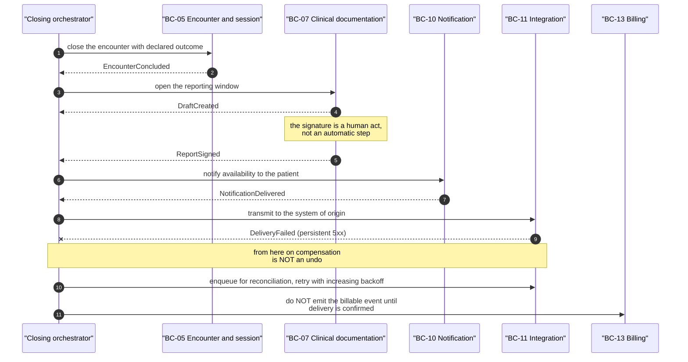
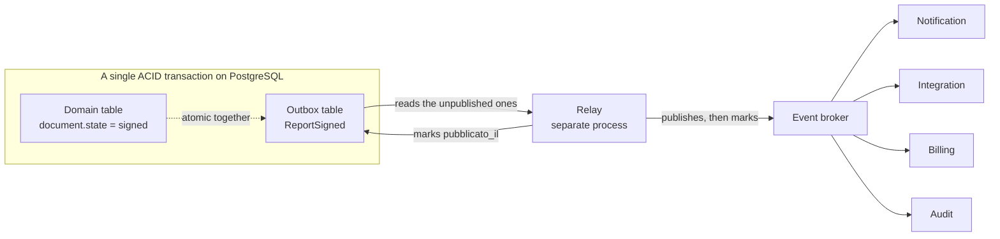
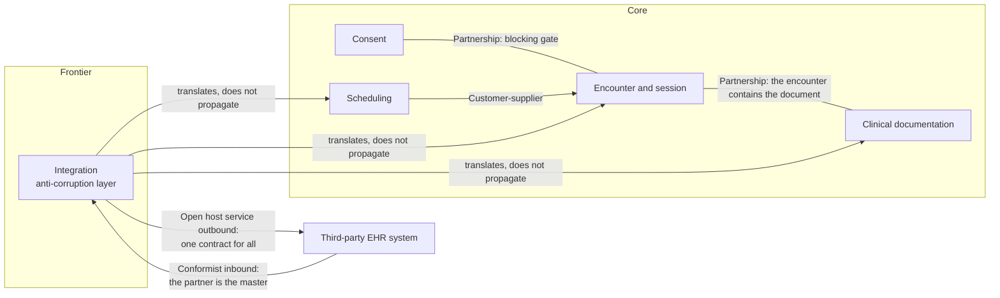
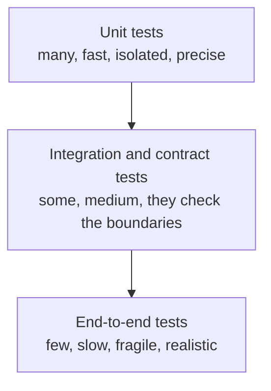

# Computing fundamentals

This module is the mirror image of [block C](09-fondamenti-clinici.md): there, a computing
person is told what happens inside a patient's body; here, a clinician - or anyone coming
from linear application development - is told what happens inside a system made of pieces
that talk to one another across a network.

It presupposes nothing. It does not presuppose that you know what a transaction is, what a
broker is, what «eventual consistency» means. It presupposes only that you have read
[the module on telemedicine services](02-prestazioni-di-telemedicina.md) and
[the one on the clinical datum](03-il-dato-clinico.md), because the examples in this module
are taken from there: a booking, a consent, a signed report, a remote monitoring
(telemonitoraggio) measurement.

This is a deliberate choice. The literature on distributed systems teaches with shopping
carts and bank transfers. Those examples are of no use here: a cart can be emptied, a credit
transfer can be reversed, a report signed and deposited in a citizen's health record
**cannot be undone**. The properties of this domain are different, and the theory has to be
reread through them, not applied mechanically.

All the examples contain **synthetic data only**.

Convention of this module: statements marked **`[NV]`** were not verified against a primary
source while it was being written and carry the indication of the recipient in one of three
permitted forms (area code in backticks, question identifier, or external party named according
to the rules in `CONTRIBUTING.md`); they must be confirmed before being turned into code or into
a requirement. The project's decisions are cited with their identifier (`D15`, `V4`…) and are
found in the project's *context pack*.

---

## 1. Why telemedicine is a distributed system

### 1.1 What changes with respect to a monolithic application

A **monolithic application** is a single program, running in a single process, writing to a
single database. It has an extremely precious property that usually nobody notices, because
it is invisible while it is there: when one part of the program calls another part of the
program, either the call succeeds, or it fails with an error, and in both cases the caller
knows it. There is no third possibility.

A **distributed system** is a set of programs running on different machines, coordinating
with one another by exchanging messages over a network. The third possibility exists: the
call may **give no answer at all**. The caller is left with an uncertainty that no technical
mechanism can eliminate - it does not know whether the other party never received the
request, whether it received it and died before executing it, whether it executed it and died
before replying, or whether it executed it and the reply was lost in the network. These are
four states of the world with very different clinical consequences and a single observable
symptom: silence.

Telemedic is not distributed by architectural choice: it is distributed **by the constitution
of the problem**. Even in its smallest deployment - a single node, everything in Docker
Compose - the system necessarily comprises:

- the patient's browser, typically on a mobile network, with a life cycle the server does not
  control (the user closes the tab, the phone goes into standby, the operating system kills
  the page in the background);
- the professional's browser, on another network, with another clock;
- the audio-video stream which, when the network allows it, travels **directly between the two
  browsers** without passing through the server (WebRTC, see [module 08](08-webrtc-da-zero.md)):
  the server does not see the media and therefore cannot know by direct observation whether the
  clinical communication is working;
- the relay service used when the direct connection fails, which is another machine with
  another availability;
- the digital identity system, which belongs to a third party (a national identity provider)
  and may be slow or unavailable without the project being able to do anything about it;
- the integrator's healthcare management system, which owns the demographic registry and the
  diary and which Telemedic queries without being its owner;
- the national or regional document repository to which the report is transmitted;
- the signature and time-stamping service.

The elements listed are eight, but the network boundaries crossed on the path of **a single
remote consultation (televisita)** are **seven**: the direct stream between the two browsers
and the relay service are not two boundaries, they are **two alternative states of the same
boundary** - either the media travels directly, or it goes through the relay, and never both
in the same session. Each of the seven is a point at which the third possibility manifests
itself.

### 1.2 The eight fallacies of distributed computing

At Sun Microsystems, at the end of the nineteen-nineties, Peter Deutsch formulated a list of
assumptions that every programmer inexperienced in distributed systems makes without noticing,
and that are all false; James Gosling added the eighth. The list circulates as «the eight
fallacies of distributed computing». **`[NV]`** the exact authorship and the date of first
formulation were not verified against a primary source while this module was being written: **`[NV]`** `GUIDA` must verify Deutsch's and Gosling's original formulation;
the technical content, by contrast, is amply borne out by operational experience.

We take them one at a time with the example from the domain that refutes each.

**First: the network is reliable.** False. The patient in a remote consultation is on a mobile network
while moving; they pass from one cell to another, get into a lift, go through a tunnel. The
project makes this a requirement: `RNF-009` calls for the stream to be restored within eight
seconds at the 95th percentile *from the return of connectivity*, which presupposes that
connectivity goes away regularly. An architecture that treats disconnection as an exception
produces, at every network drop, a phantom clinical encounter: it is exactly the defect that
the domain rule `BR-030` forbids by separating the state of the encounter from the state of
the media session.

**Second: latency is zero.** False, and in this domain it is false in a binding way. The
project declares a median round-trip latency below 200 ms on the media stream (`RNF-001`). Two
hundred milliseconds are not zero: they are the threshold beyond which a human conversation
begins to produce turn overlaps, the sensation of interrupting one another and, in a
psychological interview or a neurological assessment, a distortion of the relationship that
has clinical significance. Latency is a **budget to be spent** (§11.6), not a detail to be
neglected.

**Third: bandwidth is infinite.** False. `RNF-008` fixes a default profile at 1.2 Mbit/s per
direction and a reduced-bandwidth mode at 350 kbit/s. Constraint `V6` (mobile first) requires
designing for the worst connection, not for the one in the developer's office.

**Fourth: the network is secure.** False, and the project not only assumes this but makes it a
verifiable requirement: the media is encrypted between the two ends and key verification is
done with a short authentication string compared aloud by the two interlocutors (`D22`). The
idea that «we are inside the corporate network, so we can trust it» is the premise of almost
every lateral compromise.

**Fifth: topology does not change.** False. The participants' network addresses change during
the session - the phone moves from the mobile network to home Wi-Fi and back - and the whole
WebRTC mechanism for gathering and exchanging connection candidates exists precisely because
the topology is mutable and unknown in advance.

**Sixth: there is one administrator.** False, and in this domain conspicuously false. The
citizen's digital identity is administered by a third-party provider, the health record by a
Region, the clinical record by the integrator, the deployment by a service centre which -
according to the national guidance - is an entity **distinct** from the providing centre.
Nobody can order everybody else to reboot.

**Seventh: transport cost is zero.** False in two senses. In the computational sense,
serialising a FHIR `Bundle`, signing it, encrypting it, transmitting it and validating it
costs measurable CPU and memory. In the literal, economic sense, some calls carry a tariff:
the project documents that asking the identity provider for **a single attribute beyond the
basic demographic set** takes the cost per access from €0.4 to €3.5 (`D38`). It is the rare
case in which a data design choice has a unit price printed in a decree.

**Eighth: the network is homogeneous.** False. On the path of a report at least three
technological families coexist: FHIR R4 over HTTP towards the modern integrator, HL7 v2
messaging over a delimiter-based transport protocol towards a hospital's integration engine,
and structured documents with metadata towards the document repository. Module
[13](13-protocolli.md) catalogues them one by one.

### 1.3 Partial failure: the property that changes everything

The operationally most important concept in this section is **partial failure**: in a
distributed system a part may be broken while the rest works, and whoever is working may not
know that the other is broken.

An example from the domain, concrete. The doctor presses «conclude and sign». The system
must, in logical sequence: close the encounter, mark the document as signed, notify the patient
that the report is available, transmit the document to the integrator's management system,
emit the billable event, write the audit entry. Six effects on different components. In a
monolith they would be six lines inside one transaction. Here, the notification may fail
because the mail gateway is saturated; the transmission may fail because the management system
is under maintenance; the audit **cannot fail**, because requirement `RF-196` establishes that
failure of the audit write makes the application operation fail.

Whence the question that will recur throughout the module, and it is the central engineering
question of this project: **which effects must be atomic with respect to one another, and
which may be merely eventual?** It is not a technical question. It is a clinical and legal
question to which technique supplies an answer.

### 1.4 The order of messages is not guaranteed

A last counter-intuitive property. If a component sends two messages, A and B, in that order,
the recipient may receive them in the order B, A. The causes are banal: different network
paths, a retry on A that delays its delivery, two concurrent workers that take on the two
messages and finish at different times.

In the domain: the event `SessionStarted` and the event `EncounterConcluded` concern the same
encounter. If the consumer receives them inverted and applies them naively, the encounter
turns out to be «in progress» for ever - and at that point a health management dashboard shows
sessions open for days, a billing report counts services never closed, and the professional
receives a reminder to write a report for an act they have already reported.

Project research `R5` addresses the problem explicitly and prescribes declaring the
non-guarantee in the contract: «no guarantee of global ordering», with the countermeasure of a
monotonic sequence number per aggregate that allows the receiver to **discard old events**
rather than apply them. This is the correct mental model: one does not build a global ordering
(it costs a great deal and reduces availability), one makes the consumer insensitive to order.

---

## 2. Consistency and availability

### 2.1 What consistency is

The term «consistency» is used in computing with at least three different meanings, and
confusing them is the leading cause of sterile discussions during design.

1. **Transactional consistency**, the C of ACID (§3.1): a transaction takes the database from
   one valid state to another valid state, respecting the declared constraints. It is a
   property of the *data model*.
2. **Replica consistency**: when the same datum exists in several copies, what relation holds
   between the copies? It is a property of the *storage system*.
3. **Consistency as a model of visibility**: what a reader may observe with respect to what a
   writer has written. It is a property of the *contract towards the application*.

Here we are speaking of the third meaning, which is the one that determines the behaviour
observable by the doctor and by the patient.

The strongest form that is useful in practice is called **linearisability**: the system behaves
as if there were a single copy of the datum and every operation occurred at a precise instant
between its request and its response. Practical consequence: if the signature of the report
was confirmed to the doctor at 10:12:03, anyone reading after 10:12:03 sees the report signed.
Nobody can see the previous state.

At the opposite extreme is **eventual consistency**: if writing stops, sooner or later all the
copies converge on the same value. «Sooner or later» is not quantified by the definition. In
the meantime, different reads may return different values.

Between the two extremes there is a hierarchy of intermediate models. The two that matter for
this project are **read your writes** (whoever has written sees at least their own write, even
if the others do not yet) and **monotonic read consistency** (whoever has seen a value will
never again see an earlier one). They are weak guarantees, but they are exactly the ones that
make an interface non-frustrating: a doctor who saves a draft and, on reloading the page, no
longer finds it has lost confidence in the system, and confidence in a clinical setting is not
recovered.

### 2.2 The CAP theorem, and above all what it does not say

The **CAP theorem** - conjectured by Eric Brewer in 2000 and formally proved by Gilbert and
Lynch in 2002; attribution and dates not verified against a primary source in this
drafting: **`[NV]`** `GUIDA` must verify the original CAP theorem formulation by Brewer, Gilbert, and Lynch) - states that a distributed system replicating data cannot simultaneously guarantee
all three of the following properties:

- **C**onsistency, in the sense of linearisability;
- **A**vailability, that is: every request to a non-failed node receives a response;
- **P**artition tolerance: the system keeps working even when the network splits into parts
  that do not talk to one another.

Here are the misunderstandings to correct, because they are widespread and they produce wrong
decisions.

**It is not true that «you pick two out of three».** A network partition is not an
architectural choice: it is an event that happens. Nobody decides not to tolerate partitions;
one decides only **how to behave when they happen**. The real choice is binary and applies only
during the partition: answer anyway, at the risk of answering with stale data (A is favoured),
or refuse to answer until the partition heals (C is favoured).

**It is not true that CAP says anything about normal behaviour.** The theorem speaks only of
the partitioned regime. A more useful model in design is **PACELC**, formulated by Daniel Abadi
**`[NV]`**: *if Partition, then A or C; Else, then L or C* - that is, when the network works,
there remains all the same a trade-off between **latency** and consistency. Every stronger
consistency guarantee is paid for with additional round trips. In a system with a latency
budget of 200 ms this is not an academic detail.

**It is not true that the C of CAP is the C of ACID.** They are two different notions sharing a
letter. The C of ACID is respect for integrity constraints; the C of CAP is linearisability.

**It is not true that CAP says anything at all about a non-replicated system.** A single
PostgreSQL database is not subject to the CAP trade-off among its data: it is subject to a much
simpler trade-off, «if it is down, it is down». The theorem becomes relevant once one
introduces replicas, clusters, or independent services each holding a piece of the truth.

### 2.3 The concrete question: what tolerates eventual consistency in this domain

The useful way to use the theory is to turn it upside down: not «what system shall we build»,
but «which data of our domain admit being observed in different states by different observers,
and for how long».

| Datum of the domain | Model required | Why |
|---|---|---|
| Signed report | Strong, non-negotiable | `BR-044`: a signed document is immutable. If two readers saw two versions, the signature would no longer prove anything and the document's evidential value would fall away |
| Consent to recording | Strong, blocking | `BR-071`: no recording without consent in force. Revocation takes effect immediately (`BC-06`). A two-second window of inconsistency here means two seconds of unlawful recording |
| Outcome of the check on mandatory consents before starting | Strong | `RF-114`: the session cannot start without consents verified. It is a gate, and a gate that is sometimes open is not a gate |
| Capacity of the diary slot | Strong within the tenant | `BR-020`: the sum of bookings on a slot does not exceed the capacity. If two operators simultaneously book the last place, involuntary overbooking is a defect, not a feature (`BR-023`) |
| Audit entry | Strong, with failure propagated | `RF-196`: if the audit does not get written, the operation fails |
| State of the encounter (`Encounter`) | Strong for the transitions, eventual for the propagation | The transition is decided by a single aggregate; its propagation to notifications, billing and dashboards may be eventual |
| Counter of sessions provided in the month | Eventual | Nobody takes a clinical decision on a counter. A dashboard thirty seconds behind harms nobody |
| Channel quality metrics (delay, packet loss, jitter) | Eventual | They are sampled time series: their semantics is already statistical, instantaneous inconsistency is irrelevant |
| Copy of the demographic resource read from the integrator's management system | Eventual by construction | Telemedic **is not** the master (§6.2.3 of the brief): it is reading the copy of a datum that lives elsewhere. To demand strong consistency on a datum one does not own is a contradiction |
| Report transmitted to the document repository | Eventual, with reconciliation | Transmission may fail and be retried; what must be strong is the **local knowledge** of the state of the transmission, not the act itself |
| Read-only `DiagnosticReport` projection for the integrators (`D13`) | Eventual | It is by definition a projection: were it strong, it would be a second master |

The criterion that emerges, and it is generalisable: **everything that is a gate or a proof
requires strong consistency**. A gate is a check that authorises or forbids an act (consent,
capacity, professional registration). A proof is an artefact that will have to withstand a
challenge years later (signature, audit, evidence of consent). Everything that is **derived,
aggregated or informational** tolerates eventual consistency.

There is an important and often ignored architectural consequence: if a datum requires strong
consistency, **it must live in one place only**. Strong consistency is not obtained by
replicating a datum across three services and hoping they stay aligned; it is obtained by
deciding who the owner is and arranging for everyone else to **ask** for it instead of copying
it. It is the same principle that in §7 goes by the name of aggregate.

---

## 3. Transactions

### 3.1 ACID, one letter at a time

A **transaction** is a grouping of operations on the database that the system treats as an
indivisible unit. The acronym **ACID** describes its four properties. We explain them with the
same example: the doctor affixes their signature to the report, and this entails writing the
new version of the document, changing its state from *draft* to *signed*, and recording the
evidence of signature.

**A - Atomicity.** Either all three writes happen, or none does. There is no intermediate state
«document signed but without evidence of signature». It is a guarantee about *failure*, not
about success: atomicity says that half a job is not left lying on the ground.

**C - Consistency.** At the end of the transaction all the constraints declared on the database
are satisfied: the foreign key towards the encounter exists, the mandatory tenant identifier
field is populated (`V4`), the state belongs to the set of admitted values. Note that the C
depends on how *you* declared the constraints: the database enforces the rules you gave it, not
the domain rules you kept in your head.

**I - Isolation.** If two transactions run at the same time, each behaves - within the limits
of the chosen isolation level - as if it were alone. It is the subtlest property and the one
most often got wrong, because the default isolation level of almost every engine is **not** the
one that gives the intuitive guarantee.

**D - Durability.** Once committed, the transaction survives a process crash or a power cut. In
practice this means that the engine has written and synchronised to persistent storage before
answering «done». And this is where durability meets the recovery point of §13: *durable on
which copy?* If the node with the disk catches fire, local durability saves nothing - a replica
is needed.

### 3.2 Isolation levels and the anomalies they admit

The SQL standard defines four isolation levels, defining them **by the anomalies they forbid**.
It is a negative way of defining and must be read carefully: a level does not promise
correctness, it promises only to exclude certain phenomena.

The classic anomalies:

- **Dirty read**: a transaction reads data written by another transaction not yet committed,
  which might then be rolled back. In the domain: the dashboard reads a report as «signed» from
  a transaction that then fails; the report does not exist, but somebody has seen it.
- **Non-repeatable read**: the same row, read twice within the same transaction, returns
  different values because in the meantime somebody has modified and committed it. In the
  domain: consent is checked at the beginning of the procedure, other checks are carried out,
  consent is read again and in the meantime the patient has revoked it.
- **Phantom read**: the same query with the same condition returns a different set of rows,
  because new ones have been inserted. In the domain: the bookings on the slot are counted to
  check the capacity, and between the count and the insert another transaction has inserted its
  own booking.
- **Write skew**: two transactions read a common set, each takes a decision that is correct with
  respect to what it read, and they write on different rows producing a global state that
  violates a constraint neither of them violated individually. It is the most insidious anomaly
  because it is neither a dirty read nor a phantom.

| Level | Dirty read | Non-repeatable read | Phantom | Write skew |
|---|---|---|---|---|
| Read uncommitted | possible | possible | possible | possible |
| Read committed | excluded | possible | possible | possible |
| Repeatable read | excluded | excluded | possible according to the standard | possible |
| Serializable | excluded | excluded | excluded | excluded |

Two operational clarifications that are worth more than the table.

**PostgreSQL's default level is *read committed*.** It means that, unless you do something
explicit, your transactions admit non-repeatable reads and phantoms. **`[NV]`** the exact
behaviour of the *repeatable read* level in PostgreSQL - which is implemented as *snapshot
isolation* and in practice excludes phantoms too, while still admitting write skew - must be
verified against the documentation of the version actually adopted before relying on it in a
requirement.

**Write skew is the way involuntary overbooking gets into the system.** Here is the example
from the domain in its exact form. Two front-office operators simultaneously book the last free
place on a slot with capacity 1.

```sql
-- Transaction A and transaction B, in parallel, at read committed level
BEGIN;
SELECT count(*) FROM appuntamento WHERE slot_id = 'slot-0042';  -- both read 0
-- both conclude: "there is a place"
INSERT INTO appuntamento (id, slot_id, paziente_ref, tenant_id)
VALUES (gen_random_uuid(), 'slot-0042', 'ext:pz-000117', 'tenant-demo');
COMMIT;
```

Neither of the two transactions read dirty data, neither violated a constraint that it could
see. The result is two appointments on a slot for one. Rule `BR-020` is violated and `BR-023`
qualifies this outcome as a **defect**, not as a feature.

The three correct countermeasures, in order of preference:

1. **Make the constraint expressible to the database.** If the capacity is 1, a unique index on
   `slot_id` settles the problem definitively: one of the two transactions fails with a
   uniqueness violation, and the application translates the error into a comprehensible message.
   It is the best solution because it does not depend on the discipline of whoever writes the
   code.
2. **Serialise explicitly on the aggregate.** Lock the slot's row (`SELECT ... FOR UPDATE` on
   the `slot` row) before counting. The key is that the lock be on the **aggregate root**
   (§7.4), not on the child rows: one locks what exists, not what might exist.
3. **Raise the level to *serializable*** and handle the serialisation failure with a retry.
   Correct, but it has to be designed: at serializable level transactions **legitimately fail**
   and the application code must know how to replay them, which requires them to be idempotent
   (§6).

The general criterion: **an invariant domain rule is not defended with a read followed by a
write.** It is defended with a constraint, with a lock on the aggregate root, or with a
serialisable transaction. The three options have different costs; read-and-then-write has the
worst cost, because it seems to work in development and fails in production under load, where
the window between read and write widens.

### 3.3 Distributed transactions, and why they are avoided

If a transaction is so useful, why not extend it to several services? The classic mechanism
exists and is called **two-phase commit** (2PC): a coordinator asks all the participants «are
you ready to commit?», gathers the yeses, and then orders everyone to commit.

It has three defects that, taken together, make it unsuited to this project.

**The coordinator is a point of blockage.** If the coordinator dies between the prepare phase
and the commit phase, the participants remain **in doubt**: they have promised they can commit,
so they hold the locks on the rows concerned, and can neither commit nor roll back until the
coordinator returns. In the domain, this means a diary slot blocked, or a document
inaccessible, for an indeterminate time.

**Availability is the product of the availabilities.** A transaction involving five
participants at 99.9 % each has a theoretical availability of 99.5 %: worse than any of its
components. Adding a participant makes everyone worse off.

**Many of the participants are not transactionable.** This is the decisive point, and it is not
technical: a national document repository, a digital identity provider, a message gateway
towards patients, a time-stamping service **do not offer** a prepare phase. One cannot ask a
national infrastructure to hold a transaction open while we decide. And above all: **a health
act performed in the real world is not undoable**. If the patient has seen the report, they
have seen it.

The project therefore takes the opposite road, and it is codified in `D15`: a local transaction
on the database **plus** reliable publication of an event by way of an outbox (§5). The only
ACID transaction is the one involving a single store; everything beyond the service boundary is
coordinated with a saga.

### 3.4 The saga: coordination without a global transaction

A **saga** is a sequence of local transactions. Every committed step is visible immediately; if
a later step fails, the steps already carried out are neutralised not by undoing them, but by
executing for each a **compensating transaction** that counteracts its effects. The concept was
introduced by Hector Garcia-Molina and Kenneth Salem in a paper of 1987; the exact bibliographic reference has not been verified: **`[NV]`** `GUIDA` must verify the 1987 Garcia-Molina and Salem paper.

There are two styles of orchestration.

- **Choreography**: no coordinator. Each service reacts to the others' events. It is light and
  decoupled, but the overall flow is written down nowhere: to understand what happens you have
  to read all the services. It becomes rapidly unmanageable beyond three or four steps.
- **Orchestration**: there is a component that knows the sequence, issues the commands, receives
  the outcomes and decides whether to proceed or to compensate. It costs one component more but
  it makes the flow **readable, testable and traceable**. In a project that must demonstrate to
  an external assessor how the system behaves in the event of failure (software life cycle under
  `RNF-077`), the readability of the flow is not a luxury.

The project adopts orchestration for the critical clinical flows. **`[NV]`** the specific choice
of orchestration mechanism (a dedicated workflow engine, a state machine persisted in a table, an
application component) is not the subject of an approved decision at the time of writing and must
be formalised in an architectural decision record.

### 3.5 Why a clinical compensation is not an undo

This is the point at which the general literature on distributed systems stops being useful and
the domain has to rewrite the rule.

In the textbooks' canonical example, the compensation for «debit €100» is «credit €100», and at
the end the world is as if nothing had happened. **In the clinical domain this almost never
happens**, for three distinct reasons.

**First reason: the act was perceived by a human being.** If the system has notified the patient
«your report is available» and it then emerges that the document was wrong, there exists no
operation that undoes the reading. The correct compensation is not to delete the notification:
it is to **send a second one** that puts matters right, with wording a patient can understand,
and to record both.

**Second reason: the law requires the trace to remain.** A signed health document is immutable
(`BR-044`) and the audit trail is append-only (`BC-12`, invariant i). Deleting a wrong report
from the system would mean destroying the proof that it existed, that it was consulted and that
it was corrected. The correct model is the one the domain has used since before computing: the
wrong document stays, it is marked as **superseded**, and a new document declares its amendment
and the reason. The clinical documentation context provides for this explicitly with the event
`ReportAmended` and with the state `superseded` among the values of `DocumentState`.

**Third reason: the recipient may be outside our control.** If the document has already been
transmitted to the regional or national document repository, there exists no operation of ours
that removes it from there. There exists only the amendment procedure provided for by that
system, which is a flow in its own right, with its own timings, and which must be **modelled as
a step of the saga**, not assumed to be instantaneous.

From this follow four design rules valid for all the sagas of this project.

1. **Every step must declare its own compensation at the moment it is designed, not when it is
   needed.** If no compensation exists, the step must be moved further along the sequence -
   irreversible steps are executed last. Transmitting the report to the national repository
   before having verified the signature is an error in the ordering of the saga, not a corner
   case.
2. **Compensation is a positive, traced act, not a deletion.** It produces a new event, a new
   audit entry, and a reason (`AmendmentReason`).
3. **Compensation may itself fail**, and its failure must be visible to a human being.
   `DeliveryFailed` is a domain event with a consumer that is a **reconciliation queue visible
   to the front office**, not a message in a log that nobody reads.
4. **Some steps have no compensation and must therefore be made conditional.** The audio-video
   recording of a session cannot be «un-recorded»: the project resolves this by not allowing
   recording to start without a consent in force verified synchronously and strongly (`BR-071`).
   Where compensation does not exist, the cost is moved onto the gate upstream.

The diagram that follows shows the saga for closing a remote consultation, with the compensable steps and
the point beyond which compensation changes its nature.



Note the last step: billing is **not** compensated afterwards, it is **deferred** beforehand. It
is the application of rule 1: when a step is hard to compensate, it is moved to the end of the
sequence.

---

## 4. Event-driven architecture

### 4.1 A command and an event are two different things

They are the two types of message a system exchanges, and confusing them produces architectures
that look event-driven but are coupled like direct calls.

A **command** expresses an intention: *do this thing*. It has a precise recipient, it is in the
imperative mood, it can be **refused**, and whoever sends it expects an outcome.
`StartRecording`, `AdmitPatientToSession`, `TransmitDocumentToSystemOfOrigin` are commands.

An **event** states a fact that has happened: *this thing has happened*. It has no designated
recipient, it is in the past tense, it **cannot be refused** - it has already happened - and
whoever emits it does not know and must not know who will consume it. `SessionStarted`,
`ReportSigned`, `ConsentRevoked`, `ThresholdExceeded` are events.

The distinction has an immediate practical consequence for coupling. If the session context
emits the command `SendNotificationToPatient`, it knows that a notification service exists and
it knows its contract: every change to the recipient touches it. If instead it emits the event
`EncounterConcluded`, it knows nothing of its consumers: notification, billing, audit and
integration subscribe and unsubscribe without the producer changing by a single line. The
project's domain event catalogue (`R6` §8.4) is built like this: one producer, many declared
consumers.

The criterion of choice, put as a question: **if tomorrow we add a consumer, must the producer
change?** If yes, you have written a command dressed up as an event.

The mirror-image mistake, equally frequent: calling an event `PatientToBeNotified`. That is not
a fact, it is an order with a participle. The correct name of the fact is
`PatientEnteredLobby`, and the decision to notify belongs to the consumer.

### 4.2 Producer, consumer, and what lies between

In the simplest form the producer calls the consumer directly. It works as long as there is one
consumer and as long as they are always available. As soon as the consumers become four, and one
of them is slow, the producer pays for everyone's slowness - and the doctor who pressed
«conclude» waits for the billing system to answer before seeing the next screen. It is
unacceptable and, under the project's latency constraint, measurable.

Between producer and consumers one therefore puts a **message broker**: an intermediate component
that accepts the message from the producer, keeps it, and makes it available to the consumers in
their own time. The producer is free as soon as the broker has accepted.

The project adopts **Apache Kafka** (`D15`). Kafka is not a traditional queue: it is a
**distributed log**, and the difference is substantial.

### 4.3 The event log

A **log** in this sense is not the diagnostic file of §12: it is a sequence of records that is
**ordered, immutable and append-only**. Every record has a progressive numeric position called an
**offset**. Records are not removed when a consumer reads them: they remain for a configured
retention period, and each consumer keeps track of **how far it has got**.

The consequences are three and all are relevant to this domain.

**Several independent consumers read the same stream without disturbing one another.** The event
`ReportSigned` is read by notification, by integration, by billing and by audit; each has its own
position. In a classic queue, the first to read consumes the message and the others never see it.

**The past can be reread.** A defect in the billing consumer, fixed today, is remedied by moving
that one consumer's position back and replaying the events of the last few days. No other consumer
notices. It is an operational capability worth a great deal in a system that must demonstrate the
correctness of its own counts.

**A consumer's delay is measurable.** The difference between the offset of the last record written
and the offset reached by the consumer is called **lag**, and it is the most honest saturation
metric of an event-driven system (§11.4): it says, in number of events, how far behind the consumer
is.

### 4.4 Partitioning and ordering

An event stream (in Kafka, a *topic*) is divided into **partitions**. The fundamental rule, and it
must be learned by heart because everything else follows from it:

> Ordering is guaranteed **within** a partition, and **not** across different partitions.

The destination partition of an event is chosen on the basis of a **partition key**. Whence the
most important design decision of an event-driven architecture: **which key?**

In the domain, the correct choice is almost always **the identifier of the aggregate root to which
the event refers**.

| Event stream | Partition key | Consequence |
|---|---|---|
| Encounter life cycle | identifier of the `Encounter` | all the events of the same encounter are ordered with respect to one another; different encounters proceed in parallel |
| Clinical documentation | identifier of the document | draft, signature and amendment of the same document arrive in order |
| Consents | identifier of the patient within the tenant | granting and revocation for the same patient do not overtake one another |
| Quality telemetry | identifier of the media session | the samples of the same session stay in sequence |
| Events towards the integrator | identifier of the tenant, **or else** of the aggregate | see the warning below |

Two recurring mistakes, both with visible consequences.

**Key too coarse.** Partitioning by tenant looks aligned with constraint `V4`, but it puts all the
events of a large **azienda sanitaria locale (ASL, local health authority)** into a single
partition: the maximum parallelism of that tenant becomes one, and one slow event blocks all the
other events of that tenant. The capacity to isolate tenants from one another is obtained with
quotas and circuit breakers, not with the partition key.

**Key too fine, or absent.** If `SessionStarted` and `EncounterConcluded` end up in different
partitions because the key is random, one falls back into the problem of §1.4: the consumer
receives them inverted. The countermeasure is the one already indicated - a sequence number per
aggregate and discarding of old events - but it is a patch: if the aggregate is the same, the right
key exists and must be used.

It has to be said clearly that **partitioning is not free**: choosing it by aggregate means that the
number of partitions determines the maximum parallelism, and that increasing the partitions after
the fact **changes the assignment function** and can therefore break the ordering of the aggregates
in flight. **`[NV]`** the exact behaviour of reassignment on an increase in partitions for the
version of Kafka adopted must be verified against the documentation before planning a resizing in
service.

### 4.5 Consumer groups

A **consumer group** is a set of processes collaborating to read the same stream: the broker assigns
each member a disjoint subset of the partitions, so that every event is processed by **one and only
one** member of the group. Adding a process to the group increases parallelism, up to the number of
partitions. Different groups each receive all the events.

In the domain: `notification`, `integration`, `billing`, `audit` are four distinct **groups** on the
same stream of encounter events; each group may have three processes sharing out the partitions.

Three operational traps.

**Rebalancing.** When a member joins or leaves the group, the broker reassigns the partitions. During
the reassignment, processing stops. A consumer that takes too long to process a single event is
deemed dead and evicted, causing a rebalance, which slows things further, which causes another
eviction: this is the perpetual rebalancing loop, and it is recognisable because the *lag* grows
without the load having grown. Countermeasure: short processing, heavy work moved elsewhere, session
parameters consistent with the real processing time.

**The moment of committing the position.** If the consumer commits the position *before* processing,
a crash loses the event (*at-most-once* delivery). If it commits *after*, a crash reprocesses it
(*at-least-once* delivery). There is no third option, and the correct choice for this domain is
always the second, with idempotent consumers (§6).

**The poison event.** An event that systematically makes the consumer fail blocks its partition for
ever. An explicit policy is needed: maximum number of attempts, then a move to a stream of
unprocessable events with notification to a human being. A clinical event that ends up there **must
not be silently discarded**: `DeliveryFailed` must surface in a visible reconciliation queue.

### 4.6 What the broker solves, and what it does not

It solves: the decoupling of producer from consumers; the absorption of peaks (the broker acts as a
buffer between a fast producer and a slow consumer); resistance to the temporary unavailability of a
consumer; the possibility of adding consumers without touching the producer; replayability.

It does not solve: consistency between the database and the event stream (that is the problem of §5,
and the broker on its own **makes it worse**); global ordering; exactly-once delivery towards the
outside world (§6.1); operational complexity, which increases - and that is the reason why `D15`
prescribes, for deployment at the customer's premises, a single-node setup in a mode without an
external coordinator, and prescribes that the publication abstraction remain **behind a project
interface**, so that the domain code is not wedged into the broker.

This last point deserves emphasis: the domain must say «this has happened», not «publish on this
topic with this key». The translation belongs to the infrastructure. It is the same principle as the
anti-corruption layer of §7.7, applied on the way out.

---

## 5. Dual write and the transactional outbox

### 5.1 The problem, in its exact form

Let us take up the simplest possible operation again: the doctor signs the report. The system
must do two things:

1. write to the database that the document is signed;
2. publish on the broker the event `ReportSigned`, so that notification, integration, billing
   and audit learn of it.

They are two different systems. There is no transaction that comprises both - and even if
there were (2PC), §3.3 explains why we do not want it. So the writes happen in sequence, and
**between the two there is a window**. This is the **dual write**: the commonest and most
underestimated architectural defect of event-driven systems.

What can go wrong, exhaustively:

```java
// SBAGLIATO - non fare questo. Illustrazione del difetto.
@Transactional
public void firma(DocumentoId id, EvidenzaFirma evidenza) {
    var documento = repository.carica(id);
    documento.applicaFirma(evidenza);      // (1) scrittura sulla base dati
    repository.salva(documento);
    broker.pubblica(new RefertoFirmato(id)); // (2) scrittura sul broker
}
```

**Case A - the process dies between (1) and (2).** The database, on commit of the transaction,
contains the signed report. The event was never published. Result: the patient does not
receive the notification, the integrator's management system does not receive the document,
the billable event does not exist. The datum is correct and the world around it does not know.
This is a **lost event**, and it is the worst failure mode because it is **silent**: no error,
no warning, no trace. It is discovered weeks later, when a patient telephones asking for a
report that the system shows as delivered.

**Case B - the publication (2) succeeds but the transaction (1) is rolled back.** If the
publication happens inside the transactional block, as in the example, and the commit of the
transaction then fails (constraint violation, serialisation conflict, loss of the connection to
the database), the event has already left. Result: the notification reaches the patient for a
report that in the database is still a draft, and the integrator asks for a document that does
not exist. This is a **phantom event**.

**Case C - publication is slow.** If the broker takes three seconds to reply, the transaction on
the database stays open for three seconds, holding locks on the rows. A slowdown of the broker
turns into contention on the database and, in cascade, into saturation of the connection pool.
It is the mechanism by which an isolated failure propagates.

No ordering of the two operations eliminates the problem: writing to the broker first gives you
case B guaranteed; writing to the database first gives you case A. **A dual write is not
resolved by reordering: it is resolved by eliminating the second write.**

### 5.2 The transactional outbox

The idea is simple and for that reason robust: **do not publish the event; write it to a table
of the same database, inside the same transaction as the domain datum.** A separate process -
the **relay** - reads the table and publishes to the broker.

The table is called the **outbox**, «outgoing mail».

```sql
CREATE TABLE evento_outbox (
    id              uuid        PRIMARY KEY,
    tenant_id       text        NOT NULL,
    aggregato_tipo  text        NOT NULL,     -- 'Encounter', 'ClinicalDocument', ...
    aggregato_id    text        NOT NULL,     -- partition key (§4.4)
    tipo_evento     text        NOT NULL,     -- 'RefertoFirmato'
    versione_schema int         NOT NULL,     -- contract versioning (§10.2)
    occorso_il      timestamptz NOT NULL,     -- domain time (§8.4)
    payload         jsonb       NOT NULL,     -- references, NEVER clinical content
    pubblicato_il   timestamptz NULL,
    tentativi       int         NOT NULL DEFAULT 0
);

CREATE INDEX ON evento_outbox (pubblicato_il) WHERE pubblicato_il IS NULL;
```

And the write becomes a single one:

```java
@Transactional
public void firma(DocumentoId id, EvidenzaFirma evidenza) {
    var documento = repository.carica(id);
    documento.applicaFirma(evidenza);
    repository.salva(documento);
    outbox.accoda(EventoDiDominio.di(documento, "RefertoFirmato"));  // stessa transazione
}
```

If the transaction fails, both writes fail: no phantom event. If the transaction succeeds, the
event is **durably recorded**: the relay will publish it sooner or later, even if the broker is
switched off at this moment. No lost event.



### 5.3 How the relay works

Two possible implementations, with different properties.

**Periodic querying** (*polling*). The relay queries the table looking for rows with
`pubblicato_il IS NULL`, ordered by key, takes a batch, publishes, marks. Simple, with no
additional dependencies, easy to understand and to test. Cost: a query every few tenths of a
second and a publication latency equal to the interval. Delicate point: if several instances of
the relay run together, a lock is needed - `SELECT ... FOR UPDATE SKIP LOCKED` is the construct
that allows several workers to take disjoint batches without blocking one another.

**Change data capture.** The relay reads the database's replication log and extracts from it the
inserts on the outbox table. Much lower latency, no query load, but it introduces one more
infrastructural component to install, update, monitor and record as a third-party software
component - with all the obligations that this entails under the project's regime. **`[NV]`** the
choice between the two modes is not the subject of an approved decision at the time of writing;
the reasonable criterion is to adopt periodic querying as the default mode, in order to contain
the operational weight of deployment at the customer's premises, and change data capture as an
option for high-volume setups.

### 5.4 What the outbox guarantees, and what it does not

This section is the reason why the outbox must be explained in full and not cited as a formula.

**It gives: no lost event.** If the datum has been written, the event is in the table, and the
relay publishes it sooner or later.

**It gives: no phantom event.** If the datum has not been written, the event is not in the table.

**It gives: ordering per aggregate within the table.** If the rows are read in insertion order
and published with the aggregate's partition key (§4.4), the relative order of the events of
the same aggregate is preserved.

**It gives: failure decoupling.** The broker may be switched off for hours; clinical operations
continue, the outbox grows, and on switching back on the relay catches up. This is what makes
the system usable in a hospital deployment where the infrastructure is not always available.

**It does not give: exactly-once delivery.** It is the guarantee nobody has and everybody
believes they have. The relay publishes, and then marks the row as published: if it dies between
the two operations, on restart it republishes the same event. **The outbox is intrinsically *at
least once*.** The consumer must be idempotent. It is not a defect to be corrected: it is a
property to be accepted and designed around (§6).

**It does not give: low latency.** Between the commit of the transaction and the availability of
the event on the broker passes the relay's time. With periodic querying that is tens or hundreds
of milliseconds. For a low-latency flow such as the exchange of WebRTC connection candidates this
is unacceptable - and indeed that flow **does not go through the outbox**: it goes through a
direct channel. The outbox is for domain events, not for real-time signalling. It is a
distinction that must be held firm, because the temptation to route everything through the broker
is strong and produces slow systems.

**It does not give: global ordering across different aggregates.** What was said in §4.4 applies.

**It does not give: the guarantee that the consumer has processed.** The outbox guarantees
publication, not the effect. If it is necessary to know that the integrator's management system
has actually received the report, a **return confirmation** is needed and a reconciliation state,
which is exactly what the integration context models with `OutboundDelivery` and the events
`DeliveryFailed` / `DeliveryReconciled`.

**It does not give: exemption from housekeeping.** The outbox table grows indefinitely if nobody
prunes it. A process is needed to delete published rows beyond a safety window, and the window
must be chosen long enough to allow a manual republication after an incident. An outbox table
that grows without limit degrades the performance of the production database, and it is an
inelegant way of causing a clinical unavailability.

One last rule, which follows from data minimisation and not from the theory of distributed
systems: **the outbox payload does not contain clinical content**. It contains references.
Research `R5` prescribes this for outbound notifications with three converging reasons -
minimisation, reduction of harm in the case of a misconfigured recipient, alignment with the
identifiers-only model of FHIR subscriptions - and the same rule applies a fortiori to a table
that stays in the database and to a broker that keeps messages for days.

---

## 6. Delivery and idempotency

### 6.1 The three delivery semantics, and why one of them does not exist

When a message crosses a network, the possible guarantees are three.

**At most once.** You send and you do not retry. The message arrives zero times or once. Simple,
and acceptable only for data whose loss has no consequences: one quality telemetry sample among
thousands, a presence update in the interface. **Never** for a clinical event. A lost
`ReportSigned` is a report that does not reach the patient.

**At least once.** You retry until you receive confirmation. The message arrives once or more. It
is the semantics the project adopts for all domain events and that research `R5` prescribes
**declaring explicitly in the contract** of the notifications towards the integrator.

**Exactly once.** It is the object of the most expensive misunderstanding in this discipline, and
it must be taken apart precisely.

The problem is not one of engineering, it is logical. Sender and recipient communicate over a
channel that may lose messages. The sender sends; it receives no confirmation. It has two
options: retry (risking a duplicate, if the confirmation was lost) or not retry (risking loss, if
it was the request that was lost). **There exists no protocol that avoids both risks**, because
the sender cannot distinguish the two cases with any finite number of messages. This is the
substance of the two generals problem, whose impossibility has been proved.

What, then, do the systems that declare «exactly-once» sell? Two different things, both
legitimate, neither of which is what the name suggests.

- **Exactly-once processing *within* the system**: if reading the message, updating the state and
  writing the result happen within the same broker transaction, the internal effect is unique even
  in the presence of transport duplicates. Kafka offers this for flows that stay inside Kafka.
  the exact limits of this guarantee in the version adopted and in the single-node setup: **`[NV]`** `TECH` must verify the Kafka documentation
  provided for by `D15` must be verified against the documentation before relying on it.
- **Deduplication at the receiver**: the receiver recognises that it has already seen that message
  and does not repeat the effect. This is *at least once* plus idempotency, and it produces an
  observable result equivalent to exactly-once.

**The moment the effect leaves the system - a message to the patient's phone, a call to the
document repository, a charge - there exists no exactly-once guarantee at all.** What exists is
the second option: making the duplicate harmless.

A formula to remember: **unique effect = at-least-once delivery + idempotency of the receiver**.

### 6.2 Idempotency

An operation is **idempotent** if executing it several times with the same arguments produces the
same final state as executing it once only. It does not mean «it returns the same value»: it
means «it adds no effects».

Some operations are idempotent by nature: assigning a value (`documento.stato = 'firmato'`),
deleting by key, setting a conclusion date. Others are not idempotent by nature: incrementing a
counter, adding an element to a list, sending a message.

In the domain, the classification is instructive and must be made explicitly:

| Operation | Idempotent by nature? | How it is made safe |
|---|---|---|
| Marking the encounter as concluded with an outcome | Yes | no intervention; the second execution changes nothing |
| Recording the evidence of consent version *n* for a patient | Yes, with a natural key | uniqueness constraint on (patient, type, version of the privacy notice) |
| Creating an appointment | **No** | idempotency key supplied by the caller (§6.3) |
| Incrementing the count of sessions provided | **No** | do not increment: **count** from the events with a unique identifier |
| Sending the message «your report is available» | **No, and without compensation** | deduplication on the sending side, with a persisted deduplication key |
| Transmitting the document to the document repository | Depends on the recipient | ideally the recipient accepts a document identifier and recognises the duplicate; if it does not, a table of local transmissions is needed |
| Adding an audit entry | **No** by nature, but it **must** remain append-only | the event identifier as key; a rewrite of the same key is ignored, never overwritten |
| Starting the recording of the session | **No** | command with a request identifier; the second execution returns the current state, it does not start a second recording |

The row about the counter deserves a comment, because it is the mental model that saves the most
bugs. `counter = counter + 1` is not idempotent and never will be. The solution is not to protect
it with locks: it is **not to store the counter**. One stores the facts - the sessions provided,
each with its own identifier - and the count is derived. A fact recorded twice with the same key
is a single fact. It is the same principle as the event as the source of truth.

### 6.3 Idempotency key and deduplication

The **idempotency key** is an identifier generated **by the caller** that identifies the
*intention*, not the attempt. If the caller retries the same intention, it reuses the same key;
the service recognises that it has already executed and returns the previous outcome without
re-executing.

The project exposes it on the application API with the field `Idempotency-Key`, aligned with an
IETF working document that **is not yet a published standard** - and research `R5` prescribes
declaring it as such in the public documentation, not as a standard.

```http
POST /v1/sessions HTTP/1.1
Host: telemedic.example
Authorization: Bearer <token>
Idempotency-Key: 01J9ZC7Y4Q7K9V0R2M4T8N1B3D
Content-Type: application/json

{
  "tenantId": "tenant-demo",
  "appointment": { "system": "urn:example:agenda", "value": "apt-0000931" },
  "modality": "televisita"
}
```

The implementation rules that make the mechanism actually correct, and that are almost always
incomplete in naive implementations:

1. **The key is per caller and per operation.** The same key presented by another integrator, or
   on another endpoint, is a different thing. The deduplication key stored is the triple (client
   identifier, operation, key).
2. **The outcome is stored too, not just the fact of having executed.** The retry must receive the
   same response as the first time, body included. Answering «already done» without saying what was
   done forces the caller into a further query, and on an unstable network into a loop.
3. **The fingerprint of the request is stored.** If the same key arrives with a different body, it
   is not a retry: it is a caller error, and it must be refused with an explicit conflict.
   Otherwise a defect in the caller - a key reused for two different bookings - silently turns into
   a missing booking.
4. **Concurrency handling is needed.** Two retries in parallel, both with the same key, arrive
   before the first has finished. A key-reservation row inserted atomically at the start is needed:
   the second finds the row and waits, or receives a code telling it to retry later.
5. **The validity window is finite and declared.** Twenty-four hours, seven days: the choice is a
   project matter, but it must be written into the contract, because the caller must know for how
   long the retry is safe.
6. **It is not put on already idempotent operations.** On `GET`, `PUT` and `DELETE` the HTTP
   semantics is already idempotent: adding the key is noise.

On the event side, deduplication works in the same way but the key is the event identifier,
generated by the producer. The consumer keeps a table of the keys already processed, with a window
at least equal to the maximum retry window. Research `R5` prescribes this for the notifications
towards the integrator, with the important proviso that **the replay of an event from the
dead-letter queue reuses the same identifier**, precisely so that the receiver's deduplication
goes on working.

The best way of obtaining deduplication, however, is **not to add a table**: if the effect of the
event is a write on a row whose natural key derives from the event identifier, deduplication is
the uniqueness constraint of the database. Less code, no window to manage.

### 6.4 Non-idempotent side effects

There are operations whose repetition produces harm that no key eliminates, because the effect
has already left the system.

- **The message to the patient.** Two identical messages seconds apart are not a serious incident,
  but they are a sign of malfunction visible to the most fragile user of the system. Worse: two
  *different* messages for the same fact, generated by two processings with different outcomes, are
  a contradictory communication to a patient.
- **The transmission of the document to the document repository.** A document deposited twice
  creates a duplicate in a citizen's health record, which has to be removed with that system's
  amendment procedure, not with a deletion of ours.
- **The call to the identity provider with a request for attributes.** It has a unit cost (`D38`).
  Retrying by mistake is money spent.
- **The start of the recording.** Two recordings of the same session double the exposure of a
  particularly sensitive datum and double the retention surface.

The design rule is: **isolate the non-idempotent effect behind a deduplication gate of its own, as
close as possible to the effect**. The gate of the notification service must sit in the
notification service, not in the producer of the event; it is the only point that sees all the
paths leading to the send.

### 6.5 Retries, exponential backoff, jitter

The retry is the elementary countermeasure to a transient failure. Done badly, it is the most
effective way of turning a small failure into total unavailability.

**Immediate retry in a tight loop**: the caller retries at once, a thousand times a second. The
struggling service receives a thousand times the normal load and never recovers. The retry has
caused the failure it meant to mitigate.

**Exponential backoff**: the interval between attempts doubles each time, up to a cap. The load on
the struggling service decreases rapidly and leaves it room to recover.

**Jitter**: a random term added to the interval. It is **mandatory, not ornamental**. Without
jitter, a thousand callers that failed at the same instant all retry at the same later instant: a
synchronised wave forms that hits the service again just as it has recovered, knocks it down
again, and perpetuates itself. In the domain: if an integrator's endpoint stays unavailable for
five minutes, on reactivation it receives in one go all the accumulated events of all its tenants.
It is an involuntary denial of service against a partner.

The formula prescribed by research `R5` for outbound deliveries:

```
backoff(n) = min( base * 2^(n-1), cap ) * (0.5 + random(0; 0.5))
base = 5 s,  cap = 6 h,  attempts = 12   ->   coverage ≈ 72 h
```

Equally important is **when not to retry**. A retry on a permanent error is wasted load and delays
the discovery of the problem.

| Outcome | Retry? |
|---|---|
| Network error, timeout, `408`, `429`, `5xx` | Yes |
| `2xx` | No: it succeeded |
| `410` (resource no longer existing) | No: deactivate the endpoint and report it |
| Other `4xx` | No: it is a permanent error of the recipient; report it, do not insist |
| `429` and `503` with an indication of how long to wait | Yes, respecting the indicated wait if greater than the computed one |

An additional rule that is often forgotten: **do not retry at several levels simultaneously**. If
the HTTP client retries three times, the service using it retries three times, and the queue
retries three times, a single event produces twenty-seven calls. Retry amplification is
multiplicative along the chain, and it must be concentrated in **a single layer**, declared.

### 6.6 Circuit breaker and bulkheads

**Circuit breaker.** If a downstream service fails continuously, there is no sense in going on
querying it: one wastes one's own capacity, one keeps the load on whoever is struggling, and one
makes the user wait for a certain failure. The breaker observes the outcome of the calls and, once
a failure threshold is passed, **opens**: subsequent calls fail immediately, without touching the
network. After an interval it moves into a trial state in which it lets a few calls through; if
they succeed, it closes again.

Three states, and all of them must be implemented: closed (normal traffic), open (immediate
failure), half-open (cautious verification). A breaker that goes straight from open to closed
dumps all the accumulated traffic at once on the service that has just come back, and knocks it
down again.

In the domain, the breaker is per **webhook endpoint and per tenant**, not global: an integrator's
faulty endpoint must not consume the delivery capacity of the others. It is the direct corollary
of constraint `V4` applied to capacity, and research `R5` formulates it as *isolating noise between
tenants*.

**Bulkheads.** The name comes from the watertight compartments of a ship's hull: a breach floods
one compartment, not the vessel. In software, it means assigning **separate and limited** resources
to different categories of work, so that the exhaustion of one does not touch the others.

An example from the domain that clarifies the concept better than any definition. The system has a
single database connection pool with fifty connections. A billing report over thirteen months of
data, launched by an administrator, occupies forty connections for two minutes. Meanwhile, ten
patients try to enter the virtual waiting room and cannot: a reporting operation has prevented
access to a health act. The bulkhead consists in giving analytical work its own pool, small and
separate, and in reserving for the clinical path a share that nobody else can erode.

The bulkheads this system requires, as a minimum: separation between the synchronous clinical path
and asynchronous work; separation between outbound delivery and internal processing; separation of
resources per tenant in expensive operations; separation between analytical read queries and
operational transactions.

### 6.7 Timeouts and their hierarchy

A **timeout** is the time beyond which one stops waiting. It is the mechanism that turns the third
possibility of §1.1 - silence - into a manageable event.

The mistake to start from: **the default timeout of almost every client is too long or absent**. An
HTTP client with no timeout, faced with a server that accepts the connection and never answers,
waits indefinitely while keeping a thread busy. A hundred requests like that exhaust the pool, and
the service stops answering everybody - not because it is broken, but because it is waiting.

The rule that governs everything else: **the timeout of the caller must be greater than the timeout
of the callee, and the sum along the chain must fit within the user's budget.**

If this hierarchy is violated, one gets the worst possible behaviour: the caller gives up while the
callee is still working; the work is completed and its outcome thrown away; the caller retries and
sets the same work going again. The system consumes twice the resources and the user sees an error.

A numerical example consistent with the project's requirements, for the path «the patient enters
the virtual waiting room», with a user-perceived budget of 3 seconds:

| Level | Timeout | Note |
|---|---|---|
| Patient interface towards the gateway | 3 000 ms | it is the perceived budget; beyond it, a comprehensible message is shown with a suggested action (`RNF-054`) |
| Gateway towards the session service | 2 500 ms | leaves 500 ms to the gateway to fail cleanly |
| Session service towards the consents service | 800 ms | blocking check; if it expires, entry is denied with an explicit reason, never granted permissively |
| Session service towards the database | 500 ms | beyond this threshold there is contention, not normal slowness |
| Session service towards the integrator's demographic registry service | 700 ms, non-blocking | if it expires, one proceeds with the minimal data already available |

Two final clarifications, both frequent sources of failure.

**The connect timeout and the read timeout are two different things.** The first limits the time to
establish the connection, the second the time to receive the data. Setting only the first leaves
the commonest case uncovered: the server accepts and then falls silent.

**A gate that times out does not open.** A consent check that times out does **not** authorise
entry. Permissive fallback (*fail-open*) is acceptable for an accessory service - demographic
enrichment, the computation of a statistic - and is forbidden for a security or lawfulness check.
`RF-114` admits no exception for network slowness.

---

## 7. Domain-Driven Design

*Domain-Driven Design* - «design guided by the domain», formulated by Eric Evans in a book of
2003; the source has not been verified: **`[NV]`** `GUIDA` must verify Evans' Domain-Driven Design book (2003) - is not a set of coding techniques. It is a thesis: **in a complex system the
principal difficulty is not technical but one of understanding the domain**, and the code must
be organised so as to make that understanding explicit and verifiable by those who know the
domain.

In this project the thesis is stronger than usual, because those who know the domain - the
doctor, the nurse, the data protection officer - **must be able to read the model and say where
it is wrong**. It is exactly what the [reading path for clinicians](00-come-usare-questa-guida.md)
asks for. A model that can only be discussed among developers is a model that no clinician will
ever correct.

### 7.1 Ubiquitous language

The **ubiquitous language** is a single vocabulary, shared between domain experts and
developers, used **everywhere**: in conversations, in requirements, in class names, in table
columns, in endpoints, in interface messages and in event names. It is not a glossary to be
consulted: it is the rule whereby, if a thing is called something in the meeting, it is called
the same thing in the code.

The reason this matters here more than elsewhere is that the Italian healthcare domain is
**full of words that look like synonyms and are not**, and every confusion produces a structural
defect, not a typo.

- **Assistito** is an administrative status; **paziente** is a clinical status. The same person
  may be an assistito without being a paziente. A single concept for both produces a model in
  which one cannot represent someone entitled to care but with no open episodes.
- **Prestazione** in Italian covers three things that in FHIR are distinct resources: the
  request, the performance, the charge. A single «Prestazione» object is, according to research
  `R6`, «the commonest modelling error in this domain».
- **Contatto** in everyday Italian also means «telephone contact details». In the code one uses
  `Encounter`, never `Contact`, so as not to collide with FHIR's `Patient.contact` element.
- **Ticket** means both cost-sharing by the patient and a support request. In the code:
  `CoPayment` versus `SupportTicket`.
- **Teleassistenza** is a professional health act; **technical assistance** is user support. In
  the code: `TeleAssistanceEncounter` versus `TechnicalSupportTicket`.
- **Informed consent to the health act** and **consent to the processing of data** have
  different legal bases, revocability and effects. Merging them into a single boolean field is,
  verbatim, «the costliest error in the domain» (`BR-060`).

The glossary of [module 19](19-glossario.md) and the chapter on the ubiquitous language in
research `R6` are not accessory documentation: they are **the source from which the names
derive**. A class name that does not appear there is an invented name, and it must be discussed
before it is written.

### 7.2 Bounded context

A **bounded context** is a portion of the system within which a model and its language are
coherent and valid. Outside that boundary, the same words may mean something else, and that is
fine: the boundary exists precisely to allow it.

The criterion with which the project drew the boundaries is not technical. Research `R6`
identifies **three lines of fracture** observable in the domain.

**Fracture of language.** «Session» means three different things: for the doctor it is the act,
for the infrastructure it is the media connection, for the administration it is the billable
unit. Where the same word changes meaning, **a boundary passes**.

**Fracture of rate of change.** Reporting changes when health legislation changes; telemetry
changes when the media protocols evolve. Different rates, different releases, different
contexts.

**Fracture of protection regime.** Clinical content, evidence of consent, audio-video recordings
and the access log have incompatible access and retention regimes. Keeping them in the same
context would force the strictest regime to be applied to all of them, making the system
unusable - an administrator could not read an access log without touching clinical content.

This third fracture is specific to the healthcare domain and does not appear in the general
literature. It is worth making explicit: **the boundaries between contexts in this project are
also boundaries of authorisation and of retention**, not only of model.

The project counts thirteen of them, listed in research `R6` §8.2 and summarised in the
[module on the architecture](16-architettura-del-progetto.md).

### 7.3 Entity and value object

An **entity** has an identity that persists across changes in its attributes. A patient who
changes surname, address and contact details remains the same patient. Two entities with the
same attributes are nevertheless two different entities, if they have different identifiers.

A **value object** has no identity: it is defined entirely by its attributes, it is
**immutable**, and two value objects with the same attributes are interchangeable. Changing it
means replacing it.

In the domain, the classification has already been made and it is worth reading it in order to
understand the criterion:

| Concept | Type | Why |
|---|---|---|
| `PatientRecord` | Entity | it has an identity of its own within the tenant, it survives changes in the data |
| `Encounter` | Entity | it is the act, it has an identity that the report and the audit reference |
| `ClinicalDocument` | Entity | it has versions; the document's identity survives amendment |
| `TenantId` | Value object | it is a value; it has no life cycle of its own |
| `ExternalIdentifier` (system + value) | Value object | the pair **is** the information; it makes no sense to «modify» the system of an identifier |
| `SignatureEvidence` | Value object | it is immutable by construction: evidence of signature that can be modified is not evidence |
| `QualitySample` (delay, loss, jitter, instant) | Value object | it is a measurement; it is not updated, another one is taken |
| `LevelOfAssurance` | Value object | it is a level, not an object with a history |
| `RetentionPolicy` | Value object | it is a configuration; changing it means replacing it and versioning it |

The practical advantage of value objects, in a project with the immutability rule declared in
the coding standards, is that they **eliminate an entire category of defects**: a value object
shared between two parts of the system cannot be modified by one without the other knowing.
`ConsentEvidence` - declarant, instant, channel, text - must be a value object for a reason that
is not one of elegance: if it were modifiable, the evidence of consent would prove nothing in a
dispute.

### 7.4 Aggregate and invariant

An **aggregate** is a group of entities and value objects treated as **a single unit of
consistency**. One of the entities is the **root** (*aggregate root*): it is the only point of
access from outside, and the internal objects are reached only through it.

An **invariant** is a condition that must be true **at every observable instant**, not only at
the end. «The sum of the bookings on a slot does not exceed the capacity» is an invariant. «A
signed document is immutable» is an invariant. «A consent always refers to an immutable version
of a text» is an invariant.

The link between the two concepts is the most useful design rule in DDD, and it must be stated
precisely:

> **The boundary of the aggregate is the boundary within which an invariant can be guaranteed in
> a single transaction.** What must be true instantaneously lies inside the same aggregate; what
> may be true eventually lies in different aggregates, coordinated by events.

From this three practical rules follow.

1. **A transaction modifies one aggregate only.** If two need modifying, one of them does so in
   reaction to an event of the first, and the invariant between the two is eventual, not strong.
   If that invariant *must* be strong, then the two aggregates are in fact one and the boundary
   is badly drawn.
2. **Aggregates refer to one another by identifier, never by direct reference.** `Encounter` does
   not contain the `PatientRecord` object: it contains its identifier. This mechanically prevents
   modifying two of them in the same transaction, and makes it explicit that the other aggregate
   might be in a state we do not know.
3. **Small aggregates.** A large aggregate is a concurrency bottleneck: if `Tenant` contained all
   its appointments, every booking would lock the entire tenant. An aggregate should be as large
   as its widest invariant, and not one byte more.

### 7.5 The decisive case: why the media session and the clinical encounter are distinct aggregates

This is the most important modelling choice in the project and it is the best way to understand
what an aggregate really is. Research `R6` states it thus: `Encounter` and `MediaSession` are
**two distinct aggregate roots, linked only by identifier**.

The two entities have radically different properties.

| | `Encounter` (clinical encounter) | `MediaSession` (media session) |
|---|---|---|
| Nature | Documented health act | Technical link between two ends |
| Duration | Hours or days: from booking to billing | Minutes, often seconds |
| Cardinality | One per act | **Many per encounter**: every drop and reconnection creates a new one |
| Rate of change | Changes with health legislation | Changes with the media protocols |
| Retention | Years, under the documentary obligations | Days, technical telemetry |
| Access regime | Clinical content | Technical datum, without direct patient identifiers (`RF-165`) |
| Who decides the transitions | A professional | The connection engine |

What would go wrong on merging them into a single aggregate. It is not a theoretical exercise:
each of these effects is a real, observable defect.

**Every network drop would produce a phantom encounter.** If the encounter is the session, and
the session ends when the connection drops, then a patient in a lift closes a health act. On
reconnection another one would begin. A twenty-minute remote consultation on a poor mobile network would
become six encounters, six rows to report on, six services to bill. Rule `BR-030` exists to
forbid this, and the research says so explicitly: «if `Encounter` and session are the same
entity, every disconnection creates a phantom encounter».

**The clinical state would depend on a technical event.** The outcome of a health act would be
determined by the connection engine. Rule `BR-032` requires the opposite: the encounter does not
pass to concluded without an **outcome declared by a professional**. A system in which the
network decides the clinical outcome is a system that attributes to a technical component a
decision reserved to a person - and it is, under the medical devices regime, exactly the kind of
confusion that constraint `V2` requires to be made explicit and to be avoided.

**The strictest protection regime would extend to the telemetry.** If the media session is inside
the encounter's aggregate, the quality samples become part of an aggregate that contains clinical
content. Requirement `RNF-075` (zero clinical content in the observability systems) and `RF-165`
(no direct patient identifier in the samples) would become impossible to comply with without
contortions. The third fracture of §7.2 is precisely this.

**Concurrency would collapse.** Quality samples arrive at a high frequency. If every sample
modified the encounter's aggregate, every sample would take a lock on the encounter's row, in
contention with the clinical operations. The media session would be the source of a performance
problem for reporting.

**The retentions would be incompatible.** The encounter must be kept for years; disaggregated
telemetry for ninety days (`RNF-076`). A single aggregate would force keeping the telemetry for
years or deleting parts of a clinical aggregate, both wrong.

**The telephone fallback would become unrepresentable.** If the video channel fails and the
encounter continues by voice, the act continues while the media session no longer exists. With a
single aggregate, the act would be over. With two, the encounter stays in progress and the media
session has simply ended: it is the correct representation of what really happened in the room.

Formulated as a general, reusable principle: **two things that have different life cycles,
cardinalities, rates of change and retention regimes do not belong in the same aggregate, even if
in common usage they are called by the same word.**

### 7.6 Domain event

A **domain event** is a fact relevant to the domain, expressed in the ubiquitous language, emitted
by an aggregate when its state changes in a way that concerns somebody else. The characteristics
that distinguish it from a technical message:

- **it is in the past tense** and it cannot be refused (§4.1);
- **it is named in the language of the domain**, not in that of the infrastructure:
  `ReportSigned`, not `DocumentTableUpdated`;
- **it belongs to the domain, not to the infrastructure**: the fact that it is then published on a
  broker is a transport detail, and it is the reason why `D15` prescribes keeping publication
  behind a project interface;
- **it is versioned**, because its schema is a contract towards consumers we do not control
  (§10.2). The audit context receives a *published language* precisely for this reason: audit
  events must be readable years later by whoever is auditing.

Beware of a recurring mistake: **the event is not a copy of the table row.** An event that carries
the whole state of the aggregate couples the consumers to the producer's internal structure, and at
that point every change to the internal model is an incompatible change to the contract. The event
carries the **fact** and the identifiers needed to retrieve the rest.

### 7.7 Context map

The **context map** describes the relations between the bounded contexts, and above all **who has
power over whom**. It is the document that makes visible a fact that otherwise stays implicit: two
contexts do not merely exchange data, they have a balance of power in negotiating the contract.

The types of relation used by the project, with their operational definition and an example:

| Relation | Meaning | Example in the project |
|---|---|---|
| **Conformist** | The downstream accepts the upstream's model without negotiating | The identity context accepts the schema imposed by the national digital identity provider; the documentary context accepts the signature format imposed by the signature service |
| **Customer-supplier** | The downstream is a customer whose needs the upstream takes into account in its planning | The session consumes the appointment produced by scheduling |
| **Partnership** | The two contexts evolve together, they coordinate on releases | Consent and session: consent is not a service consumed opportunistically, it is a **blocking condition that conditions the existence of the act** |
| **Published language** | The upstream publishes a stable, versioned contract for everyone | The configuration towards the contexts that consume it; the domain events towards audit |
| **Open host service** | The upstream exposes a service designed for many consumers, not for one | The technical quality report towards the session; the published API towards all the integrators |
| **Anti-corruption layer** | The downstream translates the external model into its own, and prevents the outside from contaminating it | The integration context towards the whole core |

The anti-corruption layer deserves an explanation of its own, because it is what makes the
requirement «multi-integrator by construction» (§6.2.6 of the brief) possible. Its function is
declared as an invariant of the integration context: **no structure of the external formats enters
the domain contexts**. Without it, the first integrator that connects imposes on the core the shape
of its own data, the second imposes another, and the domain fills up with conditional fields that
hold for one partner and not for the others. With it, the core has a single model and the
translation is confined to a replaceable frontier.

The relation with the third-party healthcare management system is **twofold**, and this is the
point that must be properly understood: **conformist inbound** - the partner is the master of the
demographic registry and of the diary, its model is not negotiable - and **open host service
outbound** - Telemedic publishes a single contract, the same for everybody. It is the correct
position for a component that is never the user's point of entry nor the master of the data.



### 7.8 What DDD is not

Three clarifications that save discussions.

**It is not a microservices architecture.** Bounded contexts are boundaries of model; whether they
become separate processes is an orthogonal decision, depending on requirements of scalability,
release and work organisation. A well-modularised monolith with context boundaries respected is
preferable to thirteen services calling one another synchronously. The project makes this
verifiable: `RNF-065` requires **zero direct dependencies between contexts that violate the map**,
with automatic checking of the dependency rules. It is the boundary that counts, not the process.

**It is not a mandatory set of layers.** Repository, application service, factory are tools; if a
context is simple - configuration, support billing - an elaborate model is pure cost.

**It is not applied uniformly.** The modelling effort must be concentrated on the **core domain**:
encounter, consent, document, scheduling. On the generic subdomains - identity, configuration,
audit - the correct choice is to use existing solutions and not to model finely what is not
distinctive.

---

## 8. Modelling time and data

### 8.1 Immutable datum versus mutable datum

A **mutable** datum is updated in place: the row changes, the previous value disappears. An
**immutable** datum never changes: a change produces a new record, and the old one remains.

The mutable model is simpler and more compact. It has a defect that in this domain is
disqualifying: **it destroys history**. To the question «what was the doctor seeing at 10:12 on
14 March, when they took that decision?», a mutable model has no answer.

The choice is not ideological and it is not uniform. The criterion:

| Category | Model | Reason |
|---|---|---|
| Signed clinical document | Immutable, absolute | `BR-044`; the signature covers a precise content, if the content changes the signature no longer proves anything |
| Evidence of consent | Immutable | it must withstand a dispute years later |
| Audit entry | Immutable, append-only | `BC-12`, invariant i |
| Domain event | Immutable | a fact that has happened is not modified |
| Telemetry sample | Immutable | it is a measurement at an instant |
| Text of the privacy notice | Immutable and versioned | `BR-061`: consent is valid only with respect to the version in force at that moment |
| Patient's contact details | Mutable, with a history of uses | the current contact details serve to make contact; the history serves to know where a notification was sent |
| Tenant configuration | Mutable, versioned | it is necessary to know which configuration was active when a fact occurred |
| State of the encounter | Mutable with a history of the transitions | the current state is useful; the history of the transitions is mandatory for reconstruction |

There is a trap specific to the domain that is worth isolating. If the text of the privacy notice
is mutable, and somebody corrects it - even only for a typo - **all the consents already given
become undemonstrable**, because the text they referred to no longer exists. `BR-061` is not a
legal refinement: it is an immutability constraint with precise technical consequences, and it is
satisfied by versioning the notice template as an aggregate in its own right (`NoticeTemplate`, a
versioned root) and by making the evidence of consent point to the version, not to the template.

### 8.2 Versioning and historisation

**Versioning** means that an entity has a succession of states, each identified and retrievable.
**Historisation** means that every state carries the interval of validity during which it was the
current one.

The three schemes one meets:

- **No history**: only the current state. Adequate only for data that are derivable and
  recomputable.
- **Side-by-side history table**: the main table contains the current state, a parallel table the
  previous versions. It is the model of the automatic entity versioning that the project adopts
  for the application audit. Convenient, but with a limit that must be declared: as `D42`
  establishes, **automatic entity versioning versions, it does not make immutable**. Whoever has
  write access to the database can also alter the history tables. For the access log the project
  therefore requires a **chain of cryptographic hashes and retention separate from the system that
  generates the events**, and it qualifies this as the greatest effort in the entire security
  catalogue.
- **Append-only table with an interval of validity**: no updates, only inserts; the current state
  is the row with an open validity. It is the model for privacy notices, configurations and fee
  schedules.

The example of the **nomenclatore tariffario** (the tariff-bearing fee schedule) is illuminating
and comes from the domain: the catalogue of services with the corresponding tariffs **is versioned
over time and varies by regime**. A table without temporal validity makes historical billing
irreproducible: one loses the ability to answer «how much did this service cost in that quarter?»,
which is exactly the question that arrives at audit time.

### 8.3 Bitemporal data: when it happened versus when we came to know it

A datum is **bitemporal** when it carries **two independent temporal axes**:

- **valid time**: when the fact is true in the world;
- **transaction time**: when the system came to know of it.

In many domains the distinction is a refinement. In clinical practice **it is not theory**, and it
is the reason this section exists.

Examples from the domain, all realistic.

**The remote monitoring measurement.** The patient measures their blood pressure at 08:00. The
device is disconnected from the network; the third-party gateway transmits at 14:30. The system
receives at 14:30 a fact that has been true since 08:00. If a single instant is recorded, a
clinically relevant piece of information is lost: **the delay with which the datum became available
to the professional**. If a threshold alert fires at 14:30 for a value from 08:00, the professional
must know it - it completely changes the meaning of the alert and the appropriate reaction.

**Retroactive correction.** The doctor amends a report: the correct value was true from the
beginning, but the system knows it only from now. The question «what was the system showing last
Tuesday?» can be answered only with the transaction time axis. The question «what was the correct
value last Tuesday?» can be answered only with the valid time axis. They are two different
questions, and both are asked in an investigation.

**Revocation of consent.** The patient revokes at 15:00 declaring that they meant to revoke from
the previous day. The legal fact and the system fact have different instants, and the check on the
lawfulness of what was done in between depends on which axis is used. The project resolves this by
establishing that **revocation takes effect immediately** - that is, by favouring transaction time
for effectiveness - but the record must preserve both instants, otherwise reconstruction is
impossible.

**The demographic datum received from the integrator.** The patient changed their contact details
on 3 March; the management system tells us on 20 March. The notifications sent between the 3rd and
the 20th went to the old contact details, and this must be reconstructable.

Whence the design rule: **every recorded clinical fact carries at least two instants**, with
distinct and non-interchangeable names.

```json
{
  "resourceType": "Observation",
  "id": "obs-sintetico-0001",
  "status": "final",
  "effectiveDateTime": "2026-03-14T08:00:00+01:00",
  "issued": "2026-03-14T14:30:12+01:00",
  "_nota": "effectiveDateTime = when the fact is true; issued = when the system knows it"
}
```

FHIR natively distinguishes the two axes with `effective[x]` and `issued` on observations. It is
one of the reasons why adopting a mature domain standard avoids badly reinventing a solution: the
bitemporal problem is already codified in the structure of the resources.

Two operational mistakes to avoid, both frequent:

- **Using the instant of insertion into the table as the time of the fact.** It is the mistake that
  makes a remote monitoring unusable: all the measurements turn out to have been taken at the moment
  of synchronisation, and the real temporal sequence is lost.
- **Showing a single instant in the clinical interface without saying which.** A date without
  qualification, next to a blood pressure value, is ambiguous in a way that may induce a wrong
  decision. `RNF-057` calls for zero ambiguous representations of dates; it is an
  internationalisation requirement, but here it becomes a requirement of safety in use.

### 8.4 Time series

A **time series** is a succession of measurements of the same phenomenon over time. The project
produces them in quantity: round-trip delay, packet loss, jitter, bitrate, sampled during every
session (`BC-09`).

Why they require dedicated structures and not an ordinary table. Time series have a usage profile
that no generic relational table serves well:

- **writes almost exclusively at the tail**, with increasing instants, in high and constant volume;
- **no updates**: the points are not modified;
- **reads almost always by time interval**, often aggregated (mean, percentile, maximum per
  minute), almost never for a single point;
- **value that decays with age**: yesterday's sample is of interest in detail, that of six months
  ago is of interest only in aggregate;
- **high cardinality of distinct series**: one series per session, per metric, per direction.

Whence the techniques that a time-series database provides and that otherwise have to be written by
hand: automatic partitioning by time interval, so that the removal of old data is the dropping of a
partition rather than a row-by-row deletion; compression of historical data; precomputed continuous
aggregates; differentiated retention policies.

The project uses **TimescaleDB**, an extension of PostgreSQL, and the retention requirements are
explicit: disaggregated telemetry for ninety days, aggregated for thirteen months, with automatic
application (`RNF-076`), on a reference volume of at least five thousand sessions a day for
thirteen months with queries within the latency limits on the aggregated views (`RNF-014`).

Two domain constraints that overlay the technique and that must not be lost sight of: the samples
**do not contain direct patient identifiers** (`RF-165`), and telemetry **does not produce clinical
assessments** (`BC-09`, invariant iii, under constraint `V2`). A time series of channel quality is
not a time series of vital parameters, and the system must not confuse them: they have completely
different protection regimes, purposes and regulatory implications.

### 8.5 Time zones, daylight saving, clocks

Civil time is one of those subjects on which intuition is systematically wrong. The rules that
follow are few and admit no exceptions.

**Store an absolute instant, present it in the user's time zone.** The absolute instant is a point
on the universal timeline; the time zone is a presentation function. An appointment stored as
«14:30» without a zone is ambiguous as soon as the patient and the doctor are in two different
places, which happens regularly - a patient abroad, a professional reporting from another site.

**Daylight saving creates instants that do not exist and instants that exist twice.** On the last
Sunday in March, in the Italian time zone, 02:30 does not exist: the clock jumps from 02:00 to
03:00. On the last Sunday in October, 02:30 exists twice. A diary that generates recurring slots at
02:30 will produce, on those two days, a non-existent slot and a doubled slot. The
specific behaviour of the date-handling library adopted on these two: **`[NV]`** `TECH` must verify conditions must be verified
with dedicated tests, not assumed.

**A time zone is not an offset.** «+01:00» is an offset; «Europe/Rome» is a time zone, that is, a
rule that changes offset over time. For a recurring **future** event the zone must be stored, not
the offset: if «+01:00» is stored, the June appointment will shift by an hour. For a **past** event
the absolute instant must be stored: the fact happened at an instant, and time-zone rules cannot
retroactively move it.

**Time-zone rules change.** Governments modify daylight-saving rules, and the modifications are
distributed as updates to the time zone database. A container image that does not update that
database produces, months later, appointments wrong by an hour in a country that has changed its
rule. It must be treated as a dependency to be maintained, not as a constant.

**Machine clocks are not synchronised.** Even with synchronisation active, the drift between two
machines is in the order of milliseconds or tens of milliseconds; without it, it may be minutes.
The consequences in the domain are concrete and already present in the project: the verification of
the signatures of notifications towards the integrator rejects messages with a time skew greater
than three hundred seconds, and research `R5` notes that outside the window one is «in replay or in
clock drift» - that is, a clock six minutes out on an integrator's server makes **all** deliveries
unverifiable. In the same way, authentication tokens have expiries of a few minutes: a clock drift
makes them invalid or extends their validity beyond what was intended.

**Do not use the clock to order events coming from different machines.** Two events with instants
ten milliseconds apart may have arrived in the opposite order to the one suggested by their
instants, simply because the two clocks diverge. Ordering clinical events by machine instant is a
mistake that produces wrong reconstructions precisely when they are needed, that is, in a
post-incident investigation.

### 8.6 Logical clocks

Since the physical clock is not reliable for ordering, one uses a **logical clock**: a counter that
does not measure time but captures the **relation of causal precedence**.

The basic model is the Lamport counter, formulated by Leslie Lamport in a paper of 1978; the reference has not been verified: **`[NV]`** `GUIDA` must verify the 1978 Lamport paper;
reference not verified in this drafting): every process keeps a counter, increments it at every
local event, attaches it to every message sent, and on receipt raises it to the maximum between its
own and the one received, plus one. The property that follows: if an event A caused an event B, then
A's counter is smaller than B's. **The converse does not hold**: two events with different counters
may be concurrent. Vector clocks solve this too, at the cost of a size proportional to the number of
participants.

In the project, logical clocks appear in three forms, and it is as well to recognise them as such:

1. **The position in the event log** (§4.3) is a monotonic counter per partition: it gives total
   ordering within the partition, and by construction of the key it gives total ordering per
   aggregate.
2. **The sequence number per aggregate** that research `R5` proposes attaching to every event towards
   the integrator serves exactly this purpose: the receiver discards events with a sequence lower
   than the one already applied. It is the way to make arrival order irrelevant without paying the
   cost of ordered queues.
3. **The entity's version number** used in optimistic concurrency control - whoever writes declares
   the version they read, and the write fails if in the meantime the version has changed. In HTTP
   this is expressed with the entity tag and the matching condition, which the project uses both on
   the application plane and on the FHIR plane.

The third case has a direct clinical translation: two doctors open the same draft report; the second
saves; the first saves on top and wipes out the second's work. Optimistic concurrency control turns
this silent scenario into an explicit error - «the document has been modified by another user» -
which the interface can handle by showing the differences. It is a case in which a distributed
systems mechanism prevents clinical harm.

---

## 9. Multi-tenancy

### 9.1 What a tenant is, and what it is not

A **tenant** is a boundary of logical isolation of data and configuration. In the project it is an
explicit architectural constraint: `V4` establishes that **every domain entity, every event and
every audit entry carries the tenant identifier**.

The first thing to clarify is what a tenant is **not**, because research `R6` points out that four
concepts coincide in the simple cases and diverge in the real ones:

- the **tenant** is the technical boundary of isolation;
- the **organisation** is the legal entity;
- the **providing organisation** is who materially delivers the service, and one tenant may contain
  more than one of them;
- the **integrator** is not a user but an application *principal*, with its own keys, its own
  webhooks, its own rate limits and its own branding.

Modelling them as a single field works for the first customer and breaks with the second. The case
that breaks it is banal: a health authority that is one tenant, contains six sites that are distinct
providing organisations with their own billing codes, and connects through two different
integrators.

There is then a fact of the domain that bears directly on the data model: **in the multi-tenant
model the patient is not global**. The same natural person is a distinct entity per tenant,
reconciled only by way of external identifiers, and `RF-023` forbids correlation between tenants. It
is not a choice of convenience: two autonomous data controllers cannot share a demographic registry,
and the very possibility of correlating two tenants would be a compliance defect.

### 9.2 The three isolation models

| | Separate databases | Separate schemas | Separate rows with row level security |
|---|---|---|---|
| Data isolation | Maximum: engine boundary | High: schema boundary | Depends on a policy; the boundary is logical |
| Cost per tenant | High: every database has a minimum footprint of its own | Medium | Low: shared resources |
| Number of tenants sustainable | Tens | Hundreds | Thousands |
| Schema migrations | N executions, N chances of partial failure | N executions on the same engine | **One only** |
| Restoring a single tenant | Trivial: its database is restored | Feasible with a schema export | **Difficult**: its rows are mixed with the others' |
| Schema customisation | Full | Full | None |
| Noise between tenants | Absent | Partial | Present: quota management is needed |
| Consequence of an authorisation defect | Confined to the tenant | Confined to the tenant | **Potentially across all tenants** |
| Closing and deleting a tenant | The database is dropped | The schema is dropped | Mass deletion with verification |

**Row level security** is the mechanism by which the database engine automatically applies a filter
to every query on a table, on the basis of a session variable. The crucial point - and the reason
why it is qualitatively different from «putting `WHERE tenant_id = ?` everywhere» - is that the
filter is applied **by the engine**, not by the application code: a query that forgets the condition
does not return the other tenants' data, it returns zero rows.

```sql
ALTER TABLE encounter ENABLE ROW LEVEL SECURITY;
ALTER TABLE encounter FORCE ROW LEVEL SECURITY;   -- applies to the owner too

CREATE POLICY isolamento_tenant ON encounter
  USING (tenant_id = current_setting('app.tenant_id', true));
```

Two points remain, however, that no policy resolves on its own and that must be guarded:

- **who sets the session variable, and can it be bypassed?** If the application connects with a user
  that possesses the policy-bypass attribute, row level security is de facto switched off. The
  application user must not have that attribute, and the addition of `FORCE` serves precisely to
  prevent the table's owner from evading the rule;
- **the setting must be tied to the life cycle of the connection**, not to that of the request. With
  a connection pool, a connection returned to the pool with the variable still set by the previous
  tenant is a data leak. The reset must be guaranteed, and it must be **proved with a dedicated
  test**, not assumed.

### 9.3 The project's choice

`D8` prescribes a **dual model**: a multi-tenant service with isolation by way of row level security
or schema per tenant, and single-tenant deployment at the customer's premises. The requirement that
follows is that the architecture be **tenant-aware from the outset**.

This is the part that must be understood and that is often underestimated: **multi-tenancy is not
retrofittable**. Adding a tenant identifier to a system that does not have one means touching every
table, every index, every query, every event, every audit entry, every cache key and every partition
key - and above all it means having no way of proving that not one of them has been left out. Doing
it on day one costs little; doing it in the second year costs as much as a rewrite, with the
aggravating circumstance that every omission is a breach of health data.

Requirement `RNF-059` - a complete working environment from declarative configuration in thirty
minutes, with no undocumented manual steps - constrains it further: **the isolation model cannot
require manual operations to create a tenant**.

### 9.4 Why in healthcare isolation is not an operational detail

Elsewhere, a data leak between tenants is a serious commercial incident. Here it is something
different, and the reasons are cumulative.

**The data are of a special category.** Health data are special data within the meaning of Article 9
of the European data protection regulation. And the perimeter is wider than it seems: research `R6`
observes that **even the mere fact of having an appointment with a certain specialist branch is data
concerning health**. A list of appointments with no clinical content, leaked between tenants, is
still a breach of health data. The «administrative» objects are not neutral.

**Every tenant is typically an autonomous data controller.** These are not two customers of the same
service: they are two entities each answering on its own account, and the platform is data processor
for both. A communication of data between the two is not a technical defect: it is a communication
of data to a third party with no legal basis.

**Correlation is forbidden upstream.** `RF-023` does not merely forbid showing the other tenant's
data: it forbids correlation. It means that not even an internal function may, starting from the tax
code (codice fiscale), discover that the same person is a patient in two tenants. It is a constraint
stronger than simple access control and it must be verified on the data model, not only on
authorisation.

**Cryptographic keys are per tenant.** `RF-188` and `RNF-027` require keys per tenant, never shared,
for data at rest and for recordings. The isolation model must therefore support a key hierarchy per
tenant, which has consequences for cache, backup, restore and rotation.

**Selective restore is a requirement, not an eventuality.** A tenant asks to be restored to the
previous day, or withdraws and asks for deletion. With separate databases it is an operation; with
shared rows it is a project. It must be decided beforehand, not when the request arrives.

**Capacity isolation is part of isolation.** A tenant generating ten times the traffic of the others
must not degrade the service for anybody. It is the reason why circuit breakers and quotas are per
tenant (§6.6), and why billing aggregates have a minimum cardinality threshold (`BR-090`) - an
aggregate computed over three patients is, in effect, an individual datum.

---

## 10. APIs and contracts

### 10.1 What a contract is

A **contract** is the promise a component makes to whoever uses it: which operations exist, what
data they accept, what they return, what errors they may produce, what guarantees hold. It always
comprises more than what is written in the schema: it comprises the **semantics** (what a field
means), the **delivery guarantees** (§6.1), the **ordering**, the **expected latency**, the **rate
limits**, and the declared **non-guarantees**.

The most neglected part is the last. A contract that does not declare what it does **not**
guarantee will be interpreted by the caller in the most favourable way, and its interpretation will
become a de facto constraint. Research `R5` applies this literally to notifications towards the
integrator, prescribing that the contract explicitly declare: at-least-once delivery and not
exactly-once, and no guarantee of global ordering.

There is then a rule that holds in all systems but that here is particularly severe: **once a
behaviour is observable, somebody will rely on it**. If the API returns appointments ordered by
date even without having promised it, an integrator will build its own interface on that ordering,
and the day an index on the table is changed something will break in a waiting room. What one does
not wish to guarantee must be made explicitly non-guaranteed, and if possible **deliberately
varied** so that nobody leans on it.

In the project the contract surface is wide by construction, because `V3` requires that every
capability of the system be reachable by a third-party system: application API, FHIR API, outbound
notifications, embeddable component with its message protocol, development kit, previous-generation
health messaging, event schema. Seven families of contract, each with its own life cycle.

### 10.2 Versioning and backward compatibility

A change is **backward compatible** if a client written for the previous version goes on working
with the new one. It is **forward compatible** if a client written for the new version works with
data produced by the old one - a less famous property and equally necessary in events, where
producer and consumer are updated at different times.

The operational classification:

| Change | Backward compatible? |
|---|---|
| Adding an optional field to the response | Yes, **if** the clients tolerate unknown fields |
| Adding a mandatory field to the request | **No** |
| Adding an optional field to the request, with a default | Yes |
| Removing a field from the response | **No** |
| Renaming a field | **No** (it is a removal plus an addition) |
| Narrowing an admitted range or length | **No** |
| Widening an admitted range | Yes on input, **no** on output: the client might not handle the new values |
| Adding a value to a returned enumeration | **No** in practice: clients that check exhaustively fail |
| Changing the type of a field | **No** |
| Changing the meaning of a field while keeping its name | **No**, and it is the worst case because no automatic check detects it |
| Adding a new event type | Yes, if consumers ignore unknown types |
| Making a validation stricter | **No** |

The practical rule that follows from the first and the last row: **tolerance must be designed in
both directions**. The producer adds conservatively; the consumer ignores what it does not know
rather than failing. A consumer that rejects a message because it contains a field it did not
expect makes any evolution of the schema impossible.

The last row - changing the meaning while keeping the name - deserves an example from the domain.
Suppose the `durata` field of a session was produced, in the first version, as the time between
admission and conclusion, and that it is decided to make it the effective media connection time,
excluding interruptions. The schema does not change, validation passes, no automatic check reports
anything, and the billing of every integrator changes silently. It is why the semantics of fields
belongs to the contract just as much as the type, and why the ubiquitous language (§7.1) is also an
instrument for the stability of contracts.

The versioning strategies in use, with their respective defects:

- **Version in the path** (`/v1/sessions`): explicit, trivial to route, easy to document; it
  produces duplication when versions coexist for a long time. It is the project's choice for the
  application API.
- **Version in the negotiated content type**: elegant and consistent with the semantics of the
  protocol, but harder to use and to diagnose for a small-scale integrator.
- **Field-level versioning, with conservative additions**: no declared version, one adds and never
  removes. It is the strategy of FHIR and of the events.
- **Event version in the message**: a schema version field in every event (it is the
  `versione_schema` column of the outbox table of §5.2), which allows the consumer to choose how to
  interpret it.

A specific note about the domain standards: the Italian implementation guides on which the data
model is based are, at the time of writing, in draft status. `D13` draws the correct consequence: a
**version-pinning policy** is needed and a re-checking process. A contract built on a specification
that may change must be treated as a moving dependency, with a declared fixed point.

### 10.3 Evolution without breakage, and deprecation

The mechanism for changing a contract without breaking it is called **expand and contract**, and it
has three phases that must be carried out in order:

1. **Expand.** The new field, the new endpoint, the new event type is added. The old one goes on
   working. Both are produced and accepted. Double production is an acceptable temporary cost.
2. **Migrate.** The consumers are accompanied onto the new one. **Observability of usage** is
   needed: without knowing who is still using the old one, the next phase is a leap in the dark. A
   counter per client and per deprecated field is what makes the migration an informed decision
   rather than a gamble.
3. **Contract.** The old one is removed, but only when usage is at zero or when the announced period
   has expired and the few remaining have been notified individually.

**Deprecation** is the announcement that something will be removed. For it to be effective it must
have four elements, and the absence of any one of them makes it useless: what is deprecated, from
when, what it is to be replaced with, by when it will disappear. A deprecation notice with no
removal date produces no migration at all.

The project already has a concrete case of deprecation to handle: in the authorisation ecosystem
for clinical applications, the historical mechanism for discovering endpoints through the capability
statement is **deprecated** in favour of a dedicated configuration document. Research `R5`
prescribes publishing both, with the new one as the source of truth and the old one emitted for
compatibility with dated clients **and marked as deprecated in the documentation**. It is the exact
example of phase 2.

A compliance note worth keeping in mind: `RNF-083` requires every release to publish release notes,
upgrade instructions, **breaking changes** and the impact on compliance. In a project with
regulatory obligations, a contract change is not only an integration problem: it is an element of
configuration management.

### 10.4 Synchronous versus asynchronous, polling versus subscription

They are two independent axes that are often confused.

**Synchronous versus asynchronous** concerns waiting: in the first case the caller waits for the
outcome before proceeding, in the second it receives an immediate acknowledgement and the outcome
arrives later.

**Polling versus subscription** concerns initiative: in the first case it is the consumer that
periodically asks whether there is anything new, in the second it is the producer that communicates
when something happens.

The useful combinations, with the example from the domain that justifies them:

| Mode | When it is the right choice | Example |
|---|---|---|
| Synchronous | The outcome is needed for the user's immediate decision, and the time is short and bounded | Checking consents before admission: it is a gate, it must answer now |
| Asynchronous with acknowledgement | The operation is long or depends on third parties not under control | Transmission of the document to the document repository: one answers «accepted» and communicates the outcome later |
| Polling | The consumer is not reachable, or prefers to control its own pace | An integration engine behind a firewall that does not accept incoming connections |
| Subscription | The event is rare and timeliness matters | End of session: polling a thousand sessions every ten seconds to discover that one has ended is pure waste |

The costliest mistake is **using the synchronous mode to cross a boundary whose availability one
does not control**. If the conclusion of the session waits synchronously for confirmation from the
integrator's management system, then the unavailability of the management system prevents a health
act from being concluded. The correct form is: one concludes, one records, one emits the event, one
delivers reliably with retries, and one exposes a reconciliation queue to the operator.

The reverse must also be said, because the asynchronous mode has a cost that often goes uncounted:
**the asynchronous mode moves the complexity onto the user**. If the report is transmitted
asynchronously, somebody must be able to answer the question «has it arrived?». A consultable state
is needed, an interface that shows it is needed, a procedure for what remains stuck is needed. An
asynchronous operation with no observable state is worse than a slow synchronous one, because the
failure is invisible.

### 10.5 Pagination and its traps

**Pagination** is the return of a large set in pieces. It looks trivial and it is an inexhaustible
source of subtle defects.

**The trap of offset-based scrolling.** The form `?offset=200&limit=50` asks the engine to compute
the first two hundred and fifty rows and discard two hundred of them: the cost grows with depth, and
at page two hundred the request is slow by construction. Worse: if while the user is scrolling
somebody inserts a row at the head, **one row is shown twice and another is never shown at all**. In
a list of patients waiting, a skipped row is a person not seen.

The countermeasure is **cursor-based pagination**: an opaque reference to the position reached is
returned, and the next page starts again from there with a stable ordering condition. The cursor
must be built on a **total** key - instant plus identifier, not instant alone, because two rows may
share the instant - and it must be treated as opaque by the client, otherwise it becomes an implicit
contract.

**The trap of the total count.** Returning «results 1-50 of 12,483» requires a full count, which on
large tables with filters costs more than the page itself. It must be made optional, or approximated
and declared as such.

**The trap of stateful pagination.** A cursor that holds state open on the server - a database
cursor, a copy of the result - is a per-client resource that nobody frees if the client disappears.
The cursor must be **stateless**: it must contain what is needed in order to resume, not a reference
to something alive on the server.

**The trap of the interaction with authorisation.** If the authorisation filter is applied **after**
pagination, a page of fifty results may return three, and the user concludes that there is nothing
more. The filter must be applied first, inside the query - and it is a further argument in favour of
row level security (§9.2), which guarantees it by construction.

**The trap of suppression.** It is specific to the domain and it is the most serious. `BR-064`
requires that the suppression of a document be **also the suppression of the suppression**: the
existence of the suppressed document must not be inferable from gaps in the numbering or from
counts. It follows that a pagination that filters out suppressed documents **after** having
computed page numbers or totals reveals their existence. The rule: totals and page boundaries are computed on the set that is
**already filtered**.

### 10.6 The hidden cost of over-generic interfaces

There is a recurring temptation: instead of exposing specific operations, to expose a general
mechanism - a search endpoint with an arbitrary query language, an endpoint that accepts any
resource, a query language that lets the client choose what to ask for. It looks like the more
flexible and more elegant choice, and it carries five costs that all show up later.

**The contract becomes unbounded.** If the client can compose any query, every combination is part
of the contract. One can no longer change an index, denormalise, move a datum, without the risk of
breaking somebody. With ten specific operations one knows what one is promising; with a general
query language one does not.

**The cost of execution becomes unpredictable.** The client can write the query that scans the whole
table, and it will - not out of malice, but because it has no visibility of the indexes. The latency
budget of `RNF-003` is not defensible over an arbitrary query surface, because there is no way of
reasoning about the worst case.

**Authorisation becomes difficult and fragile.** Authorising «read report X» is verifiable.
Authorising «execute this query» requires analysing the query and deciding whether what it will
return is admitted - a problem that in general is not well solved. In a domain with selective
suppression per document and per subject, this is a disclosure risk, not an inconvenience.

**The audit loses meaning.** `V5` requires every access to health data to be traced
non-repudiably. Recording «Dr X executed this query» is far less useful, in an investigation, than
«Dr X read report Y of patient Z». The reconstruction of who saw what, which is the question the
audit must answer, becomes a work of interpretation.

**The ubiquitous language dissolves.** A generic endpoint does not speak the language of the domain:
it speaks the language of persistence. `POST /entities` says nothing; `POST
/v1/sessions/{id}/admit-patient` says exactly what happens, and it is verifiable by whoever knows
the domain.

This does not mean that all genericity is wrong. FHIR **is** a generic interface, and the project
exposes it. The difference is that FHIR is generic **within a closed, standardised domain model**:
the resource types are a finite set, the search parameters are declared resource by resource and are
verifiable, and the capability statement declares exactly what the server supports. It is
**bounded** genericity, not arbitrary - and it must in any case be governed by restricting the
supported search parameters to those one knows how to serve within the latency budget.

The operational rule: **expose operations that correspond to intentions of the domain**, and reserve
generic interfaces for the cases in which a standard defines and bounds them.

---

## 11. Performance and capacity

### 11.1 Latency and throughput are not the same thing

**Latency** is the time elapsing between the request and the response for **a single** operation.
**Throughput** is the number of operations completed per unit of time.

They are not correlated in the intuitive way, and the two following examples make this clear. A
system that processes one request at a time in 10 ms has a throughput of 100 a second. A system that
processes a hundred of them in parallel, each in 50 ms, has five times worse latency and twenty
times better throughput. Increasing parallelism increases throughput and, beyond a certain point,
**worsens latency**, because the requests begin to wait for one another on the shared resources.

In the project the two requirements coexist and must be read together: median latency of the media
stream under 200 ms (`RNF-001`) and at least five hundred concurrent two-participant sessions on the
reference setup (`RNF-010`) **with the latency requirements met**. The second phrase is the part
that counts: a load test that reaches the number of sessions but overshoots the latency has not
demonstrated the capacity, it has demonstrated the breaking point.

### 11.2 Percentiles, and why the mean lies

A mean latency of 120 ms says almost nothing useful. The reasons are three.

**The distribution of latencies is not symmetrical.** It has a long right tail: most requests are
fast, some are very slow. The mean, pulled by the tail, describes neither the typical case nor the
bad case.

**The mean hides the number of users affected.** A mean of 120 ms may mean «everyone at 120 ms» or
«95 % at 50 ms and 5 % at 1.5 s». In the second case, out of a thousand patients entering the
waiting room, fifty have a terrible experience. The mean says it is fine.

**Whoever is slow is often whoever has the most data.** Slow requests are not random: they belong
systematically to the users with the most encounters, to the biggest tenants, to the patients with
the most documents. That is, to the most important users. The mean dilutes them among thousands of
trivial requests.

The **percentile** answers the right question. The 95th percentile is the value below which 95 % of
the observations fall: saying «p95 = 300 ms» means that one request in twenty takes more than 300
ms. The project specifies almost all its performance requirements in percentiles - p95 and p99 on
the read and write APIs, p95 and p99 on the session establishment time, p95 on the time to recover
after a network drop - and this is the correct way to write a performance requirement.

Three technical clarifications that avoid measurement errors.

**Percentiles do not add up and do not average.** The p99 of a service composed of two calls in
sequence is **not** the sum of the two p99s. And the mean of the p99s of ten instances is not the
p99 of the system: to aggregate correctly one needs histograms, not already computed values.

**The percentile must be measured where the user feels it.** The p95 measured on the server side
excludes the network time of the patient on a mobile network, which is precisely the worst part.

**At high percentiles the method needs care.** The p99.9 of a service that receives a thousand
requests a minute is computed on one request a minute: it is noise. And a load generator that waits
for the response before sending the next request **does not measure** queueing delays, because it
stops generating load precisely when the system slows down - a phenomenon known as coordinated
omission, which makes saturated systems look good. The specific behaviour of the load
testing tools adopted with respect to this phenomenon must be verified before the measurements are
considered valid.

A counter-intuitive fact and an important one for the project: **with several downstream calls, the
worst case becomes the normal case**. If a clinical screen requires ten independent calls and each
has p99 = 500 ms, the probability that at least one exceeds 500 ms is about 10 %. The p99 of the
individual calls has become the p90 of the screen. It is the quantitative argument against
interfaces that make many fine-grained calls, and in favour of a single call that returns what is
needed.

### 11.3 Little's law

It is the only formula in this module, and it is worth learning because it ties together three
quantities that are otherwise discussed by intuition:

```
L = λ × W
```

- **L** = mean number of items in the system (requests in progress, active sessions, patients
  waiting);
- **λ** = mean arrival rate (requests per second);
- **W** = mean time spent in the system.

The law was proved by John Little in 1961; the reference has not been verified: **`[NV]`** `GUIDA` must verify the 1961 Little paper and has
a remarkable property: **it does not depend on the distribution of arrivals nor on the queue
discipline**. It holds for any stable system.

Three practical uses in the domain.

**Sizing concurrency.** If 40 requests a second arrive and each lasts on average 250 ms, there are
on average 10 simultaneous requests in the system. If the thread pool allows 8, a queue is building
up. This is the calculation that must be done **before** choosing the size of a pool, not after
seeing the first timeouts.

**Sizing database connections.** If every request uses a connection for 40 ms and 200 a second
arrive, 8 simultaneous connections are needed on average - and the peak is much higher than the
mean. An undersized pool adds waiting; an oversized one moves the contention inside the engine,
which is worse, because the queue becomes invisible to the application.

**Predicting waiting in the waiting room.** If a virtual clinic admits 12 patients an hour and each
remote consultation lasts 20 minutes, there are on average 4 patients being seen simultaneously. If the
professionals on duty are 3, the queue grows and the time spent in the system - that is, the waiting
perceived by the patient - increases without limit. Little's law applies to people exactly as it
does to packets, and this is the calculation that ought to precede the configuration of a diary.

### 11.4 Queues and saturation

A **queue** forms every time the arrival rate exceeds, even only temporarily, the service capacity.
Queues are useful: they absorb peaks. They become dangerous when they are **unbounded**.

The key behaviour from queueing theory, which must be known even without the mathematics: **waiting
time does not grow linearly with utilisation, it grows hyperbolically**. Approximately, the wait is
proportional to `ρ / (1 - ρ)`, where `ρ` is the utilisation factor. The numerical consequences:

| Utilisation | Relative wait |
|---|---|
| 50 % | 1.0 |
| 70 % | 2.3 |
| 80 % | 4.0 |
| 90 % | 9.0 |
| 95 % | 19.0 |
| 99 % | 99.0 |

Going from 50 % to 90 % utilisation of a component does not double the wait: it multiplies it by
nine. It is the reason why **a system that has to meet a latency limit cannot be run close to
saturation**, and why the project's endurance test is defined at 70 % of capacity (`RNF-016`), not at
95 %.

The danger of **unbounded queues** deserves a paragraph of its own. A queue with no limit never
refuses: it accepts, and the waiting time grows. The observable result is that the system «gives no
errors» but answers after thirty seconds. In the meantime the caller has timed out, has retried, and
its original request is still in the queue: the system is working on requests **whose answer nobody
is waiting for any more**. This is queue collapse, and it is recognised by this symptom: incoming
load grows while completed useful work falls.

The countermeasures, in order:

1. **Bounded queues.** Once the size is exceeded, one refuses at once with an explicit error.
   Refusing quickly is a better service than accepting and not answering: the patient sees a
   comprehensible message with a suggested action, instead of a spinning wheel.
2. **Expiry of queued work.** Every item carries a deadline beyond which there is no longer any sense
   in serving it, because the caller has already given up. Discarding it frees capacity for useful
   work.
3. **Load shedding with priority.** Not all traffic has the same value: under overload one protects
   entry into a session and refuses the export of a report. `RNF-011` makes this a requirement: at
   150 % of nominal capacity the system **refuses new sessions with an explicit message without
   degrading those in progress** beyond 15 % of the quality metrics. The criterion is clear: a
   clinical session in progress is worth more than one that is about to begin.

### 11.5 Backpressure

**Backpressure** is the mechanism by which a slow component tells whoever is feeding it to slow
down, instead of silently accumulating.

Without backpressure, the fast producer fills the slow consumer's memory until it is exhausted, and
the consumer dies. On restarting it finds an even bigger backlog, and dies again. It is a looping
failure.

The forms it takes in the project:

- **In the media stream**: the real-time transport protocol provides for receiver reports that
  signal packet loss, and the sender reduces the bitrate. It is backpressure applied to video
  quality, and it is why a deteriorating connection produces a blurrier image instead of a freeze.
- **In consumption from the broker**: the consumer controls how many records to ask for at a time. If
  it processes slowly, it asks for fewer. The *lag* grows, which is visible and can be alerted on,
  but nothing is lost: it is the correct way of being behind.
- **Towards the integrators**: rate limits declared in the contract, with the standard too-many-
  requests response and the indication of when to retry. Communicating the limit is explicit
  backpressure.
- **Inbound on the API**: quotas per tenant and per client, which prevent one integrator from
  consuming the others' capacity.

The general principle, and it is worth stating because it is counter-intuitive: **backpressure is a
service rendered to the caller**, not a discourtesy. A system that accepts everything and then does
not answer has moved the problem onto the caller without telling it. A system that says «I am at my
limit, try again in thirty seconds» allows the caller to behave sensibly.

### 11.6 The latency budget of a real-time interaction

The **latency budget** is the breakdown of the total admitted time into its components, so that
every component has a limit of its own and a verifiable one.

Requirement `RNF-001` fixes a median round-trip delay under 200 ms, with p95 under 350 ms on a direct
path within the same geographical area. Let us see where that time goes, on one leg (half of the
round trip).

| Component | Order of magnitude | Notes |
|---|---|---|
| Audio-video capture and encoding on the patient's device | tens of ms | depends on the device and the codec; on modest hardware it is the most variable item |
| Outbound queueing and network waiting | variable | it is the item that explodes under congestion |
| Propagation over the network | ~1 ms every 100 km, multiplied by the factor of the medium | not compressible: it is the speed of light in the fibre |
| Traversal of the relay, when the direct path is not available | the sum of two legs plus processing | it is why falling back to a relay **worsens** latency, and why the project measures its share (`RNF-013`, maximum share 30 % under nominal conditions) |
| Reception, reordering, jitter buffer | tens of ms | the buffer deliberately **adds** latency in order to absorb variability: it is a trade-off, not waste |
| Decoding and presentation | tens of ms | |

Three observations follow from this table.

**Geographical distance is a physical constraint, not an optimisation problem.** Propagation is not
reduced by better code. It is one of the technical reasons why data sovereignty (`V1`, `D24`) and
latency are not in conflict: keeping the components close to the users is at once a compliance
requirement and a performance requirement.

**The jitter buffer is an explicit trade-off.** The bigger it is, the more it absorbs the network's
variability and the less audible the audio gaps; but it adds latency to every packet. There is no
right choice in the absolute: there is a right choice for the type of service. Research `R6` points
this out for **telecooperazione sanitaria (health telecooperation)**, where synchrony is binding and
the tolerable latency is much lower than in a remote consultation: **the same service objectives are not
reused for different services**.

**The signalling budget is separate from the media one.** `RNF-005` fixes the exchange of candidates
and the response at p95 under 150 ms on the server side, and `RNF-002` fixes the time from admission
to the first frame at p95 under 5 seconds. They are three distinct budgets - start-up, signalling,
media in steady state - and they must be measured separately, because a problem on one of the three
can be diagnosed only if it is not mixed up with the others.

Finally, a note that links this section to the clinical domain. Latency in a remote consultation is not a
comfort parameter. Above a certain threshold one loses the ability to catch turn overlaps, pauses,
hesitations - which in a psychiatric or neurological assessment are a **clinical sign**. This is why
the project treats latency as a metric that is measured, recorded and notified (`D19`) and not as a
commercial promise: it is a parameter that contributes to the quality of the act, and as such it must
be documented for every single session.

---

## 12. Observability

### 12.1 Observability is not monitoring

**Monitoring** answers questions that were known in advance: is the CPU above threshold? is the
service responding? A dashboard is built for each known question.

**Observability** is the property of being able to answer questions **that had not been foreseen**,
starting from what the system emits. «Why did yesterday's session at 15:42 lose video for eleven
seconds after the patient moved from Wi-Fi to the mobile network?» is not a question one foresees:
it is a question that arrives.

The project makes it a requirement in an unusually concrete form: `RNF-074` requires the **complete
reconstruction of the technical chronology of a session within ten minutes starting from its
identifier**. It is this system's acceptance criterion for observability, and it is far more
demanding than «we have the logs».

### 12.2 The three signals

**Logs.** Textual or structured records of discrete events. High richness of detail, high cost per
volume, hard to aggregate unless structured. They answer «what exactly happened in this case».

**Metrics.** Numerical values aggregated over time - counters, gauges, histograms. Low and constant
cost with respect to traffic volume, natural aggregation, but **loss of the individual case**. They
answer «how is the system behaving overall».

**Traces.** The representation of the path of a single request through all the components it passed
through, with the duration of each segment. They answer «where did the time of this request go».

Each answers questions that the others cannot address, and none of the three is replaceable. The
project requires all of them: distributed tracing with a correlation identifier propagated on 100 %
of requests and present in every log (`RNF-070`), structured logs with level, pseudonymised tenant
context and correlation identifier (`RNF-071`), metrics on latency, errors, saturation and traffic
for every service (`RNF-072`).

Those four metrics are not a random list: latency, traffic, errors and saturation are the minimum
quartet that describes the state of a service. Latency says how slow it is, traffic how loaded it
is, errors how much it gets wrong, saturation how close to the limit it is. A service observed only
on latency and errors is blind precisely on the dimension that precedes collapse (§11.4).

### 12.3 Correlation

**Correlation** is what turns three separate streams into an investigative capability. It is
achieved with an identifier generated at the first point of entry and **propagated unchanged**
through every call, every message, every log line.

In the domain, the chain to be held together is long: the request from the patient's interface, the
call to the gateway, the session service, the consents check, the write to the database, the outbox
row, the publication to the broker, the consumption by notification, the delivery to the
integrator's management system. Nine steps, six components, two organisational boundaries. Without
a common identifier, reconstructing a case means cross-referencing instants from machines with
different clocks (§8.5), which is precisely the method that does not work.

Two points often neglected.

**Correlation must cross the asynchronous boundary.** The identifier must be written into the event,
otherwise the chain breaks exactly where it is hardest to reconstruct. The outbox row must carry it.

**Two identifiers are needed, not one.** The **technical** one of the request, which lives for
minutes, and the **domain** one of the aggregate - the identifier of the encounter, of the media
session - which lives for the whole life of the act. `RNF-074` asks for reconstruction «starting
from its identifier»: that is the second. The first serves for a request, the second for a clinical
case.

### 12.4 What may not be logged

This is the section that distinguishes this project's observability from that of any other system,
and the rules are binding, not advice.

`RNF-075` is categorical: **zero clinical content in the observability systems**, with automatic
checking of the fields transmitted. `RNF-038` requires **zero direct patient identifiers in the
application logs**, with automatic sample analysis. `RNF-037` requires zero third-party tracking
tools in the clinical interface. The reason is the same one that governs the whole module:
observability systems have an access, retention and often physical-location regime **different**
from that of clinical data - they are consulted by those who operate, not by those who care - and a
health datum that ends up there is a health datum outside its protection regime.

What may not appear, concretely:

- the patient's first name, surname, date of birth, tax code (codice fiscale), contact details;
- the content of the report, of the draft, of the chat, of the history taking, of the annotations;
- values of clinical parameters and remote monitoring measurements;
- the external identifier with which the integrator identifies the patient;
- the reason for the encounter, the specialist branch, the exemption code - because, as already
  observed in §9.4, **even the mere fact of having an appointment with a certain branch is data
  concerning health**;
- the content of the messages to the patient;
- credentials, tokens, keys, webhook secrets, and in particular the authorisation reference of the
  message channel with the host, which research `R5` prescribes **never** logging and never putting
  into an address.

What may appear, and it is sufficient for investigating:

- the technical identifier of the encounter and of the media session, which are internal pseudonyms;
- the tenant identifier, pseudonymised as `RNF-071` requires;
- the pseudonymous identifier of the subject who acted, for attribution;
- the type of operation, the outcome, the error code, the durations;
- the technical channel quality metrics, which by construction contain no direct identifiers
  (`RF-165`);
- references to the resources, not their content - the same choice made for the event payload
  (§5.4).

The correct mental model: **the log contains pointers, not content**. Whoever investigates and has
standing to do so resolves the pointer in the clinical system, where access is in turn traced.
Whoever has no standing gets nothing from the log.

It must also be said clearly that **the diagnostic log is not the access log**. They are two things
with different purposes, regimes and recipients: the first serves to diagnose failures and is
technical; the second is the non-repudiable tracing of accesses to health data required by `V5`, it
lives in a separate store with access control independent of the operational roles (`RNF-042`), it
is append-only, and **reading it is itself recorded** (`BR-094`). Using the diagnostic log as an
access log is a compliance error; using the access log as a diagnostic instrument is a
confidentiality error.

### 12.5 Severity levels

Levels serve one purpose only: to make filtering possible. If used at random, they make nothing
possible. The discipline proposed, with the example from the domain:

| Level | Operational meaning | Example |
|---|---|---|
| **ERROR** | Something has failed and somebody must intervene; every occurrence is potentially an incident | Failure of the audit write (which makes the operation fail, `RF-196`); exhaustion of the delivery attempts towards the integrator |
| **WARN** | Anomaly handled by the system, but which indicates a degradation or foreshadows a problem | Fallback to a relay because the direct path was not established; retry that succeeded on the third attempt; circuit breaker open on an endpoint |
| **INFO** | Significant life-cycle event, expected and of low frequency | Session started, session concluded, report signed, tenant created |
| **DEBUG** | Detail useful in diagnosis, switched off in service | Intermediate states of the connection negotiation |
| **TRACE** | Very fine detail, never active in service | Content of the signalling messages |

Two rules that make levels actually useful.

**ERROR means «somebody must look».** A system that emits ten thousand ERRORs a day does not have
ten thousand problems: it has an ERROR level devoid of meaning, and nobody will look at it any more
on the day there is a real one. An expected error - validation of a field failing because the user
made a mistake - is not an ERROR: it is normal operation.

**The level must be switchable at runtime on a subset.** Raising the detail in service in order to
diagnose a case must not require a restart, and it must be restrictable to a component or to a
correlation identifier, not applied to the whole system - which would produce an unmanageable volume
and a disclosure risk.

### 12.6 What makes a log useful in a post-incident investigation

The verification criterion is practical: **a log is useful if somebody who was not there and does
not know the code can reconstruct what happened**. From this seven properties follow, and the first
three are the ones most often missing.

1. **Context, not just outcome.** «Delivery failed» is useless. «Delivery of event *X* of type *Y*
   for tenant *Z* to endpoint *E*, attempt 4 of 12, outcome: connection timed out after 10,000 ms,
   next attempt in 640 s» allows a decision to be taken without opening the code.
2. **The cause, in full.** Recording the exception's message without the chain of underlying causes
   loses the information that is needed. The chain must be recorded; the exception text on its own
   is almost never enough.
3. **Absence of health data, without losing diagnostic capability.** It is the constraint of §12.4,
   and it is satisfied with references: «document `doc-8842` of encounter `enc-77213`» allows
   investigation, «Mario Rossi's report» does not.
4. **Structure, not prose.** Named and queryable fields. A message that concatenates values into a
   sentence cannot be filtered, and an investigation is made of filters.
5. **Correlation present.** See §12.3. A line with no correlation identifier is a fragment.
6. **A reliable and qualified instant.** An instant in absolute format with an explicit time zone,
   in the awareness that clocks diverge (§8.5) and that ordering is reconstructed with correlation
   and sequences, not with instants.
7. **Retention adequate to the investigation.** `RNF-043` requires the ability to reconstruct the
   scope and the subjects involved in a breach **within twenty-four hours of detection**. A breach
   may be detected weeks after it occurred: if log retention is seven days, that requirement cannot
   be satisfied.

It should finally be noted that `RNF-073` calls for automatic detection of incidents that affect the
service objectives within five minutes, verified with **controlled failure exercises**. It is the
point at which observability stops being a collection of data and becomes a proven capability - and
it connects directly to the next section.

---

## 13. Reliability

### 13.1 Failure modes

A **failure mode** is a specific way in which a component may stop working. Listing them explicitly
is the premise of all resilient design, and it is also a substantive obligation in a project that
must produce a risk analysis with control measures traced onto requirements (`RNF-078`).

The modes, in increasing order of difficulty of handling:

**Hard failure** (*crash*). The component stops. It is the **easiest** mode, because it is
observable: the readiness check fails, traffic is diverted, the operator sees it.

**Omission failure.** The component answers some requests and not others, with no apparent pattern.
The health checks pass because they use a simple path; users see intermittent errors. It is
diagnosed only with measurements at the high percentiles, not at the mean (§11.2).

**Slowness failure.** The component answers, but ten times more slowly. It is **the worst mode**,
because it is not a failure as far as any automatic check is concerned: the system is «up», and in
the meantime it saturates the pools of those calling it, fills the queues, and provokes an upstream
collapse. It is why timeouts (§6.7) and circuit breakers (§6.6) exist: they are the mechanisms that
**turn slowness into a hard failure**, which is manageable.

**Byzantine failure.** The component answers, but answers badly: corrupted data, plausible but wrong
values. In the domain it is the most dangerous mode of all, because a plausible but wrong clinical
value alarms nobody. The countermeasures are validation at the boundaries - never trust external
data, not even a response from a partner system - and the signing of messages, which protects
against alteration but not against error at source.

**Correlated failure.** Many components fail together because they share a dependency: the same
configuration service, the same expired certificate, the same power zone. Redundancy does not
protect against what is shared, and this is the reason why `RNF-025` requires **at least two
independent relays per geographical area served**, with the loss of one not increasing the failure
rate beyond 1 %. The important word is *independent*.

**Cascading failure.** A local failure causes the failure of its neighbours, which cause the failure
of theirs. The typical mechanism: A slows down, B accumulates requests waiting on A and exhausts its
threads, C which calls B times out, retries, and adds load. Bulkheads, timeouts, breakers and
bounded queues all exist to break this chain.

**Failure on recovery.** The system comes back up and falls over again, because all the clients
retry at the same time. It is the case in which jitter is missing (§6.5) or in which the breaker
goes from open to closed with no trial phase.

### 13.2 Graceful degradation and fallback

**Graceful degradation** is the ability to go on providing a reduced but useful service when
something is not working, instead of failing wholesale.

In the project it is not a refinement: `D25` qualifies it as an **accessibility requirement**. «Poor
bandwidth, intermittent network, modest device: degrading comprehensibly - audio before video, clear
warnings, resumption of the session - is part of real accessibility, not of optimisation». The
degradation hierarchy is therefore a clinical and accessibility decision, not a technical one.

The scale for the media channel, from best to worst:

1. high-definition video with audio;
2. reduced-definition video with audio;
3. **audio only** - which for very many services is still a clinically valid act;
4. **telephone fallback** - but with a decisive domain caveat: it is not the same service.
   Degradation of the channel **may change the admissibility of the act and whether it can be
   reported on** (`BR-034`). It is not a detail to be hidden from the user: it is a fact the
   professional must know in order to decide;
5. **rescheduling or redirection to attendance in person** - which research `R6` qualifies as a
   **legitimate clinical outcome, not a failure of the system**, to be measured as an indicator
   rather than concealed.

A **fallback** is the alternative behaviour when the main route is not available. The rules that
govern its use:

- **The fallback must be tested.** An alternative path never exercised does not work when it is
  needed: it is the same logic as the untested restore of §13.4. The project makes it a requirement
  with a controlled failure test on the relays (`RNF-025`).
- **The fallback must be visible.** If the system is working in a degraded way, the user must know
  it. A professional who does not know they are in audio-only mode might attribute to the absence of
  visual findings a significance it does not have.
- **The fallback must never loosen a security or lawfulness check.** The rule of §6.7 applies: a gate
  that times out does not open. Fallback concerns functionality, never authorisation, never consent.
- **The non-technological fallback must be provided for.** `D25` requires a telephone fallback and no
  compulsory step that presupposes computing skills. For a real part of the population, the best
  fallback is a person who telephones.

### 13.3 Recovery point and recovery time

They are the two quantities that put a figure on what one is prepared to lose and for how long one
is prepared to be down. They must be defined before the incident, because during it there is no time
to discuss them.

**Recovery Point Objective**: the maximum quantity of data one accepts losing, expressed as an
interval of time. A recovery point of fifteen minutes means that, in the worst case, the last
fifteen minutes of work are lost.

**Recovery Time Objective**: the maximum time within which the service must be available again.

The project fixes them explicitly and differentially, and the differentiation is the interesting
point. `RNF-021`: restoration of the service within **four hours** of the declaration of a disaster.
`RNF-022`: maximum loss of **fifteen minutes** for transactional data, and **zero** for signed
documents.

That zero is not rhetoric: it is a requirement with direct architectural consequences. It means that
confirmation of the signature cannot be returned to the doctor before the document is durable in a
replicated way, which entails synchronous replication for that category of data and a higher write
latency. It is a textbook case of a reliability requirement determining an architecture: **a zero
recovery point is not obtained with a nightly backup**, by definition.

Note also the symmetry with §2.3: the same categories of datum that require strong consistency - the
proofs - require a zero recovery point. It is not a coincidence: both properties follow from the
fact that that datum must withstand a challenge.

And one thing must be distinguished that in the domain has different names and different regimes:
**backup is not statutory preservation**. The project's glossary says so in a line worth quoting:
«backup protects against loss, preservation against challenge». They are two distinct processes,
with distinct obligations, and one does not replace the other.

### 13.4 A restore that has never been tested does not exist

It is the most important statement in this section, and it is to be taken literally.

A backup is not a property of the backup system: it is a property of the **restore** system. Until
somebody has restored that copy into a clean environment and verified that the data are correct, it
is not known whether the copy is valid. This is not pessimism: the ways in which a backup turns out
to be useless at the moment of need are numerous and all banal.

- The backup process runs and reports success, but for months it has been excluding a table added
  after it was configured.
- The copy is encrypted and the key is kept **in the system that has been lost**.
- The copy is consistent file by file but not transactionally consistent across the tables, because
  it was taken without a consistency point.
- The copy contains the data but not the schema migrations needed to read them with the current
  version of the application.
- The restore takes fourteen hours against a recovery time of four.
- The procedure is documented by a person who no longer works on the project and contains a step
  that no longer works.
- The copy exists, it is valid, and it is in the same physical place as what has been lost.

The project treats this as a verifiable requirement, not as good practice: `RNF-021` requires a
**documented exercise at least every six months**, `RNF-022` verification on a test restore,
`RNF-043` an annual exercise on the ability to reconstruct the scope and the subjects of a breach,
`RNF-073` a controlled failure exercise for incident detection.

The criterion by which an exercise is valid, and there are five conditions all of them necessary:

1. One starts **only** from the preserved artefacts, without touching the original system.
2. It is carried out by somebody who did **not** design it, following the written procedure. If the
   procedure is not enough, the defect is in the procedure.
3. The actual time is measured and compared with the declared recovery time.
4. The **integrity of the data** is verified, not merely that the service starts: a system that
   starts with truncated data has passed a useless check.
5. The deviations are recorded and the procedure is updated. An exercise that produces no changes to
   the procedure, the first time round, is almost always an exercise badly conducted.

A natural extension, and a consequence of `D24`: if the system must be able to run in distribution
profiles with location constraints, then **the location of the copies is part of the constraint
too**. A backup outside the declared perimeter is a violation of constraint `V1` just as much as an
operational dependency, and with the aggravating circumstance of being less visible.

---

## 14. Software quality

### 14.1 What makes a test useful

A test is not useful because it exists, and coverage is not the measure of its usefulness. A test is
useful if it has **all** five of these properties.

1. **It fails when the behaviour is wrong.** It looks obvious; it is not. A test that checks that a
   method was called does not check that it did the right thing. The practical proof: introduce the
   defect deliberately and check that the test notices. A test that has never been seen to fail has
   demonstrated nothing.
2. **It does not fail when the behaviour is right.** A test that fails intermittently gets re-run
   until it passes, then disabled, then deleted. But before being deleted it has done a worse harm:
   it has taught the team that a red chain means nothing.
3. **It checks the behaviour, not the implementation.** A test tied to the internal structure fails
   at every restructuring without anything being broken. It becomes an obstacle to improving the
   code, which is the opposite of what it exists for.
4. **It says what is broken when it fails.** The test's name and the error message must make it
   possible to understand the problem without opening the debugger.
5. **It checks something worth checking.** A test on a trivial accessor consumes execution time and
   attention without protecting anything.

In this project a sixth criterion is added that does not exist elsewhere: **a test must be linkable
to the requirement it verifies**. `RNF-069` requires 100 % of requirements linked to at least one
design element and one test case, with automatic checking.

### 14.2 The test pyramid

The **pyramid** describes the desirable proportion between types of test, on the basis of the ratio
between cost of execution and maintenance and the ability to locate the defect.



**Unit tests.** They check a function or a class in isolation. Milliseconds, no infrastructure, they
indicate exactly what is broken. They are the right place for the **aggregate invariants** (§7.4):
that a signed document refuses modification, that a slot refuses a booking beyond capacity, that a
revoked consent does not appear to be in force. These are the rules of the domain, and they must be
checked where they are expressed.

**Integration tests.** They check that two or more real components collaborate: the service with the
real database, the consumer with the real broker. They are the right place for what unit tests
cannot check by construction: that the row level security policies really do isolate the tenants
(§9.2), that the outbox and the transaction really are atomic (§5.2), that the schema migration
applies and can be rolled back (`RNF-063`), that the connection returned to the pool does not retain
the previous tenant.

**End-to-end tests.** They traverse the complete system as a user would. They are the only ones that
check that the system **really works**, and they are also the most expensive and the most fragile
(§14.4).

The pyramid shape is not an aesthetic dogma: it follows from the fact that the cost of locating the
defect grows with the breadth of the test. A unit test that fails points to a function; an
end-to-end test that fails points out that something, somewhere, is wrong.

The project sets the threshold at **≥ 80 % line and branch coverage, blocking** (`RNF-064`). It must
be said what that means and what it does not mean: coverage measures which code was **executed**
during the tests, not which behaviour was **checked**. A test that executes a function without
asserting anything covers it 100 %. Coverage is a useful indicator for finding code that is **not**
tested; it is meaningless as a measure of quality.

### 14.3 Contract tests

The problem they solve: integration tests require the other system, which is often unavailable -
because it belongs to a third party, because it is slow, because it has no test environment. The
naive solution is to simulate it with a hand-written fake; and the fake, silently, diverges from
reality. The day the real system changes, all the tests pass and production breaks.

A **contract test** checks that two parties agree on the contract, by testing them separately
against a shared description of it.

The mechanism, in the consumer-driven form: the consumer declares what it expects; from this
declaration a contract is generated; the producer runs a test that checks that it satisfies it.
Neither of the two needs to be running at the same time as the other, but the divergence is
identified at the first run of the verification chain.

In the project contract tests are more necessary than elsewhere, and on three distinct boundaries.

**Towards the integrator.** The contract of outbound notifications - event structure, fields,
signature, headers - is consumed by systems we do not control and that we cannot put into a
verification chain. A contract test is the only way of knowing that a change is incompatible
**before** a partner discovers it in service.

**Towards the domain standard.** Conformance to the FHIR profiles is not a contract test in the
strict sense: it is a **validation against a profile**, and it must be run in the verification chain
on representative synthetic instances. `D13` makes the urgency of this evident: the guides are in
draft status, so the contract **will** change, and an automatic mechanism is needed to signal when
the version pinning needs revisiting.

**Between internal bounded contexts.** `RNF-065` requires zero direct dependencies between contexts
that violate the map, with automatic checking of the dependency rules. It is an architecture test,
and it is the cheapest form of contract test there is: it checks that the boundaries of §7.7 are
respected by the code and not only by the drawing.

### 14.4 End-to-end tests and their fragility

They are indispensable and they are a problem, and it is as well to say both things.

They are indispensable because some properties **do not exist** below the end-to-end level. That an
elderly patient manages to enter a session in three actions (`RNF-051`); that the critical path is
completable with keyboard alone and a screen reader (`RNF-045`, `RNF-046`); that the video session
really is established with simulated media devices and that the fallback to a relay works when the
direct path is blocked (`D10`). No unit test can come near these questions.

They are fragile because they fail for reasons that are not defects: timing, animations, residual
data, order of execution, availability of an external service, slowness of the verification machine.
Every non-defect failure erodes confidence in the chain, and a chain that is not trusted is a chain
switched off.

The countermeasures that work, in order of effectiveness:

1. **Wait on a condition, never on time.** Wait for an element to be present and interactable, do not
   wait two seconds. Fixed-time waiting is the leading cause of flakiness.
2. **Data isolation per run.** Every run creates its own synthetic tenants, patients and
   appointments, and does not reuse the previous ones. Tests that share data fail in parallel and
   pass in sequence, which is the costliest type of defect to diagnose.
3. **Stable selectors.** Attributes dedicated to verification, not interface text - which changes
   with translation - nor position in the tree - which changes with the graphics.
4. **Control of the environment.** Simulated media devices, network conditions emulated
   deterministically, a controllable clock. A test of recovery after a network drop that depends on
   the real network of the verification machine is not a test.
5. **Few of them, and on the paths that count.** The selection criterion is the cost of failure in
   service, and in the project it is already written down: the critical paths are access, technical
   check, waiting room, session, report (`RNF-044`).
6. **Zero tolerance for flakiness.** A flaky test is fixed or removed within a short deadline. One
   does not «re-run it and see».

### 14.5 Synthetic data

A non-negotiable rule of the guide and of the project: **no real data** in documentation, code,
tests, examples and images.

It is not only a compliance rule. A test environment with real patient data is, to all intents and
purposes, a processing of health data with an extremely wide access surface - developers, continuous
integration systems, local copies, execution logs. Synthetic generation is the solution, not the
anonymisation of real data: re-identification starting from «anonymised» health data is a known
problem, and in a small set, with dates, service codes and geographical area, it is often trivial.

What a good synthetic data generator must have for this project:

- **structural realism**: synthetic tax codes that are formally valid but not attributable,
  identifiers with the right shape, coherent references between resources;
- **coverage of edge cases**, which is the part that improvised generators do not have: minors with a
  holder of parental responsibility, patients with no tax code, cases of support administration with
  delimited powers, homonyms, external identifiers from different systems that collide;
- **volume**, for the capacity tests: `RNF-014` requires a test with synthetic data at full volume,
  five thousand sessions a day for thirteen months;
- **reproducibility**: same seed, same data set, so that a failure is reproducible;
- **linguistic and accessibility variety**: long names, non-Latin characters, texts that wrap -
  because `RNF-047` calls for no loss of function at 200 % magnification, and test data that are
  always short never put it to the test.

### 14.6 Load tests

Load tests are not a single thing. Four types with different objectives:

- **load test**: the behaviour at the expected load is checked. It answers «do we hold the expected
  traffic while meeting the latency limits?»;
- **stress test**: the load is increased to breaking point, in order to **know where it breaks and
  how**. `RNF-011` specifies it at 150 % of nominal capacity, with the criterion already seen:
  explicit refusal of new sessions without degrading those in progress beyond 15 %;
- **endurance test**: constant, prolonged load to bring out the defects that manifest themselves only
  over time - memory leaks, table growth, exhaustion of descriptors. `RNF-016` defines it at 72 hours
  at 70 % of capacity, with memory growth within 5 % and degradation within 10 %;
- **spike test**: a sudden increase, to check the reaction to a concentrated event - which in this
  domain is realistic: a diary with many televisite at nine in the morning produces a burst of
  arrivals into the waiting room within a few minutes.

The conditions for a load test to say anything true, and they are all frequently disregarded:

**A declared setup.** `RNF-010` speaks of a «documented reference setup»: a measurement without a
description of the setup is not comparable with anything, not even with itself two months later.

**A representative load profile.** A thousand identical requests to the same endpoint measure nothing
useful. The real mix is needed: arrivals in the waiting room, session start-ups, telemetry samples,
document reads, calls from the integrators.

**Data at full volume.** A query over a thousand rows is fast regardless. Performance is measured at
the operational volume, and execution plans change with volume.

**Correct measurement of percentiles.** See §11.2, including the warning about coordinated omission.

**An emulated network.** `RNF-001` specifies the load test «with an emulated network», `RNF-008`
measures it «with bandwidth limiting», `RNF-006` measures it «on an emulated slow mobile network and
a low-end device». Measuring on a broadband local network with a powerful machine says nothing about
the real patient's experience, which is the only one that counts.

### 14.7 Why requirement → test traceability is not bureaucracy

In most projects traceability is a formality. Here it is not, for three distinct and cumulative
reasons.

**First reason: it is the condition of certifiability, and it is retroactively unrecoverable.**
Medical device software requires demonstrating that every requirement has been designed, implemented
and verified. `D45` is explicit on the crucial point: the freezing of requirement identifiers must be
done **now**, because «traceability cannot be reconstructed». A project that arrives at certification
with renumbered requirements and no links to tests does not have a documentation problem: it has a
problem that **makes it impossible for anybody** to certify it later. That is why the consequences of
`D12` establish that identifiers produced during the research phase **must never be renumbered**.

**Second reason: it is what makes it possible to assess the impact of a change.** With traceability in
place, the question «if I change this behaviour, what must I re-verify?» has a computable answer.
Without it, the answer is «everything» or «I don't know», and neither is compatible with frequent
releases. It is why traceability, which looks like a cost, is in fact **what makes it possible to go
fast in a regulated domain**: without it, every change requires a complete re-verification.

**Third reason: risk management depends on it.** `RNF-078` requires risk control measures **traced
onto requirements** and verification of their effectiveness. A control measure for a clinical risk
that is not linked to a requirement and to a test is a measure that nobody knows whether it works. In
the domain, this is the difference between «we have provided for consent to be checked before
recording» and «we can demonstrate that consent is checked before recording».

The project makes it automatic and verifiable: `RF-205` and `RNF-069` require automatic checking of
traceability coverage. The model is a chain:

```
Domain rule (BR-071)
  -> Functional requirement (RF-139: no recording without consent in force)
    -> Design element (invariant of the RecordingAsset aggregate)
      -> Code (blocking check on starting the recording)
        -> Unit test (the invariant refuses the start without consent)
        -> Integration test (revocation during the session stops the recording)
        -> End-to-end test (the complete path with consent denied)
          -> Risk control measure in the ISO 14971 analysis
```

Note that the same sentence - «no recording without consent in force» - appears in the chain with
**two different identifiers**, and this is not an oversight: `BR-071` is the **domain rule**, that
is, what the healthcare domain imposes on anyone providing the service, and `RF-139` is the
**functional requirement**, that is, the obligation this system takes upon itself in order to comply
with it. They are two distinct links even when the text that states them is identical: the rule
would hold even if the project did not exist, whereas the requirement is verifiable only against this
project. That is why §2.3 and §3.5 cite `BR-071` - they are speaking of the rule - while the chain
cites both. A link carrying only one of the two would make the step from one to the other
undemonstrable, which is precisely what traceability has to demonstrate.

Every missing link is a point at which, under external verification, nothing can be demonstrated. And
it is worth closing with the observation that makes the whole thing less abstract: the ultimate
recipient of this chain is not an assessor. It is the patient who discovers that they were recorded
without having consented, and the chain is what makes it possible to say - with evidence, not with an
assertion - that it could not have happened.

---

## What you must remember

1. **Partial failure is the property that defines a distributed system.** A call may give no answer,
   and the caller cannot know whether the other party executed. Every choice in this module follows
   from here.
2. **The central engineering question is: what must be atomic and what may be eventual.** Strong
   consistency is required by the **gates** (consent, capacity, professional registration) and by the
   **proofs** (signature, audit, evidence). Everything that is derived, aggregated or informational
   tolerates eventual consistency.
3. **CAP does not say that you pick two properties out of three.** The partition happens; one chooses
   only how to behave when it happens. And even outside the partition the trade-off between latency
   and consistency remains.
4. **Distributed transactions are avoided.** Not out of architectural taste: because many participants
   are not transactionable, and because a health act performed in the real world cannot be undone.
5. **A clinical compensation is not an undo.** The wrong report is not deleted: it stays, it is marked
   as superseded, and a new document amends it with a reason. Irreversible steps go last in the saga.
6. **The dual write is a defect, and the outbox is its cure.** A single transaction writes the datum
   and the event; a relay publishes. No lost event, no phantom event - and **at-least-once** delivery,
   never exactly-once.
7. **Exactly-once, as one imagines it, does not exist.** The unique effect is obtained thus:
   at-least-once delivery plus idempotency of the receiver. There is no other road.
8. **A retry with no exponential backoff and no jitter is a weapon aimed at one's own partners.** And
   timeouts have a hierarchy: the caller waits longer than the callee, and a gate that times out does
   not open.
9. **`Encounter` and `MediaSession` are distinct aggregates.** Merging them would produce phantom
   encounters at every network drop, would let the network decide the clinical outcome and would make
   the telephone fallback impossible. The general criterion: different life cycles, cardinalities,
   rates and retentions mean different aggregates, even when the word is the same.
10. **In clinical practice time has two axes.** When the fact is true and when the system came to know
    it. Recording only one of them makes a remote monitoring unusable and reconstruction impossible.
11. **Multi-tenancy is not retrofittable**, and in healthcare isolation is not an operational detail:
    every tenant is an autonomous controller, and even the mere appointment with a specialist branch
    is data concerning health.
12. **A contract comprises what it does not guarantee.** It must be declared, otherwise it will be
    interpreted in the way most favourable to the caller and will become a de facto constraint.
13. **The mean lies.** Performance requirements are written in percentiles, are measured where the
    user feels them, and do not add up. And queueing delay grows hyperbolically with utilisation: from
    50 % to 90 % it does not double, it multiplies by nine.
14. **No clinical datum enters the observability systems.** The log contains pointers, not content.
    And the diagnostic log is not the access log: they have different purposes, regimes and
    recipients.
15. **Slowness is a worse failure mode than a crash**, because no automatic check sees it. Timeouts
    and breakers exist to turn it into a hard failure.
16. **A restore that has never been tested does not exist.** It holds for backups and it holds for
    fallbacks. The project makes it a requirement with periodic, documented exercises.
17. **Requirement → test traceability is what makes it possible to go fast in a regulated domain**,
    and it cannot be reconstructed after the fact. Its ultimate recipient is not an assessor: it is
    the patient.

---

## Terms introduced in this module

| Term (IT) | English | Operational definition |
|---|---|---|
| Aggregato | Aggregate | A group of entities and value objects treated as a single unit of consistency, with a root as the sole point of access. The project's canonical formulation - «a set of objects that must change **together** in a single transaction in order to keep a rule true» - is in module [16](./16-architettura-del-progetto.md): it says the same thing while foregrounding the rule instead of the structure, and it is the one to cite |
| Almeno una volta | At-least-once | Delivery guarantee whereby a message arrives once or more; it requires an idempotent receiver |
| Al più una volta | At-most-once | Delivery guarantee without retries: the message arrives zero times or once |
| Attesa esponenziale | Exponential backoff | Retry strategy in which the interval doubles at every attempt up to a cap |
| Bitemporale | Bitemporal | Modelling with two independent temporal axes: when the fact is true and when the system came to know it |
| Cattura delle modifiche | Change data capture | Extraction of a database's changes from its replication log |
| Chiave di idempotenza | Idempotency key | Identifier generated by the caller that identifies the intention, not the attempt, and makes it possible to recognise retries |
| Chiave di partizionamento | Partition key | Value that determines which partition of a log an event ends up in; it determines its relative ordering |
| Commit a due fasi | Two-phase commit (2PC) | Distributed transaction protocol with a prepare phase and a commit phase; avoided in the project |
| Compensazione | Compensating transaction | Transaction that counteracts the effects of an earlier step of a saga; in clinical practice it is a traced amendment, not an undo |
| Consistenza finale | Eventual consistency | Guarantee whereby, once writing has ceased, all the copies converge, with no declared limit on when |
| Consistenza forte | Strong consistency | Model in which every read subsequent to a committed write observes that write |
| Contesto delimitato | Bounded context | Portion of the system within which a model and its language are coherent and valid |
| Contropressione | Backpressure | Mechanism by which a slow component tells whoever is feeding it to slow down |
| Correlazione | Correlation | Propagation of a common identifier through all the components involved in a request |
| Doppia scrittura | Dual write | Defect whereby one writes to two systems without atomicity, producing lost or phantom events |
| Entità | Entity | Object with an identity that persists across changes in its attributes |
| Esattamente una volta | Exactly-once | Delivery guarantee that is not obtainable end-to-end; it is approximated with at-least-once plus idempotency |
| Evento di dominio | Domain event | Fact relevant to the domain, in the past tense, not refusable, named in the ubiquitous language |
| Fallacie del calcolo distribuito | Fallacies of distributed computing | The eight implicit and false assumptions about network, latency, bandwidth, security, topology, administration, cost and homogeneity |
| Gruppo di consumatori | Consumer group | Set of processes that share out the partitions of a stream, so that every event is processed by a single member |
| Guasto parziale | Partial failure | Situation in which a part of the system is broken and the rest may not know it |
| Idempotenza | Idempotency | Property of an operation which, repeated with the same arguments, adds no effects |
| Interruttore automatico | Circuit breaker | Component that stops calling a service that is continuously failing and retries cautiously |
| Invariante | Invariant | Condition that must be true at every observable instant |
| Jitter (ritentativi) | Jitter | Random term added to the backoff interval in order to avoid synchronised bursts |
| Latenza | Latency | Time between the request and the response of a single operation |
| Legge di Little | Little's law | `L = λ × W`: items in the system equals arrival rate times time spent in the system |
| Linguaggio ubiquo | Ubiquitous language | Single vocabulary shared between domain experts and developers, used everywhere |
| Livello anticorruzione | Anti-corruption layer | Layer that translates the external model into the internal model and prevents contamination |
| Livello di isolamento | Isolation level | Degree of separation between concurrent transactions, defined by the anomalies it excludes |
| Log degli eventi | Event log | Ordered, immutable and append-only sequence of records, with a progressive position |
| Mappa dei contesti | Context map | Description of the relations and the balances of power between bounded contexts |
| Modalità di guasto | Failure mode | Specific way in which a component may stop working |
| Oggetto valore | Value object | Immutable object without identity, defined entirely by its attributes |
| Omissione coordinata | Coordinated omission | Measurement defect whereby a load generator stops generating when the system slows down, underestimating the waits |
| Orologio logico | Logical clock | Counter that captures causal precedence between events, independent of the physical clock |
| Osservabilità | Observability | Ability to answer unforeseen questions starting from what the system emits |
| Outbox transazionale | Transactional outbox | Table onto which the event is written in the same transaction as the datum, and from which a relay publishes |
| PACELC | PACELC | Extension of CAP: under partition, availability or consistency; otherwise, latency or consistency |
| Paginazione per cursore | Cursor pagination | Pagination based on an opaque reference to the position reached, stable with respect to insertions |
| Paratia | Bulkhead | Assignment of separate and limited resources to different categories of work, in order to contain failures |
| Percentile | Percentile | Value below which a given fraction of the observations falls |
| Prova a contratto | Contract test | Test that checks that producer and consumer agree on the contract, without running them together |
| Punto di ripristino | Recovery Point Objective (RPO) | Maximum quantity of data one accepts losing, expressed in time |
| Radice di aggregato | Aggregate root | Entity that is the sole point of access to an aggregate from outside |
| Relay dell'outbox | Outbox relay | Separate process that reads the outbox table and publishes the events to the broker |
| Ripiego | Fallback | Alternative behaviour when the main route is not available |
| Ritardo del consumatore | Consumer lag | Difference between the last record written and the position reached by the consumer |
| Saga | Saga | Sequence of local transactions with compensations, an alternative to the distributed transaction |
| Scrittura obliqua | Write skew | Anomaly in which two transactions that are individually correct produce an invalid global state |
| Serie temporale | Time series | Succession of measurements of the same phenomenon over time, with a usage profile of its own |
| Sicurezza a livello di riga | Row Level Security (RLS) | Filter applied by the database engine to every query, on the basis of the session context |
| Tempo di ripristino | Recovery Time Objective (RTO) | Maximum time within which the service must become available again |
| Tempo di sistema | Transaction time | Instant at which the system came to know of a fact |
| Tempo di validità | Valid time | Instant or interval in which a fact is true in the world |
| Tenant | Tenant | Boundary of logical isolation of data and configuration |
| Timeout | Timeout | Time beyond which one stops waiting for a response |
| Traccia | Trace | Representation of the path of a single request through the components it traversed |
| Tracciabilità | Traceability | Verifiable chain from domain rule to requirement, design, code, test and risk measure |
| Versionamento | Versioning | Identified and retrievable succession of the states of an entity or of a contract |

---

## Where to continue

- [12 - Cryptography and security](12-crittografia-e-sicurezza.md): the theory of the protection
  measures, from signatures to the hash chains required by `D42`.
- [13 - The protocols, one by one](13-protocolli.md): where the concepts of this module become
  concrete protocols.
- [14 - The functional flows](14-flussi-funzionali.md): the end-to-end paths in which saga, outbox,
  idempotency and fallbacks are seen at work.
- [16 - The architecture of the project](16-architettura-del-progetto.md): the map of the bounded
  contexts with their real boundaries.
- [19 - Glossary](19-glossario.md): the terms of this module together with the clinical and
  regulatory ones.
