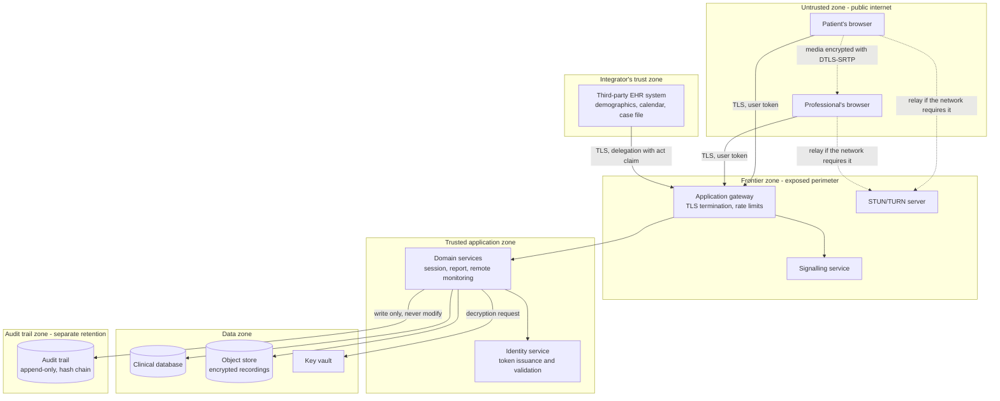
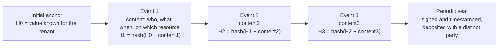
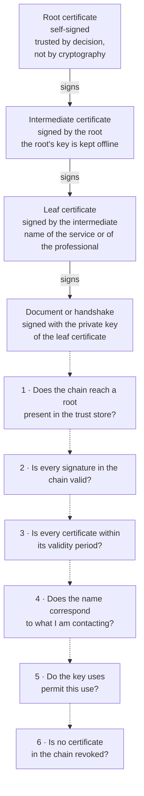
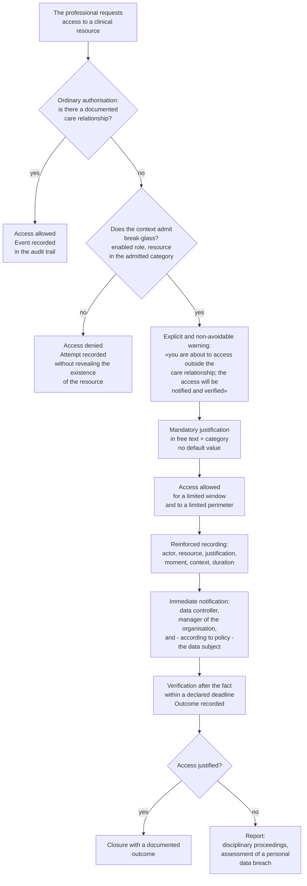
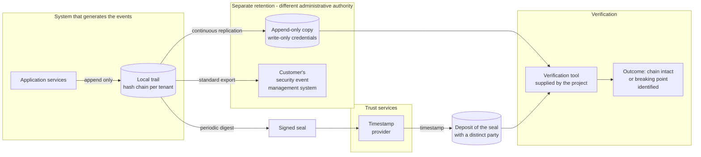

# Cryptography and security

Most of a software project's security documents are a list of measures: encrypt here, rotate
there, impose a second factor. A list of measures is useful to someone who already has in mind
the model that justifies it, and useless - indeed, harmful - to someone who does not, because
it produces the illusion that applying the measure is equivalent to obtaining the property. It
is not so. You can encrypt a disk and protect nothing. You can impose a second factor and leave
the front door open. You can sign a document and be unable to prove anything in court.

This module takes the opposite route. First the **properties**: what one wants to obtain, with
what precise definition, against what adversary. Then the **instruments** that realise them:
symmetric cryptography, asymmetric cryptography, hash functions, signatures, public key
infrastructure. Then the point at which the instruments are applied to a real system: identity,
authorisation, traceability. Only at the end the **regulatory framework**, which is the reason
why some of these choices, in this domain, are not a matter of opinion.

It presupposes nothing. Whoever comes from clinical practice will find explained from scratch
what a key is; whoever comes from computing will find explained why in healthcare the record of
who looked at a case file weighs as much as the encryption of the disk it sits on.

**Three warnings before we begin.**

1. **This module contains no recipes.** Where it indicates an algorithm or a parameter, it
   states the source. Where the source has not been verified, it marks it with `[NV]`. The
   reason is that cryptographic recipes age - a parameter that was adequate in 2015 may not be
   so in 2026 - and a document that crystallises them produces obsolete systems that believe
   themselves secure. The project's references of choice for the selection of mechanisms and
   key sizes are **ETSI TS 119 312**, the cryptographic mechanisms agreed within **SOG-IS** and
   the **AgID-ACN** indications, by effect of decision **D19**.
2. **It does not cover real time.** DTLS-SRTP, ICE, STUN, TURN and the short authentication
   string compared aloud are dealt with at length in
   [08 - WebRTC from scratch](08-webrtc-da-zero.md), which is their source. Here they appear as
   applied examples, with a cross-reference.
3. **It does not cover the protocols.** TLS, OAuth 2.0, OpenID Connect, SAML 2 and their
   mechanics are in [13 - The protocols, one by one](13-protocolli.md). Here the theory those
   protocols use is explained; there, how they use it.

And one cross-reference that holds for the whole module: **the rules governing health data -
Article 9 GDPR, legal basis, consent, privacy roles, data suppression, retention - are in
[03 - The clinical datum](03-il-dato-clinico.md)**. They are not repeated here: they are
assumed, and what is discussed is how they are realised technically.

---

## 1. What «secure» means

«Secure» is not a binary adjective and is not a property of software. It is a set of distinct
properties, each defined with respect to an adversary and a context. A system may have one of
these properties to an excellent degree and another not at all, and the combination is what
determines whether it is adequate for its purpose.

The properties are six. The first three form the classical triad, which **Regulation (EU)
2016/679** (**GDPR**, *General Data Protection Regulation*) recalls verbatim in Article 32(1)(b),
requiring «the ability to ensure the ongoing confidentiality, integrity, availability and
resilience of processing systems and services». The other three are what distinguishes a
healthcare system from any other information system.

### 1.1 Confidentiality

**Definition.** Information is accessible only to those authorised to access it.

**In the domain.** The report of a psychiatric remote consultation (televisita) must not be
readable by the system administrator who manages the database, nor by the dermatologist
colleague in the same organisation, nor by the supplier's technician who intervenes on an
incident, nor by whoever intercepts the traffic on the hospital network.

**What violates it, in order of real frequency.** Not the interception of traffic - which is
the attack everybody imagines and almost nobody suffers, because encrypted transport is
universal - but: a badly written application authorisation that allows a resource of another
tenant to be read; a diagnostic log that prints the body of a request containing a tax code
(codice fiscale); an error message that reveals the existence of a patient; an unencrypted
backup copied onto a workstation; an access that is legitimate by credentials but illegitimate
by purpose.

This last case deserves to be isolated, because it is the most frequent in healthcare and the
least covered by ordinary technical measures: **the professional who opens the case file of a
person they know, without that person being their patient**. No encryption prevents it, no
second factor prevents it, no firewall prevents it. The only things that prevent it are an
authorisation model anchored to the **care relationship** (§ 8.5) and an audit trail that makes
the act visible and contestable (§ 9).

### 1.2 Integrity

**Definition.** Information is not altered, either accidentally or maliciously, except by those
authorised and in the ways provided for; and every unauthorised alteration is **detectable**.

The second half of the definition is the part that gets forgotten. Preventing every alteration
is often impossible: whoever has write access to the database can write. What can always be
obtained is that the alteration **leaves a trace that cannot be erased without leaving
another**. It is the principle on which hash chains (§ 5.6) and the audit trail (§ 9) rest.

**In the domain.** Was the blood pressure value the patient entered into the remote monitoring
(telemonitoraggio) plan 180/110 or 108/70? Was the alert threshold configured by the
cardiologist 140 or 160? Is the report the patient downloaded the one the doctor signed, or a
version modified afterwards? Is the chronological order of the events of a session the real one,
or has it been rewritten?

**Why integrity weighs more than confidentiality here.** Common intuition, formed on domains
such as finance or personal communications, puts confidentiality first. In healthcare the order
is reversed, for a structural reason: **a breach of confidentiality produces serious harm but
does not modify the clinical decision; a breach of integrity does modify it**.

If a health datum is disclosed, the patient suffers harm - stigma, discrimination, loss of
opportunity - that is real and that the law protects with particular intensity. But the doctor
goes on deciding on the basis of correct information. If instead a health datum is altered, the
doctor decides on the basis of false information, and the outcome may be a wrong therapy, a
missed intervention, permanent harm. Risk management under **ISO 14971:2019** classifies the
first scenario as serious and the second as critical or catastrophic, because the severity
criterion is **harm to the person** (`harm`), not informational harm - and the scenario
«clinical decision taken on erroneous information or attributed to the wrong patient» is, in the
risk matrix proposed for this project, of severity **S4**, immediately below permanent harm or
death.

From this follows a design rule that runs against instinct: **when a confidentiality measure and
an integrity measure come into conflict, integrity wins**, and confidentiality is obtained
otherwise. A concrete example is the audit trail: making it manipulable in order to «protect the
privacy of operators» would be a choice that sacrifices integrity to a misplaced confidentiality.

### 1.3 Availability

**Definition.** Information and the service are accessible when they are needed, to those
entitled to them, within the times required by the use.

**In the domain.** A remote consultation that does not start is a healthcare service not
provided. If the patient is a chronic cardiac patient in a remote monitoring programme and the
system does not receive their measurements for three days, the surveillance programme has been
interrupted without anyone noticing - and that is a clinical risk scenario, not a service
disruption.

**Why availability is a security requirement and not one of performance engineering.** Because
an adversary can attack it directly (resource exhaustion, extortionate encryption of the data)
and because the law treats it as such: Article 32(1)(c) GDPR requires «the ability to restore
the availability and access to personal data in a timely manner in the event of a physical or
technical incident», and **d.lgs. 4 settembre 2024, n. 138** (Legislative Decree no. 138 of
4 September 2024, transposing the NIS2 Directive) makes «breach of the expected service levels»
an autonomous type of **significant incident** notifiable to the authority - type **IS-3** of
Annexes 3 and 4 of **Determinazione ACN n. 379907 del 19 dicembre 2025** (the determination of
the national cybersecurity authority no. 379907 of 19 December 2025).

A quantitative datum that clarifies the scope of the obligation: the authority's official
example in the *Guida alla lettura* (the reading guide) to the baseline specifications indicates
that, if the declared expected service level is «available at least 99% of the time on a daily
basis», an unavailability greater than **14 minutes and 24 seconds in one day** constitutes a
significant incident and triggers the obligation to pre-notify within 24 hours. This is the
reason why the project must measure and historicise its own availability per tenant and per
service at that granularity (requirement **SEC-037** of the security catalogue): not in order to
display a number on a dashboard, but because without that number the customer does not know
whether they are under an obligation to notify.

### 1.4 Authenticity

**Definition.** The information really comes from the source it declares, and the entity with
which one is interacting really is the one it declares itself to be.

Authenticity and integrity are often confused because the same cryptographic instruments provide
them together. They are, however, distinct properties: a message may be intact - not altered
after being sent - and not authentic, if the sender is not who they say they are. An intact
message coming from an impostor is intact and false.

**In the domain.** Is the video session the patient connects to really being conducted by their
doctor, or by someone who has taken their place? Was the blood glucose measurement that arrived
via the application interface from the remote monitoring gateway really produced by that
gateway? Does the webhook that communicates the closure of an appointment really come from the
integrator's system? Was the signed report really signed by that professional, with that
certificate, at that moment?

**The most delicate case in this project.** In a WebRTC session, the DTLS handshake guarantees
that the channel is encrypted with the counterparty that presented a certain certificate
fingerprint; **it does not guarantee that that counterparty is the expected person**, because
the fingerprint arrives through the signalling channel, and whoever controls the signalling can
replace it. It is exactly the reason why decision **D22** makes the **short authentication
string** compared aloud by the two interlocutors mandatory by default: it is the only mechanism
that turns authenticity from an assertion into a verification. The mechanics are in
[08 § 6.4–6.6](08-webrtc-da-zero.md); here the principle suffices: **encryption without
authentication of the interlocutor protects the channel towards an unknown party**.

### 1.5 Non-repudiation

**Definition.** Whoever has performed an act cannot deny, before a third party, having performed
it.

It is the property that distinguishes a technical measure from evidence. Integrity and
authenticity are verifiable **by the parties**; non-repudiation must be verifiable **by a third
party who trusts neither of the two**: a judge, a supervisory authority, a notified body.

**Why it requires asymmetric cryptography.** With symmetric cryptography alone, sender and
recipient share the same key: both can produce an authentic message, so neither of the two can
demonstrate to a third party that the other produced it. The digital signature (§ 6) solves this
problem because the key with which one signs is known only to the signatory.

**In the domain.** The doctor signed the report: they cannot maintain that they did not, and the
organisation cannot maintain that it did so in their place. The patient gave consent to the
recording of the session: the organisation can demonstrate it. The operator performed a
**break-glass** access (§ 8.7) at 3 in the morning: they cannot maintain that it did not happen.

**Beware of a recurring confusion.** TLS does not produce non-repudiation. It protects the
channel, authenticates the server (and optionally the client), guarantees the integrity and
confidentiality of the transit - but it leaves no evidence that can be opposed to a third party
as to who sent what. For non-repudiation, signatures **on the messages or on the documents** are
needed, not on the channel.

And a second confusion, more insidious: **not all electronic signatures are the same**.
Regulation (EU) No 910/2014 (**eIDAS**), as amended by Regulation (EU) 2024/1183, distinguishes
simple, advanced and qualified electronic signatures, and **only the qualified one has by law the
legal effect equivalent to a handwritten signature** (Article 25(2) eIDAS). The complete table
and its effect on reports are in [03 § 7.1](03-il-dato-clinico.md); what matters here is the
technical consequence: **the level of signature determines the level of non-repudiation
obtainable, and is to be chosen as a function of the challenge one wants to be able to
withstand**, not of implementation convenience.

### 1.6 Traceability

> **Beware of a collision of names that runs through this very guide.** «Traceability» has **two
> distinct and non-interchangeable meanings**, and using them without noticing is a quick way to
> misunderstand one another in a technical discussion.
>
> - **Traceability of accesses** - the meaning of this section: reconstructing *after the fact*
>   who did what. It is a security property, and its instrument is the audit trail.
> - **Traceability of requirements** - the meaning used in modules
>   [11](11-fondamenti-informatici.md) and [17](17-ambiente-di-sviluppo.md) and throughout
>   the compliance area: the chain that binds a requirement to the design, to the implementation
>   and to the test that verifies it. It is a process property, required by the standard on the
>   software life cycle, and **it cannot be reconstructed after the fact** - that is what makes
>   it one of the retroactively unrecoverable activities.
>
> When the context is not obvious, this guide uses the extended form. The
> [glossary](19-glossario.md) carries both entries.

**Definition.** Every relevant operation is recorded in such a way that it is possible to
reconstruct, after the fact, who did what, when, on which datum and in which context.

It is the least cryptographic of the six properties and the most decisive in healthcare. The
other five concern what the system prevents; traceability concerns what the system **makes
visible** when prevention is absent or has not worked.

**Why in healthcare it weighs as much as confidentiality.** Because in the healthcare access
model most accesses are **legitimate by credentials and potentially illegitimate by purpose**. A
qualified professional is entitled to access many case files; which of these concern patients
actually under their care is a circumstance that the system, in many cases, cannot ascertain in
advance with certainty. Preventive control can reduce the set, not eliminate it - and if it did
eliminate it, it would block care in an emergency.

From this follows the model: **more is allowed than one would wish, and everything is recorded
in a non-repudiable and non-alterable way**. It is exactly the project's constraint **[V5](../11_registri/03-vincoli-fondanti.md#v5)**, and
it is the reason why the traceability obligation appears in all the applicable sources at the
same time: Article 5(2) GDPR (accountability), measures `PR.PS-04` and `DE.CM-01` of the national
authority's baseline specifications, requirement R30 of the AgID guidelines on security in ICT
procurement, measure ABSC 3.5.1 of AgID Circular 2/2017, Annex I Part I of **Regulation (EU)
2024/2847** (*Cyber Resilience Act*), and - on the retention-period side - Annex 4 of **DM 19
novembre 2025** (the Ministerial Decree of 19 November 2025), which sets the retention of
operation logs at twenty-four months.

**The architectural consequence, which is the greatest effort in the whole security catalogue.**
An audit trail that the system operator can modify proves nothing against the system operator.
Since the system operator is, in many scenarios, exactly the party whose conduct one wants to be
able to challenge, the audit trail must be built so as to be verifiable **against whoever hosts
it**. It is decision **D42**, and it is dealt with in § 9.

### 1.7 The six properties, in a table

| Property | Question it answers | Primary mechanism | Example of violation in the domain |
|---|---|---|---|
| **Confidentiality** | Who can read? | Encryption, access control, minimisation | A professional reads the case file of an acquaintance who is not their patient |
| **Integrity** | Is the datum the original one? | Authenticated encryption, signature, hash chains | An alert threshold of the remote monitoring is altered |
| **Availability** | Is it accessible when needed? | Redundancy, verified backups, resilience | The session does not start at the time of the appointment |
| **Authenticity** | Is the one saying it the one they say they are? | Signature, certificates, key verification | A third party takes the doctor's place in the video session |
| **Non-repudiation** | Can it be proved to a third party? | Digital signature with an exclusive private key, timestamp | The signatory denies having validated a report |
| **Traceability** | Who did what, when? | Append-only audit trail with hash chain and separate retention | No evidence of who consulted a file |

### 1.8 The properties none of these covers

Three real needs of the domain fall under none of the six, and must be named because otherwise
one ends up expecting encryption to solve them.

**The confidentiality of metadata.** Encrypting the content of a communication does not conceal
that the communication took place, between whom, when and for how long. In telemedicine the
metadatum **is** health data by inference: knowing that a patient has had three sessions with a
psychiatric service in the last month reveals information about their health even without
knowing a single word of it. Module [03 § 1.2](03-il-dato-clinico.md) argues this at length. The
technical consequence is that metadata must be **minimised and subjected to short retention**,
not merely encrypted.

**Resistance to coercion.** No cryptographic mechanism protects against an authorised user
acting under duress, or against an administrator who is compelled to hand over the keys. It is
mitigated with separation of duties (§ 8.6) and with dual control, not with cryptography.

**The correctness of the incoming datum.** A blood pressure value that is authenticated, intact,
signed and traced may simply be wrong, because the patient typed it in badly or because the
sphygmomanometer is badly calibrated. Information security guarantees that the datum arrives as
it left; it does not guarantee that it left correct. It is the reason why decision **D21**
establishes that the project assumes no responsibility for the accuracy of the hardware
measurement chain, and why thresholds and alerts are configured by the professional and never
inferred by the system (constraint **[V2](../11_registri/03-vincoli-fondanti.md#v2)**).

---
## 2. Modelling threats

### 2.1 What a threat model is

A **threat model** is the structured description of what a system defends itself against. It is
neither a list of attacks nor a list of controls: it is a document that answers four questions,
in this order.

1. **What are we building?** Which components exist, which data they process, how they
   communicate with one another, where the boundaries of responsibility lie.
2. **What can go wrong?** Which threats apply to each element of the system, given an adversary
   with certain capabilities.
3. **What are we doing about it?** Which controls mitigate which threats, and what residual risk
   remains.
4. **Have we done a good job?** How we verify that the controls really work.

The property that makes a threat model different from a checklist is that it is **relative to
the specific system**. A checklist says «use TLS»; a threat model says «the channel between the
gateway and the reporting service crosses a trust boundary and carries unsigned clinical
content, so an adversary with access to the internal network can alter it without anyone
noticing; mitigation: mTLS plus an application-level signature on the message; verification: an
integration test that rejects a message with an invalid signature».

**Why it is an obligation and not a good practice, in this project.** Decision **D10** imposes a
**STRIDE** threat model as part of security testing. The standard
**EN IEC 81001-5-1:2022** - *Health software and health IT systems safety, effectiveness and
security - Part 5-1: Security - Activities in the product life cycle* - requires threat
modelling as a process activity of the life cycle, and the European Commission's guidance
**MDCG 2019-16 rev. 1** presupposes it in the cybersecurity risk management process linked to
**ISO 14971**. The corresponding verifiable requirement is **SEC-049**: the model exists, it is
dated, and every relevant threat has at least one requirement and one test associated with it.

> **Status note.** The harmonisation status of EN IEC 81001-5-1:2022 under MDR has not been
> ascertained against a primary source in this project: `[NV]` `TECH` must verify it. The standard nevertheless
> remains the technical reference of choice for demonstrating the «state of the art» required by
> Annex I of Regulation (EU) 2017/745, independently of the presumption of conformity.

### 2.2 STRIDE: six categories, one per property

**STRIDE** is an acronym that lists six categories of threat. Each is the negation of a security
property, which makes the method systematic: for every element of the system one runs through
the six categories and asks whether that threat applies.

| Category | In Italian | Negates the property | Example in this system |
|---|---|---|---|
| **S**poofing | Sostituzione di identità | Authenticity | A third party presents themselves as the professional in the signalling of the session |
| **T**ampering | Manomissione | Integrity | Alteration of a row of the audit table by someone with access to the database |
| **R**epudiation | Ripudio | Non-repudiation | The signatory denies having validated that report; the system has no evidence that can be opposed to them |
| **I**nformation disclosure | Divulgazione | Confidentiality | An application interface response returns resources of a tenant other than the caller's |
| **D**enial of service | Interruzione | Availability | Exhaustion of the relay ports of the TURN server, which prevents sessions from starting |
| **E**levation of privilege | Elevazione di privilegio | Authorisation | A user with a front-desk role obtains the capability to read clinical content |

STRIDE is not the only method, and it is not the best for every purpose: it is the one that
applies best to a data flow diagram, and it is the one adopted by the project. Others exist that
are attacker-oriented (attack trees) or oriented to the protected value (asset-centred
analysis); using one does not exclude the others.

### 2.3 Actor, capability, motivation

A threat without an actor is an abstraction. The threat model must be anchored to **realistic**
adversaries, described by three attributes.

- **Capability**: what they can do technically. Observe the traffic? Modify it? Execute code on
  a machine? Obtain valid credentials? Compromise a dependency?
- **Position**: from where they act. The public internet, the organisation's network, inside the
  application perimeter, inside the supply chain.
- **Motivation**: why they do it. It determines their persistence, the cost they are willing to
  bear and the target they choose.

The mistake to avoid is modelling only the spectacular adversary - the state attacker with
unlimited resources - because against them no proportionate measure works and the operational
conclusion is paralysis. The useful model is the one that describes the adversaries who really
turn up, in order of decreasing probability.

### 2.4 The realistic adversaries of this system

**A1 - The opportunistic external attacker.** They have no specific interest in healthcare: they
scan the internet looking for exposed services with known vulnerabilities or default
credentials. They are by far the most frequent adversary and the easiest to repel. Capability:
public automated tools, exploits of known vulnerabilities, reuse of leaked credentials.
Countermeasures: absence of default credentials and of unnecessary exposed services (requirement
**SEC-055**, «secure by default»), timely updates, account lockout after failed attempts
(**SEC-015**), a mandatory second factor on administrative accounts (**SEC-012**).

**A2 - The targeted external attacker.** They have chosen the target. In healthcare the typical
motivation is economic: extortion by encrypting the data and threatening publication, which
works particularly well in the healthcare sector because the pressure to restore the service is
at its highest and the blackmail value of the datum is high. Capability: reconnaissance,
targeted phishing against staff, exploitation of recent vulnerabilities, lateral movement.
Countermeasures: segmentation, least privilege, encrypted backups with a copy unreachable from
the compromised system and verified restore tests - which is precisely the reinforced profile of
measure `PR.DS-11` for essential entities.

**A3 - The curious insider.** They are a legitimate user of the organisation who accesses data
to which they have no title for the purpose for which they access it. They are not an attacker
in the technical sense: they circumvent no control, they use their own credentials, they leave
no anomalous traces on the network. It is the case that data protection law treats with the
greatest severity in the healthcare domain, and it is the one against which cryptography is
almost powerless. Countermeasures: authorisation anchored to the care relationship, break-glass
access with mandatory justification and notification (§ 8.7), an audit trail with qualitative
and quantitative indicators - which is exactly what measure `DE.CM-01` of the national
authority's baseline specifications requires when it asks for parameters such as «the exceeding
of a threshold for queries of a database by a single user» or «access by a system administrator
outside service hours» to be defined, and which incident type **IS-4** - reserved for essential
entities - makes notifiable to the authority.

**A4 - The professional who accesses a case that is not theirs.** It is a variant of A3 that
deserves separate treatment because its legitimacy is **graduated, not binary**. A duty doctor
who opens the case file of a patient they have never seen may be: (a) a curious person; (b) a
colleague called in for an informal consultation; (c) the professional who is about to take that
patient's case on and does not yet have an assignment formalised in the system; (d) someone
managing an emergency. The system, at the moment of the access, is not able to distinguish these
four cases. From this follows the two-stage model: **access is allowed, its reason must be
declared, it is recorded in a non-repudiable way, notification is sent, and verification happens
afterwards**. A system that claims to decide beforehand either blocks care or lets everything
through.

**A5 - The system administrator.** They have, by definition of their role, the technical
privileges that allow them to read and alter anything: the content of the databases,
configuration files, keys, logs. They are the adversary who renders most application defences
useless and who obliges one to design traceability **against the system's custodian**. The role
is also governed on the legal plane - module [03 § 3.4](03-il-dato-clinico.md) deals with the
individual designation, the tracking and the periodic review of system administrators. Technical
countermeasures: separation of duties, a hash chain of the audit trail with **retention at a
distinct party or system** (§ 9.4), field-level encryption with keys not accessible to the
database administrator (§ 7.4), dual control on the most sensitive operations.

**A6 - The neighbouring tenant.** In a multi-tenant deployment, every other customer of the same
deployment is a potential adversary. Not because they are one in intention, but because the
distance between them and other people's data is a single wrong line of code. Data leakage
across the tenant boundary is, in the project's risk matrix, one of the two scenarios of
severity **S4** to be kept under absolute control. Structural countermeasure: isolation imposed
**at the persistence level** - row-level security or a dedicated schema - and not only at the
application level (requirement **SEC-018**, constraint **[V4](../11_registri/03-vincoli-fondanti.md#v4)**), plus a negative cross-tenant
access test on every endpoint of the interface.

**A7 - The compromised supplier and the supply chain.** The adversary does not attack the
system: they attack one of its dependencies, or the tool with which the system is built. A
third-party library with a malicious contribution, an altered base image, a stolen credential of
the continuous integration pipeline, a compromised artefact signing key. It is the adversary
against which runtime defences do nothing, because the malicious code arrives **inside** the
legitimate artefact, signed by the legitimate signatory. It is also the adversary that European
law has decided to tackle head-on: Article 24(2)(d) and (3) of d.lgs. 138/2024 requires the NIS
entity to assess «the specific vulnerabilities of each direct supplier» and «the overall quality
of the products and the cybersecurity practices of the suppliers, including their secure
development procedures». § 11 deals with the countermeasures.

**A8 - The integrator.** They are not an adversary in the proper sense: they are a legitimate
counterparty who nevertheless sits **outside the project's trust boundary**. They receive
delegations, present federated identities, invoke the interface on behalf of their own users. If
their system is compromised, or if they simply make a mistake, their assertions become false.
Hence the rule of decision **D18**: delegation is **always represented with the `act` claim** of
RFC 8693 § 4.1, **never with impersonation**, because the audit trail must be able to
distinguish «X acted» from «system Y acted on behalf of X». And hence the rule of decision
**D38**: the level of assurance of the authentication must be qualified with a marker that
distinguishes **authentication performed by the project** from authentication **reported by the
integrator**. They are two statements with different evidential value and must not be conflated
into a single field.

**A9 - The user themselves.** The patient who grants access to their own device to a relative,
who reuses a password, who clicks on a link in a message that appears to come from the
organisation. They are not malicious: they are the ordinary condition. Countermeasures: short
and reversible paths, strong authentication through the national digital identity, messages that
never ask for credentials, and - by virtue of constraint **[V6](../11_registri/03-vincoli-fondanti.md#v6)** - the awareness that a security
measure the real user cannot carry out is a measure that does not exist.

### 2.5 Attack surface

The **attack surface** is the set of points at which an adversary can interact with the system.
It is reduced in three ways, in order of effectiveness: by **eliminating** unnecessary
functionality, by **restricting** access to the necessary functionality, by **hardening** what
remains. The order matters: functionality that has been removed has no vulnerabilities.

For this system, the surface is composed at least of:

| Surface | Who reaches it | Characteristic risk |
|---|---|---|
| Patient and professional web interface | Public internet | Attacks on the browser, stolen sessions, phishing |
| REST and FHIR application interface | Authenticated integrators | Defective authorisation, cross-tenant access, enumeration |
| Session signalling channel | Public internet, authenticated | Substitution of the interlocutor, resource exhaustion |
| STUN/TURN relay server | Public internet | Abuse as a relay towards internal networks, port exhaustion |
| Outbound webhooks | Network towards the integrator | Forged inbound requests if unsigned; exfiltration if the endpoint can be altered |
| Measurement ingestion endpoint | Remote monitoring gateway | Injection of false measurements, replay of messages |
| Administration interfaces | Management network | Elevation of privilege, untraced remote access |
| Build chain (dependencies, CI, image registry) | Whoever contributes, whoever publishes | Malicious code inside the legitimate artefact |
| Databases, stored objects, backups | Administrators, internal processes | Direct reading, alteration, exfiltration of copies |

It should be noted that the surface **changes with the configuration**. Enabling server-side
recording (decision **D23**) introduces a component that terminates the encryption and that
therefore sees the media in the clear: it is a surface that does not exist in the default mode.
The threat model must therefore be **per operating mode**, not a single one.

### 2.6 Trust and trust boundaries

**Trusting a component**, in this context, is not a moral judgement: it means that if that
component behaves incorrectly, the security property falls and the system does not notice. The
**trust boundary** is the line separating two zones in which the assumptions are different: in
crossing it, a datum passes from «already validated and attributed» to «to be validated and to
be attributed», or vice versa.

The operational rule that follows is a single one and always holds: **every time a datum crosses
a trust boundary inbound, it must be validated; every time it crosses one outbound, it must be
authorised**. Validations internal to the boundary are defence in depth; those on the boundary
are mandatory.

Five readings of the diagram that are worth making explicit.

1. **The browser is never trusted.** Not even the professional's, not even on a hospital
   network. Any check carried out only in the interface is a usability suggestion, not a
   security measure. If a rule matters, it must be applied on the server side as well - and
   since constraint **[V3](../11_registri/03-vincoli-fondanti.md#v3)** requires that every capability be reachable by a third-party system
   through a documented interface, the server side is in any case the only possible point of
   application.
2. **The integrator is in a zone of their own.** They are neither public like a browser nor
   trusted like an internal service: they are an authenticated counterparty whose assertions
   about the identity of their users must be accepted **qualifying them as reported** (decision
   D38).
3. **The relay server sits on the frontier and sees more than it seems.** It does not see the
   content of the media, which remains encrypted end to end, but it does see the IP addresses of
   both parties - which are personal data and which can reveal location. It is the reason why
   constraint **[V1](../11_registri/03-vincoli-fondanti.md#v1)** requires it to be self-operated within the Union: it is a measure under
   Article 32 GDPR, not merely a sovereignty choice.
4. **The media does not cross the application zone** in the default mode. It is the reason why
   the mode with recording (D23) is architecturally another thing, and must be treated as such
   in the threat model.
5. **The arrow towards the audit trail is one-way and has no return.** The application service
   can write and cannot modify. If this arrow were bidirectional, the entire traceability
   property would fall: § 9.

### 2.7 From threat to requirement to test

A threat model that does not produce verifiable requirements is an exercise. The chain that
makes it useful is: **threat → control → identified requirement → test that verifies it**.
Decision **D45** makes requirement identifiers (`RF-*`, `RNF-*`, `BR-*`) immutable precisely
because this chain, for the purposes of **IEC 62304**, must remain traceable over time and
cannot be reconstructed after the fact.

A complete example on a real case from the project:

| Step | Content |
|---|---|
| **Threat** | Spoofing: a third party controlling the signalling channel replaces the DTLS certificate fingerprint and interposes themselves in the session |
| **Actor** | A2 (targeted external) or A5 (administrator of the signalling service) |
| **Why the ordinary control is not enough** | The DTLS handshake authenticates the key, not the person; the fingerprint arrives from the channel the adversary controls |
| **Control** | Spoken comparison of a short string derived from the fingerprints of both parties |
| **Requirement** | Short authentication string mandatory by default, readable by a screen reader, never conveyed by colour alone, with a defined procedure in the event of a mismatch (decision **D22**) |
| **Test** | Test session with a substituted fingerprint: the two strings must differ; accessibility test with real assistive technology |
| **Residual risk** | The two interlocutors may omit the comparison; it is mitigated by the obligation by default and by the recording of the comparison having taken place |

Note the last row: **residual risk is declared**. A threat model that concludes «mitigated» on
every row is a model that has not been done. The declaration of residual risk is also a formal
obligation: ISO 14971:2019 requires the evaluation of overall residual risk, and the national
authority's baseline specifications, when they admit a derogation «subject to reasoned and
documented regulatory or technical grounds», require the residual risk to be described in the
risk treatment plan (measure `ID.RA-06`, point 2).

---
## 3. Symmetric cryptography

### 3.1 The problem it solves, and the minimum vocabulary

Symmetric cryptography solves one problem only: **two parties that already share a secret want
to exchange messages that a third party can neither read nor alter**.

The vocabulary, settled once and for all:

- **Plaintext**: the original message.
- **Ciphertext**: the transformed message, which to an observer appears indistinguishable from a
  random sequence.
- **Key**: the secret that determines the transformation. In **symmetric** cryptography the same
  key encrypts and decrypts, hence the name.
- **Cipher**: the algorithm that performs the transformation.

**Kerckhoffs's principle**, formulated in 1883 and never disproved, establishes that the
security of a cryptographic system must depend **only on the secrecy of the key**, not on the
secrecy of the algorithm. From it follows the most important practical rule in this whole
module: **cryptographic algorithms are not invented, cryptographic algorithms are not
implemented, cryptographic algorithms are not «adapted»**. Public implementations are used, ones
that have been subjected to scrutiny and are maintained. A secret algorithm is an unanalysed
algorithm, and an unanalysed algorithm is broken: it is simply that nobody knows it yet.

### 3.2 Block ciphers and stream ciphers

A **block cipher** transforms blocks of a fixed size - typically 128 bits - into encrypted
blocks of the same size, under the control of the key. It is a permutation: with the key fixed,
the correspondence between plaintext block and ciphertext block is one-to-one. The reference
block cipher is **AES** (*Advanced Encryption Standard*), adopted after a multi-year public
competition.

A **stream cipher**, by contrast, generates from the key a pseudorandom sequence of arbitrary
length - the **keystream** - which is combined with the plaintext bit by bit by means of the
exclusive or operation. Encryption and decryption are the same operation. It is efficient and
suited to data whose length is not known in advance, and it has a dangerous property that we
shall see in § 3.5.

The distinction has, in practice, become blurred: modern modes of operation use a block cipher
**as if it were** a keystream generator. What matters today is not so much the family of the
cipher as the **mode of operation** with which it is used.

### 3.3 Modes of operation, and why the choice is everything

A block cipher on its own encrypts 16 bytes. To encrypt a 40-kilobyte report a **mode of
operation** is needed: the rule by which the invocations of the cipher are concatenated.

The most naive mode, historically called **ECB** (*Electronic Codebook*), encrypts every block
independently with the same key. The defect is immediate and catastrophic: **identical plaintext
blocks produce identical ciphertext blocks**. On structured data - an image file, a record with
repeated fields, a stream with fixed headers - the structure of the plaintext remains visible in
the ciphertext. It is not a theoretical defect: it is the reason why ECB must never be used, in
any context, not even for a single block.

The later modes - block chaining, counter - solve the problem by introducing a variable value
for each encryption, and obtain the desired property: **two encryptions of the same plaintext
with the same key produce different ciphertexts**. But none of these modes, on its own, provides
**integrity**: an adversary who cannot read the ciphertext can nevertheless modify it, and in
some modes can do so in a targeted way, flipping known bits at known positions of the plaintext
without knowing it.

This leads to the central point.

### 3.4 Authenticated encryption is the minimum, not an option

An **authenticated encryption with associated data** - abbreviated **AEAD**, *Authenticated
Encryption with Associated Data* - is a construction that provides confidentiality and integrity
at the same time, and that allows **associated data** to be bound to the ciphertext, data which
remain in the clear but whose integrity and association are guaranteed. The abstract interface
of an AEAD is defined by **RFC 5116**; the reference AEAD constructions are AES in
Galois/Counter mode (**AES-GCM**) and the constructions based on ChaCha20 and Poly1305.

Why it is the minimum. Because the history of applied cryptography over the last twenty years
is, to a very large extent, the history of systems that encrypted correctly and did not
authenticate, and that were broken by exploiting the absence of integrity: attacks that use the
recipient's behaviour in the face of a malformed ciphertext to extract, one bit at a time, the
plaintext. The lesson is consolidated into a rule: **there is no case in which it is correct to
encrypt without authenticating**. If somebody proposes doing so for performance reasons, the
answer is that modern AEAD constructions are hardware-accelerated and the cost is negligible.

**What associated data are for.** They are the part of the message that must remain readable - a
routing header, a tenant identifier, a schema version number - but that must not be changeable
without invalidating the message. In the domain: when encrypting a session recording, the tenant
identifier and the session identifier are natural candidates to be associated data, because in
that way an encrypted file cannot be moved from one session to another or from one tenant to
another without decryption failing. It is a defence against the confusion attack, and it is
often overlooked.

**In the project.** The session media is protected with SRTP using authenticated encryption
suites based on AES-GCM (**RFC 7714**), with keys negotiated via DTLS according to DTLS-SRTP
(**RFC 5764**). The mechanics and their limits are in [08 § 6](08-webrtc-da-zero.md).

### 3.5 The initialisation vector, and the disaster of reuse

The variable value that makes two encryptions of the same text different is called the
**initialisation vector** (IV) or **nonce** - *number used once*. The name already contains the
requirement.

**What it must be.** It need not be secret: it travels in the clear alongside the ciphertext. It
must be **unique for every encryption performed with the same key**. In some modes it must also
be **unpredictable**; in others it is enough that it be unique, and a counter will do.

**What happens if it is reused.** The consequences depend on the mode, but in counter-based
constructions - that is, in almost all those in use, AES-GCM included - they are catastrophic
and not gradual:

1. **Immediate loss of relative confidentiality.** With the same nonce and the same key the same
   keystream is generated. An adversary who obtains two ciphertexts produced in this way can
   combine them and obtain the exclusive or of the two plaintexts, eliminating the key from the
   equation altogether. On texts with a known structure - and a report or a protocol message has
   a very well known structure - this is equivalent to reading both of them.
2. **Total loss of integrity.** In AES-GCM, nonce reuse allows the recovery of the
   **authentication key**, which is derived deterministically from the encryption key. Once that
   is recovered, the adversary can **forge valid messages at will**. It is no longer a problem of
   the confidentiality of two messages: it is the compromise of the authenticity property for
   all future messages under that key.

There is no way of «reusing a nonce a little». It is the reason why AEAD constructions have a
**limit on the number of messages that can be encrypted under a single key**, beyond which the
key must be replaced: the limit depends on the size of the nonce and on the strategy by which it
is generated. `[NV]` `TECH` must verify on the precise numerical values, which must be read on the specification of
the construction adopted and not on a summary.

**The three correct strategies**, in order of preference:

- **A counter per key**, with the state persisted atomically. Simple and secure as long as the
  counter cannot go backwards. The case in which it goes backwards is the one that kills:
  restore from a snapshot, replication of a process, cloning of a virtual machine. If the
  counter lives in memory and the process is cloned, two instances produce the same nonces.
- **A random nonce with a sufficiently large space**, accepting a negligible but non-zero
  probability of collision, and imposing a limit on the number of encryptions per key.
- **Nonce-misuse-resistant constructions**, which degrade in a controlled way instead of
  collapsing. They exist and are standardised; their adoption must be decided explicitly and not
  implicitly.

**The practical rule for whoever contributes to this project:** never generate a nonce by hand.
Use the high-level interface of the cryptographic library, which manages it internally. If the
code you are writing contains the word «nonce» or «IV», stop: almost certainly you are using a
level of abstraction that is too low for the problem you have.

### 3.6 Key management is the real problem

The algorithm is the easy and solved part. **Key management is the part in which real systems
fail**, and it has no universal solution: it has a set of requirements that must be satisfied
explicitly.

**Generation.** A key must come from a **cryptographically secure** pseudorandom number
generator, that is, from a primitive designed to be unpredictable even to someone who knows part
of the output. The ordinary generator of a programming language - the one used to shuffle a list
- **is not one**, and this is one of the most frequent errors of all. In Java the class to use is
`SecureRandom`; in the browser environment, the `crypto.getRandomValues` interface. The
difference is not one of statistical quality: it is that the ordinary generator has a state that
can be reconstructed from a few observations.

**Derivation.** From one key, different keys are derived for different purposes, by means of a
**key derivation function** (KDF). The standardised reference construction is **HKDF**
(**RFC 5869**), based on HMAC (§ 5.5). The principle that makes derivation necessary is called
**domain separation**: the key that encrypts the backups must not be the same as the one that
encrypts the recordings, even if both derive from the same root, because the compromise of one
use must not extend to the others. Derivation includes a context label precisely for this
purpose.

**Storage.** A key stored next to the datum it protects protects nothing. The usual hierarchy has
two levels: a **data encryption key**, which encrypts the datum and is stored encrypted next to
it, and a **key encryption key**, kept in a separate system - a key vault, a hardware
module, a dedicated service - that never exposes the key but performs the wrapping and
unwrapping operations. The operational advantage is that rotating the higher-level key does not
require re-encrypting the data.

Requirement **SEC-023** of the catalogue states it in verifiable terms: health data and
recordings are encrypted at rest, key management is documented and **the keys are separable from
the datum**. Verification is inspection of the storage: no clinical content readable without a
key.

**Rotation.** Rotating a key means ceasing to use it for new encryptions and replacing it with a
new one. It does not necessarily mean re-encrypting the whole history: the usual strategy is to
keep the old keys **for decryption only**, with a key version identifier stored next to each
encrypted datum. This identifier is a design requirement that must be provided for from day one,
because adding it afterwards means not knowing which key applies to which datum.

On the frequency of rotation the literature is less peremptory than is commonly believed:
periodic rotation «for hygiene» has limited benefits, whereas rotation **on event** - suspected
compromise, departure of an administrator, decommissioning of a component - is what counts.
`[NV]` `TECH` must verify on any recommended numerical periodicity: it cannot be derived from the sources consulted
in this project and must be fixed in the key management policy with an explicit justification.

**Destruction.** Deleting a key is the most effective way of making an encrypted datum
unrecoverable, and it is the technique that makes erasure practicable from media on which
physical erasure is not possible - tape backups, geographical replicas, immutable archives. It
is the mechanism that requirement **SEC-025** presupposes when it asks for the secure and
permanent removal of a tenant's data with verification on backups and replicas. Per-tenant
encryption with a distinct key means that decommissioning a tenant is an atomic operation on the
key, not a campaign of distributed deletions.

**What is never acceptable.** Keys in the source code. Keys in the repository history, even if
removed from the current code. Keys in version-controlled configuration files. Keys in the
environment variables of a published container image. Keys in the logs, even at diagnostic
level, even partial. Keys passed as command-line arguments, which are visible in the process
list. § 11.5 deals with secret management; here the rule suffices: **if a secret has entered a
repository, it is compromised and must be rotated, even if the repository is private, even if
the commit has been rewritten**.

---
## 4. Asymmetric cryptography

### 4.1 The idea, and the problem it solves

Symmetric cryptography presupposes that the two parties already share a secret. But how do they
come to share it, if the only channel they have is the one the adversary is listening to? It is
the **key distribution problem**, and for millennia it had no solution: it was solved physically,
with a courier.

**Asymmetric**, or **public key**, cryptography solves it with an idea that in the nineteen
seventies was counter-intuitive: **two mathematically linked keys, one of which can be
published**. What one key does, only the other undoes; and from the public key it is not
computationally possible to derive the private one.

- The **public key** is distributed freely. It is not a secret, but its **authenticity** is
  critical: if an adversary manages to make me believe that their public key is my
  interlocutor's, they have won. It is the problem that PKI solves (§ 6).
- The **private key** never leaves its holder. If it leaves the holder, all the properties fall,
  retroactively for the signature and prospectively for encryption.

### 4.2 Encrypting and signing are two different operations

This distinction is the source of half the confusions about asymmetric cryptography, and must be
fixed precisely.

| | Asymmetric encryption | Digital signature |
|---|---|---|
| **Objective** | Confidentiality towards a recipient | Authenticity, integrity, non-repudiation towards anyone |
| **Who uses the public key** | The **sender**, to encrypt | The **verifier**, to verify |
| **Who uses the private key** | The **recipient**, to decrypt | The **signatory**, to sign |
| **Who can perform the operation** | Anyone who knows the public key | Only the holder of the private key |
| **Who can verify its outcome** | Only the holder of the private key | Anyone who knows the public key |

The mnemonic formula «signing is encrypting with the private key» is widespread, convenient and
**wrong**. That is not how modern signature schemes work - they are autonomous constructions
with their own formatting and their own steps; and taking that formula literally leads to
implementing insecure signatures. The two operations must be kept conceptually separate, and in
practice **different keys are used for different purposes**: one pair to encrypt, one to sign,
never the same for both.

### 4.3 Why a report is not encrypted with RSA

Asymmetric cryptography is **slow** - orders of magnitude slower than symmetric cryptography -
and operates on inputs of limited size. A document is not encrypted with it. **Hybrid
encryption** is used: an ephemeral symmetric key is generated, the document is encrypted with
it, the symmetric key is encrypted with the recipient's public key, and the pair is sent. The
recipient decrypts the key with their own private key and, with it, the document. It is what all
file and mail encryption systems do under the bonnet.

The same principle explains the structure of TLS: the asymmetric part of the handshake serves to
agree a secret and to authenticate the server; the actual traffic travels protected with
authenticated symmetric cryptography.

### 4.4 Key exchange and forward secrecy

A **key exchange** is a protocol by which two parties that share nothing come to share a secret,
without the secret transiting over the channel. In the Diffie-Hellman construction each party
generates a key pair, they exchange the public ones, and each combines its own private key with
the other's public key, obtaining **the same value**, which an observer cannot compute even
having seen both public keys.

The property that makes this construction decisive is **forward secrecy**: if the key pairs used
in the exchange are **ephemeral**, generated for that session alone and destroyed at the end,
then the future compromise of the server's long-term private key **does not allow past sessions
to be decrypted**, not even if the adversary has recorded them in full. In TLS 1.3 forward
secrecy is mandatory; [13 § 2.5](13-protocolli.md) describes its mechanics.

Why it matters in this domain: it means that an adversary who records encrypted traffic today
and obtains the server's key tomorrow does not obtain today's consultations. In the absence of
forward secrecy, every recorded session is a time bomb.

Raw key exchange, however, is **anonymous**: it guarantees a secret shared with *somebody*, not
with the intended recipient. Without authentication of the public keys exchanged, an active
adversary can perform two exchanges - one with each party - and interpose themselves. It is the
man-in-the-middle attack, and it is the reason why every useful key exchange is
**authenticated**: by a certificate (§ 6), by a pre-shared key, or by an out-of-band
verification such as the short authentication string of § 1.4.

### 4.5 Elliptic curves, in an honest summary

The first public key systems rest on the difficulty of factorising large integers (RSA) or of
computing discrete logarithms in multiplicative groups. **Elliptic curve** systems rest on the
difficulty of the discrete logarithm in a different group - the points of an elliptic curve over
a finite field - and have a decisive practical property: **for equal estimated security, the
keys are much shorter**, which reduces bandwidth, memory and computational cost.

What one needs to know in order to work here:

- Curves are neither interchangeable nor all equivalent. Some are standardised and widely
  implemented; others are designed to be resistant to implementation errors. The choice of curve
  is not a configuration detail: it is a decision with a source.
- **Curves are not implemented.** Curve operations are notoriously subject to side-channel
  attacks - analysis of execution times, of power consumption - that extract the private key
  from an implementation that is correct but not constant-time.
- The **project's source** for the choice of mechanisms, curves and key sizes is
  **ETSI TS 119 312**, supplemented by the mechanisms agreed within **SOG-IS** and by the
  **AgID-ACN** indications, by effect of decision **D19**. This module does not publish a
  parameter table of its own, and no document of the project should do so: crystallising
  parameters in a guide means guaranteeing their obsolescence.

### 4.6 Key sizes age

A point that anyone who has never studied cryptography finds surprising: **the strength of a key
is not an absolute property, but a function of time**. The available computing power grows,
attack algorithms improve, and a key size that is adequate today will not be so in ten years'
time. Recommendations on sizes are therefore always **dated and with a declared horizon**:
«adequate until 20xx», not «secure».

Three practical design consequences, which hold irrespective of the numbers.

1. **Cryptographic agility.** The system must be able to change algorithm and key size without
   rewriting. In practice: the algorithm identifier and the key version are stored **next to
   every encrypted or signed datum**, and the decryption and verification code knows how to
   handle several versions at the same time. An encrypted data format that does not contain the
   algorithm identifier is a format that will not be migratable.
2. **The signature has one problem more than encryption.** A datum encrypted with a weakened
   algorithm can be re-encrypted. A signature affixed years ago with an algorithm that was later
   weakened **cannot be redone**, because the signatory may no longer be available and because
   redoing it today would change the date. The solution is the **timestamp** (§ 6.6), which
   attests that the signature existed when the algorithm was still considered strong. It is the
   reason why a report intended to be retained for decades requires a timestamp, not merely a
   signature.
3. **Long retention changes the requirements.** In the healthcare domain retention periods are
   measured in decades - module [03 § 7.3](03-il-dato-clinico.md) reports, among others, the
   thirty years from death provided for the index and the documents of the electronic health
   record (Fascicolo Sanitario Elettronico) by DM 7 settembre 2023 (the Ministerial Decree of
   7 September 2023). Over that horizon, cryptographic obsolescence is not hypothetical: it is
   certain.

### 4.7 The quantum threat, without alarmism

A sufficiently large and stable quantum computer would break the public key systems in use today
- factorisation and discrete logarithm, hence RSA, Diffie-Hellman and elliptic curves - while it
would weaken only to a manageable extent symmetric cryptography and hash functions, which defend
themselves by increasing sizes.

What can honestly be said, as things stand:

- **A cryptographically relevant quantum computer does not exist today**, and estimates of its
  future availability carry an uncertainty such as to make them unusable as a basis for precise
  planning.
- **Standardised post-quantum algorithms exist** and transport protocols are adopting **hybrid**
  modes, which combine a classical exchange and a post-quantum one in such a way that security
  holds as long as at least one of the two holds. It is the prudent strategy: neither of the two
  families is abandoned.
- **The threat that is relevant today is called «harvest now, decrypt later»**: an adversary
  records today encrypted traffic they cannot read, waiting to be able to read it in fifteen
  years' time. Against data whose sensitivity vanishes in days it is not a problem; against
  **health data, whose sensitivity lasts as long as the data subject's life and beyond**, it is.

**What this project must do, concretely.** Not adopt post-quantum cryptography today on its own
account: that would be a choice without a source and without implementation maturity. But
guarantee the **cryptographic agility** of § 4.6, so that adoption is a configuration migration
and not a rewrite. And for traffic protected by TLS, follow the evolution of the libraries and
of the ETSI/SOG-IS/AgID-ACN indications, which is where the migration will arrive first. `[NV]` `TECH` must verify
on any date, precise algorithm or migration deadline: the sources consulted in this project do
not provide them, and they must be read on the primary documents updated at the moment of the
decision.

---
## 5. Hash functions

### 5.1 What they are

A **cryptographic hash function** transforms an input of arbitrary length into an output of
fixed length - typically 256 or 512 bits - called a **digest**, a **fingerprint** or a
**summary**. It is deterministic: the same input always produces the same digest. It uses no
keys. It is not invertible by construction, simply because it compresses information.

The properties that make it **cryptographic** are three, and they are progressively stronger.

1. **Preimage resistance.** Given a digest, it is not computationally feasible to find an input
   that produces it. It is the property that allows the digest of a document to be published
   without revealing its content.
2. **Second preimage resistance.** Given an input, it is not feasible to find another with the
   same digest. It is the property that allows the digest to be used as the identifier of a
   specific content.
3. **Collision resistance.** It is not feasible to find **any pair whatsoever** of distinct
   inputs with the same digest. It is the strongest of the three, and it is the one that falls
   first.

To these is added a practical property, the **avalanche effect**: changing a single bit of the
input changes on average half the bits of the digest. The digests of almost identical documents
do not resemble each other.

### 5.2 Why collisions matter more than they seem to

A collision - two different documents with the same digest - looks like a mathematical
curiosity. It becomes an attack when the digest is used **in place of** the document, which is
exactly what happens in the digital signature: the document is not signed, its digest is
(§ 6.1).

If an adversary can construct two documents with the same digest - a benign report and an
altered one - they can have the first signed and present the second with the signature of the
first. The signature will verify correctly, because it verifies the digest, and the two digests
are equal. Non-repudiation is destroyed.

The defence is not conceptual but practical: **use a hash function for which the construction of
collisions is not known**. Functions for which it is known must be abandoned for every use in
which collision resistance matters - signature, hash chains, content identifiers - even if they
remain formally usable for uses that depend only on the first preimage. The practical rule for
contributors is simpler: **deprecated functions are not used, in any context**, because the
context changes and nobody re-reads the code to check that the use has remained harmless. The
functions to be used, and their obsolescence over time, follow **ETSI TS 119 312** and the
AgID-ACN indications (decision **D19**), not habit.

### 5.3 Hashing passwords is a different problem

Here intuition betrays almost everyone. An ordinary cryptographic hash function is designed to
be **fast**. Speed is a virtue when verifying the integrity of a one-gigabyte file, and it is a
**catastrophic defect** when protecting a password.

The reason. Passwords are not random: they are chosen by people, and the set of plausible
passwords is enormously smaller than the set of possible strings. An adversary who obtains an
archive of digests does not try to invert the function: **they try the plausible passwords in
order of probability** and compare the digests. If the function is fast, with specialised
hardware they try billions per second, and ordinary passwords fall in times measured in minutes.

**The countermeasure is to make the computation deliberately expensive.** The functions designed
for this purpose - password-based key derivation functions - have cost parameters adjustable
along three axes:

- **cost in time**, that is, the number of iterations;
- **cost in memory**, that is, the amount of memory the computation requires: it is the
  parameter that neutralises specialised hardware, which has many computing units and little
  memory per unit;
- **parallelism**, that is, how many computing units a single hash occupies.

The modern reference construction is **Argon2**, standardised in **RFC 9106**, in the variant
designed to resist both attacks with dedicated hardware and side-channel attacks. Older
constructions based on the iteration of HMAC or on memory consumption remain in use; they are
acceptable with adequate parameters, but they are not the reference choice for a new system.

`[NV]` `TECH` must verify on the **numerical values of the cost parameters**: they cannot be derived from the
sources consulted in this project and they depend on the hardware on which the verifier runs.
The correct method is to measure on one's own hardware and choose the highest parameters
compatible with an acceptable verification time, revisiting them periodically; the value goes in
configuration, not in the code, and must be stored **next to every digest** so that the
parameters can grow without invalidating the existing hashes.

**An important note on scope.** In this project the verification of end-user passwords is, in
the reference configuration, delegated to the identity federation product and - for users who log
in with the national digital identity - does not happen locally at all. This does not make the
paragraph irrelevant: service credentials, those of local administrators and the cases of
deployment without federation remain. And a known trap remains, flagged by decision **D37** as a
risk under ISO 14971: in the default configuration of the federation product adopted, **a
federated user can give themselves a local password**, opening an access channel that bypasses
the level of assurance of the digital identity. It is a configuration defect to be treated as a
risk, not as a footnote.

### 5.4 The salt, and what it is not

The **salt** is a **random value, unique for every password, not secret**, which is concatenated
to the password before hashing and stored in the clear next to the digest.

What it solves, precisely: without a salt, two users with the same password have the same digest
- which already reveals information - and, above all, an adversary can precompute a table of
digests once and use it against **every** archive in the world. With a salt unique per user,
every password has to be attacked individually and the precomputation is not reusable.

What it does **not** solve: the salt does not slow down the attack on a single password. If the
adversary wants the password of a specific user, the salt costs them one more table, not a
slower attack. **Slowness comes from the cost parameter, not from the salt.** Both are needed,
and they are measures against different adversaries.

It must be distinguished from a third element, the **pepper**: a secret value, the same for
everybody, kept **outside the database** - in a key vault or in the service configuration.
Its purpose is that whoever obtains a dump of the database, but not the application secret,
cannot attack at all. It is defence in depth, not a substitute for the salt.

### 5.5 HMAC: authentication with a shared key

A hash function uses no keys, so on its own it **authenticates nothing**: anyone can recompute
the digest of a message they have modified. Publishing a digest next to a message, over the same
channel, does not protect against an active adversary.

The **message authentication code** (MAC) solves this: it is a value computed over a message
**and over a shared secret key**, such that only whoever knows the key can produce and verify
it. **HMAC** - *Hash-based MAC*, specified in **RFC 2104** - is the standard construction that
obtains a MAC from a hash function, in a way that remains secure even with hash functions that
have known structural weaknesses. The reason a dedicated construction exists instead of the
naive concatenation of key and message is that the naive one is vulnerable: with many hash
functions, whoever knows the digest of a message can compute the digest of that message
extended, without knowing the key.

**What HMAC gives and what it does not give.** It gives **integrity and authenticity between the
parties that share the key**. It does not give **non-repudiation**, because both parties can
produce it: before a third party, neither of the two can demonstrate that it was the other. For
non-repudiation an asymmetric signature is needed.

**Concrete uses in this system.**

- **Signing of outbound webhooks.** The integrator who receives a notification must be able to
  verify that it really comes from the deployment and not from a third party who knows its
  address. An HMAC signature of the body with a per-integrator shared secret is the usual
  construction; it must be accompanied by a timestamp inside the signed payload and by an
  acceptance window, otherwise it remains vulnerable to the replay of a captured message.
- **Ephemeral credentials of the relay server.** The mechanism by which the TURN server accepts
  expiring credentials generated by the application service is based on HMAC; the mechanics are
  in [08 § 11.2](08-webrtc-da-zero.md).
- **Key derivation**, by means of HKDF (§ 3.6).
- **Links of the hash chain of the audit trail**, when one wants the chain not to be simply
  recomputable by whoever possesses the data (§ 5.6).

**An implementation rule that looks like pedantry and is not.** The comparison between the
computed MAC and the received one must be performed with a **constant-time** comparison
function, not with the ordinary equality operator. The ordinary comparison stops at the first
differing byte, and the difference in time between a comparison that stops at the first byte and
one that stops at the tenth is measurable: it allows an adversary to guess the MAC one byte at a
time. Cryptographic libraries provide the dedicated function; using it is not optional.

### 5.6 Hash chains: the basis of an immutable audit trail

Here hash functions cease to be an auxiliary instrument and become the central mechanism of one
of the project's most important properties.

**The problem.** One wants an event trail such that, if somebody alters, deletes or reorders even
a single row of it, the alteration is **detectable** - even if whoever alters it has full
privileges on the database that hosts the trail.

**The idea.** Every row of the trail contains, besides its own content, **the digest of the
previous row**. The digest of each row is computed over the content of the row **and** over the
digest of the previous one. The result is a chain in which every link depends on all those that
precede it.

**Why it works.** Whoever alters the content of event 2 changes its hash, so the digest stored in
event 3 no longer matches: the chain breaks at a precise and verifiable point. Whoever deletes
event 2 breaks the link between 1 and 3. Whoever reorders the events produces digests that do
not add up.

**Why on its own it is not enough.** Whoever has full privileges can alter event 2 **and
recompute all the subsequent hashes**. The chain is internally consistent and the alteration is
invisible. This is the reason why a hash chain retained **only** in the system that generates it
proves nothing against the operator of that system - which is exactly adversary A5 of § 2.4.

**The three constructions that close the gap**, in order of increasing robustness:

1. **A periodic seal deposited elsewhere.** At regular intervals the current digest of the chain
   is taken, signed with a key whose private part is not accessible to the system administrator,
   submitted for a **timestamp** from a trust service provider, and deposited with a distinct
   party or system. Whoever wants to rewrite the past must rewrite the seals too, which they do
   not control. It is the construction with the best cost-benefit ratio, and it has a relevant
   legal effect: the timestamp can be opposed to third parties, the system date cannot
   ([03 § 7.2](03-il-dato-clinico.md)).
2. **Continuous writing towards a separate retention system**, with append-only credentials and
   with a one-way network path. The system that generates the events has no privilege that
   allows it to modify them once written.
3. **Links computed with HMAC under a key kept outside the system**, so that recomputing the
   chain is not possible for whoever possesses only the data. It combines with the previous two.

**Why this is the most expensive point in the project's security catalogue.** Because decision
**D42** explicitly establishes that entity versioning **is not** an immutable audit trail, and
that constraint **[V5](../11_registri/03-vincoli-fondanti.md#v5)**, requirement R30 of the AgID guidelines on ICT procurement, measure
ABSC 3.5.1 of AgID Circular 2/2017 and requirement `PR.PS-04` of the national authority's
baseline specifications require a hash chain **and** retention separate from the system that
generates the events. The decision qualifies it as «the greatest effort in the whole security
catalogue», to be planned as such and not as configuration. § 9 deals with it at length.

**A terminological note, to clear the ground.** A hash chain is **not** a blockchain. A
blockchain adds to this structure a mechanism of distributed consensus among parties that do not
trust one another, which is not needed here: the parties are known, the custodian is identified,
and the problem is non-alterability towards a third party, not agreement among peers.
Introducing a distributed ledger to solve this problem means adding an order of magnitude of
operational and regulatory complexity for a property that a signed and timestamped chain already
provides.

---
## 6. Digital signatures and public key infrastructure

### 6.1 How a signature works, concretely

To sign means to produce, from a document and a private key, a value that anyone can verify with
the corresponding public key, and that nobody can produce without the private one.

The procedure, in three steps:

1. The **digest** of the document is computed with a hash function (§ 5). The digest is signed,
   not the document, for two reasons: asymmetric operations are slow and limited in the size of
   the input, and the digest is a faithful representative of the document - provided the hash
   function resists collisions, which is why § 5.2 matters.
2. The **signature scheme** is applied to the digest with the private key, obtaining the
   signature value.
3. The document is transmitted with the signature. The verifier recomputes the digest, applies
   the verification operation with the public key and obtains a binary outcome.

**What a valid signature demonstrates**: that the document has not been modified after signing,
and that whoever produced it possessed that private key.

**What it does not demonstrate**: that whoever possessed the private key is the person one
expects. This is the leap that cryptography alone does not make, and that requires the
infrastructure of the following paragraph.

### 6.2 The problem PKI solves

A public key is a sequence of bytes. It does not say who it belongs to. If I receive a document
signed with a key and I verify the signature correctly, I have demonstrated that whoever signed
possessed that key - which is worthless if I do not know who the key belongs to.

A **certificate** resolves this binding: it is an electronic document that associates a **public
key** with an **identity**, and it is **signed by a third entity** that attests the association.
The standard format is **X.509**, whose profile for the internet is defined in **RFC 5280**. A
certificate contains at least: the public key; the identity of the holder (person, service,
domain name); the identity of the issuer; a validity period with a start and an end; the
permitted uses of the key; and the issuer's signature over everything preceding.

The entity that issues certificates is the **certification authority** (CA). The complex of
authorities, policies, procedures, formats and software that make this mechanism operational is
called the **public key infrastructure** (PKI).

### 6.3 The chain of trust

If a certificate is credible because it is signed by a CA, what makes the CA credible? Another
certificate, signed by a higher CA. The recursion terminates in a **trust anchor**: a
**self-signed** certificate, whose credibility derives not from cryptography but from a
**decision**: the fact that it was preinstalled in the trusted certificate store of the operating
system, the browser or the application.

The six checks in the diagram **must all be performed**, and in practice two of them are
regularly forgotten.

- **Check 4, name verification.** Validating the chain and not verifying that the name in the
  certificate corresponds to the service being contacted is a recurring error in low-level
  libraries: the result is that any valid certificate issued by any trusted CA is accepted for
  any service. Module [13 § 2.5](13-protocolli.md) lists it among the typical TLS errors.
- **Check 6, revocation.** Dealt with in § 6.5.

A point of realism must be added that no diagram shows: **trust in a CA is total trust**. Every
CA in the system's trust store can issue a valid certificate for any name. The security of the
system is therefore equal to that of the least reliable CA among those trusted - and the trust
stores of operating systems contain hundreds of roots. The countermeasures to this structural
problem are **certificate transparency**, that is, public and verifiable registers of all
certificates issued (**RFC 6962**, updated by **RFC 9162**), which make anomalous issuance
detectable, and - for communications between components under common control - restricting the
trust store to an own CA, which is the correct choice for internal traffic and for mutual
authentication between services.

### 6.4 Certificates for services and certificates for people

They are two worlds with different problems, and confusing them produces architectural errors.

| | Service certificate | Personal certificate |
|---|---|---|
| **Identifies** | A domain name or a service | A natural or legal person |
| **Who issues it** | Public CAs or the organisation's internal CA | Qualified trust service providers, for the qualified signature |
| **Typical duration** | Short, with automated renewal | Longer, with procedures for identifying the person |
| **Where the private key sits** | On the server, protected by the operating system or by a dedicated module | On a qualified signature creation device, or at a provider in remote mode |
| **Use in the project** | TLS, mutual authentication between services, artefact signing | Signing of the report, strong authentication of the citizen with the national health card (Tessera Sanitaria) |

The second case brings with it a requirement the first does not have: identification of the
person at the moment of issuance. It is the non-technical part of PKI, and it is what determines
its evidential value.

### 6.5 Revocation, and why it is the weak point

A certificate has an expiry date, but it can become untrustworthy before then: the private key
has been compromised, the person has changed role, the service has been decommissioned.
**Revocation** is the issuer's declaration that that certificate is no longer valid.

The structural problem: **a revoked certificate remains cryptographically valid**. The signatures
verify, the chain holds, the dates are good. The only difference is a piece of information that
sits elsewhere, and that the verifier has to go and look for.

The two standard mechanisms are **revocation lists** (RFC 5280), downloaded periodically, and
point-in-time online querying (**OCSP**, **RFC 6960**), which asks the issuer for the status of a
single certificate.

Both have the same defect and force the same decision: **what to do when the revocation service
does not answer?**

- **Failing closed** - refusing the connection - is secure and makes the availability of the
  system dependent on that of an external service one does not control. In a healthcare context,
  where a remote consultation that does not start is a service not provided, it is not a neutral
  choice.
- **Failing open** - proceeding anyway - preserves availability and makes revocation ineffective
  against an adversary able to block the queries, which is exactly the adversary it is needed
  against.

There is no answer that is right in the absolute; there is the obligation to **take the decision
explicitly, for each context, and document it**. The practical mitigations are **stapling** of
the revocation response, in which the server itself presents recent proof of its own status,
sparing the client the query, and the **short duration** of certificates, which reduces the
window in which revocation matters.

### 6.6 The timestamp

A signature says *who* and *what*. It does not say *when*: the date the signatory inserts in the
document is a statement by the signatory, not proof.

The **timestamp** is the attestation, issued by a trust service provider, that a certain document
- in practice, a certain digest - existed in that form at that instant. The standard protocol is
defined by **RFC 3161**. The provider receives the digest, not the document: it does not see the
content, and this makes it usable on health data too.

It serves two distinct purposes:

1. **Dating a fact in a way that can be opposed to third parties.** Module
   [03 § 7.2](03-il-dato-clinico.md) says it without ambiguity: a `created_at` field written by
   the application is a datum the application's operator can alter, and it cannot be opposed.
2. **Extending the validity of a signature beyond the expiry of the certificate and beyond the
   obsolescence of the algorithm.** It is the point of § 4.6: without a timestamp, at the expiry
   of the certificate verification becomes problematic, because it cannot be established whether
   the signature was affixed while the certificate was valid. For decades-long retention it is
   the difference between a document that is verifiable and one that no longer is.

And it is also the mechanism that closes the hash chain of the audit trail (§ 5.6): the periodic
seal is not merely signed, it is timestamped, because what one wants to demonstrate is that that
sequence of events existed in that form **on that date**.

### 6.7 Advanced, qualified, digital signatures: the Italian framework

**Regulation (EU) No 910/2014** (**eIDAS**), as amended by **Regulation (EU) 2024/1183**,
distinguishes three levels of electronic signature. Module [03 § 7.1](03-il-dato-clinico.md)
carries the complete table; what matters here is **what changes on the evidential plane** and why
the choice falls to a technical person and not to a lawyer alone.

- The **simple electronic signature** (*firma elettronica semplice*, FES) cannot be refused
  merely because it is electronic, but its value is freely assessable by the judge. In practice:
  if challenged, it must be proved by other means.
- The **advanced electronic signature** (*firma elettronica avanzata*, FEA) is uniquely linked to
  the signatory, allows the signatory to be identified, is created with means under their sole
  control and is linked to the data in such a way that any subsequent modification is detectable.
  It has reinforced value, but **it is not equated by law to a handwritten signature**: whoever
  invokes it must be able to demonstrate that those four characteristics were satisfied, which
  means that the burden of proof falls to a large extent on whoever built the system.
- The **qualified electronic signature** (*firma elettronica qualificata*, FEQ) is an FEA created
  with a qualified signature creation device and based on a **qualified certificate**. Article
  25(2) eIDAS attributes to it **legal effect equivalent to that of a handwritten signature**. In
  the Italian legal order the **Codice dell'amministrazione digitale** (the Italian Digital
  Administration Code, D.lgs. 7 marzo 2005, n. 82 - Legislative Decree no. 82 of 7 March 2005)
  completes the picture: Article 20 governs the evidential value of the electronic document,
  Article 21 the effects of signatures, and a document subscribed with a qualified or digital
  electronic signature has the evidential force of Article **2702 of the codice civile** (the
  Italian Civil Code) - that is, it constitutes full proof, up to an action alleging forgery
  (*querela di falso*), that the declarations come from whoever subscribed it.

The **digital signature** is, in Italian law, the species of qualified signature based on a
system of asymmetric keys. In common usage «digital signature» is used for any cryptographic
signature: in the documentation of this project **it is not used in a generic sense**, because it
is a term with a precise regulatory definition.

**What changes for a report.** Module [03 § 7.1](03-il-dato-clinico.md) reports that the Accordo
Stato-Regioni del 17 dicembre 2020 (rep. 215/CSR) (the State-Regions Agreement of 17 December
2020, act no. 215/CSR) requires «digital subscription» and, for telerefertazione (remote
reporting), the «validated digital signature of the responsible doctor».
`[NV]` Must be requested of the `COMP` area the precise identification of the level required
by the legal order for each health document type: the choice must be documented as a reasoned
decision and not assumed implicitly. What the project can assert without uncertainty is the
architectural consequence:

1. **The signature is an act of the person, not of the system.** A system that signs «on behalf
   of the doctor» with a key the system holds in custody does not produce a qualified signature
   and does not produce non-repudiation: it produces an attestation by the organisation. That may
   be legitimate, but it must be called by its name.
2. **Signature, clinical validation and timestamp are three distinct events** and must be
   modelled as such ([03 § 7.2](03-il-dato-clinico.md)).
3. **Formats matter.** Signatures are applied in standardised formats - PAdES for PDFs, CAdES for
   generic files, XAdES for XML - and the choice of format determines what a third-party verifier
   is able to do without proprietary software.
4. **An unsigned draft is not a report.** The boundary between the two states is a domain event
   with legal consequences, not a convenient boolean attribute.

---
## 7. Encryption in transit and at rest

### 7.1 Two measures, two different threats

«Encryption in transit» and «encryption at rest» appear together in every tender specification
and in every security questionnaire, so much so that one ends up treating them as two boxes to
tick. They are instead two measures against **different threats**, which overlap little and which
leave the same point uncovered.

**Encryption in transit** protects data while they cross a network. Against whoever observes or
alters the traffic: another device on the same network, a compromised intermediate appliance, an
operator, an adversary who has obtained the position of intermediary. It protects against nothing
that happens before sending or after reception.

**Encryption at rest** protects data while they are stored. Against whoever obtains the medium or
a copy of the content without going through the system: the replaced disk, the lost backup tape,
the copied virtual machine image, the exfiltrated archive file, the device decommissioned without
secure erasure. It does not protect against whoever accesses through the system with valid
credentials, because for them the system decrypts.

**The point uncovered by both: data are in the clear during processing.** At the moment when the
application service executes a rule on a report, that report is in memory, in the clear. Whoever
has access to the process - whoever can read the memory, whoever can obtain a dump, whoever can
inject code - sees it. Technologies exist for reducing this window (computation in isolated
environments, homomorphic encryption), but they are not at a maturity and scope usable for a
system of this kind. **The correct consequence is not to look for a cryptographic solution, it is
to recognise that the defence at that point is of a different nature**: access control to the
systems, separation of duties, traceability, security of the build chain.

**In the regulatory framework both are mandatory and cited distinctly.** Article 32(1)(a) GDPR
names encryption among the appropriate measures. The national authority's baseline specifications
distinguish them into two different measures: `PR.DS-01` for data at rest and `PR.DS-02` for data
in transit, both traced by the *Guida alla lettura* to element h) of Article 24(2) of d.lgs.
138/2024 («policies and procedures regarding the use of cryptography and, where appropriate,
encryption»). Annex I, Part I of the **Cyber Resilience Act** requires the protection of the
confidentiality of data «by means of state-of-the-art encryption in transit and at rest». AgID
Circular 2/2017 places them in class ABSC 13, and the AgID guidelines on ICT procurement in
requirements R13, R24 and R36. In the domain, the **Accordo Stato-Regioni del 17 dicembre 2020,
rep. 215/CSR** is particularly peremptory: **all** transfers of voice, video, images and files
must be encrypted.

### 7.2 Encryption in transit: what it really protects

The mechanism is TLS for everything that is request-response and messaging, and DTLS-SRTP for
real-time media. The mechanics are in [13 § 2.5](13-protocolli.md) and in
[08 § 6](08-webrtc-da-zero.md). What matters here are the limits, of which there are four and
which are always underestimated.

**First: it protects the channel, not the ends of the channel.** An interface that exposes
another tenant's data exposes them perfectly encrypted. TLS has no opinion whatsoever about the
content.

**Second: it does not hide the metadata.** An observer of the network sees the IP addresses, the
times, the volumes, the duration, and - in the TLS negotiation - the name of the service
contacted, which travels in the clear in the server name indication extension. They therefore
know **that** a certain address contacted a telemedicine service, for how long, with what traffic
profile. In the healthcare domain this is already relevant information.

**Third: it is interrupted at every termination.** A load balancer or a gateway that terminates
TLS decrypts and re-encrypts. The datum is in the clear inside that component. This is normal and
often necessary, but it must be **known and mapped**: every termination point is a point at which
the datum is readable, and it must be included in the threat model and in the inventory of flows.

**Fourth: it holds only if the client verifies.** A client that accepts any certificate has the
encryption and does not have the authentication: it is defenceless before an active intermediary.
It is the error introduced «to make the test environment work» that then reaches production, and
it is the reason why the project treats it as a blocking defect and not as a configuration note.

**The particular case of the media.** Module 08 deals with it at length; here only the
architectural consequence of decision **D23** need be recalled: when server-side recording is
active, encryption is terminated on the server and **the session is no longer end to end**. The
consent notice must state this explicitly, the interface must indicate the recording state in a
persistent and non-concealable way, and the switch between the two modes is traced in the audit
trail. It is not a nuance of communication: it is the difference between a true statement and a
false one.

### 7.3 Encryption at rest: three levels, three different protections

«Encrypted at rest» does not identify one measure, it identifies three, with very different
properties.

**Volume or disk encryption.** It encrypts the whole medium below the file system. It is
transparent to everything above it and has almost no adoption cost.

*What it protects against*: physical removal of the medium, its decommissioning without erasure,
the raw copying of a machine image.

*What it does not protect against*: **anything that happens with the system switched on**. With
the machine running, the volume is mounted and decrypted: anyone with access to the file system
reads the files in the clear. Since the physical theft of a disk from a data centre is not,
realistically, the principal threat to this system, volume encryption is **necessary and largely
insufficient**. The typical defect is to consider it the answer to the questionnaire's
«encryption at rest» box and stop there.

**Database, table or column level encryption.** The database engine encrypts the data files, or
certain columns, with keys it manages itself or that it receives from an external vault.

*What it protects against*: the reading of the database files and of its backups outside the
engine.

*What it does not protect against*: whoever connects to the engine with valid credentials,
because the engine decrypts for them. If whoever holds the keys is the database administrator, the
protection against adversary A5 is nil.

**Field-level, application encryption.** The application encrypts the value **before** handing it
over to persistence and decrypts it after re-reading it. The database sees opaque bytes.

*What it protects against*: everything above, **plus** the database administrator, plus the copy
of the dump, plus - if the keys are per tenant and held separately - leakage across the tenant
boundary.

*What it costs*, and the cost is real and must be reckoned with at the design stage:

- **search is lost**. On an encrypted field one does not perform order comparisons, partial
  searches, sortings. Exact equality is recovered with deterministic constructions, which
  however reintroduce the loss of information of § 3.3 (equal values produce equal ciphertexts,
  so the frequencies remain visible). It is not a neutral choice;
- **referential integrity constraints are lost** on those fields;
- **the complexity of migration and of key rotation increases**;
- **key management becomes part of the application domain**, with everything § 3.6 entails.

**The rule of choice.** Not everything is encrypted at field level: the fields for which the
specific threat justifies it are encrypted, and for the rest the lower levels are used. The
criterion is the threat model, not exhaustiveness. Encrypting the technical identifier of a row
at field level protects nothing and breaks the system; encrypting the content of a free clinical
note at field level protects exactly what needs protecting.

### 7.4 The case of recordings and stored objects

Session recordings are the most sensitive datum the system can produce and the only one that
exists as an autonomous object of large size. The rules that follow from this are settled by two
decisions and one requirement:

- they exist **only with the patient's explicit consent**, documented, and their presence changes
  the encryption regime of the session (**D23**);
- they are **encrypted at rest with per-tenant keys** and have **configurable retention** with
  automatic deletion on expiry (**D23**, requirement **SEC-024**);
- effective deletion is obtained, in practice, **by destroying the key** (§ 3.6), which is the
  only way of making unrecoverable an object replicated in copies whose physical deletion one
  does not control.

A point that gets overlooked must be added: **the identifier of the stored object must not be
guessable**. An object store with predictable names, exposed even only to an adversary who has
obtained a temporary signed address, allows enumeration. The identifiers must be generated with a
cryptographically secure generator, and access must be authorised by the application service on
every request, not delegated to the secrecy of the name.

### 7.5 End-to-end encryption, and what giving it up entails

**End to end** means that the data are encrypted on the sender's device and decrypted only on the
recipient's, and that **no intermediate component, including the service's server, possesses the
keys**. It is a qualitatively different property from encryption in transit: the latter protects
against whoever is outside the system, the former protects **against the system itself as well**.

**What is gained.** Compromise of the server does not expose the content. The administrator
cannot read. An order addressed to the operator produces no content, because the operator does
not have it. In a data sovereignty architecture it is the strongest property that can be offered.

**What is lost, and it must be said without attenuation.** Everything that requires the server to
see the content:

- **server-side recording**, which decision **D23** chose in order to guarantee its reliability
  independently of the patient's device and load;
- **any processing of the content** carried out centrally: transcription, automatic subtitling,
  quality analysis on the content, moderation;
- **recovery in the event of the user losing the keys**, which without escrow is definitive;
- **the convenience of multi-device access**, which requires key synchronisation mechanisms with
  problems of their own.

**The project's position, which is an explicit and declared choice.** The architecture has two
modes (**D23**): the default mode is encrypted end to end, with media routed directly when the
network allows it and with the short authentication string making the property **demonstrable and
not merely asserted** (**D22**); the mode with recording, activatable only with the patient's
explicit consent, **is not end to end** and declares as much. Decision **D19** requires public
communication to reflect this conditionality, not to conceal it.

**Why this honesty is technically relevant and not merely ethical.** Because an assertion of
end-to-end encryption that does not hold in every configuration is, for a supervisory authority
or for a reviewer of a technical file, an untruthful declaration about the security measures -
with consequences far greater than the absence of the property. Module
[08 § 6.9](08-webrtc-da-zero.md) carries the defensible wording, which is stronger than an
absolute assertion precisely because every part of it is verifiable.

### 7.6 Where the data are in the clear anyway: the honest inventory

A useful exercise, and one that must be redone at every architectural change, is to enumerate the
points at which the clinical datum exists in the clear. For this system, in the default mode:

| Point | Why it is in the clear | Applicable defence |
|---|---|---|
| Patient's and professional's browser | It is the end of the communication | Device security, short-lived session, no unnecessary local persistence |
| Memory of the application services during processing | The code must read the datum | Access control to the systems, separation of duties, security of the build chain |
| TLS termination points (gateway, load balancer) | The traffic must be routed and inspected | Mapping in the inventory of flows, minimisation of the points, encryption of the internal leg too |
| Database engine, for the fields not encrypted at application level | Queryability is needed | Field-level encryption where the threat justifies it; access control on the engine |
| Recording component, when active | It must produce the file | Explicit mode, consent, persistent indication, tracing of the mode switch |
| Application logs, if badly written | Programming error | Rule for writing logs (§ 9.2), automated verification in continuous integration |

The last row is the one that produces the most real incidents. A diagnostic log that prints the
body of a request nullifies the whole encryption of the system in a single line, and it does so
in a component - the log collection system - that typically has weaker access controls, longer
retention and wider distribution than the clinical database.

---
## 8. Identity, authentication, authorisation

### 8.1 Three words that are not synonyms

- **Identification**: declaring who one is. It is a statement, devoid of proof.
- **Authentication**: demonstrating that the declaration is true.
- **Authorisation**: establishing what that subject, so authenticated, may do on a certain
  resource in a certain context.

They are three distinct steps that fail in different ways, and confusion between the second and
the third is the cause of most real application vulnerabilities. A system can authenticate
impeccably - second factor, national digital identity, certificate on a smart card - and then
let an authenticated user read someone else's resource by changing an identifier in the address.
**Strong authentication does not compensate for weak authorisation**; on the contrary, it masks
it, because it produces trust in the authenticated subject.

The operational rule that follows: **authorisation is verified on every request, on the specific
resource, on the server side**. Not at the entrance, not in the construction of the menu, not in
the screen. Constraint **[V3](../11_registri/03-vincoli-fondanti.md#v3)** - no functionality reachable only from the interface - makes this
rule inevitable: if every capability is invocable by a third-party system, no interface-side
check can be considered a defence.

### 8.2 The factors of authentication

A **factor** is a category of proof. There are three:

- **something you know**: a password, a personal code, the answer to a question;
- **something you have**: a device, a smart card, a security key;
- **something you are**: a biometric trait.

Authentication is **multi-factor** when it combines **different** categories. Two passwords are
not two factors. A password and a security question are not two factors: they are two things one
knows, and the second is typically weaker than the first because the answer is often public or
guessable.

Each category has a characteristic way of failing:

- **what you know** gets reused across several services, guessed, obtained by deception, or
  leaked from someone else's breach;
- **what you have** gets stolen, lost, cloned when the channel is weak - this is the case of
  codes sent by text message, exposed to the takeover of the telephone number - or circumvented
  with notification fatigue, in which the user approves out of weariness a request they did not
  originate;
- **what you are** is not revocable. A compromised password is changed; a fingerprint is not.
  This is why biometrics is appropriate as a **local unlocking of a possession factor** - it is
  the device that verifies the user and then uses its own key - and not as a credential
  transmitted to a remote service. The distinction also has legal relevance: biometric data are
  a special category within the meaning of Article 9 GDPR.

**The strongest defence is not the second factor in itself: it is the binding to the origin.** A
second factor based on a numeric code that the user types in is vulnerable to real-time
deception - a fake site collects it and replays it immediately. The mechanisms in which the proof
is cryptographically bound to the domain that requested it are not, because the signature
produced for the fake site is not valid for the real one. It is a qualitative difference, not an
incremental one.

**In the project.** Requirement **SEC-012** requires that the system support multi-factor
authentication on all accounts and **make it mandatory** for accounts with administrative
privileges and for remote access; verification is functional - it must be impossible to complete
an administrative login without a second factor. Four sources converge on this point: measure
`PR.AA-03`, point 2 of the national authority's baseline specifications; measure ABSC 5.6.1 of
AgID Circular 2/2017; Article 24(2)(l) of d.lgs. 138/2024, which expressly names «multi-factor
authentication or continuous authentication solutions»; Annex I, Part I of the Cyber Resilience
Act.

For the citizen and for the professional, the reference strong authentication channel is the
national digital identity under **Article 64 of the CAD**: **SPID in SAML 2, CIE in OpenID
Connect** by effect of decision **D37**, and **TS-CNS**, which decision **D36** qualifies as
mandatory and not optional, being the only channel free of external dependencies. The level of
assurance of the authentication is not a detail: decision **D38** places it in the `acr` claim,
with a project-specific marker that distinguishes authentication performed from authentication
reported by the integrator, and clarifies that **it does not travel in the `act` claim**, which
expresses delegation and not level. The mechanics of the protocols are in
[13](13-protocolli.md); the demographic registry of identity in
[04 - Identity and demographic registries](04-identita-e-anagrafiche.md).

### 8.3 The session: the point at which authentication is preserved

Authenticating on every request with the primary credential is not practicable. One authenticates
once and a **session artefact** is issued - a cookie, a token - which subsequent requests
present. This artefact **is worth as much as the credential**: whoever steals it gets in.

The properties it must have are not negotiable.

- **Unpredictability.** Generated by a cryptographically secure generator (§ 3.6), not by a
  counter, not by a transformed user identifier.
- **Expiry.** Absolute and on inactivity, with different durations by context: the session of a
  professional on a shared workstation in a ward cannot have the same duration as that of a
  patient on their own phone.
- **Revocability.** There must be a way of invalidating a session **before** its natural expiry,
  and it must work immediately. It is the point at which self-contained tokens - those the server
  validates without consulting any state - show their limit: without a revocation list or without
  a very short duration with renewal, a stolen token remains valid until expiry. Requirement
  **SEC-017** asks that the revocation of authorisations when the relationship changes (transfer,
  termination) be effective **within the declared deadline**: if the declared deadline is the
  duration of the token, that is what must be declared, and not an optimistic value.
- **Regeneration on a change of privilege level.** On authentication, on elevation, on the switch
  to break-glass: a session identifier obtained before authentication must not survive it.
- **Binding to the context.** A token that is valid everywhere is more useful to whoever steals
  it than to whoever legitimately possesses it. Binding it to the intended recipient, to the
  channel or to the client certificate drastically reduces the value of the theft.

### 8.4 Role-based authorisation

**Role-based access control** (RBAC) introduces an intermediate level: permissions are not
assigned to people but to **roles**, and roles are assigned to people. It enormously simplifies
administration - a new cardiologist inherits an already defined set of permissions - and makes
the model verifiable, because the roles are few and the permissions per role can be listed.

The limit is structural and in healthcare it is decisive: **the role does not depend on the
resource**. Saying that a user has the role «doctor» does not say whether that doctor is entitled
to access **that** patient's case file. If one tries to solve the problem inside the role model,
one obtains an explosion - «cardiologist of ward X on duty with an assignment on patient Y» is
not a role, it is a condition - and the model becomes unmanageable.

### 8.5 Attribute-based authorisation, and the care relationship

**Attribute-based access control** (ABAC) decides by evaluating a rule over four sets of
attributes:

- of the **subject**: role, speciality, organisation, level of assurance of the authentication,
  assignments in progress;
- of the **resource**: document type, tenant, patient it refers to, confidentiality level,
  suppression state;
- of the **action**: reading, writing, export, printing, sharing;
- of the **context**: moment, channel, provenance, presence of a declared emergency, existence of
  a valid consent.

In the healthcare domain the attribute that carries almost all the weight is the **care
relationship**: the documented link between that professional and that patient, arising from an
assignment, from an appointment, from taking the case on, from an episode in progress. It is the
only way of answering the question «can this doctor read this case file?» without either blocking
care or opening everything up.

The model that works is **hybrid**: RBAC for coarse permissions - who can use which
functionalities - and ABAC for access to the individual clinical resource. The first is
administered, the second is evaluated.

**Three design implications that must be provided for from the start.**

1. **The care relationship is a domain entity**, with a beginning, an end, an origin and
   traceability, not a flag computed on the fly. It must be capable of being exhibited after the
   fact to justify the access.
2. **The authorisation decision must be recorded together with its justification.** Knowing that
   the access was allowed is not enough: one needs to know **by virtue of which attribute**,
   because it is the only information that makes it verifiable months later whether the model
   worked.
3. **Data suppression enters here.** Module [03 § 8](03-il-dato-clinico.md) establishes that
   suppression must conceal itself: it is not enough to deny access, the very existence of the
   suppressed document must not be inferable from counts, gaps in the numbering, notifications or
   differentiated error messages. It is a requirement that falls **on the authorisation engine
   and on the form of the responses**, not on a filter function applied at the end.

### 8.6 Least privilege and separation of duties

**Least privilege**: every subject - person, service, process - has only the permissions
necessary to carry out its own task, for only the necessary time. It is the principle that limits
the damage of any compromise: a compromised component can do only what it could do before.

What it means in practice, beyond the statement:

- **distinct application accounts per service**, each with its own permissions on persistence,
  instead of a single omnipotent shared account;
- **no ordinary operation performed with an administrative account**, which is requirement
  **SEC-014**: the separation between privileged and non-privileged accounts must be complete,
  and must be verified with privilege elevation tests;
- **temporary privileges and explicit elevation**, instead of permanent privileges;
- **no anonymous or shared accounts**, which is requirement **SEC-011**: all accounts, including
  administrative ones and those for remote access, are inventoried, approved and individual.
  Verification is the absence, in the exported list, of accounts without a named holder. A shared
  account destroys non-repudiation: if three people know the same credential, none of the three
  can be called to account for what has been done with it.

**Separation of duties**: no single subject can complete a critical operation alone. Whoever
develops does not deploy to production; whoever administers the system does not administer the
audit trail; whoever holds the keys does not administer the database they protect; whoever
approves an emergency access is not the one who requested it.

It is the control that makes abuse by whoever has legitimate privileges difficult, and it is the
only **structural** defence against adversary A5 of § 2.4. It has a real operational cost - it
requires more people and more procedures - and for this reason it must be applied where it is
needed: keys, audit trail, publication of artefacts, management of privileged accounts.

### 8.7 Break-glass access

**What it is.** **Break-glass** is the procedure that allows a professional to access clinical
data **overriding the ordinary authorisation control**, declaring the reason, under reinforced
tracking and with subsequent verification.

**Why in healthcare it is a requirement and not an exception.** Because an authorisation system
that does not provide for it fails in one of the two possible ways, both unacceptable.

- If it is **restrictive**, sooner or later it denies an access necessary to treat a person in
  danger: the unconscious patient brought into an emergency department where nobody has a formal
  assignment over them, the urgent night-time consultation, the substitute doctor whose
  qualification has not yet propagated. The harm is clinical and immediate.
- If it is **permissive**, in order to avoid that risk broad permissions are granted to everyone,
  and the confidentiality property vanishes.

Break-glass is the construction that dissolves the dilemma: **emergency access is allowed, but it
is costly, visible and verifiable**. It is not a tolerated loophole: it is a designed,
disciplined control, and one required by the sector literature - **ISO 27799:2016**, which is the
healthcare interpretation of the ISO/IEC 27002 controls, expressly deals with the management of
emergency access among the requirements specific to the domain.

**How it must be built.**

**The seven requirements that make the construction valid**, and whose absence turns it into a
short cut:

1. **It is not silent.** The user knows, explicitly and unavoidably, that they are leaving the
   ordinary path. An emergency access indistinguishable from an ordinary one is not break-glass:
   it is a permission.
2. **The justification is mandatory and free.** A drop-down menu with four entries produces four
   entries selected at random. The justification must be written, and its quality is itself an
   indicator.
3. **It is limited in time and in perimeter.** It opens access to that resource or to that
   patient, for a defined window, not a permanent state of privilege.
4. **It is recorded in a reinforced way**, in the immutable audit trail of § 9, with all the
   attributes of the decision.
5. **It immediately notifies** the parties defined by the organisation's policy. Notification is
   what makes the act costly and therefore rare.
6. **It is verified after the fact within a declared deadline**, and the outcome of the
   verification is itself recorded. A break-glass access never verified is a permission with a
   form to fill in.
7. **It is not available to everyone.** The set of roles that can invoke it, and that of the data
   categories on which it can be invoked, are configurations of the organisation - and must be
   coordinated with the limits that module [03 § 8.3](03-il-dato-clinico.md) describes for the
   categories with greater protection of anonymity, where the rules are stricter.

**A note for whoever designs the interface.** Constraint **[V6](../11_registri/03-vincoli-fondanti.md#v6)** holds here too: the warning must
be comprehensible, accessible from assistive technology, and not conveyed by colour alone. A
break-glass screen that a professional under pressure does not understand produces unaware
accesses, which are the worst defect of all those possible.

---
## 9. The audit trail

### 9.1 What it is, and what it is not

The **audit trail** - or traceability register, or record of accesses - is the sequence of events
that document who did what, when, on which datum and with what outcome. It is the technical
realisation of the traceability property of § 1.6 and of the project's constraint **[V5](../11_registri/03-vincoli-fondanti.md#v5)**.

It must be kept distinct from three things with which it is regularly confused.

- **It is not the application log.** The application log serves to diagnose the functioning of
  the software; the audit trail serves to document the processing of the datum. They have
  different content, format, recipients, retention and integrity requirements. An audit trail
  obtained by extraction from textual diagnostic logs is an audit trail that withstands no
  inspection.
- **It is not the register of domain events.** Domain events describe what has happened to the
  model; the audit trail describes **who accessed it**, including mere reads, which produce no
  domain event whatsoever. In a healthcare system reading is the most important act to trace, and
  it is the one a domain event model does not capture by construction.
- **It is not entity versioning.** That is decision **D42**, and it deserves the paragraph that
  follows.

### 9.2 What to record, and what not to record

**What an event of the trail must contain.** The minimum that allows a challenge to be answered
without further investigation:

| Attribute | Why |
|---|---|
| **Who** - the named identifier of the actor, not the application account | Without a named actor there is no accountability; shared accounts destroy this property (§ 8.6) |
| **On behalf of whom** - the delegating party, if any, with the `act` claim | Distinguishes «X acted» from «system Y acted for X» (D18) |
| **What** - the action, in a closed and versioned vocabulary | An action described in free text is neither aggregable nor comparable over time |
| **On which resource** - type and identifier, plus the patient it refers to | Without the reference to the patient one cannot answer «who read my case file?» |
| **When** - the moment with declared time zone and precision, from a synchronised clock | Requirement **SEC-034**: without synchronisation the events of different components cannot be ordered |
| **From where** - provenance, channel, calling application | It serves to distinguish access from the internal network from remote access |
| **With what outcome** - allowed, denied, partial | Denials are the most useful information for detecting an abuse in progress |
| **By virtue of what** - the justification of the authorisation, and in an emergency the declared justification | § 8.5, point 2 |
| **Tenant** | Constraint **[V4](../11_registri/03-vincoli-fondanti.md#v4)**: every audit row carries the tenant identifier |
| **Link of the chain** - digest of the previous event | § 5.6 |

**What it must never contain.** This part is more important than the previous one, because a
badly built trail itself becomes the worst archive of health data in the system: retained for
longer, replicated more widely, protected worse, and consulted by technical staff who have no
title over clinical content.

- **Clinical content.** One records *that* the report was read, not the report. One records *that*
  the field was modified, not the value before and after - if that is needed, the value is in the
  versioned datum, with its own access controls, not in the trail.
- **Credentials, tokens, keys, biometric prints**, not even partial ones, not even half-masked. A
  half-masked token is a halved token, not a protected token.
- **Request and response bodies** in raw form. It is the most frequent way in which the clinical
  datum ends up in the trail: nobody decides it, it happens by enabling a library's diagnostics.
- **Query parameters and address fragments** that contain direct identifiers.
- **Personal data in excess** of the purpose of the trail. The minimisation principle of Article
  5(1)(c) GDPR applies to the trail exactly as to any other processing. Module
  [03 § 4.4](03-il-dato-clinico.md) contains the rule on logs.

**The conflict to be governed, and how it is resolved.** Recording too little makes the trail
useless; recording too much makes it a shadow clinical archive. The criterion that unties the
knot is: **the trail contains the references, not the contents**. An event of the trail must
allow the act to be reconstructed and the datum to be traced back through the normal access
controls, not substitute itself for it.

### 9.3 Why entity versioning is not an immutable audit trail

Many systems solve traceability with a mechanism of **entity versioning**: on every modification,
the persistence tool writes a copy of the previous state into parallel tables. It is useful, it
solves real problems, and it is the choice declared by the project's stack. **It is not an
immutable audit trail**, for three cumulative reasons.

1. **It versions, it does not make immutable.** The version tables are ordinary tables of the same
   database. **Whoever has write access to the database can alter them**, exactly as they alter
   the application tables. It is the verbatim statement of decision **D42**, and it is the reason
   why the mechanism opposes nothing to adversary A5 of § 2.4 - which is precisely the adversary
   the trail is needed against.
2. **It traces writes, not reads.** A modification produces a version; **a consultation produces
   nothing**. In a health file the act to be traced par excellence is consultation: the
   professional who opens the case file of an acquaintance writes nothing. A system that traces
   only writes does not see the domain's most frequent abuse.
3. **It has no proof of completeness.** Even granting that no row has been altered, there is no
   way of demonstrating that **no row has been deleted**. Without a link between the rows, the
   removal of a row leaves a perfectly consistent set.

The sources that require going beyond this are four and they agree: the project's constraint
**[V5](../11_registri/03-vincoli-fondanti.md#v5)**; requirement **R30** of the AgID guidelines on security in ICT procurement; measure
**ABSC 3.5.1** of AgID Circular no. 2/2017 of 18 April 2017; requirement `PR.PS-04` of the
national authority's baseline specifications adopted with **Determinazione ACN n. 379907 del
19 dicembre 2025**. Decision **D42** draws the operational conclusion: a **hash chain and
retention separate from the system that generates the events** are needed, and it is «the
greatest effort in the whole security catalogue», to be planned as such.

It must be said with precision **what remains** to entity versioning, because the point is not to
abandon it: what remains is the reconstruction of the historical state of the datum, which is an
autonomous clinical need - knowing what the value of the alert threshold was on the day the alert
did not fire. They are two different functions that coexist. The defect is **passing one off as
the other** in the compliance documentation.

### 9.4 How it is built: hash chain and separate retention

The architecture that fills the three gaps of § 9.3 and satisfies the four sources listed there is
composed of four elements.

**First: append-only writing.** The trail has no modification or deletion operations. Not «we do
not use them»: **they do not exist**, neither in the code nor in the permissions granted to the
application account on persistence. An account that possesses the modification permission on a
trail table is a vulnerability, irrespective of how the code behaves.

**Second: a hash chain.** Every event contains the digest of the previous one, according to the
construction of § 5.6. The chain is **per tenant**, with a known initial anchor, so that the
isolation of constraint [V4](../11_registri/03-vincoli-fondanti.md#v4) holds here too and the verification of one tenant does not require
reading the events of another.

**Third: separate retention.** The events are replicated, continuously or in batches, towards a
retention system **distinct from the one that generates them**, reachable with append-only
credentials and through a network path that allows the producer no modification operation
whatsoever. The separation may be: an archive with immutable retention for a defined period, a
deployment managed by a distinct organisational unit, or the customer's security event collection
system. Requirement **SEC-032** indeed provides for export towards an external security event
management system in a standard format, in active mode, **without any need for direct access to
the database**: that same route is the natural channel for separate retention.

**Fourth: a periodic seal, signed and timestamped.** At defined intervals, the current digest of
the chain is signed with a key whose private part is not at the disposal of the system
administrator, submitted for a timestamp under RFC 3161 (§ 6.6) and deposited. The seal is what
makes the chain opposable: without it, whoever controls the system can rewrite everything
consistently.

**A practical problem that must be solved at the design stage and not afterwards: concurrency.** A
hash chain is intrinsically sequential - to compute link *n* one needs link *n−1* - whereas a
system serving many requests in parallel produces events simultaneously. There are three
strategies, with different trade-offs: **serialising** the writing of the trail through a single
component per tenant, which is simple and introduces a bottleneck; **partitioning** the chains per
tenant and per period, reducing contention and multiplying the anchors to be kept; **chaining in
batches**, computing the link over a set of events in a time window instead of over each one,
which reduces the granularity of detection to that of the batch. The choice must be made and
documented: none of the three is free, and discovering this in production means redesigning.

### 9.5 How one demonstrates to an authority that it has not been altered

This is the question the entire construction must be able to withstand, and it must be posed in
the form in which it really arrives: a supervisory authority, a notified body or a court-appointed
technical expert (*consulente tecnico d'ufficio*) asks for a demonstration that the trail
exhibited is the one produced at the time of the facts.

The answer is composed of five elements, which must be **prepared in advance**, because none of
them can be constructed after the fact.

1. **The verification tool.** The project supplies a program that, given the set of events and the
   anchors, recomputes the chain and returns a binary outcome **and**, in the event of a break,
   **the exact point** at which the chain is interrupted. It is requirement **SEC-033**, whose
   verification is exactly this: alter a row and observe that the tool detects the break. The tool
   must be capable of being run by a third party, on the exported data, **without access to the
   system in production**: if it requires the system, it demonstrates only that the system agrees
   with itself.
2. **The signed and timestamped seals**, deposited with a distinct party, which anchor the chain
   to certain and opposable instants. They are the element that moves the proof from the plane of
   assertion to that of opposability.
3. **Export in an open format with an integrity digest of the package.** Requirement **SEC-036**
   asks for export in CSV, TXT or JSON with a digest of the exported package, within a documented
   deadline and in any case **by the day following the request** - a deadline that derives from
   requirement R44 of the AgID guidelines on ICT procurement. A trail that can be consulted only
   through the producer's interface cannot be exhibited.
4. **Chronological reconstruction on query.** Requirement **SEC-035** asks that the system
   reconstruct, from an application interface, the complete chronology of the events relating to a
   session, to a user or to a tenant over an arbitrary interval. It is the practical precondition
   of Article 25 of d.lgs. 138/2024 and of AgID requirement R43: without it, the incident
   notification within 24 hours cannot materially be drafted.
5. **The documentation of the process.** Who keeps the anchors, with what procedure, with what
   separation of duties, with what periodicity of sealing, with what retention. A technically
   perfect chain whose anchors are kept by the same administrator who could alter the data
   demonstrates nothing, and the weakness lies in the process, not in the code.

**The retention periods.** Requirement **SEC-041** fixes them on a source: **twenty-four months**
for traceability logs and **twelve months** for access and authentication data, under **Annex 4 of
DM 19 novembre 2025** and opinion no. 2 of 16 January 2025 of the Garante per la protezione dei
dati personali (the Italian data protection authority). Retention is **a maximum as well as a
minimum**: on expiry the data must be deleted, and a retention that is declared and not applied is
equivalent, in an inspection, to the absence of retention - as module
[03 § 7.3](03-il-dato-clinico.md) observes with regard to all retention policies.

### 9.6 The trail as an instrument of detection

A trail serves to reconstruct the past, but its value increases enormously if it also serves to
**detect the present**. The national authority's baseline specifications expressly require it:
measure `DE.CM-01` requires **qualitative and quantitative parameters** to be defined whose
exceeding identifies an anomalous access, and the *Guida alla lettura* provides two examples of
them that look as if they had been written for this domain - a quantitative indicator, «the
exceeding of a threshold for queries of a database by a single user», and a qualitative one,
«access by a system administrator outside service hours». Exceeding them constitutes incident type
**IS-4**, notifiable by essential entities.

From this follow requirements **SEC-020** and **SEC-031**: the trail must be **queryable by actor
and by unit of time**, with a temporal marking that allows accesses outside service hours to be
recognised, and the system must **detect and report automatically** failed access attempts beyond
a threshold, out-of-hours accesses from administrative accounts, the exceeding of clinical data
query thresholds per individual user and unauthorised changes of configuration. Verification is by
induction: each threshold is deliberately exceeded and the raising of the alarm is observed.

**An observation on the evidential value of temporal order.** The moment of each event is attested
by the clock of the component that produces it, which is alterable. The hash chain attests the
**order** of the events, which is a stronger property and harder to falsify; the timestamped seals
anchor that order to certain instants. The three things together - synchronised clocks, chain,
seals - produce a defensible chronology; none of the three manages it on its own.

---
## 10. The regulatory framework, explained

This paragraph is not a survey. It serves to answer three questions that recur in every technical
discussion of the project: **which rule imposes this measure**, **on whom it imposes the
obligation**, and **what the project must produce so that whoever has the obligation can
discharge it**.

The distinction that makes everything else comprehensible must be stated first. In this ecosystem
**three parties with different obligations** coexist:

- **the project**, that is, whoever produces and publishes the source code under the Apache-2.0
  licence. It is not a medical device and it says so (**D28**, **D51**);
- **whoever deploys and uses it** - the local health authority, the clinic, the integrator who
  provides the service. It is the data controller, it is the NIS entity, it is the one who
  notifies incidents;
- **the manufacturer entity, yet to be established, that places on the market** the medical device, assuming the role of
  manufacturer under Regulation (EU) 2017/745.

Decision **D63** of 26 August 2026 reorients the point: the project intends to assume the role
of manufacturer and will produce the regulatory package - technical file, IEC 62304 life cycle
documentation, ISO 14971 risk management, IEC 62366-1 usability engineering file - and the
manufacturer entity, **once established, will engage notified bodies, will conduct the clinical
evaluation and will affix the CE marking**. Decision **D63** authorises
the pathway; the tasks that remain the project's responsibility until then and those that the
manufacturer entity will assume are detailed by the implementation plan in
[`.telemedic/piani/D63-recepimento-del-ruolo-di-fabbricante.md`](https://github.com/fedcal/Telemedic/blob/main/.telemedic/piani/D63-recepimento-del-ruolo-di-fabbricante.md).

### 10.1 GDPR: Article 32 and what it really requires

**Regulation (EU) 2016/679** governs the processing of personal data. Module
[03](03-il-dato-clinico.md) deals with its substantive part - special category, legal basis,
roles, consent, retention, data suppression, impact assessment, breaches - and it is not repeated
here. What matters is **Article 32**, which is the rule on security measures.

Article 32(1) requires measures «appropriate to the risk», and lists four by way of example:

- point (a) **pseudonymisation and encryption** of personal data;
- point (b) the ability to ensure **on an ongoing basis** the confidentiality, integrity,
  availability and resilience of systems and services;
- point (c) the ability to **restore in a timely manner** availability and access in the event of
  a physical or technical incident;
- point (d) a **process for regularly testing, assessing and evaluating** the effectiveness of the
  measures.

Three points that are regularly misunderstood.

**First: the list is illustrative, not exhaustive.** Adopting the four listed measures does not
produce automatic compliance; the rule requires appropriateness to the risk, which must be
assessed and documented. Point (d) moreover makes compliance a **periodically verified process**,
not a state attained once.

**Second: paragraph 2 identifies the reference threats** - destruction, loss, alteration,
unauthorised disclosure or access, «whether accidental or unlawful». Note that **alteration** and
**destruction** precede disclosure: the order of the text confirms the reading of § 1.2 of this
module.

**Third: the obligation falls on the controller and the processor, not on the software
producer.** The project is neither the one nor the other. It is typically whoever provides the
service who is the **processor under Article 28**, and it is to them that Article 32 is addressed.
Requirement **SEC-005** draws the consequence: the project makes available a template agreement
under Article 28 with a technical annex of the measures under Article 32 and an explicit
apportionment of responsibilities, **without general exclusions of liability**.

The connection with **Article 25**, data protection by design and by default, must be added,
because it is the one that directly concerns whoever writes the code: requirement **SEC-030** asks
the project to document how the architectural choices realise it, **with a precise link choice →
risk mitigated**. Not a chapter of principles: a table traceable to the risk register.

And the connection with **Articles 33–34** on breaches: the controller notifies the supervisory
authority within 72 hours; **the processor informs the controller «without undue delay»**, with no
statutory time limit - which is why the Article 28 agreement must set a contractual one.
Requirement **SEC-038** places it **under 24 hours**, and immediate for serious incidents, because
that is the deadline that allows the customer to meet their own.

### 10.2 NIS2 in Italy: the deadline is subject-specific

The NIS2 Directive is transposed in Italy by **d.lgs. 4 settembre 2024, n. 138**, in force since
16 October 2024. It imposes on certain entities - among them healthcare providers, hence the
typical users of this system - governance obligations (Article 23), risk management measures
(Article 24) and notification of significant incidents (Article 25: **pre-notification within
24 hours, notification within 72 hours, final report within one month**).

**The point that must be corrected with respect to what is commonly read.** Decision **D39**
states it without margins: **the deadline for adopting the measures is not a single date**. The
rule is **eighteen months from receipt of the communication of inclusion** in the list of NIS
entities, under Article 3(1) of **Determinazione ACN n. 379907 del 19 dicembre 2025** - hence **a
different deadline for each customer**. The date of 31 October 2026, which circulates as a general
deadline, is only the outer limit of the first wave. The determination applies from **15 January
2026** and replaces no. 164179 of 14 April 2025. **Determinazione ACN n. 127434 del 13 aprile
2026** brings entities included in 2026 to measures by **31 July 2027** and notifications from
**1 January 2027**.

**Product consequence**, and it is a design consequence and not a communication one: compliance
must be **parameterised on the individual user's deadline**, not on a date hard-wired into the
planning.

**The measures.** The national authority's baseline specifications, adopted as Annexes 1–4 of
Determination 379907/2025, count **37 measures with 87 requirements for important entities** and
**43 measures with 116 requirements for essential entities** - a figure confirmed by the official
*Guida alla lettura*, § 2.1. Every measure has a code of the form `XX.YY-NN` derived from the
Framework nazionale per la cybersecurity e la data protection, 2025 edition.

The measures this module touches directly: `PR.DS-01` and `PR.DS-02` (encryption at rest and in
transit, § 7), `PR.AA-01`, `PR.AA-03`, `PR.AA-05`, `PR.AA-06` (identity and access, § 8),
`PR.PS-04` and `DE.CM-01` (traceability and detection, § 9), `ID.RA-08`, `PR.PS-01`, `PR.PS-02`,
`PR.PS-03`, `PR.PS-06` (secure development and vulnerabilities, § 11), `GV.SC-01`, `GV.SC-02`,
`GV.SC-04`, `GV.SC-05`, `GV.SC-07` (supply chain, § 11).

**One observation worth isolating.** Element l) of Article 24(2) of the decree is the only one
that expressly names «**secured voice, video and text communications**», and it is implemented by
measures `PR.AA-03`, `PR.DS-02` and `PR.IR-03`. For an essential healthcare entity, an encrypted
video consultation platform **is the means by which that measure is implemented**: it is the point
at which the function of the product and a legal obligation of the customer coincide.

**Who has the obligation.** The NIS entity, that is, the user. **Not the project** - which,
according to the reference analysis, almost certainly is not a NIS entity in its own right. But
Article 24(2)(d) and (3) require the customer to assess «the specific vulnerabilities of each
direct supplier» and «the overall quality of the products and the cybersecurity practices of the
suppliers, **including their secure development procedures**». A supplier who does not supply a
software bill of materials, a disclosure policy, forensic export and secure development
documentation **is not less competitive: it is unusable**, because it prevents the customer from
closing their own documentary evidence.

**And an obligation that turns data sovereignty into a form field.** Decision **D40** records it:
Article 18 of **Determinazione ACN n. 127437 del 13 aprile 2026** obliges the NIS entity to declare
to the national cybersecurity authority, by name, its own «relevant suppliers», with company name,
tax code, **country of the registered office**, CPV codes and criterion of relevance. Constraint
**[V1](../11_registri/03-vincoli-fondanti.md#v1)** thus ceases to be an argument and becomes **a datum the customer must communicate to an
authority**. The particulars of Article 18 are `[NV]` `COMP` must verify as to the text: reconstructed from concurring
qualified secondary sources and from institutional communication.

### 10.3 The Cyber Resilience Act: the exclusion is per product, not per project

**Regulation (EU) 2024/2847** - the cyber resilience regulation, abbreviated **CRA** - imposes
horizontal cybersecurity requirements on products with digital elements placed on the Union
market. It entered into force on 10 December 2024, with staggered application: **Article 14
(reporting of actively exploited vulnerabilities and of severe incidents) from 11 September
2026**, the rest of the regulation from 11 December 2027 (Article 71).

**Article 2(2) excludes from the CRA products to which the MDR applies.** And it is here that the
error corrected by decision **D41** lurks: **the exclusion is per product, not per project**.

| Artefact | Regime |
|---|---|
| The medical device CE-marked under the MDR | **Outside the CRA** (Article 2(2)); the cybersecurity requirements come from Annex I MDR |
| Development kit, embeddable component, distribution images and installation packages **not covered by the marking** | **Potentially within the CRA**, if placed on the market in the course of a commercial activity |
| The integrator's commercial product that incorporates the project | **Within the CRA**, unless it is itself a medical device; the integrator is the manufacturer of what they place on the market |

From this follows requirement **SEC-006**: the project documents, **for each distributed
artefact**, whether it is covered by the CE marking and hence excluded from the CRA. Decision
**D27** chooses the route that absorbs the uncertainty - **full CRA compliance, without invoking
exemptions** - but the artefact → regime table remains necessary for the compliance matrix and for
the documentation to the integrator.

**The open source regime, explained correctly.** The CRA does not exempt «open source» as such: it
exempts **what is not placed on the market in the course of a commercial activity**. Development
and making available without consideration, donations that do not exceed the costs, cost recovery,
and occasional contribution to other people's projects do not constitute a commercial activity.
What **does** constitute a commercial activity: charging a price for the product or for technical
support beyond the recovery of actual costs; providing a platform through which other services are
monetised; using personal data for reasons other than improving security, compatibility and
interoperability.

The figure of the **open-source software steward** (Article 3, point 14 and Article 24) is a
**legal person** - never a natural person - who provides systematic and continuous support to the
development of open source products intended for commercial activities. Their obligations are
deliberately lighter than the manufacturer's: a documented cybersecurity policy, cooperation with
the market surveillance authorities, application of Article 14 within the indicated limits. They
are not subject to the penalties and do not affix the CE marking.

**And a rule that must be written where integrators read it.** The Apache-2.0 licence **does not
transfer regulatory obligations**. No warranty disclaimer shifts CRA, MDR or GDPR responsibility
onto the recipient. Whoever integrates the project into a commercial product is a manufacturer
*ex lege*, irrespective of what is written in the licence. The warning of decision **D28** must be
added: **Directive (EU) 2024/2853** prohibits, in Article 15, the contractual exclusion of
liability towards the injured party, and in Article 10 presumes defectiveness in the event of
non-compliance with mandatory Union safety requirements - the warranty disclaimer and limitation
of liability clauses of Apache-2.0 hold between the parties, **not towards the patient**.

**The substantive CRA requirements that touch the code.** Annex I, Part I asks, among other
things, for: placing on the market **without known exploitable vulnerabilities**; **secure
configuration by default** with the possibility of restoring the factory state; automatic security
updates with a clear opt-out mechanism; protection of access by means of authentication and
identity management; **protection of confidentiality by means of state-of-the-art encryption in
transit and at rest**; data minimisation; resilience to denial-of-service attacks; **recording and
monitoring of security-relevant activities**; the possibility for users to **remove securely and
permanently** data and settings. Part II concerns the handling of vulnerabilities and is dealt with
in § 11.

### 10.4 MDR: cybersecurity as a device requirement

For the artefact that becomes a medical device, the cybersecurity requirements come from
**Regulation (EU) 2017/745**, Annex I:

- **§ 17.2** requires that software be developed and manufactured **in accordance with the state
  of the art**, taking into account the principles of the development life cycle, of risk
  management **including information security**, of verification and validation;
- **§ 17.4** requires manufacturers to set out **minimum requirements concerning hardware, the
  characteristics of IT networks and IT security measures**, including protection against
  unauthorised access, necessary to run the software as intended.

`[NV]` `COMP` must verify on the precise numbering 17.1–17.4 of Annex I: the project's reference research reports it
as unconfirmed against the primary text, even though it is the numbering commonly cited.

The European Commission's guidance **MDCG 2019-16 rev. 1** explains how to satisfy those
requirements: a cybersecurity risk management process distinct from but linked to **ISO 14971**, a
security-by-design and by-default approach, security throughout the whole life cycle, post-market
surveillance and incident response. The process standard is **EN IEC 81001-5-1:2022**, with the
caveat on harmonisation status already flagged in § 2.1.

**The point worth fixing**: these requirements are **process-oriented**, not solution-oriented.
They prescribe neither algorithms nor configurations: they prescribe that there exist a documented
secure development life cycle, integrated into the quality management system, with threat
modelling, security requirements, verification, management of third-party components and
management of vulnerabilities after release. It is the reason why **a single process satisfies
them all** - CRA, NIS2 and MDR - and designing them separately would be the error to avoid.

### 10.5 The recognised conflict between security and certification

There is a point at which the two regimes collide, and the national authority expressly
acknowledges it.

Measure `DE.CM-09` of the national authority's baseline specifications requires the presence of
endpoint protection systems for the detection of malicious code. The *Guida alla lettura*, § 2.3.3,
observes:

> «This requirement might, however, not be applicable in the case of *endpoints* such as, for
> example, **medical devices for which a possible installation of the protection systems could
> invalidate their certification**.»

**What this means in practice.** The customer who uses a CE-marked medical device may derogate from
`DE.CM-09` by invoking the clause «subject to reasoned and documented regulatory or technical
grounds». But the derogation **is not free**: it obliges them to adopt **compensating mitigation
measures** and to describe the residual risk in the risk treatment plan (measure `ID.RA-06`,
point 2).

**Who must produce the compensating measures.** Decision **D43** is clear-cut: **the supplier**,
not the customer. Requirement **SEC-010** defines its content - a technical declaration that
(a) identifies the components whose alteration would invalidate the CE marking, (b) lists the
compensating measures available natively (container hardening, read-only file system, verification
of image integrity, external monitoring of process behaviour, network segmentation), (c) defines
the supported anti-malware configuration on the host. **Without this document the customer cannot
close the derogation**, and hence cannot demonstrate their own compliance.

It is the clearest example of a general rule of this domain: **an obligation that falls on the
customer becomes a product requirement when only the supplier has the information necessary to
discharge it.**

### 10.6 Who has which obligation: the table

| Duty | The project | Whoever deploys and uses | The manufacturer entity, yet to be established |
|---|:-:|:-:|:-:|
| Security measures under Article 32 GDPR | Provides the capabilities and documents them | **Obliged** as controller or processor | - |
| Agreement under Article 28 GDPR | Provides the template (**SEC-005**) | **Obliged** to enter into it | - |
| Data protection impact assessment | Provides the technical elements | **Obliged** | - |
| Breach notification to the authority (72 h) | Provides the evidence and notifies the customer within 24 h (**SEC-038**) | **Obliged** | - |
| NIS2 measures (37 or 43, according to the category) | Provides a pre-filled file and a RACI matrix (**SEC-001**, **SEC-002**) | **Obliged**, within its own subject-specific deadline | - |
| Notification of a significant incident (24 h / 72 h / 1 month) | Provides detection, chronology and export | **Obliged** | - |
| Declaration of relevant suppliers to the national cybersecurity authority | Is the declared party; publishes the data (**SEC-007**) | **Obliged** | - |
| Derogation from `DE.CM-09` with compensating measures | **Produces the technical declaration** (**SEC-010**) | Adopts the derogation and documents it | - |
| CRA essential requirements, Annex I | Adopts them voluntarily in full (**D27**) | - | **Obliged** for what it places on the market not covered by MDR |
| Reporting under Article 14 CRA (from 11 September 2026) | Only if it becomes a steward or a manufacturer | - | **Obliged** as manufacturer |
| Software bill of materials | **Produces and publishes it** (**SEC-043**) | Uses it for its own vulnerability plan | Includes it in the technical documentation |
| Technical file, IEC 62304, ISO 14971, IEC 62366-1 | **Produces and publishes the package** (**D49**) | - | Takes it on, completes it, assumes responsibility for it |
| CE marking and declaration of conformity | **Never** (**D28**, **D49**) | - | **Obliged** |
| Clinical evaluation | **Never** (**D49**) | - | **Obliged** |
| Retention of the logs for 24 months | Provides the capability and the configuration | **Obliged** to apply it | - |

The cross-cutting reading of the table is the message: **the project almost never has the
obligation, and almost always has the monopoly of the information necessary to discharge it**. This
is what makes security documentation a product deliverable and not an ancillary formality.

---
## 11. Security in the development life cycle

### 11.1 Why it is not added at the end

A security control applied after the architecture is fixed can only filter, not correct. If the
authorisation model does not provide for the care relationship, no network appliance will
introduce it; if the trail does not have a hash chain from the first event written, one does not
add it afterwards for the events already written; if the dependencies are not inventoried from the
start, inventorying them after the fact costs - according to decision **D45** - **three to five
times as much**.

Hence the classification of decision **D45** into two groups: the **retroactively unrecoverable**
activities, which must be done at once irrespective of who will assume the manufacturer role, and the others. Among the
former, two concern this module directly: the **freezing of the requirement identifiers** with a
register, because the traceability required by IEC 62304 cannot be reconstructed; and the
**inventory of third-party components with a bill of materials generated by the first pipeline**.

### 11.2 Third-party components: SOUP and classification

Every external dependency is code that enters the product and whose development one does not
control. In the vocabulary of the **IEC 62304** standard it is called **SOUP** - *Software Of
Unknown Provenance*: a software item already developed and generally available, not developed to
be incorporated into the medical device, or for which adequate documentation of the development
process is not available.

By effect of the project's classification as medical device software, **the management of SOUP is
a formal obligation, not a good practice**. Requirement **SEC-051** defines its content: list,
version, **reason for inclusion**, risk assessment, update criteria - and consistency with the bill
of materials.

The classification criterion that is needed, in practice, orders the dependencies by **impact in
the event of compromise**, not by popularity:

| Class | Criterion | Treatment |
|---|---|---|
| **Critical** | Performs cryptographic operations, handles credentials, applies authorisations, processes clinical content | Explicit review, pinned version, supervised updating, alternative identified |
| **High** | Has access to the network or to persistence, processes untrusted input | Automated vulnerability monitoring, timely updating |
| **Ordinary** | Internal utilities with no access to data or network | Automated monitoring, periodic updating |
| **Development** | Present only in the build and test tooling | It does not enter the product, but **it enters the build chain**: it must be treated as attack surface (§ 11.6) |

The last row is the one that gets underestimated: a compromised development dependency does not end
up in the artefact, but it can alter the artefact while it is being built, which is worse.

### 11.3 The software bill of materials is a regulatory obligation

The **software bill of materials** (**SBOM**) is the machine-readable list of the components that
make up an artefact, with version, origin and licence. It is not documentation: it is **a legal
obligation**.

**Annex I, Part II, point 1 of the Cyber Resilience Act** requires the manufacturer to identify and
document the vulnerabilities and components contained in the product, «including by drawing up a
software bill of materials in a commonly used and machine-readable format covering **at the very
least the top-level dependencies** of the product».

Three clarifications that avoid as many misunderstandings.

1. **The legal minimum is the top-level dependencies**, not the complete transitive tree. A bill
   generated by the project's build tooling satisfies and exceeds that minimum, because the
   transitive tree is obtained in any case.
2. **The bill does not necessarily have to be published**: the CRA requires it as part of the
   technical documentation, to be made available to the surveillance authorities upon a reasoned
   request. Publishing it is, however, the rational choice for a project that wants to be
   integrable, because it is the document every integrator will ask for in their own preliminary
   assessment.
3. **It is not the only source that requires it.** Converging on it: measures `ID.AM-02` and
   `ID.RA-08` of the national authority's baseline specifications; measure ABSC 2.1.1 of AgID
   Circular 2/2017; requirement R33 of the AgID guidelines on ICT procurement; the management of
   SOUP in EN IEC 81001-5-1 and IEC 62304; and Article 24(3) of d.lgs. 138/2024, which requires the
   customer to assess the quality of suppliers' products. The project requirement is **SEC-043**: a
   bill in **CycloneDX** format, published for every release, validatable against the schema.

**The complement that makes the bill useful: the exploitability statement.** A bill produces a list
of known vulnerabilities of the dependencies, most of which are not exploitable in the specific
context - because the vulnerable code is never invoked, or because a configuration neutralises it.
Without an explicit declaration, the integrator finds themselves having to remediate irrelevant
vulnerabilities, and the cost of this activity is what causes a component to be rejected at the
assessment stage. **VEX** - *Vulnerability Exploitability eXchange* - is the document that
declares, for each known vulnerability of the dependencies, whether it is actually exploitable in
the product. It is requirement **SEC-044**.

> **Note on method.** This module **does not cite specific vulnerability identifiers**. Citing an
> identifier one has not read on the source is an error that propagates through the documentation
> and that ages badly. Identifiers live in the security advisories and in the exploitability
> statement, updated at every release, not in a training guide.

### 11.4 Vulnerability management and coordinated disclosure

**The cycle.** A vulnerability is discovered - by an automated tool, by an external researcher, by
a user, by an advisory on a dependency. It must be **assessed** (is it applicable? with what impact
in the real context?), **corrected**, **released**, **communicated**. Each of these steps has a
declared deadline, and the declaration of the deadlines is itself a requirement.

Requirement **SEC-052** fixes the inbound part: the project **monitors the publication of updates
and fixes relating to its own dependencies and starts the assessment by the day following the
release**, declaring the correction deadline as a function of severity - requirement R45 of the
AgID guidelines, measures ABSC 4.7.1, 4.8.1 and 4.8.2, Annex I Part II point 2 of the CRA.

**Coordinated disclosure.** It is the procedure by which whoever discovers a vulnerability
communicates it to whoever can correct it, agreeing a window before publication. It is not
courtesy: it is the only arrangement in which the discovery produces a correction instead of an
incident. Requirement **SEC-045** requires a [`SECURITY.md`](https://github.com/fedcal/Telemedic/blob/main/SECURITY.md) file with a coordinated disclosure
policy, a **dedicated contact channel, declared response and remediation times**. To these must be
added, because they are what determines whether researchers will use it: a public key for
confidential communication, an explicit embargo window, and a **safe harbour** clause declaring
that the project will take no action against whoever reports in good faith while following the
procedure.

**Publication of the corrections.** Annex I, Part II, point 4 of the CRA requires that information
about corrected vulnerabilities be **publicly disclosed once the update has been made available**.
It is requirement **SEC-046**. The logic is that a silent update does not allow whoever installs it
to establish urgency, and whoever does not know the urgency does not update.

**The support period.** The CRA imposes on the manufacturer a support period of **not less than
five years** (requirement **SEC-008**). The point that directly concerns the project: **a project
that declares a shorter support period makes its own integrator non-compliant**. The declaration of
the end of security support is also an element required by EN IEC 81001-5-1 in the communication to
the user.

**An obligation with a near date.** The reporting obligations of **Article 14 CRA** - actively
exploited vulnerabilities and severe incidents - run from **11 September 2026** (Article 71), hence
**before** the release of v1.0. They concern manufacturers and, within the limits of Article 24(3),
open-source software stewards. Decision **D27** adopts the whole structure of the regulation without
invoking exemptions, and records the starting date.

### 11.5 Secrets and their rotation

A **secret** is any value whose knowledge allows access to be obtained: service passwords,
interface keys, tokens, private keys, database credentials, webhook signing secrets.

**The rules, in order of importance.**

1. **No secret in the repository.** Never, in any form, in any branch, not even in the tests, not
   even commented out, not even in an example file with a «fake» value that later becomes real. In
   the examples of this guide and of the project only placeholders appear - `<API-KEY>`,
   `${SECRET_TO_BE_CONFIGURED}` - never plausible-looking values, because a plausible value will be
   copied.
2. **Automated detection.** A secret scanning check runs on every proposed change and blocks
   integration (requirement **SEC-047**). It must be accompanied by a scan of the complete history,
   because a secret removed from the current code remains in the history.
3. **If a secret has entered, it is compromised.** Not «it might be»: **it is**. Rewriting the
   history does not recover it, because the history has already been cloned, indexed and stored by
   automated services. The only correct response is to **rotate the secret**, then clean up, then
   check whether it has been used. This rule holds for private repositories too, for test
   environments and for secrets «that expire anyway».
4. **Provenance from a custodian, not from a static environment variable.** Environment variables
   are visible in the inspection of a container, they end up in diagnostic dumps and in error
   reports. A secrets custodian that issues them with an expiry, with an audit of every issuance,
   is the correct solution; environment variables are an acceptable compromise only with awareness
   of their limits.
5. **Different secrets per environment and per purpose.** A secret used in development and in
   production extends the surface of the less protected environment to the more protected one.
6. **Rotation on event before rotation on the calendar**: departure of a person with access,
   suspected compromise, decommissioning of a component, end of a relationship with an integrator.
   Periodic rotation has value, but rotation on event is the one that prevents the incident.
7. **Rotation must be designed, not improvised.** A secret that cannot be rotated without
   interrupting the service is, in practice, not rotated. Support is needed for **two secrets valid
   at the same time** during the transition: it is a capability of the product, not an operational
   procedure.

### 11.6 Supply chain security and artefact signing

The supply chain is what stands between the source code and the artefact that runs at the
customer's: dependencies, build tools, continuous integration environment, publication registries,
signing keys. It is the surface on which adversary A7 of § 2.4 acts, and it has a characteristic
that makes it peculiar: **a successful attack produces a legitimate artefact**, signed by the
legitimate signatory, which passes every runtime check.

**The defences, in order of effectiveness.**

- **Pin the versions of the dependencies and verify their digest.** A dependency resolved to
  «latest available version» is an unlimited delegation of trust towards the future. The version
  lock file, with the digests, must be version-controlled and its modifications must be reviewed
  with the same attention as the code.
- **Reduce the surface**: every dependency fewer is one trust fewer. The question «do we really
  need this library?» is a security question.
- **Isolate the build environment**: least privileges, no access to production credentials,
  controlled network egress, no execution of arbitrary code coming from external proposed changes
  with access to the secrets. This last point is by far the most exploited vector against open
  source projects.
- **Sign the artefacts and make provenance verifiable.** It is requirement **SEC-050**: the
  artefacts are signed, provenance is verifiable, the distribution images are signed and the
  signature is verifiable by the deployer. The source is Annex I, Part II, point 7 of the CRA -
  «secure mechanisms for the distribution of updates» - together with measure ABSC 2.3.3 and the
  integrator's preliminary assessment. The signature must be accompanied by a **provenance
  attestation** declaring which source, which build process and which environment produced the
  artefact.
- **Reproducible builds**, where practicable: if two independent builds from the same source
  produce the same artefact bit for bit, tampering with the build environment becomes detectable by
  anyone. It is also the technical premise of the distinction between repository and distribution
  established by decision **D17**.
- **Protect the signing keys** as the project's most critical secret: kept in hardware or in a
  dedicated service, never exportable, use traced, dual control for publication operations.

### 11.7 Verification in continuous integration

Decision **D10** defines the perimeter of security testing. Requirement **SEC-047** makes it
verifiable: **static analysis, dynamic analysis, composition analysis and secret scanning on every
proposed change**, with integration blocked when the defined thresholds are exceeded - and the
verification requires evidence of **at least one actual block**, because a check that has never
blocked anything is, in all probability, a badly configured check.

The tools must be distinguished, because they find different things and none replaces another:

| Type of analysis | What it examines | What it finds | What it does not find |
|---|---|---|---|
| **Static** | The source code | Implementation defects, incorrect use of primitives, injections, unvalidated paths | Authorisation logic defects, configuration defects |
| **Composition** | The dependency tree | Components with known vulnerabilities, incompatible licences | Vulnerabilities not yet published |
| **Dynamic** | The running application | Defects observable from outside, misconfigurations, missing headers | What lies behind authentication, unless configured to get past it |
| **Secret scanning** | Code and history | Credentials that entered by mistake | Secrets that never entered the repository but are present elsewhere |
| **Hand-written abuse tests** | The cases of the threat model | **Authorisation defects, cross-tenant access, elevation of privilege** | What has not been modelled |

**The last row is the most important and the most neglected.** No automated tool finds an
authorisation defect, because the tool does not know who should have been able to read what.
Authorisation defects are the most frequent class of vulnerability in real healthcare applications,
and they are found only with tests written by someone who knows the model: **for every endpoint, a
test that verifies that a user of another tenant, or without a care relationship, receives a
denial** - which is precisely the verification provided for by requirement **SEC-018**.

To these are added, by effect of D10: independent external review of security-critical code - which
decision **D18** expressly requires for the token exchange mechanism - and external penetration
tests.

### 11.8 What the project must deliver, in a list

Putting the sources together, the minimum package that makes the project usable by an integrator
and by a NIS entity:

1. **CycloneDX bill of materials**, signed, for every release (**SEC-043**).
2. **Exploitability statement** updated to the latest release (**SEC-044**).
3. **[`SECURITY.md`](https://github.com/fedcal/Telemedic/blob/main/SECURITY.md)** with a coordinated disclosure policy, contact, public key, declared deadlines,
   safe harbour (**SEC-045**).
4. **Security advisories** published for the corrected vulnerabilities (**SEC-046**).
5. **Declaration of the support period** for every major release, not less than five years
   (**SEC-008**).
6. **Signed artefacts** with a verifiable provenance attestation (**SEC-050**).
7. **SOUP list** consistent with the bill, with the reason for inclusion and the risk assessment
   (**SEC-051**).
8. **Threat model**, dated, traceable to requirements and tests (**SEC-049**).
9. **Secure configuration by default** and a documented hardening reference (**SEC-055**).
10. **Compliance file** with an inventory of the network flows, a list of the remotely accessible
    systems and reference configurations (**SEC-001**), plus the **RACI matrix** on the security
    measures (**SEC-002**).
11. **Technical declaration of derogation** for the conflict with the device certification
    (**SEC-010**).
12. **Template agreement under Article 28 GDPR** with a technical annex of the measures
    (**SEC-005**).

None of these twelve documents is a formality: each is the piece somebody else is missing in order
to be able to close an obligation of their own.

---
## 12. What contributors must do

This paragraph is operational. These are the rules that follow from everything above, in the form
in which they apply while one is writing code or reviewing a proposed change.

### 12.1 Cryptography

1. **Do not implement cryptographic primitives.** No cipher, no hash function, no signature
   scheme, no random number generator. Use the platform's libraries or established and maintained
   libraries.
2. **Use the high-level interfaces.** If the code you are writing names an initialisation vector,
   a padding or a mode of operation, the level of abstraction is too low for the problem.
3. **Never encrypt without authenticating.** If the library offers an unauthenticated mode, that
   is not the one to use.
4. **Never generate keys or identifiers with the ordinary random generator.** In Java,
   `SecureRandom`; in the browser, `crypto.getRandomValues`.
5. **Never reuse a nonce.** If you are managing it yourself, see point 2.
6. **Never compare secret values with the equality operator.** Constant-time comparison, always.
7. **For passwords, functions with an adjustable cost.** Never a fast hash function, in no case,
   not even for a service account.
8. **Store next to every encrypted or signed datum the algorithm identifier and the key version.**
   It is what makes migration possible (§ 4.6).
9. **No cryptographic parameter decided out of habit.** The source is ETSI TS 119 312, SOG-IS and
   the AgID-ACN indications (**D19**). If you cannot find the source, ask for it in review.

### 12.2 Secrets

10. **No secret in the code, in version-controlled configuration, in the tests, in the examples, in
    the history.** Placeholders only.
11. **If a secret has entered, rotate it before cleaning up.** Report it according to the
    procedure, do not resolve it silently.
12. **No secret in command-line arguments**, which are visible in the process list.
13. **No secret in the logs**, not even partial, not even half-masked.

### 12.3 Identity and authorisation

14. **Authorisation is verified on the server side, on every request, on the specific resource.**
    Checks in the interface are usability.
15. **No endpoint without a negative access test**: user of another tenant, user without a care
    relationship, user without the role. It is the verification of **SEC-018**.
16. **Never sequential or guessable identifiers** for exposed resources.
17. **Never a shared account**, not even for a service, not even temporarily. It destroys
    non-repudiation (**SEC-011**).
18. **Represent delegation with the `act` claim** (RFC 8693 § 4.1), never with impersonation
    (**D18**).
19. **Do not confuse the level of assurance performed with the one reported** by the integrator:
    they sit in `acr`, with the project's own marker (**D38**).
20. **Regenerate the session identifier** on authentication and on every elevation of privilege.

### 12.4 Audit trail and logs

21. **Every access to health data produces an event of the audit trail, including mere reads.**
22. **No clinical content enters the audit trail**, nor request or response bodies, nor
    credentials, nor tokens (§ 9.2).
23. **Every event carries the tenant identifier** (**[V4](../11_registri/03-vincoli-fondanti.md#v4)**).
24. **The audit trail is written, not modified.** If you are writing an update or delete operation
    on an audit trail table, stop.
25. **Do not record in the application log what the audit trail already records**, and do not use
    the application log as the audit trail.
26. **Every error message must be assessed for what it reveals.** An error that distinguishes
    «non-existent patient» from «not authorised» reveals the existence of the patient, and makes a
    data suppression inferable ([03 § 8](03-il-dato-clinico.md)).

### 12.5 Data and boundaries

27. **Validate every input that crosses a trust boundary inbound** and authorise everything that
    crosses it outbound (§ 2.6).
28. **Do not duplicate the demographic registry**: work by reference (**SEC-029**).
29. **No real data, ever**: in the examples, in the tests, in the test runs, in the screenshots, in
    the reports. It is the absolute rule of module [03 § 10](03-il-dato-clinico.md).
30. **Every category of datum has a retention period applied by a verifiable automated process.** A
    retention that is declared and not applied is equivalent to the absence of retention.

### 12.6 Process

31. **If the change touches the threat model, update the threat model.** It is a living and
    traceable artefact (**SEC-049**).
32. **If the change introduces a dependency, justify its inclusion** and classify it (§ 11.2). The
    bill of materials updates itself; the justification does not.
33. **Do not renumber the requirement identifiers.** Never (**D45**).
34. **If a change reduces a publicly declared security property, the public document must be
    updated in the same proposed change.** This holds in particular for assertions about
    end-to-end encryption (**D19**, **D23**).
35. **If you discover a vulnerability, do not open a public report.** Use the channel in
    [`SECURITY.md`](https://github.com/fedcal/Telemedic/blob/main/SECURITY.md).
36. **If a security measure makes a path unusable for an elderly patient on a smartphone over a
    mobile network, or for a professional with only a keyboard and a screen reader, the measure is
    not complete** (**D25**, **[V6](../11_registri/03-vincoli-fondanti.md#v6)**). A measure the real user cannot carry out does not exist.

---

## What you must remember

1. **«Secure» is not an adjective: it is six distinct properties** - confidentiality, integrity,
   availability, authenticity, non-repudiation, traceability - each defined against a precise
   adversary.
2. **In healthcare, integrity and traceability weigh as much as confidentiality, and in some
   scenarios more.** Disclosure produces serious harm but does not alter the clinical decision;
   alteration does alter it.
3. **The threat model is a mandatory and living artefact**, and the chain that makes it useful is
   threat → control → requirement → test, with the residual risk declared.
4. **The most frequent adversary in this domain is not external**: it is the curious insider and
   the professional who accesses a case that is not theirs. Against them cryptography does nothing;
   authorisation anchored to the care relationship and the audit trail do.
5. **Authenticated encryption is the minimum**, and reusing a nonce does not degrade security: it
   annihilates it, integrity included.
6. **Key management is the real problem.** Generation from a secure source, derivation with domain
   separation, custody separate from the datum, version stored next to the datum, rotation
   designed, destruction as an instrument of erasure.
7. **Encrypting and signing are different operations**, with different keys; and only the
   asymmetric signature produces non-repudiation, because HMAC and TLS do not.
8. **Key sizes age.** Cryptographic agility - algorithm identifier and key version next to every
   datum - is what makes it possible to survive obsolescence, quantum threat included.
9. **Fast hash functions are the wrong choice for passwords**, and the salt does not replace the
   cost: both are needed, against different adversaries.
10. **A hash chain retained only in the system that generates it proves nothing against whoever
    operates that system.** Separate retention and signed, timestamped seals are needed.
11. **Only the qualified signature is equated by law to the handwritten one** (Article 25(2)
    eIDAS), and the timestamp is not a detail: it is what makes the signature verifiable twenty
    years from now.
12. **Encryption in transit and at rest protect against different threats and leave the same point
    uncovered**: the data are in the clear during processing, and there the defence is of another
    nature.
13. **End-to-end encryption is lost when recording happens server-side**, and this is a consequence
    to be declared, not attenuated (**D23**).
14. **Strong authentication does not compensate for weak authorisation**: it is verified on every
    request, on the resource, on the server side.
15. **Break-glass is a requirement, not an exception**, and it holds only if it is explicit,
    justified, limited, recorded, notified and verified after the fact.
16. **Entity versioning is not an immutable audit trail** (**D42**): it versions instead of making
    immutable, it traces writes and not reads, and it does not prove completeness.
17. **No clinical content enters the audit trail.** A badly built trail becomes the worst health
    archive in the system.
18. **The NIS2 deadline is subject-specific** - eighteen months from the communication of inclusion
    - not a single date (**D39**): compliance must be parameterised on the individual user's
    deadline.
19. **The CRA exclusion is per product, not per project** (**D41**): development kits, embeddable
    components and distribution images not covered by the marking remain within the perimeter, and
    the artefact → regime table is needed.
20. **The conflict between endpoint protection and device certification is acknowledged by the
    authority**, the derogation exists, but the compensating measures must be produced by the
    supplier (**D43**, **SEC-010**).
21. **The software bill of materials is a regulatory obligation**, not documentation, and without
    the exploitability statement that accompanies it, it offloads onto the integrator work that will
    make them reject the component.
22. **The project almost never has the obligation, and almost always has the monopoly of the
    information necessary to discharge it.** This is what makes security documentation a product
    deliverable.
23. **The licence does not transfer regulatory obligations**, and the warranty disclaimer clauses
    hold between the parties, not towards the patient (**D28**).
24. **A security measure the real user cannot carry out does not exist** (**[V6](../11_registri/03-vincoli-fondanti.md#v6)**).

---

## Terms introduced in this module

| Term | Short definition |
|---|---|
| **ABAC** | Attribute-based access control: the decision evaluates attributes of subject, resource, action and context, not a single role |
| **AEAD** | Authenticated encryption with associated data: provides confidentiality and integrity together, and binds data in the clear to the ciphertext (RFC 5116) |
| **Cryptographic agility** | The ability to replace algorithms and key sizes without rewriting, thanks to the algorithm identifier stored next to the datum |
| **Provenance attestation** | Verifiable declaration of which source, process and environment produced an artefact |
| **Authentication** | Demonstration that the declared identity is true; distinct from identification and from authorisation |
| **Certification authority** | Entity that issues certificates attesting the link between a public key and an identity |
| **Authorisation** | Determination of what an authenticated subject may do on a specific resource in a context |
| **Chain of trust** | Sequence of certificates that goes from the leaf certificate up to a root present in the trust store |
| **Hash chain** | Structure in which every element contains the digest of the previous one, so that every alteration or removal is detectable |
| **X.509 certificate** | Electronic document that binds a public key to an identity, signed by a certification authority (RFC 5280) |
| **Block cipher** | Algorithm that transforms fixed-size blocks under the control of a key |
| **Stream cipher** | Algorithm that generates a keystream combined bit by bit with the plaintext |
| **Encryption at rest** | Protection of stored data; it protects against theft of the medium, not against access through the system |
| **End-to-end encryption** | Encryption in which no intermediate component, including the service's server, possesses the keys |
| **Hybrid encryption** | Combination of asymmetric encryption for the key and symmetric encryption for the content |
| **Encryption in transit** | Protection of data crossing a network; it is interrupted at every termination point |
| **Trust boundary** | Line separating zones with different assumptions; every crossing requires validation inbound and authorisation outbound |
| **CRA** | *Cyber Resilience Act*, Regulation (EU) 2024/2847 on horizontal cybersecurity requirements for products with digital elements |
| **Open-source software steward** | Under Article 3, point 14 CRA: a legal person that systematically supports a project; reduced obligations under Article 24 |
| **Digest** | Fixed-length output of a hash function; also fingerprint or summary |
| **Availability** | Accessibility of information and of the service when they are needed; its breach is a notifiable incident (IS-3) |
| **Software bill of materials** | *SBOM*: machine-readable list of the components of an artefact; obligation under Annex I, Part II, point 1 CRA |
| **Coordinated disclosure** | Procedure by which a vulnerability is communicated to whoever can correct it, with an agreed window before publication |
| **eIDAS** | Regulation (EU) 910/2014 on electronic identification and trust services, as amended by Reg. (EU) 2024/1183 |
| **Authentication factor** | Category of proof: something you know, have, are; two elements of the same category are not two factors |
| **HKDF** | Key derivation function based on HMAC (RFC 5869), with domain separation by means of a context label |
| **HMAC** | Message authentication code based on a hash function and a shared key (RFC 2104); it gives integrity and authenticity, not non-repudiation |
| **Integrity** | Absence of unauthorised alterations and **detectability** of those that occur |
| **Timestamp** | Attestation by a trust service provider that a digest existed in that form at a given instant (RFC 3161) |
| **Threat model** | Structured description of what the system defends itself against, with actors, surface, controls and residual risk |
| **Nonce** | Value used only once per key; its reuse annihilates confidentiality and integrity in counter-based constructions |
| **Non-repudiation** | Impossibility for whoever has performed an act to deny it before a third party; it requires an asymmetric signature |
| **OCSP** | Protocol for point-in-time querying of the revocation status of a certificate (RFC 6960) |
| **Pepper** | Secret that is the same for everybody, kept outside the database, added to the password in addition to the salt |
| **PKI** | Public key infrastructure: authorities, policies, procedures and formats that make certificates operational |
| **Preimage** | Input that produces a given digest; preimage resistance is the basic property of a hash function |
| **Least privilege** | Assignment of only the necessary permissions, for only the necessary time |
| **RBAC** | Role-based access control; effective for coarse permissions, insufficient for the individual clinical resource |
| **Audit trail** | Non-alterable sequence of the events that document who did what on which datum; distinct from the application log and from versioning |
| **Care relationship** | Documented link between a professional and a patient; the central attribute of healthcare authorisation |
| **Revocation** | Declaration that a certificate is no longer valid before its expiry; a revoked certificate remains cryptographically valid |
| **Confidentiality** | Accessibility of information only to those authorised |
| **Break-glass** | Emergency access that overrides ordinary authorisation, with mandatory justification, reinforced tracking, notification and subsequent verification |
| **Salt** | Random value, unique per password, not secret, which prevents the precomputation of reusable tables |
| **Forward secrecy** | Property whereby the future compromise of the long-term key does not expose past sessions |
| **Separation of duties** | No single subject can complete a critical operation alone |
| **Domain separation** | Derivation of distinct keys for distinct uses, so that the compromise of one use does not extend to the others |
| **Periodic seal** | Digest of the chain, signed, timestamped and deposited with a distinct party |
| **SOUP** | *Software Of Unknown Provenance*: third-party component not developed for the device; its management is an IEC 62304 obligation |
| **STRIDE** | Threat modelling method in six categories, each the negation of a security property |
| **Attack surface** | Set of points at which an adversary can interact with the system; it is reduced by eliminating, restricting, hardening |
| **Traceability** | The possibility of reconstructing after the fact who did what, when, on which datum and with what outcome |
| **Certificate transparency** | Public and verifiable registers of the certificates issued, which make anomalous issuance detectable (RFC 6962, RFC 9162) |
| **Initialisation vector** | Variable and public value that makes two encryptions of the same text with the same key different |
| **VEX** | *Vulnerability Exploitability eXchange*: document that declares whether a known vulnerability of a dependency is exploitable in the product |
