# Functional flows

> **What this module is for.** The preceding modules explain *what* telemedicine services are, *how*
> clinical data is built, *how* real-time transport works and *how* care is organised over time. This
> module lines them up: it shows **the complete pathways**, from the event that triggers them to the
> outcome that closes them, with the points where they branch and the points where they fail. It is
> the module to read immediately before opening the code, because it is the one that explains *in
> what order* things happen and *who answers* when they do not.
>
> Definitions are not repeated. The services are defined in module
> [02](02-prestazioni-di-telemedicina.md), clinical data and consents in module
> [03](03-il-dato-clinico.md), real-time transport in module
> [08](08-webrtc-da-zero.md), chronicity, alerts and patient safety in module
> [10](10-percorsi-di-cura-e-sicurezza.md). Here we cross-refer.
>
> **No clinical value appears in this module.** Wherever a threshold, an interval or a frequency is
> needed, we say that it is configuration and we indicate **who** sets it. All the data in the
> examples is synthetic.

---

## 0. The principle that orders the whole module

Before the diagrams, a single idea, and it must be absorbed because it holds up every flow that
follows.

**In telemedicine the nominal pathway is the minority of cases.** Not through defective design: by
the structure of the domain. Between the moment a service is booked and the moment its outcome
arrives where it is needed, there are dozens of points at which something can go differently from
what was expected - a system permission not granted, a network that drops, an unreadable document, a
missing consent, a transmission that does not arrive, data that never leaves. Most of these points
**are not technical errors**: they are domain pathways with an outcome of their own, someone
responsible and an administrative consequence.

From this follows the editorial rule of this module: **every flow is presented with its error and
fallback branches in the same diagram or immediately below it**, and every branch ends in a
recordable outcome. A flow drawn only along its happy path is a flow that has not been designed.

The second principle is more technical but equally binding.

**Clinical state and technical state are two distinct machines.** The encounter - the clinical act -
has a clinical and administrative life cycle; the media session - the audio-video connection - has a
technical life cycle. A network drop **does not close and does not conclude** a clinical act. If the
two machines are the same entity, every disconnection creates a phantom act, every reconnection
creates a duplicate, and reconstructing what actually happened becomes impossible.

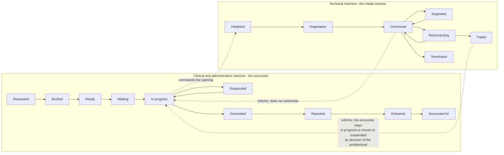

The dashed arrows are the whole point: the media session **informs** the clinical state, it does not
**determine** it. An encounter moves from «in progress» to «suspended» only if the suspension exceeds
the configured window, and it **is never closed automatically with a clinical outcome**: closure with
an outcome is always an act of the professional.

---

## 1. The cycle of a synchronous service, from beginning to end

It is the product's main flow and it runs through seven phases. It is worth looking at it whole
before taking it apart, because most design errors arise from considering one phase in isolation.

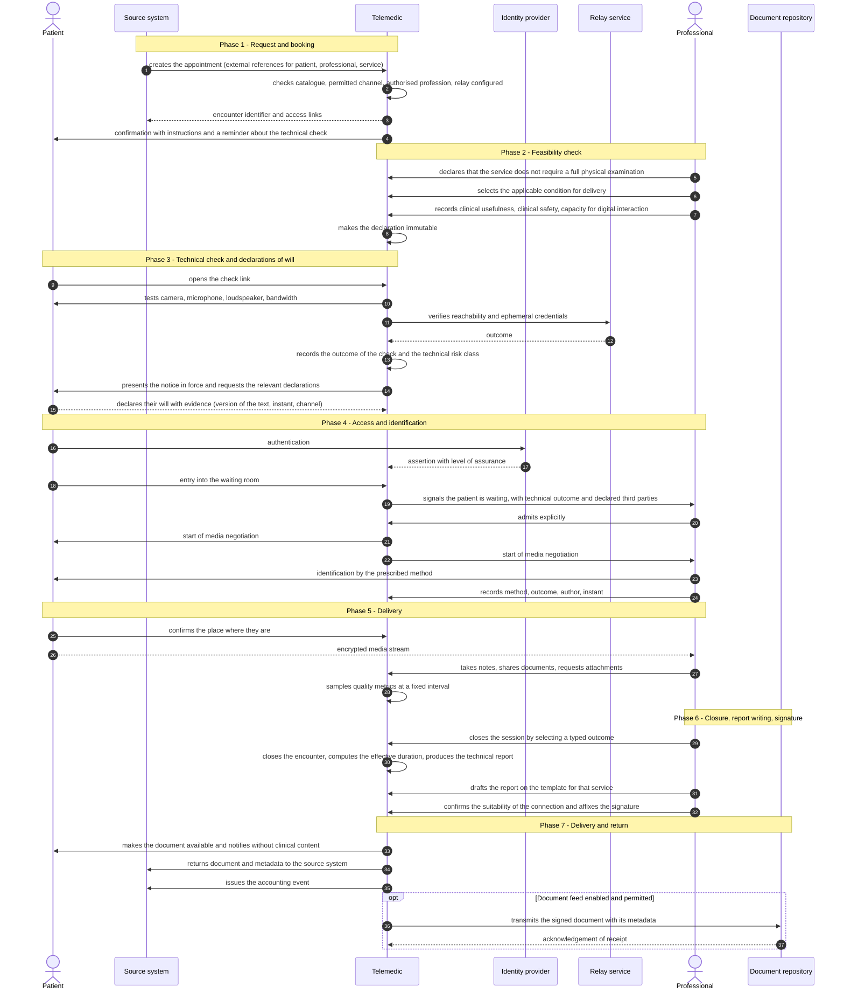

### 1.1 Seven observations on this diagram

**The technical check precedes consent, not the other way round.** Asking for a declaration of will
from a person who then discovers they cannot take part produces a pointless processing of data and a
dreadful experience. The order is: technical check → notice → consent.

**The feasibility check precedes everything else.** It is phase 2, not an end-of-pathway formality.
Delivering a service remotely is permitted under precise conditions, and the declaration that those
conditions obtain is an act of the professional, traced and immutable. Anyone who moves it downstream
finds out, with the session already running, that the act could not lawfully be delivered.

**Authentication precedes the waiting room, identification precedes the act.** They are two distinct
checks, at two distinct moments, with two distinct pieces of evidence. Authentication certifies **who
holds the credential**; identification certifies **who is in front of the camera**. The case where a
carer signs in with their own credentials on behalf of an elderly person is normal, not exceptional,
and a system that treats authentication as identification cannot represent it.

**Admission is always explicit.** There is no automatic entry into a session. It looks like an
interface detail; it is the difference between a clinical act and an open room.

**The place of delivery is asked for at the start of every session.** It is not redundant with the
registry data: the person might not be at home, and a residential address is useless in an emergency.

**Closing the encounter and writing the report are decoupled.** The professional can close and write
the report later, within the prescribed window. Tying them together forces the document to be drafted
with the patient still connected, which degrades its quality.

**Returning content to the source system is part of the process, not an appendix.** The clinical
content must flow to where the treating clinician will look for it. A failed return is a visible
incident with a reconciliation queue, not a silent error: it is the point at which the value produced
is most often lost.

### 1.2 Where the flow can stop, phase by phase

| Phase | What can stop the flow | Outcome | Who answers for it |
|---|---|---|---|
| 1 - Booking | channel not permitted, profession not authorised, relay not configured, urgent context | reasoned refusal, no partial resource | the system, with a message to the requester |
| 2 - Feasibility | physical examination required, no applicable condition, insufficient digital capacity | routing towards the in-person service or towards support | the professional |
| 3 - Technical check | permission not granted, device not supported, insufficient bandwidth, relay unreachable | technical outcome recorded, encounter appears in the risk view | the front office, proactively |
| 3 - Consents | mandatory declaration missing, representative without powers | immediate collection before the act, or suspension | the professional and the front office |
| 4 - Waiting room | access outside the window, abandonment, failure to connect | explanatory message, or an outcome of abandonment or non-attendance | the system, distinguishing those who tried from those who did not |
| 4 - Identification | unreadable document, substantive discrepancy | alternative method, or encounter cancelled without charge | the professional |
| 5 - Delivery | degradation, drop, clinical emergency, clinical decision to stop | fallback, reconnection, emergency procedure, typed outcome | the professional, with support from the system |
| 6 - Report writing | mandatory section missing, certificate not valid, deadline exceeded | signature blocked, reminder, escalation to the manager | the professional, with monitoring by the system |
| 7 - Delivery of the document | consent to transmission absent, recipient unreachable | known condition communicated, or reconciliation queue | the system, with visibility to the front office |

---

## 2. Booking and technical check, in detail

The two phases that decide whether the service will happen at all. This is where the service stakes
its reputation: the typical failure does not occur during the video call, it occurs **beforehand**.

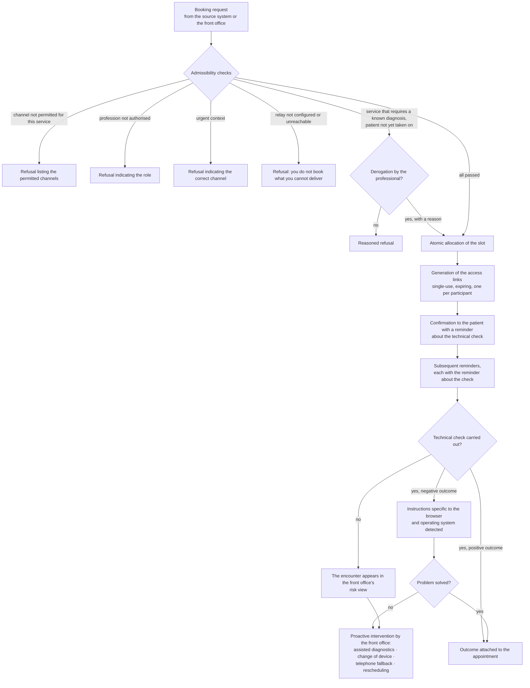

**Why the technical check is inside the pathway and is not optional.** Someone who does not know they
have to check will never check. Checking in advance is the single measure that reduces failure most,
and it must be repeated in **every** reminder, together with an indication of how long it takes.

**Why the link is in effect a credential.** It is single-use with respect to the creation of the
session, it has enough entropy not to be guessable, it expires with the waiting-room window, and it is
invalidated and regenerated when the appointment is rescheduled. Treating it as a plain web address is
the error that exposes somebody else's session.

**Why the telephone fallback must be announced in advance.** Knowing that, if it does not work, the
organisation will ring back on a certain number at a certain time removes the anxiety and turns a
total failure into a degraded service. The fallback is not, however, the same service: the change of
channel is recorded with the reason and reported in the document, because an act carried out without
a visual component may not satisfy the requirements of the service that was planned.

---

## 3. Identification: an act, not an automatic check

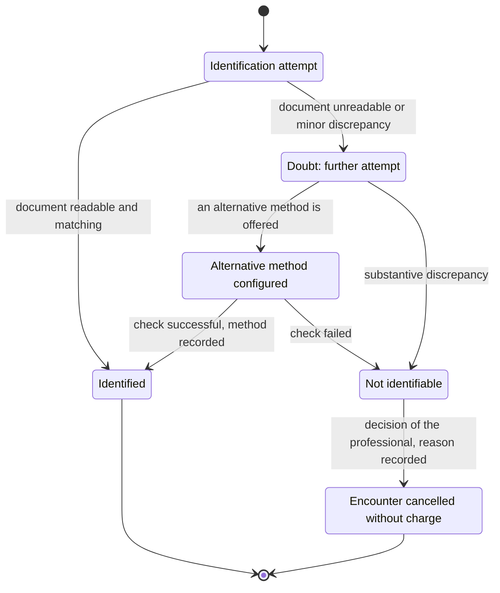

The admissible alternative methods are **configured by the tenant** and may include recognition by the
treating clinician who knows the person, sign-in with a high-level digital identity, or the presence
of a member of staff at the point of delivery. What matters, and what real systems get wrong, is that
**which method was actually used** is recorded, not a boolean: the method flows into the document and
determines its evidential value.

The system **does not perform automatic biometric recognition** and does not automatically detect the
presence of third parties. The professional bears the burden of asking; the system provides the field
in which to record the answer. It is a choice that changes the risk profile on the data and keeps
identification where it belongs: among the decisions of the professional.

---

## 4. Specialist-to-specialist consultation

A specialist-to-specialist consultation (teleconsulto) **is not a remote consultation with one extra
participant**. The subject of the service, the responsibility, the permitted synchrony, the documents
produced and the reimbursement regime all change. The operational difference that weighs most heavily
on the code is, however, another: **the consulted specialist does not receive access to the person's
clinical dossier, but only to the material that the requester has selected, for as long as the answer
requires.**

### 4.1 Asynchronous consultation, without the patient

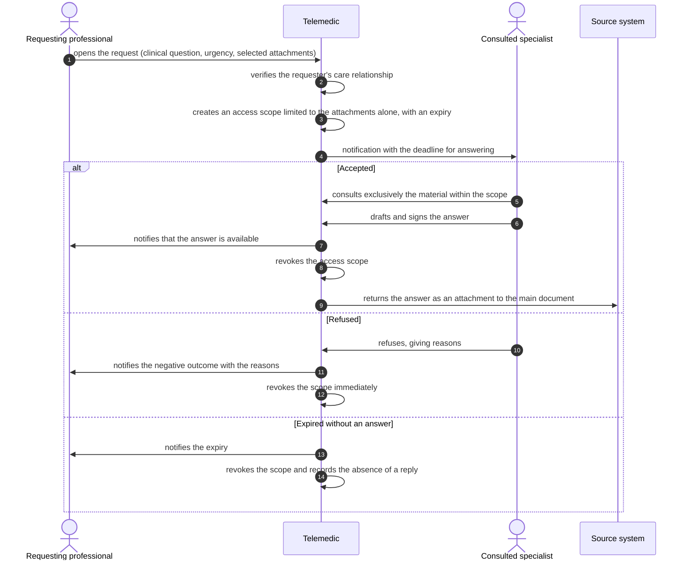

**Three points that are not obvious.**

The **ephemeral scope** is the substantive difference from ordinary clinical access. It is not a
convenient restriction: it is the translation of the principle that the consulted specialist has no
entitlement to the whole dossier. It must be implemented as an enabling relationship with an expiry,
not as an application-level filter.

The **two documents remain distinct**. The consulted specialist's report and the treating clinician's
document have different authors and separate professional responsibilities: the system does not merge
them. The collaborative report is contributed to the health record as an **attachment to the main
document**, correlated with the request.

The **consulted specialist's failure to reply is a fact to be recorded**, not a silence. It feeds the
measurement of response times and, in the pathways that provide for it, the routing to an alternative
specialist.

### 4.2 Synchronous consultation with the patient present

The three-party scenario introduces four complexities that do not exist in a remote consultation: who
is the provider, who writes the report, who conducts the session, and how the patient knows who is
there.

```mermaid
sequenceDiagram
    autonumber
    actor P as Patient
    actor R as Treating clinician (conductor)
    actor C as Consulted specialist
    participant TM as Telemedic

    R->>TM: plans the encounter and invites the specialist
    TM->>P: informs them of the presence of a third professional and requests consent
    P-->>TM: consent to the participation of the third party
    P->>TM: entry into the waiting room
    C->>TM: entry into the professional waiting area, not visible to the patient
    R->>TM: admits both
    TM->>P: shows the list of participants with name and qualification
    R->>P: identification of the patient
    R->>C: presents the case; the specialist accesses the attachments within the permitted scope
    opt Private discussion between professionals
        R->>TM: activates the side room
        TM->>P: explicitly communicates the temporary suspension and the reason
        R->>TM: returns to the main room
    end
    R->>TM: closes the session with an outcome
    C->>TM: drafts their own report and signs it
    R->>TM: drafts the document for the service and signs it
    TM->>P: makes available the documents intended for them
```

The **side room** is clinically necessary and ethically delicate: its activation is always announced,
never silent. And the **list of participants with name and qualification remains visible for the whole
duration**, with no possibility of concealment: no invisible presence at a clinical act.

---

## 5. Enrolment in remote monitoring

Here the time scale changes. A remote consultation is a transaction: open, perform, close. Remote
monitoring is a pathway that stays open for months, in which the main subject is the person receiving
care and the unit of work is the plan, not the encounter.

The premise that holds up the whole flow is the distinction between **model** and **instance**: the
population pathway describes what the organisation does for a condition, the individual plan describes
what is done for *this* person, and the thresholds live in the second, never in the first.

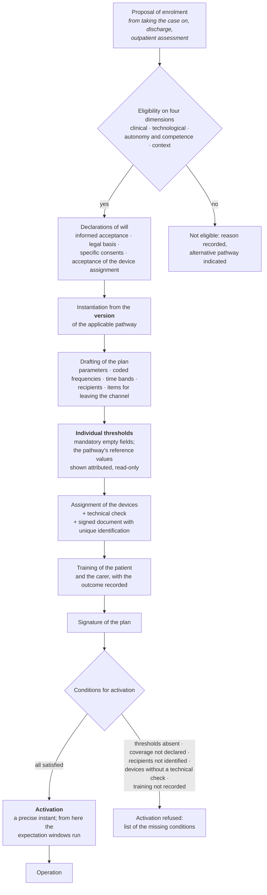

### 5.1 Why each gate exists

**The four dimensions of eligibility.** The clinical dimension is obvious and is the only one the
software must never assess by itself. The other three decide whether the remote pathway is
*achievable* for that person, independently of whether it is clinically indicated: connectivity and
devices at home; the ability to take the measurement, recognise symptoms, use the interface, answer a
call; the presence of a carer, housing conditions, distance from services. The fourth is the one
projects underestimate, and it is the one that decides whether the service works.

**Enrolment is a professional act.** There is no self-activation by the patient, in any interface. A
service activated without a responsible professional produces data with no recipient, that is,
apparent surveillance.

**The threshold field starts empty.** A value proposed by the system is confirmed by most users,
especially under time pressure: proposing a threshold amounts to setting it, with the aggravating
factor that responsibility appears to lie with whoever confirmed it. The pathway's reference values
are shown alongside, attributed with source and version, with an explicit copy action. The difference
between «showing an attributed reference value» and «pre-filling a field» is invisible to whoever
writes the code and decisive for whoever answers for it.

**Activation is an instant, not an implicit state.** From there the expectation windows run, and hence
the ability to detect an absence. A plan created but not activated generates no absences; a plan
activated without the devices delivered generates a wave of false alerts from day one.

**Coverage is a condition for activation.** It is not a commercial parameter: it is what tells the
patient when someone will look at their data. The reason why is in module
[10, § 4.5](10-percorsi-di-cura-e-sicurezza.md), and it is worth rereading before treating it as just
another configuration field.

---

## 6. Measurement, evaluation, alerting, escalation, outcome

This is the daily cycle of remote monitoring and the safety core of the system.

```mermaid
sequenceDiagram
    autonumber
    actor P as Patient or carer
    participant GW as Measurement gateway
    participant TM as Telemedic
    actor CM as Case manager
    actor MR as Responsible professional
    actor RS as Service manager

    alt Measurement from a device
        GW->>TM: transmits the batch with the instant of measurement and the device status
    else Manual entry
        P->>TM: enters the value with the unit visible and a plausibility confirmation
    end
    TM->>TM: validates (unit · plausibility · reliability · idempotency)
    alt Not technically valid
        TM->>TM: raises a technical alert, the measurement does not enter the clinical series
    else Valid
        TM->>TM: records the immutable measurement with provenance and dual timestamp
        TM->>TM: evaluates it against the rules of the plan in force at the instant of measurement
        alt No condition satisfied
            TM->>TM: closes the evaluation, recording its outcome
        else Condition satisfied
            TM->>TM: raises an immutable event with nature, severity,<br/>recipient, deadline, version of the rule,<br/>precise references to the data
            TM->>CM: delivers on the configured channels
            CM-->>TM: delivery confirmation per channel
            alt Taken on within the deadline
                CM->>TM: takes it on as a deliberate act, attributed
                CM->>TM: records the clinical assessment
                CM->>TM: closes with a typed outcome and the action taken
            else Deadline elapsed
                TM->>TM: raises the event of absent reply
                TM->>MR: escalation to the next link covered in this time band
                alt Taken on
                    MR->>TM: assumes it and handles it
                else Chain exhausted
                    TM->>TM: <b>declared failure of the handling</b>
                    TM->>RS: notification; the alert stays open
                end
            end
        end
    end
    opt The outcome entails a change to the pathway
        MR->>TM: issues a new version of the plan with the reason
    end
```

### 6.1 The six points at which this flow breaks in real implementations

1. **Between raising and delivery.** Delivery fails silently - the contact detail is no longer valid,
   the device is switched off, an external service is unavailable. Without confirmation per channel
   the system believes it has warned somebody and has not.
2. **Between delivery and reply.** No deadline is defined, therefore there is no way of knowing that
   the reply has not arrived. It is the commonest structural defect.
3. **In taking the alert on.** It coincides with opening the screen. An alert that has been «seen» is
   not an alert that has been taken on: the confirmation must be a deliberate act attributed to an
   identified person.
4. **In the escalation.** The chain points at a role that is not covered in that time band, or at the
   same recipient who did not answer. A chain that does not end in a declared failure is a chain that
   spins on empty.
5. **In the closure.** The outcome is not recorded: without a typed outcome you cannot compute how
   many alerts from that rule produced an action, and therefore you cannot improve the configuration.
6. **Everywhere.** The alert is mutable: if its state is a column updated in place, the sequence of
   events is lost. An alert is a **series of immutable events**; the current state is a projection.

### 6.2 Why the chain cannot close by itself

A system that closes unanswered alerts «on expiry» **erases the only trace of the fact that nobody
answered**. It is the most convenient behaviour to implement and the hardest to defend: it makes
invisible precisely what the service is supposed to measure. A declared failure is not a failure of
the software, it is valuable information - it says that the service, at that moment and in that time
band, was not able to handle an alert.

And the chain must be **tested cold**, periodically, without generating a real clinical alert. A chain
that has never been tested is, statistically, a broken chain: contact details change, shift rotas
change, notification services change their terms, and the only moment at which you notice that it does
not work is the wrong one.

---

## 7. Silence and systemic failure

This is the flow that systems built with an infrastructural mindset do not have at all. A technical
monitoring system, faced with a series that stops, concludes that there are no anomalies: no
measurements, no exceedances, no alerts. In a clinical service this behaviour is a safety defect,
because among the causes of the absence there is, with non-negligible probability, **exactly what the
service exists to intercept**.

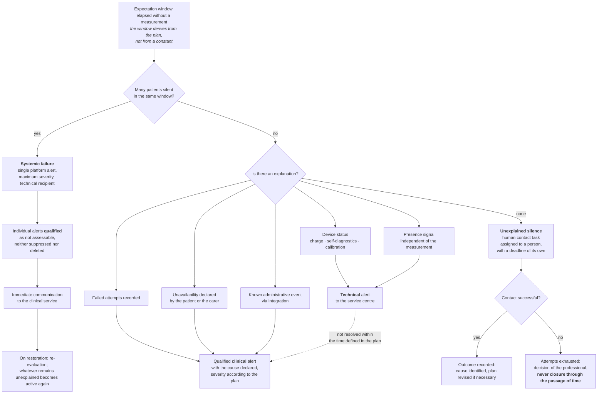

### 7.1 The strategy: eliminate the known causes

The last category of causes of silence - the person who can no longer take the measurement because
they are deteriorating - **cannot be distinguished by technical means**. The correct strategy is not
to guess it: it is to **eliminate all the others**, so that the residual silence is informative. Every
technical cause the system cannot recognise dilutes the clinical signal and produces pointless
contacts, which in turn generate operator fatigue.

Hence the order of priority of the techniques: a presence signal independent of the measurement;
telemetry of device status; recording of failed attempts; a one-touch action for declaring
unavailability; correlation with known administrative events. When all of these are exhausted and the
silence remains unexplained, the only answer is to **ring the person**. It is why a remote monitoring
service requires people and not only software, and it must be said clearly to whoever buys it.

### 7.2 Why collective failure must be detected first

Simultaneous silence from many patients caused by a fault in the ingestion chain is the worst case for
three reasons: it concerns all of them at once, so the potential harm is multiplied; it is invisible
by construction if the system does not actively look for it; and, if undetected, it generates a wave
of individual alerts that saturates the service and destroys its capacity to respond **precisely at
the moment when the data is missing**.

Detection works through **monitoring of the expected volume**: the system knows how many measurements
it expects in a window, per tenant and per source, and detects the aggregate deviation. It must notice
**before** the individual windows expire. And it must tell the clinical service while it is happening,
not only the technical team: it is the clinician who has to decide whether to activate an alternative
channel for the least stable patients, and they can only do so if they know.

---

## 8. The consent cycle

Declarations of will are more than one, they have different legal bases, different revocability and
different effects. Unifying them into a single field is the costliest error in the domain: it makes
consent to processing revocable with the effect of blocking care, and it makes clinical acceptance
impossible to demonstrate.

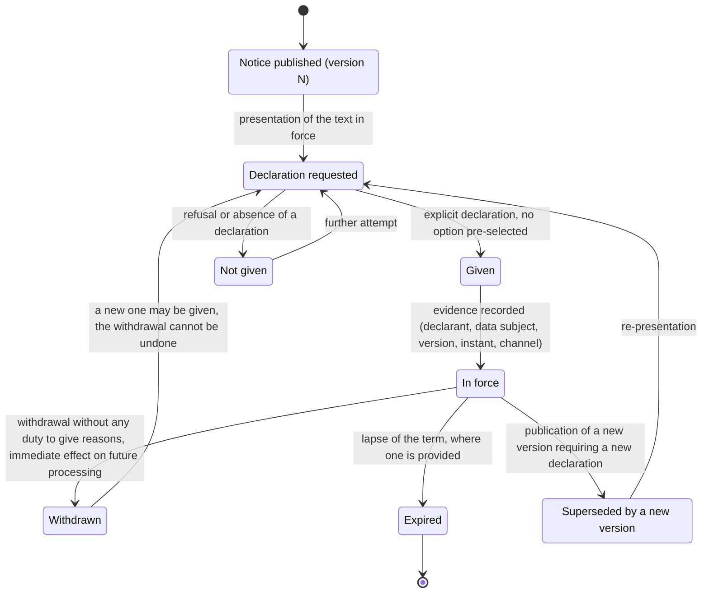

### 8.1 The distinct declarations, and what happens if they are withdrawn

| Declaration | Nature | Effect of withdrawal |
|---|---|---|
| Informed acceptance of remote delivery | a clinical act: the person agrees to receive *that* service through *that* channel | the remote pathway stops and must be reorganised in person |
| Legal basis for the processing of the data | a data protection act, with bases of its own; for the purpose of care it is typically **not consent** | if it were consent, withdrawal would block care: that is precisely why it is not used where it is not needed |
| Consent to recording the session | additional, specific, **per session**, revocable | the recording stops immediately and the event is traced |
| Consent to the presence of third parties | specific per session and per person | the third party is not admitted, with no consequences for delivery |
| Acceptance of the device assignment | acknowledgement of the handover, of the duties of safekeeping and of the instructions received | the return pathway opens; the other declarations remain in force |
| Consent to transmission to external repositories | specific | the transmission does not start: it is a **known, managed condition**, not a technical error |

### 8.2 Three rules the diagram implies

**Every declaration refers to the exact version of the text presented.** A consent that does not refer
to a versioned text cannot be demonstrated. Hence the duty to version the notices and to retain the
previous versions in full: consent collected on version 3 stays associated with version 3, which must
remain consultable for years.

**Withdrawal is an autonomous act and, as an act, irreversible.** A new declaration may be given; the
withdrawal cannot be undone. It has immediate effect on future processing and requires no reasons; the
effects on data already collected follow the retention rules, not the discretion of the operator.

**Verification precedes the act, it does not follow it.** Before the session starts the system checks
that the declarations mandatory for that type of service are present and flags any absence to the
professional, offering immediate collection. Discovering, with the session already running, that a
consent is missing is a foreseeable and preventable organisational failure.

---

## 9. The document cycle, with corrective reissue

A signed health document is **immutable**. It is not modified: a subsequent version is issued that
cancels and replaces the previous one, preserving the chain. It is one of the few rules of the domain
that admits no exception, and the reason is that the document must remain enforceable: if the content
can change after signature, the signature certifies nothing.

```mermaid
stateDiagram-v2
    direction TB
    state "Draft" as Bozza
    state "Complete draft" as Completa
    state "Signed" as Firmato
    state "Made available" as Disponibile
    state "Deferred delivery" as Differita
    state "Transmitted to the source system" as Trasmesso
    state "In the reconciliation queue" as Coda
    state "Contributed to the health record" as Fascicolo
    state "Cancelled and replaced" as Sostituito
    state "Subsequent version" as Nuova

    [*] --> Bozza : opened on the template for the service
    Bozza --> Bozza : successive saves; not visible to the patient, not transmissible
    Bozza --> Completa : mandatory sections completed
    Completa --> Firmato : signature at the required level, certificate valid
    Completa --> Bozza : certificate expired or revoked, section missing
    Firmato --> Disponibile : made available in the authenticated area
    Firmato --> Differita : deferral with reasons, with an expected date
    Differita --> Disponibile : conversation held or date reached
    Firmato --> Trasmesso : return to the source system
    Trasmesso --> Coda : transmission failure
    Coda --> Trasmesso : successful retry or manual resend
    Disponibile --> Fascicolo : contribution, if enabled and permitted
    Firmato --> Sostituito : issue of a corrective reissue
    Sostituito --> Nuova : the new version carries the reference and the reason
    Nuova --> Firmato : the new version follows the same cycle
    Fascicolo --> [*]
```

### 9.1 What the diagram forbids

**A draft is not a document.** It is not visible to the patient, it is not transmissible, it is not
retained as a health document. It does not even appear as a «document in preparation»: an incomplete
document that acquires visibility also acquires, in practice, weight.

**There is no transition from «signed» to «draft».** Correction always goes through a corrective
reissue, which preserves both versions. The previous one remains consultable and marked as cancelled;
the new one carries the reference and the reason.

**A transmission failure is not a terminal state.** It is a visible reconciliation queue, with the
cause, the number of attempts and the possibility of a manual resend, visible also to the front office
who will have to answer whoever telephones. A silent error at this point means that the clinical
content does not arrive where the treating clinician will look for it, and nobody notices until it is
needed.

**Deferred delivery is a feature, not an exception.** There are clinical circumstances in which
automatic delivery of the result is harmful and the communication requires a conversation. The
deferral is recorded with the reason, the expected date and the identity of whoever ordered it; the
patient sees that the document will be explained to them, not an unexplained void.

### 9.2 What the document must say about the act

The document produced by a service delivered remotely reports, in addition to the clinical content
drafted by the professional, some elements that do not exist in an in-person service: the channel
actually used, any degradation or change of channel that occurred, the method by which the patient was
identified, an indication of any collaborators taking part, and the **attestation of the quality of the
connection and of its suitability** for carrying out the service.

This last deserves a note, because it is the point where the clinical rule meets transport
engineering. The rule requires the professional to attest that the connection was suitable, **without
setting any numerical threshold**: the judgement belongs to the doctor, on the individual act. The
attestation nevertheless requires objective evidence, otherwise it is a bare assertion - and the
session metrics are that evidence. The thresholds at which the product warns about degradation are
therefore a **product specification**, configurable per tenant, not regulatory conformity. The detail
is in module [02, § 4.1.7](02-prestazioni-di-telemedicina.md).

---

## 10. The error and fallback flows

They are the half everybody forgets, and they are the half that determines the perception of
reliability. Five follow, chosen because each teaches a different lesson.

### 10.1 Loss of connection during the service

```mermaid
sequenceDiagram
    autonumber
    actor P as Patient
    participant TM as Telemedic
    actor M as Professional
    participant TURN as Relay

    Note over P,M: Session in progress, metrics sampled at a fixed interval
    TM->>TM: detects the threshold being exceeded for the configured duration
    TM->>M: degradation warning with the probable cause
    TM->>P: degradation warning with a suggested action
    TM->>TM: reduces the video profile while preserving the audio
    alt Degradation resolved
        TM->>M: nominal quality restored, change recorded
    else Degradation persists
        TM->>TURN: switches the stream to the relay
        alt Switch successful
            TM->>M: session continued via the relay
        else Connectivity lost
            TM->>TM: the media session moves to reconnecting;<br/><b>the encounter stays in progress</b>
            TM->>P: reconnection screen with a countdown and available actions
            TM->>M: notification of the drop and the remaining waiting time
            loop Attempts within the configured window
                P->>TM: automatic reconnection attempt
            end
            alt Reconnected within the window
                TM->>M: return to the same clinical session
                TM->>TM: notes the interruption and its duration in the encounter
            else Not reconnected
                TM->>M: offers a voice-only fallback or rescheduling
                alt Voice-only fallback accepted
                    TM->>P: instructions for the alternative channel
                    TM->>TM: records the change of channel and the reason
                else Rescheduling
                    TM->>TM: closes the encounter with a typed outcome of technical failure
                    TM->>P: offers new appointments with priority
                end
            end
        end
    end
```

**The invariant that must not be violated.** Throughout the whole procedure the clinical encounter
**does not change state**. It moves to suspended only if the suspension exceeds the configured window,
and it is never closed automatically without a decision of the professional. It is the direct
application of the principle in § 0.

**The lesson.** A fallback is not a failure of the service: it is the service continuing in a degraded
form. What must be avoided is *silent* failure - the frozen screen, the generic message, the
disconnection without explanation. The difference between a successful fallback and an abandonment
lies almost entirely in the quality of the information given in the thirty seconds after the drop.

### 10.2 Failure of the service and fallback to in-person delivery

Technical failure is not error handling: it is a **functional requirement with an obligation of
result**. When the remote instrument does not allow the substantive content of the service to be kept
unaltered, the service must be completed or rescheduled in person, at no further charge.

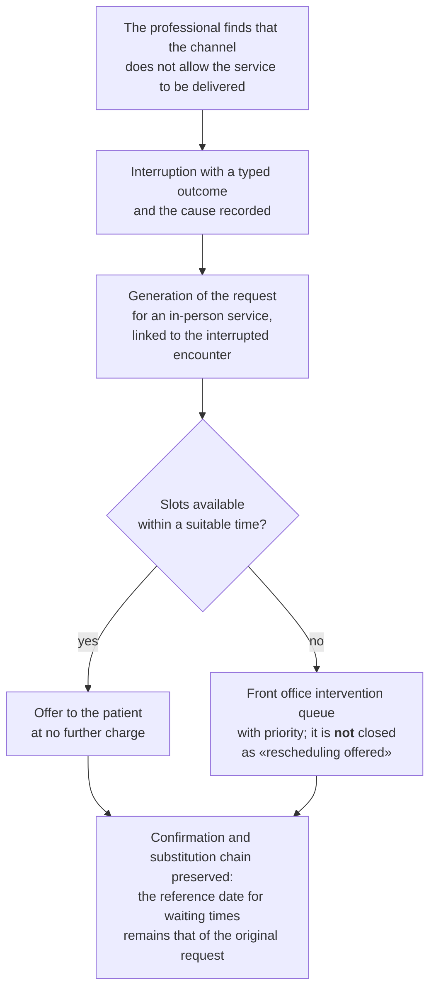

**The lesson.** A `catch` that logs and displays «connection lost» does not satisfy the obligation.
Three things are needed: a typed outcome with the cause, a rescheduling event attached to the booking,
and the guarantee that the patient does not pay twice or lose their place in the waiting times.

### 10.3 Clinical emergency during the service

It is the highest-risk scenario: the professional is at a distance from a person who might be having
an acute event, with no possibility of direct intervention.

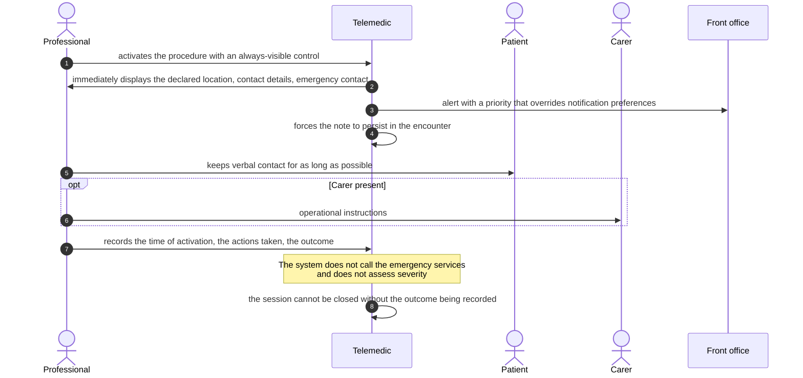

**The boundary, and why it lies there.** The system **does not** assess severity and **does not**
suggest clinical courses of action. It immediately makes available to the professional the logistical
information they do not have because the person is not in the same room: where they are, on what
number they can be reached, whom to contact. It is logistical support, not clinical decision support -
and it is the reason why the place of delivery must be asked for **at the start of every session**: a
registered residential address is useless in an emergency.

### 10.4 The alert that reaches nobody

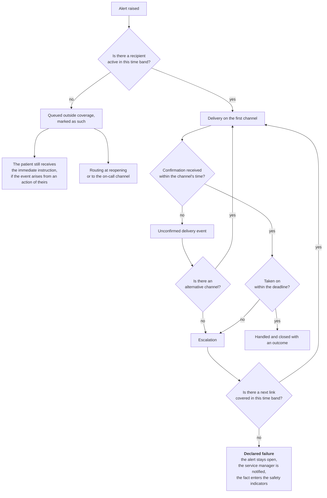

**The lesson.** There are two different ways of reaching nobody, and they must be distinguished:
**delivery fails** (channel broken, contact detail invalid) and **delivery succeeds but nobody
answers**. The first is a technical problem and is solved by changing channel; the second is a service
problem and is solved by changing recipient. Confusing them produces a chain that retries endlessly on
the same channel towards a person who is not there.

### 10.5 Outside coverage

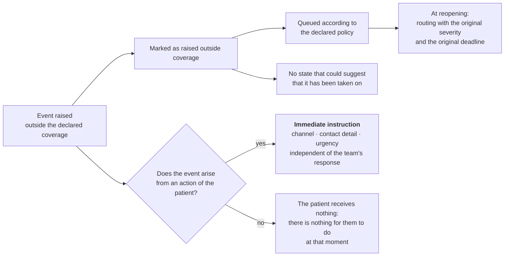

**The lesson, and it holds for the whole module.** Outside coverage the system does not stop working:
it stops **promising a professional assessment**. It carries on collecting, recording, informing on the
correct channel and making the picture available at reopening. What it must not do is behave as if
someone were watching.

### 10.6 Cancellation, rescheduling and non-attendance

This is the flow that generates the most disputes and the most discontent, and the reason is that it
assigns responsibility and produces administrative effects. In telemedicine it has one further
complication: **non-attendance is ambiguous**, because the person may have tried and failed for
technical reasons.

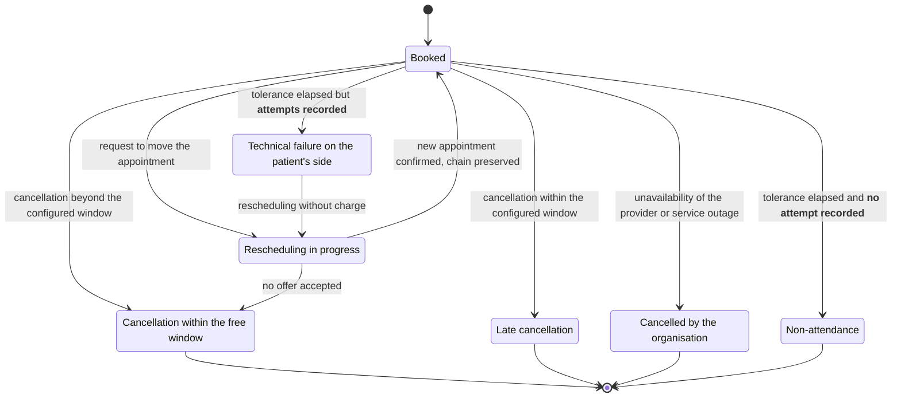

**The asymmetry is deliberate.** Cancellation by the organisation always generates a duty to offer an
alternative and never produces effects to the patient's detriment. Late cancellation may produce
administrative effects **only** if the tenant has configured them, **only** if they were communicated
at the time of booking, and **never** in the case of cancellation by the organisation or a documented
service outage. Whoever is subject to a rule must have known it before being able to break it.

**The distinction between non-attendance and technical failure is the part that counts.** An
appointment cannot be marked as non-attendance if the telemetry records at least one connection
attempt within the opening window: in that case the outcome is a technical failure on the patient's
side, it produces no administrative effects and it opens rescheduling. Charging non-attendance to
someone who tried and did not succeed is an unjustified harm and, in a public service, a problem of
equity of access. It is also why waiting-room telemetry is not technical observability: it is
**evidence for the protection of the person**.

**The substitution chain must be preserved.** Rescheduling is not «cancel and rebook»: the new
appointment remains linked to the one it replaces and the reference date for computing waiting times
remains that of the original request. Otherwise rescheduling artificially resets the waiting lists,
and the monitoring data on access to care becomes false.

### 10.7 The life cycle of a measurement: late, out of order, duplicate, corrected

Four conditions that the domain produces **routinely** and that must be designed for, not endured.
Each one has an effect on alerts, and that is where real systems break.

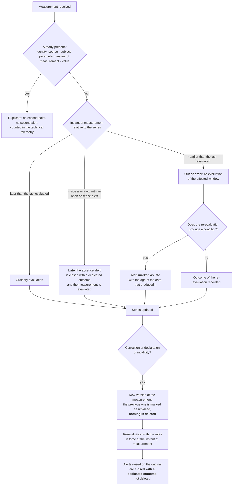

**Why the two instants must be two.** A measurement taken yesterday and transmitted today belongs to
yesterday's series. Confusing the instant of measurement with the instant of receipt produces wrong
time series and alerts raised on the wrong day - and, in the worst case, an absence alert that stays
open while the data has in fact arrived.

**Why a duplicate is a problem of trust.** A duplicate that raises a second, identical alert is, for
whoever receives it, a reliability defect: by the third time the operator stops treating the queue as
trustworthy. The identity criterion must be declared, not inferred, and it must be checked at the
boundary.

**Why correction does not delete.** You need to know what the system evaluated **when** it evaluated
it. If an alert had been raised on the original, that alert does not disappear: it is closed with an
outcome that says «data corrected», and it stays in the history. It is the only way of answering, six
months later, the question «why did nothing happen that day?».

**Why late re-evaluation must be declared.** An alert raised today on a fact from three days ago has
limited clinical value and must be flagged as such. Hiding it among the current alerts degrades the
quality of the queue; suppressing it loses information.

### 10.8 How an event reaches its destination without being lost and without being duplicated

All the flows in this module produce events that other contexts and other systems have to consume:
appointment created, session started, encounter concluded, document signed, consent withdrawn, alert
raised, measurement acquired. The way these events are published is not an infrastructural detail: it
determines whether a signed document can appear «never issued» to the source system, or whether an
alert can be delivered twice.

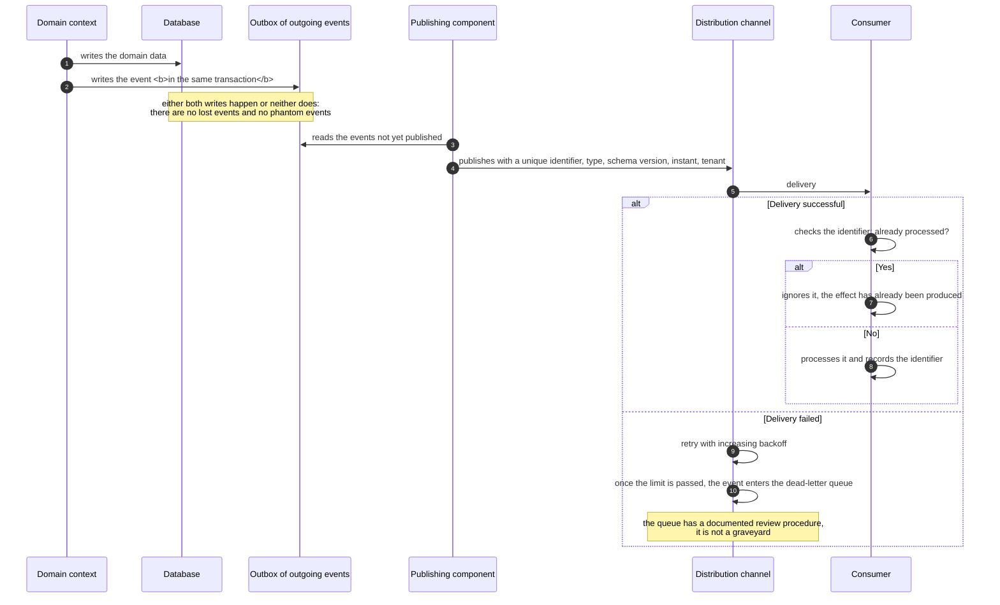

**The three properties that implementers must take as given.**

Delivery is **at least once**, not exactly once: every consumer is **idempotent by construction**,
with an explicit deduplication key. A consumer that is not produces duplicates under load, and the
load always arrives at the worst moment.

Ordering is guaranteed **only** within the partition chosen by key - typically the encounter or the
subject - and **only if all three conditions** stated in
[`06-eventi-e-integrazione-interna.md`](/02_architecture/06-eventi-e-integrazione-interna.md#41-what-is-guaranteed-and-what-is-not) §4.1 hold together: a single worker at a time, the producer
idempotent towards the channel, the number of partitions stable. Outside those conditions ordering **is not
guaranteed**. No functional requirement may depend on a global ordering: if a flow requires two events to
arrive in a given order, that order must be imposed inside the key, not hoped for.

The **dead-letter queue is not a graveyard**: it has a documented review procedure, someone
responsible and a time. An event that ends up there and is never looked at is exactly equivalent to a
lost event, with the added illusion of having kept it.

---

## 11. Map of the failure points

A summary of where things really go wrong, with the mitigation the project adopts. It is ordered by
expected frequency, not by severity.

| # | Failure point | When | Mitigation |
|---|---|---|---|
| F1 | The link cannot be found: lost in the post, deleted, filtered | before | multiple reminders on different channels, retrieval from the authenticated area, republication by the front office |
| F2 | The browser does not have permissions for camera and microphone | entry | check in advance with instructions specific to the browser and operating system detected |
| F3 | Device or browser not supported | entry | early detection with a concrete alternative and enough time to change |
| F4 | Insufficient bandwidth or unstable network | in session | adaptive profile, priority to audio, voice-only fallback, comprehensible warnings |
| F5 | The patient does not know whether they are in the right place and waits in silence | waiting room | explicit confirmation of the appointment, name of the professional, estimated wait, proactive messages |
| F6 | The professional is late and it looks like a fault | waiting room | automatic communication of the delay, updated periodically |
| F7 | Documents or questionnaires not completed before the service | preparation | list of preliminary tasks with the status visible to both, and an automatic reminder |
| F8 | Consents missing, discovered once the service has started | start | check in advance and collection in the waiting room |
| F9 | Identification not recorded | start | procedural constraint before the draft can be opened |
| F10 | Drop halfway through the service and loss of context | in session | separation between encounter and session, reconnection, note of the interruption |
| F11 | The document has to be drafted with the patient connected | end | draft that can be saved, resumed later, with a reminder before the deadline |
| F12 | The document does not arrive in the source system | after | visible reconciliation queue, not a silent error |
| F13 | The patient does not understand the document and calls back | after | limited asynchronous channel or a reading appointment, comprehensible text |
| F14 | Nobody can say what technically happened in a disputed service | after | reconstructable technical session report |
| F15 | The expected measurement does not arrive and nobody notices | remote monitoring | expectation window per parameter, absence event with recipient and deadline |
| F16 | The gateway stops delivering for everyone at once | remote monitoring | monitoring of the expected volume, platform alert, communication to the clinical service |
| F17 | The alert reaches someone who is not there at that moment | remote monitoring | chain aware of the time bands, declared failure |
| F18 | The proposed threshold is confirmed without being assessed | enrolment | mandatory empty field, attributed reference values read-only |
| F19 | The measurement is attributed to the wrong person | remote monitoring | persistent subject context, explicit confirmation on change |
| F20 | An «all green» picture is read as stability on stale data | remote monitoring | age of the most recent data always visible and highlighted, scope of the plan declared |

> **The summarising principle.** The typical failure of a service delivered remotely does not occur
> during the video call: it occurs **before** - prerequisites not checked, link not found, consents
> missing - or **after** - a document that does not arrive where it is needed. Investing in video
> quality beyond the clinically necessary threshold while neglecting the chain of prerequisites and
> the return of the content is the commonest error of priority in this domain. In remote monitoring
> the equivalent is investing in ingestion and neglecting what happens when the data **does not**
> arrive.

---

## 12. What you must remember

1. **The nominal pathway is the minority of cases.** Every flow must be designed together with its
   error and fallback branches, and every branch must end in a recordable outcome with someone
   responsible.
2. **Clinical state and technical state are two distinct machines.** A network drop does not close a
   clinical act; the media session informs the encounter, it does not determine it.
3. **The technical check precedes consent; authentication precedes the waiting room; identification
   precedes the act.** Three orderings that are not reversed, each for a precise reason.
4. **Identification is an act of the professional**, with a recorded method, not an inference from the
   fact that somebody signed in.
5. **A specialist-to-specialist consultation is not a remote consultation with one extra
   participant.** The consulted specialist's access scope is limited to the material of the question
   and lapses; the documents remain distinct.
6. **In remote monitoring the model and the instance are different entities**, linked by version, and
   the thresholds live in the instance. The threshold field starts empty and mandatory.
7. **Activation of the plan is a precise instant**, and from there the expectation windows run. A plan
   activated without the devices delivered produces false alerts from day one.
8. **An alert without a recipient, a deadline and an escalation is not an alert.** And the chain ends
   in a declared failure, never in an automatic closure.
9. **Absence of data is data.** The strategy is not to guess the cause of the silence but to eliminate
   all the recognisable technical causes, because the residual silence is what the service exists to
   intercept.
10. **Collective silence is a platform failure until proved otherwise**, and it must be detected before
    it becomes a wave of individual alerts.
11. **Outside coverage the system does not stop working: it stops promising.** It carries on collecting
    and informing, and it does not behave as if someone were watching.
12. **Declarations of will are more than one**, with different bases and effects, each referring to the
    exact version of the text presented.
13. **A signed document is immutable**: correction is a corrective reissue that preserves both versions
    and the reason.
14. **Returning clinical content to the source system is part of the process**, and its failure is a
    visible incident with a reconciliation queue.
15. **Technical failure of a service delivered remotely entails an obligation of result**: complete it
    or reschedule it in person, at no further charge, with the substitution chain preserved.

---

## 13. Where to go deeper

| What | Where |
|---|---|
| Regulatory definitions of the services, conditions for delivery, documents produced | [02 - Telemedicine services](02-prestazioni-di-telemedicina.md) |
| Clinical data, consents, legal bases, retention | [03 - Clinical data](03-il-dato-clinico.md) |
| Digital identity, registries, identifiers | [04 - Identity and registries](04-identita-e-anagrafiche.md) |
| Representation of clinical resources | [06 - FHIR from scratch](06-fhir-da-zero.md) |
| The health record and national infrastructures | [07 - The FSE and national infrastructures](07-fse-e-infrastrutture-nazionali.md) |
| Real-time transport, degradation, relay | [08 - WebRTC from scratch](08-webrtc-da-zero.md) |
| Parameters, measurements, limits of measurement at home | [09 - Clinical fundamentals](09-fondamenti-clinici.md) |
| Chronicity, pathways, alerts, silence, patient safety | [10 - Care pathways and patient safety](10-percorsi-di-cura-e-sicurezza.md) |
| Requirements, use cases, rules, typed outcomes | functional area, `docs/03_functional/` |

---

## 14. Terms introduced in this module

| Term | Short definition |
|---|---|
| **Ephemeral access scope** | The set of resources accessible to a consulted specialist for as long as the answer requires, distinct from access to the dossier |
| **Substitution chain** | The link between rescheduled appointments that preserves the date of the original request for the purposes of waiting times |
| **Reconciliation queue** | A visible list of failed transmissions to external systems, with cause, attempts and the possibility of a resend |
| **Encounter** | The clinical act as a clinical and administrative entity, distinct from the media session |
| **Typed outcome** | A value from a domain enumeration with which an encounter or an alert is closed, never free text |
| **Declared failure** | The outcome the system produces when the escalation chain is exhausted without anybody having taken the alert on |
| **Expectation window** | The interval, derived from the plan, within which a measurement is expected; its elapsing without a measurement is a clinical event |
| **Appropriateness gate** | The recording, prior to the act, of the declaration that the conditions for delivering the service remotely obtain |
| **Technical session report** | A reconstructable summary of the quality, interruptions, fallbacks and channel changes of a service, usable in the document and in complaint handling |
| **Fallback** | Continuation of the service on a degraded channel, recorded with the reason and reported in the document; it is not the same service |
| **Virtual waiting room** | The state of the encounter in which the person is connected, technically checked and awaiting admission, plus the associated queue |
| **Monitoring of the expected volume** | Comparison between the measurements expected and those received in a window, to detect collective silence before the individual absences |
| **Side room** | A private discussion between professionals during an encounter with the patient present, always announced and recorded |
