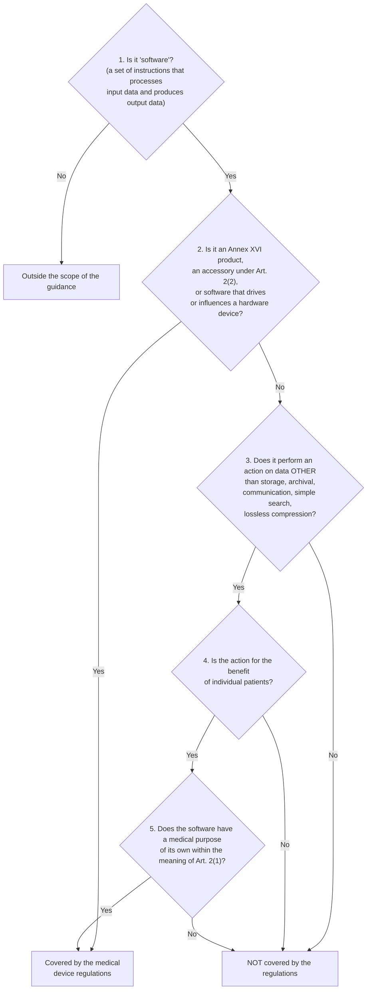
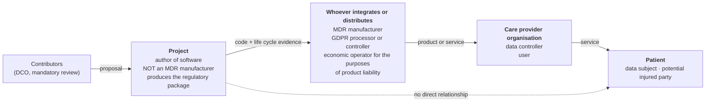
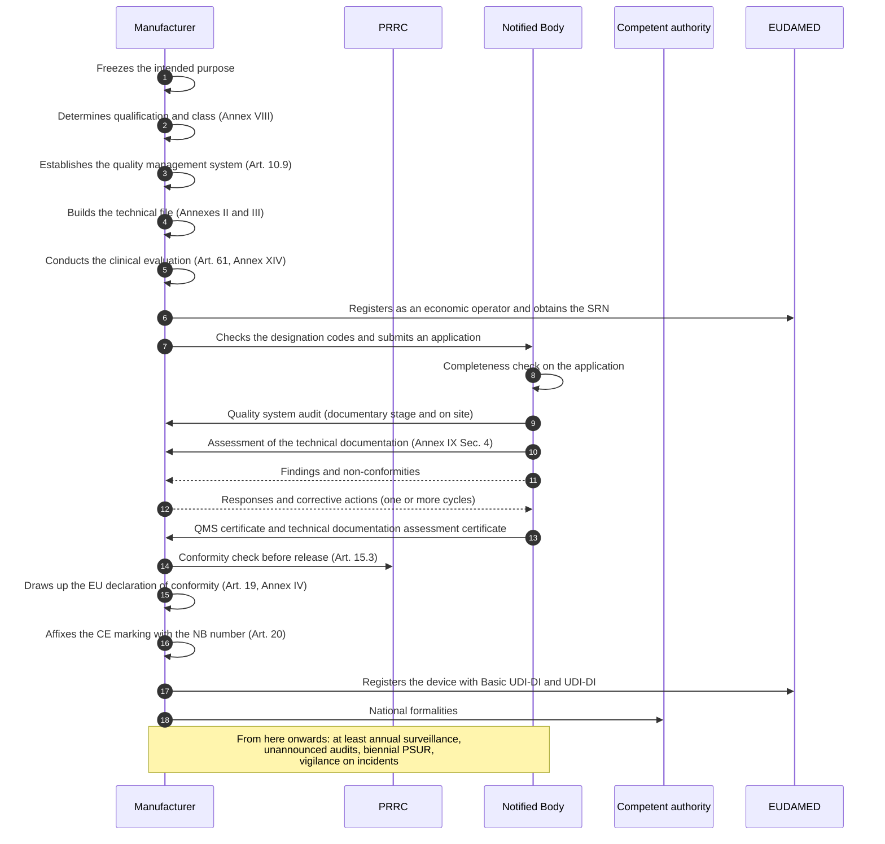
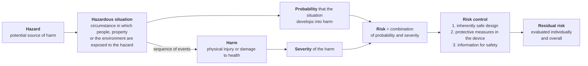
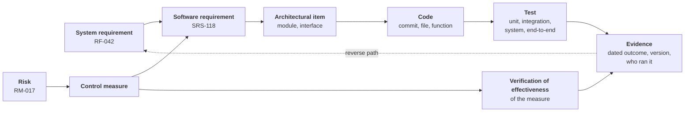

# The regulatory framework from scratch

> **This is a technical document, not legal or regulatory advice.**
> Its purpose is to make people who write code understand why certain rules exist and what
> changes in practice. It does not replace the opinion of a regulatory affairs consultant, it
> does not constitute a determination of qualification or classification, and it binds nobody.
> Regulatory decisions belong to whoever assumes the role of manufacturer (section 3) and must
> be confirmed against the original legislative texts. Where a figure is estimated, uncertain or
> taken from a secondary source, it is declared as such; anything not verified against a primary
> source is marked **[NV]**.

There are projects in which a feature is born in a conversation, written in an afternoon and
released the next day. This is not one of them, and not out of organisational fussiness.

The difference is not cultural, it is legal. There exists a body of law which, when software has
a certain declared purpose, places it in the same category as a pacemaker or a syringe: that of
**medical devices**. In that category you cannot release software without demonstrating how it
was designed, which risks were considered, who verified what, and why every line corresponds to
a requirement written beforehand. It is not a process that can be reconstructed after the fact:
either you build it while you work, or it does not exist.

This module explains that body of law starting from scratch, for anyone who has never heard of
medical devices. It presupposes no knowledge of law: every legal concept is explained from its
definition. It does presuppose module [02](02-prestazioni-di-telemedicina.md) for the vocabulary
of the services and module [03](03-il-dato-clinico.md) for health data and data protection, which
are cross-referenced here but not repeated.

By the end you should be able to answer three questions: *why is this project constrained in
this way*, *which of these constraints affect the code I am about to write*, and *what happens if
I ignore them*.

---

## 1. What a medical device is, and why software can be one

### 1.1 The definition, read word by word

The reference legislation in the European Union is **Regulation (EU) 2017/745**, commonly the
**MDR** (Medical Device Regulation), which since 26 May 2021 has replaced Directive 93/42/EEC.
**Article 2(1)** defines a medical device:

> «any instrument, apparatus, appliance, **software**, implant, reagent, material or other article
> intended by the manufacturer to be used, alone or in combination, for human beings for one or
> more of the following specific medical purposes:
> — diagnosis, prevention, monitoring, prediction, prognosis, treatment or alleviation of disease,
> — diagnosis, monitoring, treatment, alleviation of, or compensation for, an injury or
> disability,
> — investigation, replacement or modification of the anatomy or of a physiological or
> pathological process or state,
> — providing information by means of in vitro examination of specimens derived from the human
> body […]
> and which does not achieve its principal intended action by pharmacological, immunological or
> metabolic means, in or on the human body, but which may be assisted in its function by such
> means.»

Four elements have to be isolated, because each one dismantles a common intuition.

**First: software is named explicitly.** This is not an interpretative extension: the word
«software» appears in the list of objects that can be devices, alongside «instrument» and
«apparatus». There is no threshold of technological complexity. A spreadsheet with three formulas
can be a medical device; a distributed system with ten million lines may not be one at all.

**Second: «intended by the manufacturer».** This is the pivot of everything and is the subject of
section 1.3.

**Third: the purposes are exhaustive.** Diagnosis, prevention, monitoring, prediction, prognosis,
treatment, alleviation — referring to diseases, injuries or disabilities — plus investigation,
replacement or modification of the anatomy or of a physiological process. Outside this list there
is no medical purpose within the meaning of the MDR, however healthcare-related the product may be
in the ordinary sense. Invoicing for a medical practice is a healthcare activity and is not a
medical purpose. Planning the shift rota of a ward likewise.

**Fourth: the pharmacological exclusion criterion** serves to separate devices from medicinal
products and is irrelevant to software.

### 1.2 The minimum vocabulary before going on

| Term | Operational meaning |
|---|---|
| **MDR** | Regulation (EU) 2017/745 on medical devices |
| **IVDR** | Regulation (EU) 2017/746 on in vitro diagnostic medical devices: it concerns the examination of biological specimens and does not concern us |
| **MDSW** | *Medical Device Software*, software that is itself a medical device |
| **MDCG** | *Medical Device Coordination Group*, the coordination group established by Article 103 MDR; it publishes guidance that is non-binding but followed in practice by authorities and notified bodies |
| **Intended purpose** | The use for which the manufacturer intends the device, Article 2(12) |
| **GSPR** | *General Safety and Performance Requirements*, the general safety and performance requirements of Annex I MDR |
| **Notified Body** | An independent third-party body, designated by a Member State and notified to the Commission, which assesses the conformity of devices in the higher classes |
| **EUDAMED** | The European database on medical devices |

### 1.3 The conceptual leap: it is the declared intended purpose that qualifies, not the technology

This is the point almost everyone struggles with, and it must be put as bluntly as possible.

**It is not what the software does technically that determines whether it is a medical device. It
is what the manufacturer declares it is for.**

**Article 2(12)** MDR defines the intended purpose as

> «the use for which a device is intended according to the data supplied by the manufacturer on
> the label, in the instructions for use or **in promotional or sales materials or statements** and
> as specified by the manufacturer in the clinical evaluation».

Read the highlighted expression again. **Promotional material is regulatory material.** A sentence
on a home page, a line in the `README`, a section heading in the API documentation, the text of an
announcement: these are all sources from which the intended purpose is derived as a matter of law,
and they contribute to establishing whether the product is a device and in which class.

The consequences are counter-intuitive and must be internalised:

1. **Two technically identical products can have opposite qualifications.** Software that displays
   a time series of blood pressure values is a medical device if it declares that it serves to
   monitor a hypertensive patient, and is not one if it declares that it is a personal wellness
   diary. The code is the same, the legal regime is not.
2. **Adding a sentence can change the regime, without touching a line of code.** It is why, in this
   project, reviewing the public texts is a compliance activity and not a communications activity.
3. **Removing a sentence does not remove a feature.** If the software *does* something and the
   declared intended purpose denies it, the declaration is false. Article 7 MDR prohibits text,
   names, trade marks, pictures and figurative or other signs that may mislead the user or the
   patient with regard to the intended purpose, safety and performance, «in particular by ascribing
   functions and properties to the device which the device does not have».

The operational rule that follows, and that governs this project, is a single one: **declare
exactly what the product does, and design the product so that it does exactly what you want to
declare.** Any divergence between the two is a defect, in one direction or the other.

### 1.4 Risk is not a criterion of qualification

A second frequent misunderstanding: «our software cannot cause serious harm, therefore it is not a
device». The guidance **MDCG 2019-11** (*Qualification and classification of software in Regulation
(EU) 2017/745 and Regulation (EU) 2017/746*), in revision 1 of June 2025, § 3.1, is explicit:

> «It must be highlighted that the risk of harm to patients, users of the software, or any other
> person, related to the use of the software within healthcare, including a possible malfunction
> is **not a criterion** on whether the software qualifies as a medical device.»

Risk determines the **class** (section 2), not the **qualification**. They are two questions in
sequence, not one: *is it a device?* and then, only if the answer is yes, *of which class?*

### 1.5 The qualification decision tree

MDCG 2019-11 Rev.1 provides, on pages 12–13, a five-step decision tree. It is the instrument that
anyone who has to justify a qualification works through step by step, in writing, with a
justification for each node. A Notified Body or a competent authority checks that the tree has been
worked through, not merely the conclusion.



Three nodes deserve careful reading.

**Step 3 is the one that decides almost everything.** The list of «neutral» actions — storage,
archival, communication, simple search, lossless compression — describes exactly what an
information system does. The note accompanying the step defines «communication» by reference to
the standard IEEE 610.10-1994: «the flow of information from one point, known as the source, to
another, the receiver». Routing signalling messages, carrying an encrypted multimedia stream,
serialising a resource and transmitting it: all of this is communication and does not pass step 3.

Note however the word **«lossless»**: the exclusion concerns *lossless* compression, that is,
compression that allows the exact reconstruction of the original data. The adjective is deliberate
and has normative force. Lossy compression that alters clinically relevant information is an action
on data that does pass step 3. The defence, for a video communication system, lies in the fact that
the compression is for **compatibility and transmissibility**, not for a medical purpose: the same
§ 3.1 of Rev.1 states that «altering the representation of data for embellishment/cosmetic or
compatibility purposes does not readily qualify the software as MDSW». It is a solid defence, but
not a frictionless one, and the friction grows the more the public communication emphasises the
diagnostic adequacy of the channel.

**Step 4 excludes what does not concern the individual patient.** Population aggregations, generic
pathways, literature, atlases, epidemiological registries, and — a case relevant to us — **network
quality metrics**: round-trip time, packet loss, jitter, bitrate. They are for the benefit of
managing the infrastructure, not of the individual patient. They must be documented with this
justification made explicit, not left implicit.

**Step 5 is the real question:** does the software have a medical purpose *of its own*? The
guidance states it as a principle: «Software must have a medical purpose on its own to be qualified
as a MDSW» (§ 3.1). And it specifies that «software only intended for non-medical purposes […] such
as invoicing, staff planning, **e-mailing, web or voice messaging**, data parsing, word processing,
and back-up, wellness or fitness apps, do not qualify as MDSW». The express mention of **web and
voice messaging** among the *non*-medical activities is directly relevant to the signalling and
transport layer of this project.

### 1.6 What the guidance says expressly about systems like this one

Annex I to MDCG 2019-11 Rev.1 contains a set of examples. Four entries concern us.

**c) Information systems** (p. 25): «Information Systems that are intended only to transfer, store,
convert, format, archive data are not qualified as medical devices in themselves. However, they may
be used with additional modules which may be qualified in their own right as medical devices
(MDSW).»

**c.1) Electronic health record systems** (pp. 25–26): *Electronic Health Record* systems «when used
solely to replace traditional paper-based patient files, do not meet the definition of a medical
device». It is the digital equivalent of headed notepaper.

**d) Communication systems** (p. 27): «The healthcare sector uses communication systems (e.g. email
systems, mobile telecommunication systems, **video communication systems**, paging, speech-to-text
systems etc.) […] **Communication systems are normally based on software for general purposes, and
do not fall within the definition of a medical device.**» And immediately afterwards the warning:
«*A software module generating alarms based on the monitoring and analysis of patient specific
physiological parameters is qualified as a medical device (MDSW).*»

**d.1) Telemedicine systems** (p. 27) — the decisive passage, rewritten precisely in revision 1:

> «Telemedicine that solely transfers and displays information for monitoring purposes **without
> interpreting data** does not qualify as a medical device. Additional modules such as
> **thresholds alerts** may qualify as a medical device if they are intended for medical
> purposes.»

Keep in mind the expression «without interpreting data»: it is the criterion that in section 2.6
becomes the operational dividing line of the entire architecture.

### 1.7 The two traps that shift the qualification without anyone noticing

**The accessory trap.** Article 2(2) MDR defines an «accessory» as an article which, whilst not
being itself a device, is intended by its manufacturer to be used **together with** one or several
particular devices, to enable them to be used in accordance with their intended purpose or to
directly assist their medical functionality. An accessory is subject to the regulation.

Applied to us: as long as the integration documentation remains *device-agnostic*, we are the
accessory of nothing. The moment a document declared «compatible with dermatoscope X for
teledermatology» or «enables remote use of digital stethoscope Y», the product would become an
accessory of that device. And implementing rule 3.3 of Annex VIII drags software that drives or
influences a device **into the same class as the device it drives**. A single sentence in an
integration document can therefore import the class of a third party's apparatus.

**The module trap.** Section 7 of MDCG 2019-11 Rev.1, rewritten in 2025, requires the boundaries
and interfaces of modules to be delimited explicitly and requires communication of «exactly which
modules constitute the product» and «whether the product or any of its modules are subject to the
MDR/IVDR or under other applicable legislation». But it adds two passages that bear directly on a
component designed to be embedded:

> «Where not all modules serve a direct medical purpose (e.g., patient record management,
> scheduling, or communications), but these non-medical functionalities are essential to the
> medical purpose of an MDSW, the following applies: **Non-medical functionalities should not be
> excluded from the MDSW description if they are necessary for the operation of the MDSW**.»

> «For example, a manufacturer develops an MDSW extension that operates through the user
> interface of a host module or platform that itself does not meet the definition of a medical
> device. […] **Therefore, the manufacturer must assess the host module's interface as part of
> the MDSW's usability and clinical performance evaluations.**»

Translated: if one day somebody — an integrator, a third party, a *fork* — builds a module with a
medical purpose on top of this platform, **our user interface and our multimedia pipeline enter the
scope of the usability and clinical performance evaluation of that module**, while themselves
remaining non-device. That is why the architectural constraint **V2** — an explicit separation
between «communication vehicle» and «clinical decision support» — is not a design preference: it is
a documentary requirement imposed by the guidance, and it is what makes our work usable by whoever
certifies.

---

## 2. The risk classes, and the rule that applies to software

### 2.1 Four classes, a single criterion

**Article 51 MDR** provides that devices are divided into classes **I, IIa, IIb and III**, taking
into account the intended purpose and the risks, and that classification is carried out according
to the rules in **Annex VIII**. The class is not a quality label: it is an indicator of how much
procedural rigour the legal order demands before the product reaches a patient.

Chapter II of Annex VIII contains the **implementing rules**, that is, the meta-rules that say how
the classification rules are used. Four of them are decisive for software:

- **3.1** — «Application of the classification rules shall be governed by the intended purpose of
  the devices.» Again the intended purpose, not the technology.
- **3.3** — «Software, which drives a device or influences the use of a device, shall fall within
  the same class as the device. **If the software is independent of any other device, it shall be
  classified in its own right.**»
- **3.5** — «If several rules, or if, within the same rule, several sub-rules, apply to the same
  device based on the device's intended purpose, **the strictest rule and sub-rule resulting in the
  higher classification shall apply**.»
- **3.7** — «A device is considered to allow direct diagnosis when it provides the diagnosis of the
  disease or condition in question by itself **or when it provides decisive information for the
  diagnosis**.»

Rule 3.5 is the structural reason why **you do not choose** your own class: if even a single
stricter sub-rule is applicable, it prevails. Rule 3.7 is the one that makes telemedicine
treacherous in the visual specialties: if the video stream is the source of the clinical
observation, the question «does the software provide decisive information for the diagnosis?» does
not have an obviously negative answer.

A useful clarification: software is by definition an **active device**. Article 2(4) MDR, after
defining an active device as one whose operation depends on a source of energy other than that
generated by the human body, closes with «**Software shall also be deemed to be an active
device**». It follows that, if qualified, software falls under rules 9–13, 15 and 22 of Annex VIII.

### 2.2 Rule 11, full text

Annex VIII, Chapter III, point 6.3:

> **6.3. Rule 11**
>
> Software intended to provide information which is used to take decisions with diagnosis or
> therapeutic purposes is classified as class IIa, except if such decisions have an impact that may
> cause:
>
> — death or an irreversible deterioration of a person's state of health, in which case it is in
> class III, or
>
> — a serious deterioration of a person's state of health or a surgical intervention, in which case
> it is classified as class IIb.
>
> Software intended to monitor physiological processes is classified as class IIa, except if it is
> intended for monitoring of vital physiological parameters, where the nature of variations of those
> parameters is such that it could result in immediate danger to the patient, in which case it is
> classified as class IIb.
>
> **All other software is classified as class I.**

MDCG 2019-11 Rev.1, § 4.2.1, breaks the rule down into three sub-rules:

| Sub-rule | Content | Base outcome |
|---|---|---|
| **11a** | Software intended to provide information used for diagnostic or therapeutic decisions | IIa, unless IIb or III according to severity |
| **11b** | Software intended to monitor physiological processes | IIa, unless IIb for vital parameters with immediate danger |
| **11c** | All other uses | I |

Two clarifications in the guidance change the weight of the rule.

On **11a**, Rev.1 warns that the wording «describes, in very general terms, the characteristic
"mode of action" of **all** MDSW» and that therefore «this sub-rule is generally applicable to all
MDSW (excluding those that have no medical purpose)» (p. 17). Furthermore, the upward derogations
are assessed on the impact of a decision taken **on incorrect information** supplied by the
software: «where such decisions, if based on incorrect information from the MDSW, are reasonably
likely to have an impact that may cause…» (p. 18).

On **11b**, the guidance clarifies that it applies to the monitoring of *any* physiological
process, not only vital ones, and that the reference vital parameters are «respiration, heart rate,
cerebral functions, blood gases, blood pressure and body temperature» (p. 18).

### 2.3 Why, for telemedicine software, the lowest class does not exist in practice

Here we reach the most important regulatory fact in the whole module, and it must be said without
attenuation.

Annex III to MDCG 2019-11 Rev.1 (p. 33) reproduces the orientation matrix derived from the work of
the *International Medical Device Regulators Forum* (**IMDRF**), which crosses the significance of
the information with the criticality of the clinical situation:

| | Information: **treats or diagnoses** | **drives clinical management** | **informs clinical management** |
|---|---|---|---|
| **Critical** situation | Class III | Class IIb | Class IIa |
| **Serious** situation | Class IIb | Class IIa | Class IIa |
| **Non-serious** situation | Class IIa | Class IIa | Class IIa |

And beneath the table, in a note, the sentence that closes the argument:

> «**This table does not take into account MDSW which is Class I.**»

That is: in the matrix applied to Rule 11a, **Class I appears in no cell**. Any software that has
been qualified as a medical device and that provides information used for clinical decisions —
however marginal the information, however non-serious the condition — is **at least IIa**.

The logical chain that follows is inescapable:

1. to be in Class I you must first **be a medical device**: the classes are an attribute of
   devices, not of categories of software;
2. to be a device you need a **medical purpose of your own**;
3. if there is a medical purpose of its own, sub-rule 11a «is generally applicable to all MDSW» and
   the matrix contains no Class I cells: minimum result **IIa, with a Notified Body**;
4. if there is no medical purpose of its own, the product **is not a device at all** and there is
   no Class I to self-certify.

**There is no comfortable Class I box in between for a telemedicine platform.** Class I under Rule
11c exists, but it is populated by software with a medical purpose that is *non-decisional and not
monitoring*. The only two examples the guidance offers (Annex IV, p. 35) are an application that
computes fertility status from basal temperature and days of menstruation and returns it with a
traffic-light indicator, and an application that assists people with communication disorders by
converting symbols into spoken language. Both have a medical purpose attributable to Article 2(1) —
respectively control or support of conception and compensation for a disability — **without**
producing information used for a diagnostic or therapeutic decision. A secure audio-video channel
does not belong to that family.

This finding has a consequence that the project has formally adopted (decision **D26**): to declare
a medical purpose of its own and accept the **Class IIa pathway with a Notified Body**, rather than
chase a Class I which, for remote monitoring, is not available.

### 2.4 The mirror-image risk: CE marking something that is not a device

The opposite error is equally real and less discussed. Affixing a CE marking under the MDR to a
product which, correctly qualified, is not a device, **is not a harmless excess of caution**: it is
a false representation of the regulatory status.

- **Article 20** governs the CE marking of *devices* and prohibits the affixing of marks or
  inscriptions liable to mislead third parties with regard to the CE marking;
- **Article 7** prohibits misleading claims about intended purpose, safety and performance;
- **Article 10(6)** makes the declaration of conformity conditional on conformity *of a device*
  having been demonstrated through the applicable procedure;
- registration in EUDAMED and the assignment of the unique identifier presuppose the existence of a
  device.

An integrator could found its own compliance on a marking that was not due. It is one of the
reasons why this project affixes no markings and signs no declarations (section 3.6).

### 2.5 What really distinguishes the classes: pathway, timescales, costs

| | **Class I** | **Class IIa** | **Class IIb** | **Class III** |
|---|---|---|---|---|
| Who assesses conformity | The manufacturer alone, except for the sub-classes Is, Im, Ir | **Notified Body** | Notified Body | Notified Body, reinforced procedures |
| Legal basis | Art. 52(7) | Art. 52(6): Annex IX Chapters I and III plus assessment of the technical documentation under Section 4, or Annex XI | Art. 52(4) | Art. 52(3), with expert consultation in the cases provided for |
| Technical documentation | Annexes II and III | Annexes II and III | Annexes II and III | Annexes II and III |
| Clinical evaluation | Art. 61 and Annex XIV | Art. 61 and Annex XIV | Same, with more stringent evidence | Same, clinical investigation normally required |
| Periodic safety update report (**PSUR**, Art. 86) | Not due: the PMS report under Art. 85 is drawn up instead | At least **every two years** | Annual | Annual, submitted to the Notified Body |
| Surveillance | No third-party audit | At least annual audits by the NB, plus unannounced audits | Same | Same |
| Typical duration of the pathway | Months, dominated by document drafting | **Years** (section 10) | Longer | Much longer |
| Expected software safety class | Variable | Typically B | Typically B or C | Typically C |

The last two rows make the economic and temporal difference. The jump from IIa to IIb does not add
one more formality: **it adds an order of magnitude**, because it triggers simultaneously more
stringent clinical evidence, a higher software safety class with an obligation of detailed design
at unit level, and longer assessment cycles.

### 2.6 The criterion that shifts the class: transmitting without altering, or interpreting

The dividing line is this: **either the data passes through the system retaining its own
informational content, or the system adds meaning**. In the first case the software is a conduit;
in the second it produces new clinical information, and whoever produces clinical information
provides information for clinical decisions.

Here is the line applied function by function to this project. The «outcome» column indicates
whether the function, on its own, would pass step 3 of the qualification tree.

| Function | What action it performs on the data | Outcome |
|---|---|---|
| Session signalling, exchange of connectivity candidates, fallback to relay | Routing of messages: **communication** | Does not pass |
| Encrypted point-to-point multimedia transport | Transport: **communication**. Encryption does not interpret the clinical content | Does not pass |
| Persistence of the encounter, the professional, the patient, the appointment | **Storage** and format conversion | Does not pass |
| Persistence of the clinical document drafted by the professional | **Storage** of human-authored content, with serialisation as format conversion | Does not pass, **on condition** that no clinical field is derived, inferred, pre-filled or completed by the system |
| Immutable audit trail | Technical recording, no clinical purpose | Does not pass |
| Encrypted recording of the session, with consent | **Storage** | Does not pass; *playback with image enhancement tools* would be another matter |
| Network quality metrics and technical thresholds | Processing of **network** parameters, not physiological ones | Passes step 3 as an action, but falls at step 4: it is not for the benefit of the individual patient |
| Acquisition of parameters measured by third-party devices and their presentation in tables and charts | Presentation without alteration of the content | Does not pass **as long as** no interpretation is added |
| **Highlighting the crossing of a threshold configured by the professional** | Deterministic comparison between a value and an interval defined by a human being for that individual patient | **This is the frontier**: it is the function that, within the declared scope, constitutes interpretation and founds the qualification as a device |

The last row deserves an explanation, because it is the reason this project is where it is.
Comparing a number with an interval is trivial in computing terms. In regulatory terms it is the
moment at which the system stops merely displaying a datum and starts **qualifying** it as within
or outside the norm for that patient. The guidance says so expressly: «additional modules such as
thresholds alerts may qualify as a medical device if they are intended for medical purposes».

The project has chosen to acknowledge this fact rather than work around it, and has built around it
a series of constraints that keep the class at **IIa** instead of letting it rise to IIb. They are
all code constraints, not prose:

- **no clinical threshold is hard-coded**: thresholds are configuration in the hands of the
  professional, for the individual patient (constraint **V2**);
- **no score, prognostic index or risk classification is computed by the system**;
- **collection is deferred**, intended for the professional's periodic review, not for continuous
  real-time monitoring;
- **crossing a threshold generates an alert, not an emergency alarm**: the system is not an
  emergency channel and says so;
- **no clinical content is generated by the system**: every clinically significant field has an
  origin traceable to a human input.

### 2.7 The intended purpose is the most expensive document to get wrong

The project has recorded this finding as a formal decision (**D46**).

| Wording of the intended purpose | MDR class | Software safety class | Difference |
|---|---|---|---|
| «**real-time** monitoring of vital parameters» | **IIb** (Rule 11, second paragraph) | **C** | 12–18 months and an order of magnitude more cost — **an estimate, not a price list** |
| «**deferred** collection of parameters for the professional's **periodic review**» | **IIa** | **B** | — |

Two words. The difference between «real-time» and «deferred», and between «vital parameters» and
«parameters», is worth more than any technological choice taken in the whole project. That is why
the intended purpose must be **frozen and submitted to external review before** engaging anyone,
and why changing it afterwards entails a complete reassessment.

### 2.8 The functions that are one single *user story* away from reclassification

| # | Feature | Legal basis | Resulting class |
|---|---|---|---|
| C1 | Triage, symptom score, questionnaire that returns an outcome | Rule 11a | IIa, up to IIb according to severity |
| C2 | Alerting on **physiological** parameters, even self-reported ones | Rule 11b; Annex I d) of the guidance | IIa; **IIb** for vital parameters with immediate danger |
| C3 | Image enhancement for clinical reading: contrast, sharpness, diagnostic zoom, filters, live or on playback | MDCG 2019-11 Rev.1 § 3.1 | IIa, up to III for critical conditions |
| C4 | Measurement on an image: size of a lesion, joint angle | Rule 11a and implementing rule 3.7; possible «measuring function» for the purposes of Art. 52 | IIa |
| C5 | Automatic coding or semantic derivation of the clinical document | Rule 11a | IIa |
| C6 | Decision support, therapeutic suggestion, ranking of options | Rule 11a | IIa or higher |
| C7 | Driving or remotely activating a device | Implementing rule 3.3 | Class of the device driven |
| C8 | Direct delivery of therapy | Annex I d.1) of the guidance | At least IIa |
| C9 | Declaration that the channel is suitable for telepathology or teleradiology purposes | DM 21 settembre 2022 (the Ministerial Decree of 21 September 2022), Annex A | Certification as a device, class to be assessed |

Three of these nine entries are, literally, one single *user story* away from our feature list:
**C2** (threshold alerting), **C3** (playback of the recording with image controls) and **C5**
(assisted report writing, a recurring request from integrators). They are governed through change
control: a *pull request* introducing them is not rejected on technical merit, but on **scope
policy**.

Nor is introducing an artificial intelligence component a technical choice. Automatic
transcription, summarisation of the clinical document, machine translation, speech recognition:
each of these would bring the product into the scope of **Regulation (EU) 2024/1689** (*AI Act*),
with a regime of obligations of its own that adds to the MDR's. No function declared today is an AI
system within the meaning of Article 3(1) of that regulation. Introducing one «for convenience» in
a *pull request* is a change of legal regime.

---

## 3. Who the manufacturer is, and why this repository is not one

### 3.1 The definition, and what it entails

**Article 2(30)** MDR defines the manufacturer as

> «a natural or legal person who manufactures or fully refurbishes a device or has a device
> designed, manufactured or fully refurbished, **and markets that device under its name or
> trademark**».

Two cumulative elements: *having the device made*, and *marketing it under one's own name*. There is
no figure of «co-manufacturer by contribution» in the MDR: whoever opens a *pull request* markets
nothing and affixes no trade mark.

Being a manufacturer means assuming the list of obligations in **Article 10**. It is worth reading,
because it makes concrete what otherwise remains abstract.

| Paragraph | Obligation | Translation for software |
|---|---|---|
| 10(2) | **Risk management** system under Annex I, Section 3 | ISO 14971 (section 5.4) |
| 10(3) | **Clinical evaluation** under Article 61 and Annex XIV, including post-market clinical *follow-up* | Section 4.5 |
| 10(4) | **Technical documentation** under Annexes II and III, kept up to date | Section 4.4 |
| 10(6) | **EU declaration of conformity** and **CE marking** | Sections 4.6 and 4.7 |
| 10(7) | **UDI** and **registration** obligations | Section 4.8 |
| 10(8) | Retention of the documentation for at least **10 years** after the last device has been placed on the market | Document retention policy |
| 10(9) | **Quality management system** proportionate to the class, with elements (a)–(m) | Section 5.3 |
| 10(10) | **Post-market surveillance** | Section 4.9 |
| 10(11) | Information accompanying the device in the **official languages** determined by the Member State | Instructions for use in Italian |
| 10(12) | Immediate corrective action in the event of non-conformity | Field safety corrective action procedure |
| 10(13) | Recording and reporting of **incidents** | Section 4.9 |
| 10(14) | Provision to the authority of all information needed to demonstrate conformity | — |
| 10(16) | **Sufficient financial cover** for potential product liability | Section 8.4 |

Among the quality system elements listed in paragraph 9, point **(d)** deserves emphasis:
«resource management, **including selection and control of suppliers and sub-contractors**». An
external contributor is not formally a supplier, but the code they propose enters the product: the
manufacturer must be able to answer for the design and verification of code written by people it
does not control. It is the knot that section 3.8 unties.

### 3.2 The person responsible for regulatory compliance

**Article 15 MDR** requires the manufacturer to have available at least one **person responsible for
regulatory compliance** (**PRRC**), with expertise demonstrated by:

- (a) a diploma or degree in law, medicine, pharmacy, engineering or another relevant scientific
  discipline, **plus** one year of professional experience in regulatory affairs or in quality
  management systems; **or**
- (b) four years of professional experience in regulatory affairs or in quality management systems.

Micro and small enterprises — under Recommendation 2003/361/EC, micro below 10 staff and EUR 2
million, small below 50 staff and EUR 10 million — **are not required to have the PRRC within the
organisation, but must have such a person permanently and continuously at their disposal**,
typically under contract.

The tasks (paragraph 3) are precise: to check the conformity of the device before it is released,
to draw up and keep up to date the technical documentation and the declaration of conformity, to
discharge post-market surveillance obligations, and to handle the reporting under Articles 87–91.
Paragraph 5 prohibits the PRRC from suffering any disadvantage within the organisation in relation
to the proper fulfilment of their duties: it is a guarantee of independence, not a contractual
detail.

A practical note, often ignored: a natural person cannot be their own PRRC in a formally
unimpeachable way without demonstrating the requirements of paragraph 1. The PRRC must be put under
contract, and qualified profiles are a scarce resource with waiting lists.

### 3.3 The other figures: distributor, importer, authorised representative

The MDR distributes obligations along the whole chain.

| Figure | Who it is | Main obligations |
|---|---|---|
| **Authorised representative** (Art. 11) | A person established in the Union appointed in writing by a non-EU manufacturer | Verification of the declaration of conformity and the technical documentation, registration, cooperation with the authorities; jointly and severally liable for defective devices if the manufacturer fails to comply |
| **Importer** (Art. 13) | Whoever places on the Union market a device coming from a third country | Verification of marking, declaration, UDI, authorised representative; indication of its own name on the device or packaging; keeping of records |
| **Distributor** (Art. 14) | Whoever makes a device available without being its manufacturer or importer | Documentary checks before making it available, storage and transport conditions, duty to inform in the event of suspected non-conformity |

And then there is the figure that bears directly on this project's integration model:
**Article 16(1)(a)**, under which

> «A distributor, importer or other natural or legal person shall assume the obligations incumbent
> on manufacturers if it makes available on the market a device **under its name, registered trade
> name or registered trade mark**».

This is exactly the *white-label* case. Paragraph 2 provides the exemption: the obligations do not
apply where an agreement exists under which the manufacturer is identified as such on the label and
is responsible for meeting the requirements. Whoever embeds this software in their own product
under their own brand must know that this article exists, because it is the article that assigns
them the role.

### 3.4 Placing on the market, making available, putting into service: three different things

The definitions matter, because each triggers different obligations.

- **Art. 2(27) — «making available on the market»**: any supply of a device for distribution,
  consumption or use on the Union market **in the course of a commercial activity**, whether in
  return for payment **or free of charge**;
- **Art. 2(28) — «placing on the market»**: the first making available;
- **Art. 2(29) — «putting into service»**: the stage at which the device has been made available to
  the final user **as being ready for use** for its intended purpose.

Three operational consequences, distinct and not interchangeable:

1. **Being free of charge does not protect you.** «whether in return for payment or free of charge»
   is the actual wording. The argument «it is open source, therefore it is not placing on the
   market» is legally unfounded.
2. **The discriminating criterion is «in the course of a commercial activity».** A source code
   repository maintained without consideration, without any offer of services, without commercial
   support and without a monetisation model is arguably outside commercial activity. The boundary
   shifts, however, as soon as the project generates revenue: paid support, managed service,
   integration consultancy, recurring sponsorships.
3. **The form of distribution matters.** There is a substantive difference, for the purposes of
   Art. 2(29), between publishing sources that require compilation, configuration and integration,
   and publishing an artefact «ready for use» that a healthcare organisation can put into
   production without further work. The second case is much closer to putting into service.
   **[NV]** No MDCG guidance dedicated specifically to open source distribution of healthcare
   software has been found: it is a real gap in the European framework.

### 3.5 The position of this project

Decisions **D28**, **D49** and **D51** define a position that must be understood in its logic, not
memorised as a formula. It is set out in the document
[`NOT-A-MEDICAL-DEVICE.md`](https://github.com/fedcal/Telemedic/blob/main/NOT-A-MEDICAL-DEVICE.md),
which should be read: here we explain **why** it says what it says.

**The repository contains source code and documentation. Nothing else.** It is not a product placed
on the market, it does not bear a CE marking, it is not covered by any declaration of conformity,
it has not been subjected to assessment by a Notified Body.

The reasoning that supports this statement unfolds in four steps.

**First — source code is not a device ready for use.** A device is put into service when it is
«made available to the final user as being ready for use for its intended purpose» (Art. 2(29)). A
repository that requires compilation, configuration, integration with identity and registry
systems, choice of network infrastructure and definition of the clinical thresholds is not ready
for use: it is material from which somebody will build a product.

**Second — there is no commercial activity.** The project does not sell, does not offer managed
services, does not invoice support. It is the condition that keeps the repository outside the
notion of «making available on the market» in Art. 2(27), and it is a **factual and revocable**
condition: if one day the project monetised, the boundary would shift and the position would have
to be reviewed. That is why the declaration must be kept up to date and is not a text written once.

**Third — there is no manufacturer.** Nobody affixes their name or trade mark to a device that is
marketed. The second cumulative element of the definition in Art. 2(30) is missing.

**Fourth — the project produces the regulatory material anyway.** This is the point that
distinguishes this position from a loophole. The technical file, life cycle documentation, risk
management, usability engineering and the software bill of materials are produced and published —
**to make the pathway of whoever certifies practicable, not to replace it**. In technical language:
the project makes itself usable as **documented SOUP** (section 5.5) rather than as code of unknown
provenance.

There is one last, less obvious reason why this declaration must be present **at every moment in
which the repository is accessible** (decision **D51**), and not «published later on». The intended
purpose is also derived from public material (Art. 2(12)). A public repository without a
declaration of regulatory status is a repository whose intended purpose is derived by whoever reads
the project title. The declaration is not a precaution: it is the exercise of the project's right
to say what its own work is and what it is not.

### 3.6 What changes the moment somebody puts it into service

Everything. And that is the point of the section «What whoever puts it into service must do» in the
declaration document.

Whoever installs, integrates, distributes or puts this software into service in a real healthcare
setting:

1. **must verify the code** — this is not a stylistic formula: it is the condition on which the
   project makes its own work available;
2. **assumes the role of manufacturer** under the MDR, with qualification, classification,
   conformity assessment, clinical evaluation, post-market surveillance and vigilance;
3. **assumes the role of data controller** for the health data, with an impact assessment, legal
   bases, privacy notices and notification obligations (module [03](03-il-dato-clinico.md));
4. **assumes the security obligations** applicable to its own organisation (section 8.2).



### 3.7 The exemption for health institutions is not a way out

**Article 5(5)** MDR excludes from the application of most of the regulation devices
**manufactured and used exclusively within health institutions established in the Union**, subject,
among other conditions, to the devices not being transferred to another legal entity, to
manufacture and use taking place under appropriate quality management systems, and to the
institution **justifying that the specific needs of the target patient group cannot be met, or
cannot be met at the appropriate level of performance, by an equivalent device available on the
market**.

It is mentioned only in order to rule it out, because it is an apparent way out that public
customers invoke improperly. The exemption requires the device to be *manufactured* by the
institution that uses it: a local health authority that installs a product developed by third
parties has not manufactured it. And the condition on the absence of equivalent devices on the
market is hard to sustain for telemedicine.

### 3.8 Contributors are not manufacturers, but design control has to stay somewhere

The symmetrical problem is real: whoever certifies must be able to answer for code written by
people they do not control. The solution is not legal, it is procedural, and it lives entirely in
the repository:

| Mechanism | Regulatory function |
|---|---|
| Mandatory **DCO** with `Signed-off-by` verified in CI | Chain of provenance of rights and named traceability of the author, inside the configuration item |
| **CODEOWNERS** and mandatory review by the maintainers | *Design control* stays with whoever releases: the contribution is a **proposal**, acceptance is a design act |
| **Branch protection**, commit signing, merging only through a *pull request* | Integrity and non-repudiation of the life cycle |
| **Mandatory traceability** on every *pull request* that touches product code | IEC 62304, section 6 of this module |
| **Software bill of materials** generated in CI and archived for every release | SOUP management and cybersecurity obligations |
| **Separation between what is within the assessed scope and what is not** (optional modules, feature switches) | Delimitation of modules required by MDCG 2019-11 Rev.1 § 7 |

---

## 4. The conformity pathway

This section describes what happens to whoever certifies. The project does not walk this path
(decision **D49**), but it produces the material that makes it walkable: understanding the sequence
helps to understand why certain artefacts exist and why they have the shape they have.

### 4.1 The sequence



### 4.2 Conformity assessment: what it means and who does it

«Conformity assessment» is the procedure by which it is demonstrated that the device meets the
applicable requirements. For Class IIa, **Article 52(6)** offers two alternative routes:

- **Route 1** — assessment based on the **quality management system**: Annex IX, **Chapter I**
  (assessment of the QMS) and **Chapter III** (administrative provisions), **plus** the assessment
  of the technical documentation under **Section 4** of Annex IX for at least one representative
  device per category.
- **Route 2** — technical documentation under Annexes II and III combined with an assessment under
  **Annex XI**, in the «production quality assurance» variant (Part A) or «product verification»
  (Part B). **[NV]** the section numbers of Annex XI applicable to Class IIa must be re-read
  against the consolidated text before being cited in a project document.

For software, Route 1 is chosen, and the reason is simple: product verification is conceived for
articles manufactured in batches, with examination of statistical samples. Applied to software
distributed by download it produces a recurring and senseless burden, and production quality
assurance would in any case leave design uncovered, which for software **is the whole product**.

A recurring correction: the combination «Annex X plus Annex XI» (type-examination plus verification
of conformity) is the procedure for Class IIb and Class III, not for IIa.

### 4.3 The Notified Body

A **Notified Body** is a private or public entity, designated by the competent authority of a Member
State according to the requirements of **Annex VII** MDR and notified to the Commission, which
assesses conformity on behalf of the system, not of the manufacturer. The designation is not
generic: it covers specific **procedures** (for example Annex IX Chapters I and III) and **codes**
that identify the types of device, laid down by **Implementing Regulation (EU) 2017/2185**. The
code families are `MDA` (active devices), `MDN` (non-active), `MDT` (technologies and processes)
and `MDS` (horizontal codes). Standalone software is an active device and falls under an `MDA` code
corresponding to the clinical function, accompanied by a horizontal `MDS` code relating to devices
incorporating software. **[NV]** the exact codes applicable to telemedicine and remote monitoring
software have not been confirmed against a primary source: the reliable check consists of asking
each candidate body to state in writing under which codes it would handle the device.

The list of designated bodies is public and can be consulted in the **NANDO** database (*New
Approach Notified and Designated Organisations*), now part of the **SMCS** portal (*Single Market
Compliance Space*).

Under Route 1, the Notified Body carries out **four** distinct activities:

1. **assessment of the quality management system** (Annex IX, Sec. 2), with documentary examination
   and an **on-site audit**. For a software manufacturer «the premises» are the development
   environment and the build and release infrastructure: the pipeline, access control to the
   repository, artefact signing, traceability and the correspondence between written procedure and
   actual practice are verified *in situ*;
2. **assessment of the technical documentation** (Annex IX, Sec. 4);
3. **surveillance** (Annex IX, Sec. 3), with at least annual audits for the whole validity of the
   certificate and the possibility of **unannounced audits**;
4. **prior approval of substantial changes** to the quality system and to the approved device
   (section 7 of this module).

The certificate lasts at most **five years**, renewable on a fresh assessment.

What the Notified Body does **not** do: it neither drafts nor corrects the documentation. The
impartiality requirements of Annex VII prohibit it from assessing anyone it has advised. Consultancy
and assessment are always separate parties.

### 4.4 The technical file

The technical file is the complete documentary reconstruction of the device. Its structure is laid
down by **Annex II** (which the MDR calls the *technical documentation*):

1. **Description and specification**: name, intended purpose, **Basic UDI-DI**, patient population
   and clinical conditions with indications and contraindications, principle of operation,
   **justification of the qualification as a device**, **risk class and justification of the rule
   applied**, accessories and products intended to be used in combination, configurations and
   variants, key functional elements, technical specifications.
2. **Information supplied by the manufacturer**: labels and instructions for use, in the languages
   of the Member States concerned. For software the «label» is typically a device information
   screen, with standardised symbols, unique identifier, name and address of the manufacturer,
   version, CE marking and Notified Body number.
3. **Information on design and manufacture**, with identification of **all sites**, including
   suppliers and sub-contractors. For a software project this includes the CI runners, the image
   registry and the signing services.
4. **General safety and performance requirements**: the checklist of the GSPRs in Annex I, with, for
   each one, a justified statement of applicability, the method of demonstration, the standards
   applied and **precise identification of the controlled documents** that provide the evidence. It
   is the document from which everything else is navigated: it must be built as a table with links
   to documents versioned at the exact revision, not as prose.
5. **Benefit-risk analysis and risk management.**
6. **Product verification and validation**, with — for software — a summary of the results of all
   verification and validation performed before final release, on all the declared hardware
   configurations and operating systems.

**Annex III** adds the documentation on post-market surveillance: the plan under Article 84 and,
depending on the class, the report under Article 85 or the PSUR under Article 86.

A methodological observation that matters more than it seems: **the technical file is managed like
code**. Versioned in the repository, reviewed through *pull requests* with named reviewers, with
branch protection and commit signing. In this way the configuration identifier of the documentation
is the commit hash, and the correspondence between document, revision and approval is mechanically
verifiable.

### 4.5 The clinical evaluation

This is the activity that demonstrates, on clinical data, that the device achieves the intended
performance and the claimed benefits, and that the risks are acceptable when weighed against the
benefits. **Article 61** and **Annex XIV, Part A** set out the pathway: **clinical evaluation
plan**, systematic literature search, critical appraisal of the data, generation of new data where
needed, **clinical evaluation report**. Part B governs post-market clinical *follow-up*.

Two clarifications that save costly mistakes.

**Class IIa does not necessarily require a clinical investigation**, but it does require an
autonomous documentary pathway. Article 61(10) allows conformity to be demonstrated on non-clinical
testing methods alone where demonstration on clinical data is not deemed appropriate, but it
requires an **adequate justification** based on the results of risk management.

**Every claimed clinical benefit must be demonstrated individually.** The guidance **MDCG 2020-1**
on the clinical evaluation of software articulates the evidence in three elements — validity of the
scientific association, technical or analytical performance, clinical performance — and requires
that every indication and every benefit claimed in the intended purpose be evaluated and supported.
Practical consequence: **every word added to the clinical benefit is more evidence to produce.**
Declaring «improves adherence» or «diagnostic equivalence with an in-person visit» means having to
demonstrate it.

### 4.6 The EU declaration of conformity

**Article 19** requires the manufacturer to draw up the EU declaration of conformity, by which it
**assumes responsibility** for the conformity of the device, and to keep it up to date. The minimum
content is laid down by **Annex IV**: name and address of the manufacturer and, where applicable, of
the authorised representative, **Basic UDI-DI**, identification of the device, risk class, a
statement of conformity with the regulation and with any other applicable legislation, references
to the common specifications used, where relevant the name and number of the Notified Body and the
certificate issued, place and date, name and function of the signatory. **[NV]** the literal list of
the points of Annex IV has not been verified against the primary text.

It is an act **of the manufacturer**, not of the Notified Body. No body «certifies the product» in
place of whoever puts it on the market: the Notified Body certifies the quality system and assesses
the documentation, then the manufacturer declares and assumes responsibility.

### 4.7 The CE marking

**Article 20** governs the affixing of the marking: visible, legible, indelible. For software it is
typically affixed in the information screen, in the splash screen or in the electronic package. For
devices requiring the involvement of a Notified Body, the marking is **followed by the
identification number of that body**.

The CE marking is not a quality seal and does not mean «approved by a public authority». It means:
*the manufacturer declares that this product complies with the applicable Union legislation, and has
followed the prescribed procedure to demonstrate it.*

### 4.8 Unique identifier and registration

The **UDI** system (*Unique Device Identification*, Art. 27) operates on three levels:

- the **Basic UDI-DI** identifies the *model* of device and is the access key to the technical
  documentation, the declaration of conformity and the registrations; it does not appear on the
  label;
- the **UDI-DI** identifies the specific version or model;
- the **UDI-PI** identifies the production unit: for software, the **version**.

The guidance **MDCG 2018-5** establishes the criterion: a **major revision** — a change to the
original performance, to safety or to the interpretation of data, or a change of name, version,
model number, critical warnings, contraindications or interface language — requires a **new
UDI-DI**; a **minor revision** — bug fixes, usability enhancements not related to safety, security
patches, operating efficiency — requires only a new UDI-PI.

A note for whoever manages versioning: the correspondence with semantic versioning **is not
automatic**. A security patch is «minor» under this criterion even if it changes behaviour. The
versioning policy must be mapped explicitly onto this dichotomy.

**Articles 29 and 31** govern registration: the manufacturer registers as an economic operator in
**EUDAMED** and obtains a **single registration number** (SRN) **before** placing a device on the
market; it then registers the device. The first EUDAMED modules became mandatory in 2026. **[NV]**
the precise legal reference that triggered the obligation must be confirmed against a primary source
before being cited in an official document.

### 4.9 After release: surveillance and vigilance

The pathway does not end with the marking. There are two distinct systems that must be kept apart.

**Post-market surveillance** (Arts. 83–86): active and systematic collection, recording and analysis
of data on quality, performance and safety throughout the life of the device, on the basis of a
**plan** that forms part of the technical documentation. For Class I a **report** is drawn up (Art.
85); from Class IIa upwards a **PSUR** (Art. 86), updated at least every two years for IIa.

**Vigilance** (Arts. 87–92): the reporting of serious incidents and field safety corrective actions,
with deadlines graduated by severity — **15 days** from awareness of the serious incident as a rule,
**10 days** in the event of death or an unanticipated serious deterioration, **2 days** in the event
of a serious public health threat.

### 4.10 Who does what

| Activity | Manufacturer | PRRC | Notified Body | Competent authority |
|---|---|---|---|---|
| Intended purpose, qualification, classification | Decides and justifies | Signs off | Verifies | May challenge, including in advance |
| Quality management system | Establishes and maintains | Oversees | Certifies (Annex IX Chapter I) | Market surveillance |
| Technical file | Drafts and updates | Draws up and updates (Art. 15.3) | Assesses (Annex IX Sec. 4) | May request it |
| Clinical evaluation | Plans and conducts | Checks | Assesses | — |
| Declaration of conformity | **Draws up and signs** | Prepares | — | May request it |
| CE marking | **Affixes** | Checks before release | Provides its own number | — |
| EUDAMED registration | Carries it out | Handles the formalities | Registers the certificates | Validates the actors |
| Vigilance on incidents | Reports | Handles the reporting | Takes it into account in surveillance | Receives and assesses |

---

## 5. The technical standards that govern day-to-day work

### 5.1 What a technical standard is and what «harmonised» means

A **technical standard** is a consensus document produced by a standardisation body, describing the
state of the art for a process or a product. It is not law: its application is as a rule voluntary.

It becomes legally relevant, however, when it is **harmonised**, that is, when its reference is
published in the *Official Journal of the European Union* in support of a specific piece of
legislation. In that case conformity with the standard confers a **presumption of conformity** with
the requirements covered (Art. 8 MDR): whoever applies it does not have to demonstrate
independently that those requirements are met. Non-harmonised standards remain usable and remain
«state of the art», but they do not confer a presumption: coverage of the requirements has to be
demonstrated case by case.

**[NV]** The harmonisation status under the MDR of EN IEC 62304, EN IEC 62366-1, EN IEC 82304-1 and
EN ISO/IEC 81001-5-1 is not unambiguously established: secondary sources disagree. **EN ISO
13485:2016** and **EN ISO 14971:2019** are on the other hand uncontroversially harmonised. Before
declaring the application of a harmonised standard in a technical document, the most recent
consolidated list published by the Commission must be consulted; in the meantime the correct
wording is «applied as state of the art».

One last practical warning: **ISO and IEC texts are paid-for and are not reproducible.** The
descriptions that follow are functional summaries based on public sources; to work seriously on any
of these standards you have to buy the text.

### 5.2 Overview: who does what

| Standard | Subject | Question it answers |
|---|---|---|
| **ISO 13485:2016** | Quality management system | *How is the organisation that produces the software organised?* |
| **IEC 62304:2006+A1:2015** | Software life cycle | *How was the software built and verified?* |
| **ISO 14971:2019** | Risk management | *What harm can it cause and what has been done to avoid it?* |
| **IEC 62366-1:2015+A1:2020** | Usability engineering | *How was it designed so that it is not used badly?* |
| **IEC 82304-1:2016** | Health software product | *In what environment does it run and with what limits?* |
| **ISO/IEC 81001-5-1:2021** | Security in the life cycle | *How does it defend itself, and how are vulnerabilities managed?* |

### 5.3 ISO 13485 — the quality management system

**What it requires.** A quality management system specific to medical devices, built on the ISO 9001
framework but with the emphasis on regulatory effectiveness rather than generic continuous
improvement, and with additional requirements for documentation, traceability and risk control
across all processes.

The clauses that touch a software project:

| Clause | Content | How it is realised here |
|---|---|---|
| **4.1.6** | Validation of the software used *in* the quality system (not of the product) | A tool validation procedure is needed: continuous integration, issue tracker, document management, static analysis tools |
| **4.2.3** | *Medical Device File*: a file for each type of device | The compliance directory as a versioned file |
| **4.2.4 / 4.2.5** | Control of documents and records | Documentation as code, branch protection, commit signing |
| **6.2** | Competence of personnel | Competence register for the maintainers; for external contributors the control is the review |
| **7.3** | Design and development: planning, inputs, outputs, review, verification, validation, transfer, **change control**, design file | This is the core, and it maps one-to-one onto the IEC 62304 processes |
| **7.4** | **Purchasing control**: evaluation and selection of suppliers proportionate to risk | This is where dependency management attaches: **selecting a library is an act of purchasing control** |
| **7.5.8 / 7.5.9** | Identification and traceability | From requirement to test, and from release to signed artefact |
| **8.2.1 / 8.2.2** | Feedback and complaint handling | The public tracker as a formalised source of feedback, with a complaint procedure distinct from ordinary triage |
| **8.5.2 / 8.5.3** | Corrective and preventive actions | A register linked to incidents |

**What changes in a *pull request*.** That your contribution is a **design output**, not a change to
a file. It follows that: an input must exist upstream (an identified requirement); acceptance must
be a traceable act by a designated person, not just any `merge`; a change that touches the design
requires a documented review; and adding a dependency is not a line in a configuration file but a
procurement decision that must be justified.

**A note of realism.** ISO 13485 has value towards third parties only if **certified** by an
accredited body — in Italy accreditation is entrusted to the single national body designated under
Regulation (EC) No 765/2008. Declared conformity alone has limited commercial value. The ISO 13485
certificate **does not replace** the Notified Body certificate: the latter assesses the quality
system against Art. 10(9) MDR and Annex IX, not against ISO 13485. It does, however, reduce friction
and can shorten the audit.

### 5.4 IEC 62304 — the software life cycle

**What it requires.** A life cycle process for medical device software, with mandatory activities
that depend on the **safety class** of the software item.

The classes (clause 4.3, as amended in 2015):

- **Class A** — the software system **cannot contribute to a hazardous situation**, or it can
  contribute but the resulting risk is acceptable **after** risk control measures **external to the
  software system**;
- **Class B** — it can lead to a hazardous situation even after the control measures, but the
  possible harm **is not serious**;
- **Class C** — it can lead to a hazardous situation even after the control measures, and the
  possible harm **is serious or fatal**.

Two things almost everyone misunderstands:

1. **The IEC 62304 class is independent of the MDR class.** It follows from the risk file, not from
   the rules of Annex VIII. A Class I device can contain Class C software.
2. **External measures lower the class.** «External» means external *to the software system*, not
   necessarily to the product: organisational procedures and **verification by a human operator**
   count. For this project the decisive external measures are the presence of a healthcare
   professional who independently assesses the adequacy of the channel and the significance of the
   data, the scheduled periodic review provided for in the care plan, and the exclusion of real-time
   monitoring and emergency alarms from the intended purpose.

The mandatory processes by class:

| Process | A | B | C |
|---|---|---|---|
| 5.1 Development planning | ✔ | ✔ | ✔ |
| 5.2 Software requirements analysis | ✔ | ✔ | ✔ |
| 5.3 Architectural design | — | ✔ | ✔ |
| 5.4 Detailed design (at unit level) | — | — | ✔ |
| 5.5 Unit implementation and verification | — | ✔ | ✔ |
| 5.6 Integration and integration testing | — | ✔ | ✔ |
| 5.7 Software system testing | — | ✔ | ✔ |
| 5.8 Release | ✔ | ✔ | ✔ |
| 6 Maintenance | reduced | ✔ | ✔ |
| 7 Software risk management | reduced | ✔ | ✔ |
| 8 Configuration management | ✔ | ✔ | ✔ |
| 9 Problem resolution | reduced | ✔ | ✔ |

The class declared for this system is **B**, with isolated Class A items and **documented
segregation**: the architecture must *demonstrate* the effectiveness of the segregation, not merely
assert it. The classification as B is **conditional** on the exclusions in the intended purpose:
introducing an alarm function, a computed risk score, a threshold defined by the system rather than
by the professional, or extension to unstable patients, brings the determination back to **C** and
triggers the obligation of detailed design at unit level.

**SOUP: the central point for an open source project.** The acronym stands for *Software Of Unknown
Provenance*: clause 3.29 defines SOUP as a software item that is already developed and generally
available, not developed for the purpose of being incorporated into that device, or a previously
developed item for which adequate records of the development processes are not available.

**Every dependency is SOUP.** Every library, every base image, every runtime, every infrastructure
component. A frequent error: an open source component **does not stop being SOUP** because the code
is visible. The clause looks at the availability of **records of the development processes** — plan,
requirements, verification evidence — not at the visibility of the source.

The applicable requirements: specify the functional and performance requirements of each SOUP
(5.3.3) and the requirements of the execution environment (5.3.4); identify **published anomalies**
and evaluate their impact on safety (7.1.2–7.1.3); identify the title, manufacturer and unique
version designator of each SOUP in configuration management (8.1.2); handle SOUP problems in
maintenance (6).

The workable method has three levels, because treating thousands of transitive dependencies with
the same rigour is impossible and is not required:

| Level | Who falls into it | Treatment |
|---|---|---|
| **L1 — critical** | The component realises or supports a risk control measure, or its failure can contribute to a hazardous situation: cryptography, multimedia transport stack, relay, identity management, database engine, clinical interoperability library, signature library | Full record: expected functional and performance requirements, environment requirements, evaluation of published anomalies, monitored vulnerability feed, update criterion, impact assessment for every update |
| **L2 — platform** | Frameworks and infrastructure not involved in control measures | Reduced record: identification, version, function, vulnerability feed, update policy |
| **L3 — transitive** | Everything else | Coverage through the **software bill of materials** generated by the build, signed, attached to the release, with an automatic check for known vulnerabilities |

**What changes in a *pull request*.** Four concrete things:

1. **changing an L1 or L2 dependency without updating its record fails the CI.** This is not
   pedantry: it is clause 8.1.2;
2. **`latest` is forbidden.** A SOUP that cannot be uniquely identified by version breaches 8.1.2,
   and a non-reproducible build makes it impossible to demonstrate that the certified artefact
   corresponds to a controlled source;
3. **every test declares the requirements it covers**, because without that link the traceability
   matrix cannot be generated (section 6);
4. **a change to product code without an upstream requirement is not acceptable**: it is an output
   without an input.

### 5.5 ISO 14971 — risk management, and the chain that must be learnt

**What it requires.** A process, not a document: risk analysis, risk evaluation, risk control,
evaluation of overall residual risk, review, and production and post-production activities that feed
back into the risk file.

The vocabulary is precise and must not be used by ear. The chain is this:



An example taken from this system, to make the chain concrete:

- **hazard**: clinical information associated with the wrong person;
- **hazardous situation**: the professional views, during a session, the parameters of another
  patient, with no cues that would make them suspect it;
- **sequence of events**: an external identifier reused between two integrators, absence of a check
  that it belongs to the *tenant*, an interface that does not display a second identifying element;
- **harm**: a clinical decision taken on irrelevant data, with delayed or inappropriate therapy;
- **risk control**, in the mandatory hierarchical order of clause 7: *first* inherently safe design
  (a composite identifier scoped to the *tenant*, structural impossibility of resolving an
  identifier outside one's own scope), *then* protective measures (a second identifier displayed,
  explicit confirmation when the session opens), *finally* information for safety (instructions for
  use). **The hierarchy is not a suggestion**: you cannot solve with a warning in the manual what
  could have been solved with an architectural choice.

Two important technical clarifications.

**ISO 14971 concerns harm to people**, not the risk to the rights and freedoms of data subjects
under Article 35 GDPR. They are two distinct assessments, with different methods and criteria, and
they **must not be merged** — this is the commonest error in digital health projects. They must,
however, be **linked**: a confidentiality breach can produce harm to a person, and some scenarios
legitimately appear in both files.

**The standard does not prescribe a risk matrix.** The acceptability criteria are defined by the
manufacturer in the risk management plan. Which means that they are a justified and documented
choice, not an objective fact.

**What changes in a *pull request*.** That if your contribution implements or modifies a risk
control measure, the implementation alone is not enough: **verification of implementation** and
**verification of effectiveness** are both needed, both recorded. And that if you introduce a new
hazardous situation — even merely by changing the order of two screens — the risk file must be
updated before acceptance, not afterwards.

### 5.6 IEC 62366-1 — usability engineering and use error

**What it requires.** A process that identifies and mitigates use-related risks. The standard
distinguishes two notions that must be kept apart:

- **use error**: an act or omission of the user that results in a different outcome from that
  intended by the manufacturer or expected by the user. **It is not the user's fault**: it is a
  defect in the design of the interface. This reframing is the heart of the standard;
- **abnormal use**: behaviour intentionally contrary to the intended use, excluded from the scope of
  the standard but not from risk management.

The process (clause 5): use specification — user profiles, use environment, patient
characteristics; identification of **safety-related functions**; identification of use-related
hazards and hazardous situations; description of **hazardous use scenarios**; selection of the
scenarios to be validated; interface specification; validation plan; **formative evaluation** during
development; **summative validation** with representative users before release. The output is the
**usability engineering file**.

Hazardous use scenarios typical of this system:

| # | Scenario | Why it is hazardous |
|---|---|---|
| U1 | The professional starts the session believing they are connected to patient A while they are connected to B | Clinical decision on the wrong person |
| U2 | One of the two participants believes recording is on when it is not, or vice versa | Breach of consent, or loss of expected documentation |
| U3 | The professional does not perceive that video quality has degraded below the threshold useful for what they are observing | Clinical observation on an inadequate image |
| U4 | The clinical document remains in draft and the professional believes it has been transmitted | The data does not reach its destination and nobody notices |
| U5 | The patient, a lay user, cannot authenticate and the session lapses without the professional knowing | Missed service, interrupted continuity of care |
| U6 | A user with a screen reader cannot locate the consent control or the end-session control | Impossibility of exercising a choice, plus an accessibility non-conformity |

Two points the project has adopted as a cross-cutting constraint (decision **D25**):

**Accessibility is a use-risk control measure**, not merely a formality. A control that a user cannot
perceive is a control that does not exist. It must be documented as such in the usability file, with
a cross-reference to the risk file.

**Representative users include elderly people and people with disabilities.** They are not an edge
case to be tested at the end: they are the reference population. The project's operational
acceptance criterion is that every functional requirement must be completable by an elderly patient
on a smartphone on a mobile network, and by a professional using only a keyboard and a screen
reader. If that is not possible, the requirement is not satisfied.

**What changes in a *pull request*.** That a change to the interface is not a cosmetic change. If it
touches a safety-related function — identity confirmation, recording indicator, connection quality
indicator, confirmation of document transmission — it requires an impact assessment on the hazardous
use scenarios, and it may require a fresh validation. And that «I tried it and it works» is not a
usability evaluation: evaluation is done with representative users under a protocol defined
beforehand.

**The expected weak point, declared in advance:** summative validation requires time, real
participants and an approved protocol. It is the activity that, under deadline pressure, is
sacrificed first. It must be planned now or explicitly declared as not performed — never left
implicit.

### 5.7 IEC 82304-1 — the product and its environment

Whereas IEC 62304 is a «process» standard, IEC 82304-1 is a «product» standard for standalone health
software. It covers product requirements, validation, **identification and accompanying
information** (information for the user, installation instructions, requirements of the operating
and network environment) and making available together with post-sales maintenance.

It applies to **health software**, not only to medical devices: it is the standard that makes it
possible to build a coherent framework even for artefacts that remain outside the MDR scope.

The deliverable that follows from it, and which is more important than it seems, is a document of
**operating environment requirements and limits of use**: supported browsers and operating systems,
minimum bandwidth, maximum latency, acceptable packet loss and jitter, relay configuration, and
measurable thresholds below which the system **signals degradation and advises against
continuing**. That document is simultaneously: conformity with clause 7 of IEC 82304-1, a risk
control measure for scenario U3, and — as will be seen in section 8.4 — the evidence on which rests
the only liability exemption realistically available to whoever supplies a component.

### 5.8 ISO/IEC 81001-5-1 — security in the life cycle

**What it requires.** It is the «cybersecurity» complement to IEC 62304: it keeps the same process
structure and grafts security activities onto it — threat modelling, security requirements, secure
design, security-oriented code review, security testing including *fuzzing* and penetration testing,
vulnerability management for third-party components **including SOUP**, coordinated vulnerability
disclosure, update management and communication with users. It includes the concept of **end of
security support**, which must be declared to the user.

The guidance **MDCG 2019-16 Rev.1** explains how to satisfy the requirements of Annex I MDR
concerning cybersecurity: security risk management, security by design and by default, security
throughout the life cycle, post-market surveillance and incident response.

**What changes in a *pull request*.** That the threat model is a living artefact: a change that
introduces a new surface — a new endpoint, a new trust boundary, a new input format — requires the
model to be updated before acceptance. That the **security risk file is distinct** from the ISO
14971 risk file, but linked to it. That every release declares an end-of-support date. And that
updating an L1 SOUP requires a security impact assessment *before* inclusion in the release: it is
the point on which surveillance audits insist most.

### 5.9 Summary: standard → artefact → automatic check

| Standard | Main artefact | What the CI can verify |
|---|---|---|
| ISO 13485 | Procedures, design file, competence register | That every document is approved by designated reviewers; that protected branches are respected |
| IEC 62304 | Development plan, requirements specification, architecture, SOUP register, traceability matrix | Requirement without a test → failure; L1/L2 SOUP changed without its record → failure; bill of materials generated and signed |
| ISO 14971 | Plan, risk register, benefit-risk report | Risk without a verified control measure → failure |
| IEC 62366-1 | Use specification, hazardous scenarios, formative and summative evaluations, usability file | Automated accessibility checks; presence of the mandatory persistent indicators |
| IEC 82304-1 | Operating environment requirements and limits of use | That the declared thresholds match those configured in the code |
| ISO/IEC 81001-5-1 | Threat model, security risk file, disclosure policy, end-of-support statement | Static analysis, dependency scanning, severity thresholds with remediation windows |

---

## 6. Traceability: the thing that is lost for ever

### 6.1 What it is

**Traceability** means that there exists an explicit, walkable chain linking every requirement to
its realisation and to the evidence that it works — and that the chain can be walked **in both
directions**.



### 6.2 Why in both directions

The two directions answer different questions, and both are asked.

**Forwards — from requirement to evidence.** *Is this requirement realised? Is it verified? By which
test? With what outcome, on which version?* It serves to demonstrate **completeness**: no
requirement has been left unrealised, no risk control measure has been left without verification of
effectiveness.

**Backwards — from code to requirement.** *Why does this function exist? Which requirement does it
derive from? Which risk does it mitigate?* It serves to demonstrate the absence of **unrequested
functionality**. It is the question that catches code nobody asked for, the function added «while I
was there», the diagnostic shortcut left in production. In a medical device, functionality not
traceable to a requirement is by definition functionality that has not been assessed: it has not
been analysed for risk, it has not been considered in the clinical evaluation, it does not appear in
the intended purpose.

There is a third, cross-cutting direction, and it is the one the standards demand most insistently:
from the **risk** to the **control measure**, from the measure to the **requirement** that
implements it, from the requirement to the **verification of implementation**, and from that to the
**verification of effectiveness**. There are four links, and the absence of a single one invalidates
the whole demonstration.

### 6.3 Why it is lost for ever if it is not built from the start

This is the point, and it is why the project has formalised the matter as decision **D45**.

Traceability is not a document: it is an **emergent property** of how the work was done. You can
write, after the fact, a document that *asserts* traceability, but you cannot reconstruct the fact
that that test was written for that requirement, that that measure was introduced for that risk,
that that architectural decision was taken at that moment for that reason.

In detail, here is what becomes unrecoverable and why:

1. **Requirement identifiers.** If the identifiers `RF-*`, `RNF-*`, `BR-*` are renumbered, reordered
   or reused, every previous reference — in commits, in tests, in minutes, in risk documents —
   points to the wrong place. There is no automatic way of reconstructing the correct association:
   it has to be redone by hand, item by item, with the memory of whoever was there. That is why the
   identifiers are **frozen and are never renumbered**, not even when a requirement is abandoned: it
   is marked as withdrawn, the number is not reused.
2. **The SOUP inventory.** Taking stock of the dependencies after the fact on a mature project
   costs, according to industry estimates, **three to five times** as much as doing it from day one
   *(an order of magnitude, not a price-list figure)*. And for historical versions already
   distributed, without a bill of materials generated at build time, reconstruction is simply
   impossible: the transitive resolutions of two years ago are not reproducible.
3. **Document control.** A document produced outside document control has to be reissued. If fifty
   documents are produced before document control is established, fifty documents are reissued. That
   is why document control is the **first** procedure to establish, before producing any further
   documents.
4. **The link between risk and code.** If a control measure is implemented without anyone noting
   *which* risk it mitigates, the information lives in the head of whoever wrote it and disappears
   with the first change of personnel. After which nobody knows any more whether that apparently
   redundant check can be removed.

### 6.4 How it is built, concretely

- every requirement has a **stable identifier** in a file under version control;
- every test **declares the requirements it covers** through a structured annotation, not through a
  naming convention;
- every risk control measure is linked to the risk it mitigates and to the requirement that realises
  it;
- a continuous integration job **generates** the traceability matrix and **fails** if there is a
  requirement without evidence or a risk without a verified measure;
- the matrix is published as a release artefact.

The last point is what makes the difference between a written rule and a living rule: **turning a
documentary requirement into an automatic gate** is the only way to sustain it over time. A matrix
compiled by hand diverges from reality within weeks.

### 6.5 Why this justifies the apparently bureaucratic rules in `CONTRIBUTING.md`

The requests in the contribution document should now look different.

| Rule | What it looks like | What it is |
|---|---|---|
| «State the requirement covered» | Filling in a field | The link that makes completeness and the absence of unrequested functionality demonstrable |
| «Declare the impact on regulatory qualification» | A bureaucratic question | The control that catches items C1–C9 before they enter the product |
| «Update the SOUP record» | A tedious formality | Clause 8.1.2 of IEC 62304 and the basis of vulnerability management |
| «Sign the commit and add `Signed-off-by`» | A formality | The chain of provenance and named traceability inside the configuration item |
| «Add the tests first» | A methodological preference | The requirement-to-evidence link, which cannot be reconstructed after the fact |
| «Do not renumber identifiers» | Pedantry | See above: it is irreversible |

None of these rules is there to slow anyone down. They are there because **their absence would make
it impossible for anyone, in the future, to certify this software** — and would therefore make all
the rest of the work useless.

---

## 7. Changes: the point at which software and the regulatory framework quarrel

### 7.1 Change control

ISO 13485 § 7.3.9 requires design changes to be identified, reviewed, verified, validated as
appropriate and **approved before implementation**, with an evaluation of the effect on constituent
parts and on product already delivered. IEC 62304, clause 6, structures maintenance as a process
that receives reports, analyses their impact on safety, and reapplies the development processes to
the changes.

The consequence: **every change has a fixed procedural cost**, independent of its technical size.
Fixing a one-line defect requires the same chain of impact analysis, verification, traceability
update and recording as a change of a thousand lines.

### 7.2 What a substantial change is

Changes are not all alike. Annex IX requires the manufacturer to inform the Notified Body of any
plan for substantial changes to the quality system and of changes to the approved device that may
affect safety, performance or conditions of use, and requires such changes to be **approved in
advance**.

For software, the most useful operational criterion is that of the guidance **MDCG 2018-5** on
unique identifiers, which distinguishes:

| Type of revision | Examples | Consequence |
|---|---|---|
| **Major** | Change to the original performance, to safety or to the **interpretation of data**; change of intended purpose; change of name, version, model number, critical warnings, contraindications, interface language | **New UDI-DI**; likely notification to the Notified Body |
| **Minor** | Bug fixes, usability enhancements not related to safety, security patches, operating efficiency | New UDI-PI |

And then there is the category that is not a change to the device but a change of regime: any change
that touches the **intended purpose** or that introduces one of the functions C1–C9 in section 2.8.
That one is not «notified»: it obliges you to redo the qualification, the classification and — by
cascade — the clinical evaluation, the risk file and the usability scenarios.

### 7.3 Why software changes more often than the framework assumes

The regulatory framework for devices was built around physical objects. A ventilator does not change
twice a week. Software does, and for three reasons that are not whims:

1. **third-party component vulnerabilities do not wait.** A vulnerability being actively exploited in
   a cryptographic library requires a patch within days. The declared remediation window for a
   critical vulnerability is typically 72 hours: it is not compatible with waiting for prior
   approval;
2. **the environment changes underfoot.** Browsers, operating systems, runtime versions and network
   protocols evolve independently of the manufacturer. Not updating is not «maintaining the approved
   state»: it is degrading;
3. **post-market surveillance generates changes by construction.** The system is designed to collect
   reports and react. If it reacted only once a year, it would not be surveillance.

And then there is the reverse, which section 8.4 explores: **not updating is itself a legal risk**,
because the product liability regime treats the absence of necessary security updates as a possible
source of defectiveness.

### 7.4 How the tension is governed

There is no elegant solution. There are four practices that make it manageable.

**Classify changes before making them.** A decision tree applied at *pull request* time — does the
change touch the intended purpose? does it touch a safety-related function? does it touch the
interpretation of data? does it touch only an L3 SOUP? — routes towards different pathways. Most
changes are not substantial, but it has to be demonstrated that they are not, and the demonstration
has to be recorded.

**Separate what is within the assessed scope from what is not.** Optional modules, feature switches,
components explicitly declared *not part of the assessed configuration*. It is the concrete
implementation of the delimitation of modules required by section 7 of MDCG 2019-11 Rev.1, and it is
what allows the peripheral parts to evolve without touching the core.

**Define the remediation windows by severity in advance**, and agree them with whoever assesses
instead of improvising them during an incident.

**Keep two distinct life cycles.** The repository and the identified distribution have different
names, numbering and cadences (decision **D17**). The repository moves at the speed of development;
the distribution moves at the speed the regulatory regime allows. Confusing them means either
paralysing development or falsifying the regulatory status.

---

## 8. The rest of the framework

The MDR is not the only applicable body of law, and it is not even the only one that generates code
constraints.

### 8.1 Data protection

Dealt with in full in module [03](03-il-dato-clinico.md), to which we refer for legal bases, roles,
consent, data subject rights, retention and breaches. Here it is enough to fix the three points of
connection with this module.

**First: ISO 14971 risk assessment and the GDPR impact assessment are two different exercises.** The
first concerns harm to the person, the second the risks to rights and freedoms. They do not merge,
but they do connect.

**Second: data protection by design (Art. 25) is addressed to the controller, not to the producer** —
but recital 78 encourages producers to take it into account, and protective default settings are a
product requirement that no controller can reconstruct afterwards. Hence: recording disabled by
default, minimum retention by default, logs without clinical content by default.

**Third: the impact assessment is mandatory** for processing such as this, and the party that has to
carry it out is the customer. Supplying ninety per cent of the material — a description of the
processing, flow diagrams, a risk catalogue, a list of the measures with the automated test that
verifies each one — is simultaneously a service and a competitive advantage.

### 8.2 Security of network and information systems

**Directive (EU) 2022/2555** (*NIS2*), transposed in Italy by **d.lgs. 4 settembre 2024, n. 138**
(Legislative Decree no. 138 of 4 September 2024), imposes risk management measures and notification
obligations on «essential» and «important» entities in identified sectors, including healthcare and
the manufacture of medical devices.

Two clarifications the project has had to correct with respect to its first analyses (decision
**D39**):

**The deadline is not a single date.** The rule is **eighteen months from receipt of the
communication of inclusion** (ACN determination no. 379907 of 19 December 2025, Art. 3(1)), hence a
**different deadline for each entity**. From this follows a product constraint: conformity must be
**parameterised on the deadline of the individual user**, not hard-wired to a date.

**The catalogue of measures is public and has a precise size**: 37 measures and 87 requirements for
important entities, 43 measures and 116 requirements for essential ones.

There is then an effect that bears directly on whoever writes code, and it comes from decision
**D40**: ACN determination no. 127437/2026, Art. 18, obliges the NIS entity to **declare its
«relevant suppliers» by name to the authority**, with company name, tax code (codice fiscale),
**country of the registered office**, classification codes and criterion of relevance. The project's
constraint **V1** — no mandatory component hosted outside the Union, no runtime dependency on
non-EU services — therefore ceases to be a positioning argument and becomes **a fact that the
customer is obliged to communicate to an authority**. Introducing a runtime dependency on a non-EU
service is not a technical choice: it is a fact that ends up in somebody else's official
declaration.

A conflict recognised by the authority should also be noted: installing endpoint protection on a
medical device «could invalidate its certification». The derogation exists but requires
**documented compensating measures, which the supplier must provide** (decision **D43**). It is a
deliverable, not the customer's problem.

### 8.3 Cyber resilience of products, and the exclusion by product and not by project

**Regulation (EU) 2024/2847** (*Cyber Resilience Act*, CRA) imposes essential cybersecurity
requirements on «products with digital elements»: no known exploitable vulnerabilities at the time
of placing on the market, secure by default configuration, protection from unauthorised access,
confidentiality and integrity of data, minimisation, reduction of the attack surface, recording of
security-relevant activity, secure updates; and, on the vulnerability handling side, a **software
bill of materials in a machine-readable format**, timely remediation, periodic testing, a
coordinated disclosure policy, a contact channel, and free and timely security updates.

Staggered application: obligations to report actively exploited vulnerabilities and severe incidents
from **11 September 2026**; general application, including the essential requirements and the CE
marking, from **11 December 2027**.

**The point to grasp is the exclusion in Article 2(2).** The CRA excludes from its scope products
with digital elements already covered by the MDR and the IVDR, because cybersecurity requirements
are already imposed by the sectoral legislation.

**The exclusion operates by product, not by project** (decision **D41**). This is the formulation to
keep in mind, because the consequence is counter-intuitive:

| Artefact | Regime |
|---|---|
| The identified distribution CE-marked under the MDR | **Outside** the CRA, under Art. 2(2) |
| Development kit, embeddable component, images and distribution packages not covered by the marking | **Inside** the CRA |
| The source code repository, as long as it is maintained outside a commercial activity | Outside manufacturer obligations; possible position of *open-source software steward* (Art. 24), with lightened obligations and no administrative fines |

There is therefore no single answer to the question «does the CRA apply to us?». There is an
**artefact → regime table**, and it is a document that has to be produced and maintained. The
project has chosen (decision **D27**) to adopt the whole framework without invoking exemptions,
because building the material once satisfies the CRA, ISO/IEC 81001-5-1 and healthcare customers'
security questionnaires at the same time. But the table is still needed.

### 8.4 Liability for defective products — and the warning that matters most

**Directive (EU) 2024/2853**, which repeals Directive 85/374/EEC, has a transposition deadline of
**9 December 2026** and applies to products placed on the market or put into service **after** that
date. In practice, this project is born inside the new regime.

**Software is a product.** The directive expressly includes it in the definition, irrespective of the
mode of supply: standalone, embedded, in the cloud, as a service. A source file as such is by
contrast treated as information and not as a product. **[NV]** the literal wording of Article 4 and
of recitals 12–17 has not been verified against a primary source.

**There is an exemption for free and open source software**, but it applies only to software
«developed or supplied outside the course of a commercial activity». The criterion is commercial
activity, not the licence: no licence confers immunity. And the exemption falls away when the
software is supplied in return for a price or in exchange for personal data used for purposes other
than improving security, compatibility or interoperability.

**The notion of defectiveness now includes specifically digital elements.** Among the circumstances
to be taken into account: the effect of other products reasonably used together with the product —
relevant for a component intended for integration; cybersecurity requirements; and **the moment at
which the product left the manufacturer's control, where the manufacturer retains control**. From
which follows a consequence that must be stated plainly: **a product that is safe at the date of
release can become defective later** if whoever retains control of it does not supply the necessary
security updates. For a managed service, control is permanent. **Failure to fix a known
vulnerability is, under this regime, defectiveness.**

**The presumptions are the most insidious aspect.** The claimant must prove defectiveness, damage and
causal link, but the directive introduces presumptions in the claimant's favour. Defectiveness **is
presumed** where the defendant fails to comply with an order to disclose evidence; where it is
demonstrated that the product **does not comply with mandatory safety requirements laid down in
Union law** intended to protect against the risk that materialised; and in the event of an obvious
malfunction under reasonably foreseeable conditions of use. The causal link is presumed where
defectiveness has been established and the damage is of a kind typically consistent with that
defect.

Read the second point again: **a regulatory non-conformity becomes a presumption of defectiveness in
civil proceedings**. The «mandatory safety requirements laid down in Union law» include, depending
on the case, the requirements of Annex I MDR, the essential requirements of the CRA and Article 32
GDPR. It is the link that connects everything read so far to a concrete financial consequence.

**And now the warning, which is the point on which this module admits no ambiguity.**

The Apache-2.0 licence disclaims warranties (§ 7) and limits liability (§ 8). Both clauses are
expressly subordinated to mandatory law («unless required by applicable law»): they are not absolute
clauses, they give way before any non-derogable rule.

**Contractual exclusion of liability does not operate towards the injured party.** **Article 15 of
Directive (EU) 2024/2853** provides that Member States shall ensure that the liability of an
economic operator is not, **as regards the injured person**, limited or excluded by a contractual
provision or by national law. In current Italian law the equivalent rule is the nullity of any
agreement excluding or limiting liability in advance towards the injured party laid down in the
Codice del consumo (the Italian Consumer Code). **[NV]** the numbering applicable after
transposition of the new directive is to be verified.

The reason is structural, even before it is textual: product liability is non-contractual and
operates **towards the injured party**, who in telemedicine is typically **the patient** — a person
who has never accepted any licence. A licence clause cannot, by definition, be relied on against
someone who is not a party to the relationship.

Clauses §§ 7–8 remain effective **between the parties to the licence**, for contractual liability and
for pure economic loss. They do not protect against: actions by the injured person, regulatory
liability, or liability for intent or gross negligence — which under Italian law cannot be limited in
advance.

There is, however, one exemption realistically available to whoever supplies a component, and it is
the one in Article 11: the manufacturer of a component is not liable if it proves that the defect is
attributable to the design of the product into which the component was integrated **or to the
instructions of the manufacturer of that product**. It operates only if the component's instructions
were **correct and complete**. This is why the document on operating environment requirements and
limits of use (section 5.7), the integration documentation and the declaration of regulatory status
are not formalities: **they are the evidence on which the only available defence rests**.

And there is a positive flip side worth stating. The directive builds presumptions against whoever
**is unable to produce evidence**. A project with a signed bill of materials, requirement-to-evidence
traceability, a public risk file, a signed commit history and a documented vulnerability management
process is, in evidential terms, in a **structurally better** position than a closed product that has
to reconstruct its own evidence in court. Under this regime, **transparency is a defence**.

### 8.5 Accessibility: it is an obligation, not good practice

It has to be said because it is the commonest misconception among developers: accessibility here is
not a courtesy, it is a rule with a sanction.

The legislative chain:

```
Directive (EU) 2016/2102 (public sector)      ─┐
Directive (EU) 2019/882 (Accessibility Act)   ─┼→ EN 301 549 → WCAG 2.1 level AA
d.lgs. 82/2022 · legge 4/2004 (Italy)         ─┘   (clauses 9, 10, 11 of EN 301 549)
```

- **Directive (EU) 2019/882** (*European Accessibility Act*), transposed in Italy by **d.lgs. 27
  maggio 2022, n. 82** (Legislative Decree no. 82 of 27 May 2022), applies to products and services
  placed on the market from **28 June 2025**;
- **Directive (EU) 2016/2102** covers websites and mobile applications of public bodies, transposed
  in Italy by **legge 9 gennaio 2004, n. 4** (Law no. 4 of 9 January 2004) and by the guidelines of
  the national agency. When the customer is a public administration, the obligation is direct;
- **EN 301 549** is the European standard on accessibility requirements for ICT products and
  services and incorporates **WCAG 2.1 level AA**. **[NV]** the version cited in the *Official
  Journal of the European Union* in support of the Accessibility Act must be verified: until then
  the legally effective reference remains the version actually cited.

**Why the project's requirement goes beyond WCAG.** EN 301 549 contains requirements that do not
derive from WCAG and that bear precisely on a video communication platform: **clause 6** (two-way
voice communication) imposes audio quality, **real-time text** where voice is supported, caller
identification, and — for video communication — **resolution, frame rate and lip synchronisation
sufficient for sign language**. An analysis limited to WCAG catches none of these requirements, and
they are crucial for a health service intended also for deaf people.

The project has adopted (decision **D24**) the objective of **full WCAG 2.1 AA with a single declared
non-conformity** on criterion 1.2.4 (real-time captions), with an interpreter as the alternative
measure and the caption data channel nevertheless defined and versioned in the protocol. The
accessibility statement follows the model of the national agency and is drawn up in accordance with
EN 301 549. Declaring a non-conformity is legitimate; having one without declaring it is not.

And recall the connection made in section 5.6: **accessibility is also a use-risk control measure**.
A consent control that a screen reader does not announce is not a control that is accessible with
some difficulty: it is a control that, for that user, does not exist.

### 8.6 The other legislation to know by name

| Legislation | What it governs | Why it concerns us |
|---|---|---|
| **Regulation (EU) 2025/327** (*EHDS*, European Health Data Space) | Primary and secondary use of health data; a conformity regime for **electronic health record systems** with technical documentation, declaration of conformity and CE marking, as a rule without a notified body | A system that stores, exports, imports and converts health data in the priority categories could fall under Chapter III **while not being a medical device**. Horizon 2029–2031. **[NV]** exact definitions and dates to be verified against the text |
| **Regulation (EU) 2024/1689** (*AI Act*) | Artificial intelligence systems | No current function falls within it; a single addition would change the regime (section 2.8) |
| **Regulation (EU) 2023/2854** (*Data Act*) | Data generated by connected products; **switching cloud service providers**; interoperability | The chapter on switching rewards exactly what the project already offers: installation at the customer's premises as an alternative to a managed service, standard formats, complete export via API |

### 8.7 The four clocks of an incident

A single incident on a healthcare platform can simultaneously start different notification deadlines,
running from different moments and towards different recipients. They have to be orchestrated by a
single operational manual, because in the middle of an incident nobody has time to reconstruct them.

| Regime | Deadline | To whom |
|---|---|---|
| GDPR, Art. 33 | **72 hours** from awareness (for the controller); «without undue delay» for the processor | Supervisory authority |
| NIS2 | **24 hours** early warning, **72 hours** notification, **one month** final report | Competent national authority |
| MDR, Art. 87 (if the product is a device) | **2 days** for a serious public health threat, **10** for death or unanticipated serious deterioration, **15** as a rule | Competent authority |
| CRA, Art. 14 (from 11 September 2026) | **24 hours** for an actively exploited vulnerability | ENISA and CSIRT |

---

## 9. The Italian framework, in summary

The detail is in modules [01](01-sistema-sanitario-italiano.md),
[02](02-prestazioni-di-telemedicina.md) and [07](07-fse-e-infrastrutture-nazionali.md). Here we need
the three points that bear on the regulatory framework.

**The decree that defines the services and the service requirements.** **DM 21 settembre 2022** (the
Ministerial Decree of 21 September 2022), «Approvazione delle linee guida per i servizi di
telemedicina — Requisiti funzionali e livelli di servizio», published in *Gazzetta Ufficiale* (the
Italian Official Journal) no. 256 of 2 November 2022, contains statements that bear directly on
Italian regulatory strategy: the regional infrastructure for the minimum **remote monitoring**
(telemonitoraggio) service must be **certified as a medical device**; where medical devices are used
in a **remote consultation** (televisita), the software and hardware for delivering the service must
also be certified with an adequate risk class; for **specialist-to-specialist consultation**
(teleconsulto) in specialties such as histology and radiology the same prescription applies.
**[NV]** the literal wording must be verified against the official text in the *Gazzetta Ufficiale*
before any contractual use, because the exact wording is decisive.

The practical consequence: in the Italian public market **the requirement of certification as a
medical device can arrive from the tender specification**, irrespective of the outcome of the
qualification analysis. The decree also imposes on regional infrastructures the *mobile first*
paradigm, multilingual support, conformity with the design guidelines for public administration
digital services, and the organisational presence of a technical **Centro servizi** (service centre)
and a clinical **Centro erogatore** (delivery centre): the latter is, in risk management terms, an
**external control measure** that contributes to keeping the software safety class at B rather than
C (section 5.4).

**The electronic health record.** **DM 7 settembre 2023** (the Ministerial Decree of 7 September
2023) defines the framework of the FSE 2.0. **DM 19 novembre 2025** (the Ministerial Decree of 19
November 2025), Art. 7, creates **ten new document types dedicated to telemedicine**, with an
information set defined in the *Gazzetta Ufficiale*: the data model of the remote consultation
report is built on that set (decision **D30**). Also to be remembered is the limit in Art. 15(4) of
DM 7 settembre 2023, which **always excludes insurance companies**, together with loss adjusters and
employers, from access to the health record (decision **D48**): no function of the project may
mediate that access, whether directly or through a professional.

**National formalities on devices.** **d.lgs. 5 agosto 2022, n. 137** (Legislative Decree no. 137 of
5 August 2022) aligns national law with the MDR and governs the formalities towards the Ministry of
Health and the obligation of the **Italian language** for the information supplied by the
manufacturer. **[NV]** the precise article references have not been verified against a primary
source.

---

## 10. When to obtain the certifications, and how

This section describes the pathway of whoever certifies. The project does not walk it (decision
**D49**): it produces the regulatory package and documents the pathway as a **manual for whoever
certifies**. It is nevertheless necessary for contributors to know it, because it explains why
certain things have to be done now and not «when they are needed».

### 10.1 The limiting factor is not software development

It is the most important message in the section, and it contradicts the intuition of every technical
team.

The data available — all from **secondary sources**, reported as such:

| Datum | Value |
|---|---|
| Time from the written agreement with the Notified Body to the certificate: 51% of bodies | **13–18 months** |
| Same, 31% of bodies | **19–24 months** |
| «Quality system only» assessment | predominantly 6–12 months |
| «Quality system plus product» assessment (the case of software) | predominantly **13–18 months** |
| Time from first contact to signature of the contract | under 2 months in 66% of cases **when the body accepts** |
| Gap between MDR applications and certificates issued at the end of 2025 | 25,978 applications against 13,953 certificates |
| Trend in notified body staffing 2024→2025 | **−8%** internal personnel, **−21%** sub-contractors |

The last row is the most significant: it is the first contraction in over a decade. And the most
dangerous time is the **unmeasured** one: the wait before being accepted as a client. A new, micro
manufacturer, at its first certification, with a software device, **is not a priority client**. This
must be factored into the planning and the negotiation.

**The consequence is arithmetical.** Even signing a contract during December 2026, the certificate
does not arrive before **January 2028** on the most favourable hypothesis, and realistically between
**June 2028 and June 2029**. No amount of work on the code alters these numbers.

### 10.2 What has to be done first, and why

The opening activities are not documentation: they are **legal and organisational acts** with long
and incompressible lead times. Every day of delay here is a day of delay on the marking, with no
possibility of recovery downstream.

| # | Activity | Why first |
|---|---|---|
| 1 | **Constitute the manufacturer entity** | No Notified Body opens a file without an identified manufacturer with a seat in the Union. Incorporation: 4–8 weeks |
| 2 | **Freeze the intended purpose** and submit it to external review | From it derive the MDR class, the software safety class, the scope of the clinical evaluation, the codes to look for. Changing it later costs a reassessment |
| 3 | **Draft the qualification and classification determination** | It is the first document the Notified Body asks for |
| 4 | **Identify the person responsible for regulatory compliance** and verify their qualification | Qualified profiles are a scarce resource with waiting lists |
| 5 | **Check the designation codes and contact 5–6 bodies** | The time between first contact and quotation is weeks; whoever makes contact in January signs in the summer |
| 6 | **Start the clinical evaluation plan** | The systematic literature search takes 8–12 weeks and the report another 8: starting in March means not having the report before the following autumn |
| 7 | **Establish document control before producing any further documents** | A document produced outside control has to be reissued |
| 8 | **Formalise the separation between repository and distribution** and publish the declaration | Every artefact published without a declaration is a risk of an unlawful *claim* |
| 9 | **Freeze the requirement identifiers** and establish the register | Traceability is retroactively unrecoverable (section 6.3) |
| 10 | **Start the SOUP inventory with the first build** | Taking stock after the fact costs 3–5 times as much |

Activities **8, 9, 10** and **7** are the only ones the project takes on itself (decision **D45**),
because **their absence would make it impossible for anyone to certify later**. The others fall to
whoever intends to certify, and the project documents them without assuming them.

### 10.3 What has incompressible timescales

| Activity | Typical duration | Why it cannot be compressed |
|---|---|---|
| Quality management system, from start to certificate | **12–16 months** | A **full cycle of operation** is needed before the audit: real records, at least one design review, at least one corrective action, a controlled release, an internal audit across all processes, a management review. Without these, the second stage of the audit cannot be passed |
| Clinical evaluation | **6–9 months** | Systematic literature search 8–12 weeks, drafting of the report another 8, plus the reviews |
| Summative usability validation | **12–14 weeks** | It requires a frozen interface, an approved protocol, recruitment of representative users |
| Notified Body assessment | **13–24 months** from the agreement | See 10.1 |

An organisational detail that always surprises people: **the internal audit cannot be performed by
whoever carried out the activity being audited**. In a small organisation this means, in practice,
that the internal audit has to be commissioned externally.

### 10.4 The irreversible decision points

These are the moments at which a decision not taken closes off a possibility. The dates are those of
the reference plan and must be read as a **logical structure**, not as commitments.

| Moment | Decision | If not taken |
|---|---|---|
| End of September 2026 | Request for information sent to the bodies | The compressed scenario lapses automatically |
| End of October 2026 | Intended purpose frozen | The clinical evaluation plan and the risk file start again from scratch |
| End of December 2026 | Contract with the body signed | The realistic scenario slips to the conservative one |
| End of March 2027 | Summative validation protocol approved | Validation does not close during June 2027 |
| End of June 2027 | Technical file submitted | Every month of delay is a month on the certificate, with no recovery |

### 10.5 The three scenarios, without passing off as certain what is estimated

**None of the dates that follow is a commitment.** They are backward reconstructions from
secondary-source data on notified body timescales. They must be read as orders of magnitude and as a
structure of dependencies.

**Scenario A — compressed.** Contract signed in November 2026, complete file in February 2027, audit
in May, certificates in December 2027. It requires simultaneously: a *complete* file — not «started»
— in February, in direct tension with delivery of the software; the clinical evaluation report closed
in February; a cycle of internal audit and review already completed in April; and a body that sits in
the fastest decile without raising any major non-conformities. **Estimated probability: low.** It
should be treated as a stretch objective, not as a plan.

**Scenario B — realistic, the reference plan (decision D44).** Contract at the end of December 2026,
quality system certificate in July 2027, file submitted in June 2027, audit between September and
October 2027, assessment of the technical documentation through to December 2027, non-conformity
response cycles through to April 2028, **certificates in June 2028**, declaration of conformity and
CE marking between **July and August 2028**. That is 18 months from signature to certificate, that
is, the upper limit of the majority band.

**Scenario C — conservative.** Contract in March 2027 because the manufacturer has not yet been
constituted or because the first bodies contacted are not accepting new clients; 22 months of
assessment; two cycles of major non-conformities on the clinical evaluation: certificates in January
2029, marking in the first quarter of 2029.

A note that holds for all three: delivery of version 1.0 of the software and the CE marking are **two
independent milestones**. The first depends on development work; the second does not. Confusing them
produces plans that do not hold and communications that are not true.

### 10.6 Costs: where the numbers are actually found

There is a rule here worth learning, because it is less well known than it should be.

**Annex VII, Section 1.2.8, MDR obliges notified bodies to make publicly available the list of their
standard fees.** The Commission maintains a document with links to the fees published by each body.
There is therefore a **public primary source**: fees are not estimated, they are consulted.

This module does not estimate notified body fees. What can be said is the **structure** of the cost,
because it is needed in order to read a quotation:

| Item | Nature |
|---|---|
| Application review and opening of the file | Fixed fee |
| Assessment of the technical documentation | Per man-day or fixed fee |
| Initial quality system audit (two stages) | Per man-day according to a scale, plus travel |
| Review cycles for responses to non-conformities | Per man-day, **variable and systematically underestimated** |
| Issue and maintenance of the certificate | Annual fee |
| Annual surveillance audit | Per man-day, plus travel |
| Unannounced audit | Per man-day, **to be budgeted even though it cannot be planned** |
| Assessment of substantial changes | Per man-day, recurring for software (section 7) |

**A warning on comparing quotations, and it is the part most often got wrong:** comparing hourly rates
is misleading. The body that is cheapest per day may turn out to be the most expensive overall if it
generates more non-conformity cycles or has longer queues. The comparison is made on estimated total,
number of days foreseen, contractual commitments on the timescales of the individual stages, and
declared availability.

Two known practical optimisations: many notified bodies are also certification bodies for the quality
system, and asking for a **combined audit** reduces the number of days and the risk of divergent
interpretations; and asking whether the body offers a paid **preliminary review** service before
submission, which dramatically reduces the non-conformity cycles.

### 10.7 What this project does, and what it does not do

| The project | Does not |
|---|---|
| Produces and publishes the technical file, life cycle documentation, risk management, the usability engineering file, the software bill of materials | Does not constitute a manufacturer entity |
| Maintains traceability, the SOUP register, the compliance matrix | Does not engage Notified Bodies |
| Documents the operational pathway as a manual for whoever certifies | Does not conduct the clinical evaluation |
| Publishes and maintains the declaration of regulatory status, the intended purpose and the limits of use | **Does not affix the CE marking and does not sign declarations of conformity** |
| Carries out the retroactively unrecoverable activities (section 10.2, points 7–10) | Does not assume liability towards third parties |

For as long as this condition exists, **every artefact distributed states explicitly that it does not
bear a CE marking and cannot be used to deliver healthcare services to real patients** (decision
**D16**). No document, page or message may suggest otherwise.

---

## 11. What all this means for contributors

Area by area, the practical consequences.

**If you touch the intended purpose, the public texts or the documentation**

- every sentence is regulatory material: the `README`, the project description, the API section
  headings, visible commit messages;
- avoid or qualify formulations such as «clinical quality», «remote diagnostics», «reporting» when
  they refer to the *capabilities of the software* rather than to the professional's context of use;
- clinical specialties are **organisational contexts of use**, not clinical intended purposes;
- an automatic check on at-risk terms in the public texts is a CI gate, not a suggestion;
- the Italian text and the English text must stay aligned: a *pull request* that touches the Italian
  content is not complete until it updates the English (decision **D50**).

**If you touch the functional scope**

- check whether what you are adding belongs to categories **C1–C9** in section 2.8; if it does, the
  answer is no as a matter of policy, not of technical merit;
- no clinical threshold hard-coded, ever, not even as a «convenient» default value;
- no clinical field derived, inferred, pre-filled or completed by the system: every clinically
  significant field originates in a traceable human input;
- no artificial intelligence component without prior regulatory review;
- declare the impact on qualification in the *pull request*: it is a mandatory field, not a courtesy.

**If you touch product code**

- start from an identified requirement: an output without an input is not acceptable;
- declare in the tests the requirements covered, with a structured annotation;
- never renumber a requirement identifier; an abandoned requirement is marked as withdrawn;
- if you implement or modify a risk control measure, verification of implementation **and**
  verification of effectiveness are both required, both recorded.

**If you touch the dependencies**

- a new dependency is a **SOUP** and an act of procurement: it must be justified;
- if it is L1 or L2, the record must be updated in the same *pull request*;
- pinned versions, reproducible build, `latest` forbidden;
- check the licence: strong copyleft licences and those with a network-use clause are blocked by the
  licence gate, and the commonest breach is not deliberate — it is a fourth-level transitive
  dependency that changes licence in a minor version.

**If you touch the interface**

- a change to a safety-related function is not a cosmetic change: it requires an impact assessment on
  the hazardous use scenarios;
- the mandatory persistent indicators — recording status, identity of the other party, connection
  quality — cannot be concealed or removed for layout reasons;
- accessibility and *mobile first* are acceptance criteria for every screen, not a final polish:
  every requirement must be completable by an elderly patient on a smartphone on a mobile network and
  by a professional using only a keyboard and a screen reader;
- automated accessibility checking catches a minority of the defects: manual verification with real
  assistive technologies is also needed.

**If you touch security**

- a new surface — endpoint, trust boundary, input format — requires the threat model to be updated
  before acceptance;
- the security risk file is distinct from the clinical safety one, but linked to it;
- every release declares an end-of-support date;
- updating an L1 SOUP requires a security impact assessment before inclusion.

**If you touch data processing**

- protective default settings: recording disabled, minimum retention, logs without clinical content;
- every artefact has a data subject identifier and a life cycle status, because data subject rights
  have to be exercisable via API;
- no runtime dependency on services outside the Union: it is not positioning, it is a fact the
  customer has to declare to an authority (section 8.2);
- no real data, ever, anywhere: not in the code, not in the tests, not in the examples, not in
  attachments to issues.

**If you touch the compliance documents**

- document control comes first: a document produced outside control has to be reissued;
- the technical documentation is managed like code, versioned, with designated reviewers;
- never declare a standard «harmonised» without having checked the consolidated list: the prudent
  wording is «applied as state of the art»;
- mark `[NV]` whatever you have not verified against a primary source. It is a practice of honesty,
  but it is also the thing that makes the document usable by whoever will have to verify it.

---

## What you must remember

1. **It is the declared intended purpose that qualifies, not the technology.** Two technically
   identical products can have opposite legal regimes. Promotional material is regulatory material
   (Art. 2(12) MDR).
2. **Risk does not qualify: it classifies.** First you establish whether it is a device, then of
   which class.
3. **For telemedicine software the lowest class does not exist in practice.** The IMDRF matrix
   applied to Rule 11a contains no Class I cells, and the guidance says so expressly. The minimum
   result is **IIa with a Notified Body**.
4. **The criterion that shifts the class is: transmitting without altering, or interpreting.**
   Evaluating a threshold is the frontier, and thresholds in this system are configured by the
   professional, never inferred by the system.
5. **A single sentence is worth 12–18 months.** «Real-time monitoring of vital parameters» instead of
   «deferred collection for periodic review» shifts from IIa to IIb and from safety class B to C.
6. **A source code repository is not a device placed on the market**, because it is not ready for
   use, because there is no commercial activity and because nobody affixes their name to it and
   markets it. The position is factual and revocable, and for that reason it must be declared and
   maintained.
7. **Whoever puts it into service assumes everything**: manufacturer under the MDR, data controller,
   security obligations. The project publishes the regulatory material to make that pathway
   practicable, not to replace it.
8. **Traceability is lost for ever if it is not built from the start.** Frozen identifiers, SOUP
   inventory from the first build, document control before producing documents. It is the reason for
   the rules in `CONTRIBUTING.md`.
9. **The risk chain is hazard → hazardous situation → harm**, and the hierarchy of controls is
   mandatory: design first, then protective measures, and only last information for safety.
10. **Use error is not the user's fault**: it is a defect in the design of the interface. And
    accessibility is a use-risk control measure, not a separate formality.
11. **The limiting factor is not development: it is the Notified Body.** 13–24 months from the
    agreement to the certificate, with capacity contracting. No amount of work on the code changes
    these numbers.
12. **Contractual exclusion of liability does not operate towards the injured party.** Article 15 of
    Directive (EU) 2024/2853 prohibits it, and Article 10 presumes defectiveness in the event of
    non-conformity with mandatory Union safety requirements. Licence clauses hold between the
    parties, not towards the patient.
13. **Exclusion from the Cyber Resilience Act operates by product, not by project.** An artefact →
    regime table is needed, not a single answer.
14. **Notified Bodies' fees are published as a legal obligation** (Annex VII, Sec. 1.2.8): they are
    consulted at source, not estimated. And they are compared on total and days, not on hourly rate.
15. **Version 1.0 of the software and the CE marking are two independent milestones.** Confusing them
    produces plans that do not hold and communications that are not true.

---

## Terms introduced in this module

| Term | Short definition |
|---|---|
| **Accessory** | An article which, whilst not being a device, is intended to be used with particular medical devices to enable their use or to assist their medical functionality (Art. 2(2) MDR) |
| **Basic UDI-DI** | The primary identifier of a device model; the access key to the technical documentation, the declaration of conformity and the registrations; it does not appear on the label |
| **Software safety class (A/B/C)** | IEC 62304 classification based on the possible harm after control measures external to the software system; it determines which processes are mandatory |
| **Risk classes (I, IIa, IIb, III)** | MDR classification of devices under Annex VIII; it determines the conformity assessment procedure |
| **CRA** | *Cyber Resilience Act*, Regulation (EU) 2024/2847 on the cybersecurity requirements of products with digital elements |
| **Intended purpose** | The use for which the manufacturer intends the device according to the label, the instructions, promotional material and the clinical evaluation (Art. 2(12) MDR) |
| **EU declaration of conformity** | The act by which the manufacturer assumes responsibility for the conformity of the device (Art. 19 and Annex IV MDR) |
| **Active device** | A device whose operation depends on a source of energy other than that of the human body; software is by definition an active device (Art. 2(4)) |
| **Medical device** | An object — software included — intended by the manufacturer for one of the exhaustive medical purposes in Art. 2(1) MDR |
| **EHDS** | Regulation (EU) 2025/327 on the European Health Data Space |
| **Use error** | An act or omission of the user producing a different result from that intended; it is a defect in the design of the interface, not the user's fault (IEC 62366-1) |
| **EUDAMED** | The European database on medical devices: registration of actors, devices and certificates, vigilance and surveillance |
| **Technical file** | The complete documentation of the device under Annexes II and III MDR |
| **Manufacturer** | Whoever manufactures or has manufactured a device **and** markets it under their own name or trade mark (Art. 2(30) MDR) |
| **GSPR** | The general safety and performance requirements of Annex I MDR |
| **Placing on the market** | The first making available of a device on the Union market (Art. 2(28)) |
| **CE marking** | The mark by which the manufacturer declares conformity with the applicable Union legislation; for devices requiring a Notified Body it is followed by that body's number (Art. 20) |
| **Authorised representative** | A person established in the Union appointed in writing by a non-EU manufacturer (Art. 11) |
| **MDCG** | The Medical Device Coordination Group; it publishes guidance that is non-binding but followed in practice |
| **MDSW** | *Medical Device Software*: software that is itself a medical device |
| **Putting into service** | The stage at which the device has been made available to the final user as being **ready for use** (Art. 2(29)) |
| **Substantial change** | A change to the quality system or to the approved device that affects safety, performance or conditions of use; it requires prior approval by the Notified Body |
| **NANDO / SMCS** | The Commission database and portal listing notified bodies by legislation, Member State and scope of designation |
| **Harmonised standard** | A technical standard whose reference is published in the Official Journal of the European Union in support of a piece of legislation; applying it confers a presumption of conformity (Art. 8 MDR) |
| **Notified Body** | A third-party entity designated under Annex VII MDR that assesses the conformity of devices in the higher classes; it may not provide consultancy to those it assesses |
| **Hazard / hazardous situation / harm** | The ISO 14971 risk management chain: potential source of harm → circumstance of exposure → physical injury or damage to health |
| **PRRC** | Person responsible for regulatory compliance; qualification requirements and tasks laid down by Art. 15 MDR |
| **PSUR** | Periodic safety update report (Art. 86 MDR); from Class IIa upwards, biennial for IIa |
| **Rule 11** | The software classification rule in Annex VIII, Chapter III, point 6.3, broken down into sub-rules 11a, 11b, 11c |
| **Residual risk** | The risk remaining after the application of control measures; evaluated individually and overall (ISO 14971) |
| **SOUP** | *Software Of Unknown Provenance*: a software item already available, not developed for that device, or lacking adequate records of the development processes (IEC 62304 § 3.29) |
| **Post-market surveillance** | Systematic collection and analysis of data on quality, performance and safety throughout the life of the device (Arts. 83–86 MDR) |
| **SRN** | *Single Registration Number*: the unique registration number of the economic operator in EUDAMED |
| **Traceability** | A chain walkable in both directions between requirement, design, code, evidence, risk and control measure |
| **UDI / UDI-DI / UDI-PI** | The unique device identification system; for software the UDI-PI corresponds to the version |
| **Abnormal use** | Behaviour intentionally contrary to the intended use; excluded from the scope of IEC 62366-1 but not from risk management |
| **Formative / summative validation** | Usability evaluations respectively during development and before release, the latter with representative users under a protocol |
| **Clinical evaluation** | The process that demonstrates performance and benefits on clinical data (Art. 61 and Annex XIV MDR) |
| **Conformity assessment** | The procedure by which compliance with the applicable requirements is demonstrated; for Class IIa, Annex IX Chapters I and III plus Section 4, or Annex XI |
| **Vigilance** | Reporting of serious incidents and field safety corrective actions, with deadlines of 2, 10 or 15 days (Arts. 87–92 MDR) |
