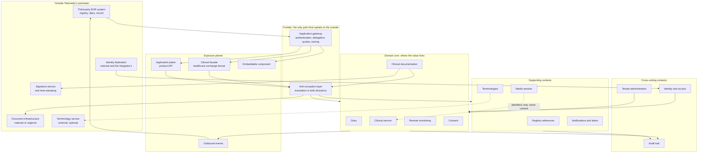
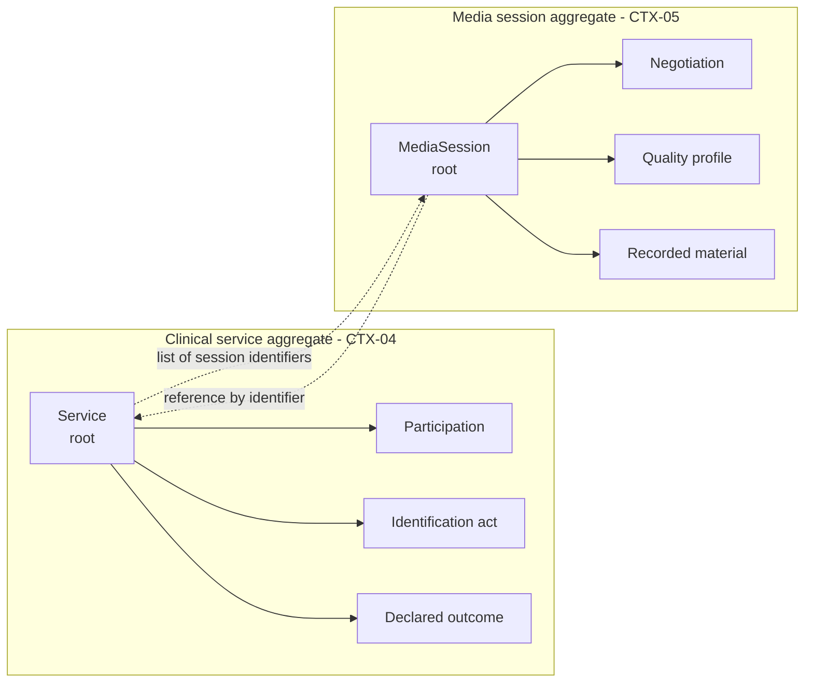
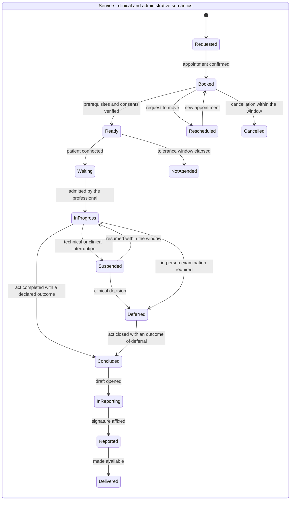
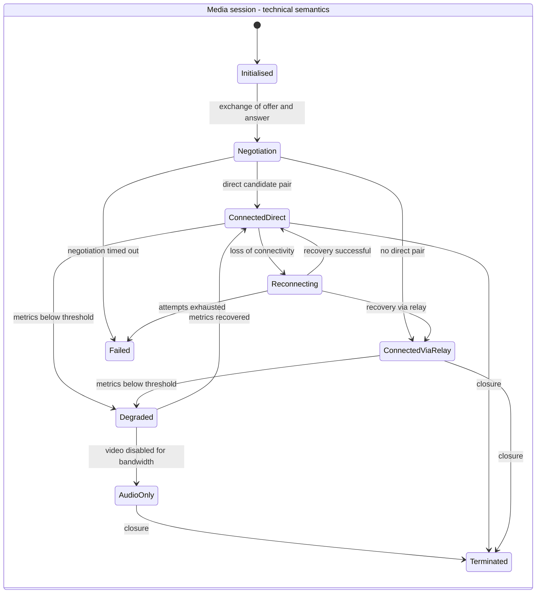
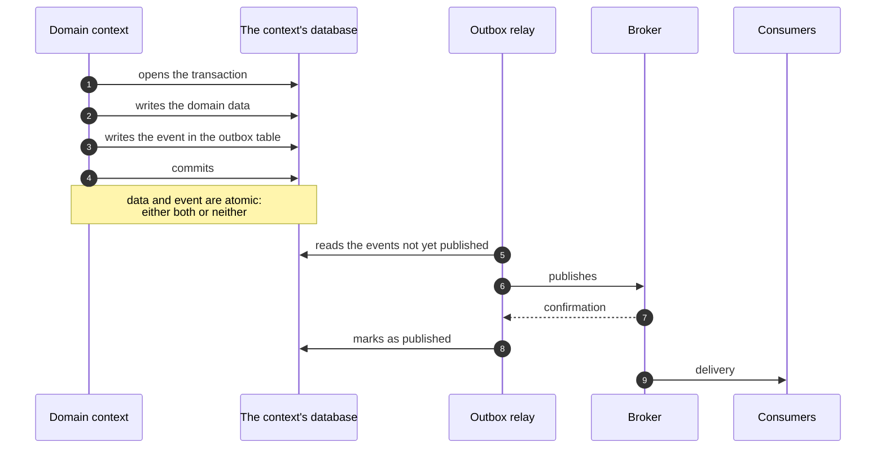
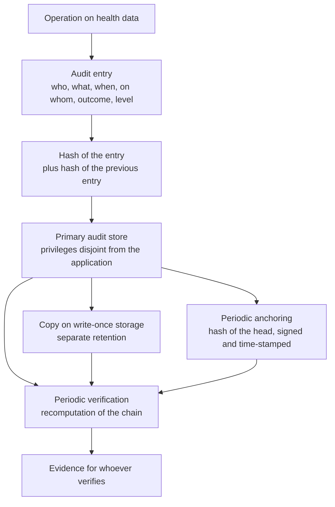
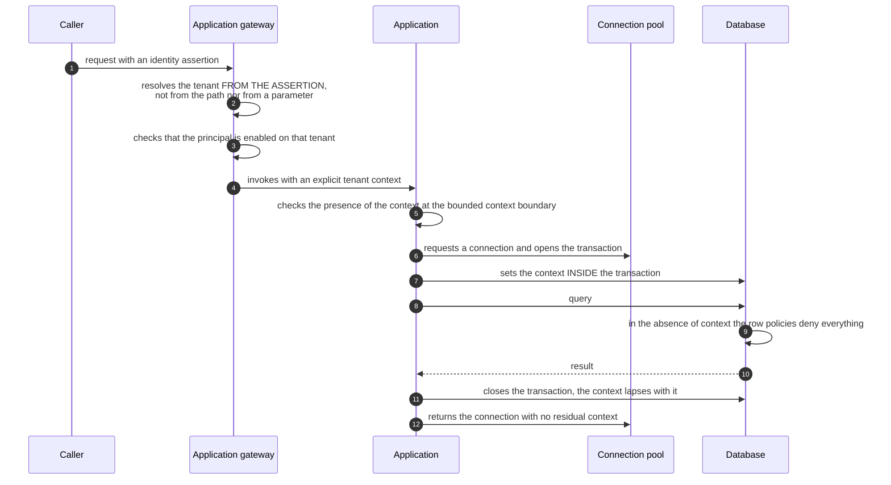

# The architecture of the project

This module serves one purpose only: to give you **the shape of the system in your head** before
you open a code file or a specification document. It does not teach you to design architectures -
that is the subject of [module 11](11-fondamenti-informatici.md) - and it does not replace the
project's architecture area, which lives in
[`docs/02_architecture/`](/02_architecture/00-indice.md) and is ten times more detailed than
what you will read here.

It does one thing that area does not: **it reconstructs the reasoning**. The architecture area
states a decision, argues it against the alternatives and declares its price, but it assumes you
already know why that question arose. Here we start from before the question.

> **No real data appears in this module.** All the examples are synthetic and the personal names,
> where they are needed, are fictitious. No third-party company, commercial product or trade mark
> is named: we always say «the integrator», «a cloud healthcare practice management system», «a
> third-party EHR system», «a document infrastructure».

---

## 0. How to read this module

### 0.1 What it presupposes

This module **does not repeat** the modules that precede it, and some of them are real
prerequisites, not recommendations.

| It presupposes | Where it is | What you need from it here |
|---|---|---|
| Distributed systems, consistency, transactions, sagas | [11 - Computing fundamentals](11-fondamenti-informatici.md) | Knowing what «failure is partial» means and why there is no transaction spanning two systems |
| Aggregate, invariant, bounded context, ubiquitous language | [11 §7](11-fondamenti-informatici.md#7-domain-driven-design) | The vocabulary. Here we explain **which ones** exist in Telemedic, not what they are in general |
| Dual write, outbox, idempotency, delivery | [11 §5](11-fondamenti-informatici.md#5-dual-write-and-the-transactional-outbox) and [11 §6](11-fondamenti-informatici.md#6-delivery-and-idempotency) | The mechanism. Here we explain **why the project adopted it** and what it costs |
| Cryptographic hashes, signatures, hash chains | [12 §5](12-crittografia-e-sicurezza.md#5-hash-functions) | Why a hash chain makes tampering detectable |
| Every protocol the system speaks | [13 - The protocols, one by one](13-protocolli.md) | Here the protocols are not explained: we say **where** they sit in the architecture |
| What health data is and why it has a regime of its own | [03 - Clinical data](03-il-dato-clinico.md) | Half of this system's architectural choices derive from there |
| What a remote consultation is and how it differs from a specialist-to-specialist consultation | [02 - Telemedicine services](02-prestazioni-di-telemedicina.md) | The domain the architecture has to carry |
| Why this software has constraints that do not exist elsewhere | [15 - The regulatory framework from scratch](15-regolatorio-da-zero.md) | The regulatory forces in §2 |

If you have not read module 11, **read it before this one**. This is not a courtesy
recommendation: from §6 onwards this module uses «outbox», «idempotent», «aggregate» and
«eventual consistency» as known terms, and without them the sections become a list of
inexplicable choices.

### 0.2 What you will not find here

| Not here | It is in |
|---|---|
| The list of functional requirements | `docs/03_functional/` |
| The specification of the signalling protocol and the message formats | `docs/04_protocols/` |
| The threat model, the cryptographic measures, the relay configuration | `docs/06_security/` |
| The contracts towards third-party systems, the SDK, the embeddable component | `docs/07_integration/` |
| Library choices, build modules, coding conventions | `docs/01_technical/` |
| The technical file, risk management, usability engineering | `docs/08_compliance/` |
| The dates | `docs/09_roadmap/` |

And above all: **there is no detail here**. Every section of this module has a corresponding
chapter in the architecture area that develops it to the end, and the cross-reference is always
explicit. If you are about to write code, this module is not enough for you.

### 0.3 The reading pact

Every choice described here is presented in three movements, always in the same order:

1. **The problem**, formulated before you know how it is solved.
2. **The choice**, with the alternatives that were discarded.
3. **The price**, that is, what was accepted as the cost.

The third movement is not a concession to honesty: it is how you tell whether a choice has been
understood. An architecture described without what it costs has not been understood, it has been
memorised - and whoever memorised it will work around it at the first occasion on which the cost
shows up.

---

## 1. What Telemedic is, in one sentence

Before talking about shape, we need to know what the shape has to carry.

> **Telemedic is a telemedicine component intended to live inside somebody else's information
> system.**

It is not a portal. It is not a clinical record system. It is not the user's point of entry. It is
not the holder of the patient registry. It is the missing piece for a healthcare practice
management system, a public organisation or a regional infrastructure when the service has to be
delivered remotely - and it has to fit in **without asking anyone to change what they already
have**.

That sentence, and not the technology stack, is what determines the architecture. It is worth
pausing on how unusual it is. Most systems that handle health data are designed to be **the**
system: they own the registry, they own the identity, they own the user's journey, and whoever
integrates adapts. Telemedic is designed to be the **guest**. From this inversion follow three
consequences that no subsequent choice can contradict, and which it is useful to fix straight away
because they recur in every section of this module.

**First: the system does not own identity.** The person in front of the screen has already been
authenticated elsewhere - by the integrator's identity provider, or by the national digital
identity federation. Telemedic receives an assertion («this is Dr Rossi, of this organisation,
authenticated at this level») and turns it into an internal authorisation context. It does not
issue primary credentials for the citizen and does not impose a second sign-in. The identity
problem, here, is a problem of **trusted propagation** and of **representing delegation**, not of
user management. Anyone coming from a product with its own sign-in screen finds this the most
disorienting difference.

**Second: the system does not own the registry data.** The patient, the professional and the
appointment already exist in the source system, with their own identifiers. Telemedic works **by
reference**: it keeps what is needed to recognise and to contact, not what is needed to treat, and
it does not build an index that reconciles identities coming from different systems. From this
follows a rule you will find everywhere in the data model: **no external identifier is a primary
key**, and the same natural person present in two different organisations is, by construction, two
distinct and unlinked entities.

**Third: the clinical content has to go back.** The report drafted during the service cannot stay
confined inside Telemedic: it has to flow into the record of the source system and, where provided
for and permitted, into the national or regional document infrastructure. The return is therefore
not an infrastructural detail to be hidden in an adapter: it is a **domain process with an
observable outcome**, which can fail, which has to be retried, and whose definitive failure must
end up in front of a human being.

To these three a fourth is added, of a different and heavier nature: the system handles **data
concerning health** and operates in a context in which **demonstrability** counts as much as
function.

- It is not enough for an access to be lawful: it must be demonstrable years later, in front of
  somebody who does not trust the operator's word.
- It is not enough for a document to be correct: it must be unmodifiable once signed, and any
  correction of it must leave a trace of the superseded version.
- It is not enough for two customers' data to be separated: the separation must hold against
  **programming error**, not only against the programmer's intention.

Keep them in mind. Whenever a choice in this module seems disproportionate to the problem, the
reason almost always lies in one of these four.

---

## 2. The shape of the system, and the forces that gave it that shape

### 2.1 Why we do not start from the architectural style

There is a widespread and wrong way of describing an architecture: you announce the style - «it is
microservices», «it is hexagonal», «it is event-driven» - and deduce everything else from there.
It is wrong because the style is an **effect**, not a cause. A style chosen before knowing the
forces at play produces a system with the right shape for somebody else's problems.

Telemedic's architecture area starts from the opposite end: it lists **seven forces**, declares
the order in which they are resolved when they conflict, and derives the shape from there. Those
seven forces are summarised in
[`01 - Architectural vision`](/02_architecture/01-visione-architetturale.md); here they are
explained one by one to somebody who has never met them, because it is the part of the system that
is most often skipped and most often needed.

### 2.2 First force - Demonstrability comes before everything

**The problem.** Imagine that in three years' time a person asks the care provider organisation
treating them: «who has read my report?». Or that a supervisory authority asks for a demonstration
that a particular access corresponded to a legitimate purpose. Or that a professional denies ever
having opened a record. In all three cases the answer is a line in a log, and in all three cases
the real question is not «what does the log say» but **«why should I believe the log»**.

The difference between the two questions is enormous and is systematically underestimated. A log
that is believed on the operator's word is useless at the moment when it is really needed, which is
precisely the moment when somebody suspects the operator.

**The misconception to be rid of.** Almost all systems handling health data solve the problem with
**automatic entity versioning**: the persistence layer keeps, alongside every table, a twin table
that preserves the history of changes. It is convenient, it costs almost nothing and it seems to
answer the requirement.

It does not. History tables **are tables like any other**: whoever has write access to the database
modifies them exactly as they modify the others. Versioning **versions, it does not make immutable**.
It is the industry's most widespread misconception and in this project attenuating it in any
document is forbidden.

**What follows.** A **chain of cryptographic hashes** is needed, and **retention separate from the
system that generates the events**. This is not configuration: it is a component, and by the
admission of the very decision that imposes it, it is the largest effort in the whole security
catalogue. The mechanism is explained in §7 of this module and developed in
[`07 - Audit trail and immutable log`](/02_architecture/07-tracciamento-e-registro-immutabile.md).

**Why it is the first force.** Because it is **retroactive**. A badly built audit trail cannot be
repaired after the fact: events already written do not acquire demonstrable integrity retroactively.
You can fix a wrong user interface; you cannot make demonstrable accesses that took place in a
period in which the mechanism did not exist.

**The price.** Writing the audit trail sits on the **critical path** of every operation on clinical
data: its latency adds to that of the operation, and if the audit trail is not writable the clinical
operation fails. It is a severe and deliberate choice, and §7.5 explains why the alternative is
worse.

### 2.3 Second force - The boundary between vehicle and interpretation

**The problem.** [Module 15](15-regolatorio-da-zero.md) explains that the qualification of software
as a medical device, and its risk class, depend on the **declared intended purpose** and on whether
the software merely transmits information or **interprets** it. A system that records what a doctor
writes is one thing; a system that itself produces clinical information is another, with a
conformity pathway that is orders of magnitude heavier.

This boundary is the second force, and its characteristic is that **it is not a communications
posture: it is a structural property that must be readable in the code**. It is not defended by
writing «the system does not interpret» in a document: it is defended by making interpretation
impossible.

**What follows, with no room for discretion.**

- **No clinical threshold is hard-coded.** There is no numeric value written by a programmer that
  decides when a measurement is abnormal. Thresholds are configuration **per patient**, always
  attributed to an identified professional, with a temporal validity. It is the project's
  constraint **V-02**.
- **No field of a clinical document is populated by text produced by the system.** No automatic
  summary, no conclusion, no inferred diagnostic code. The system structures and preserves what the
  professional writes.
- **Remote monitoring produces alerts from configuration, never judgements**, and every alert is
  subject to human review with no automatic effect on the care pathway.
- **Channel quality metrics are not clinical observations.** The transmission delay of a packet is
  not health data and does not go into anybody's record.

**The limiting case that explains everything.** It would be extremely useful, for the user
experience, if the system proposed «reasonable» default thresholds when a professional configures a
monitoring plan: it would save time and reduce typing errors. It was **rejected**. The moment the
system proposes a clinical value, it has stopped recording a professional decision and has started
producing a judgement of its own. The threshold field, in the product, starts **empty and
mandatory**, and is not pre-filled even with the value from the same patient's previous plan.

**The price.** Real friction in use, acknowledged and accepted. A professional who configures ten
similar plans configures them ten times. The project compensates by showing **attributed
reference values, read-only, with an explicit copy action** - which is a different thing from
pre-filling, because the decision remains an act.

### 2.4 Third force - Total integrability

**The problem.** If the system is a guest, every one of its capabilities must be reachable by the
host. An integrator that already has its own interface will not use ours; an integrator that has to
automate a flow cannot do it by clicking.

**The rule.** **No capability of the system is reachable only from the user interface.** It is the
project's constraint **V3**.

**What follows, and it is not obvious.** The consequence is not «expose everything in REST». It is
that the **application layer cannot contain domain logic**. If it contained a rule - say, «a
document cannot be signed if the consent is not in force» - that rule would exist in the user
interface path and would have to be rewritten in the API path. Two implementations of the same rule
always diverge, and the divergence is discovered when somebody uses the less-tested path.

The domain model is therefore **the only place where the invariants live**, and every exposure
plane is a thin adapter above it.

**The price.** Every new capability costs double: the function and its public contract. The project
has formalised this with an operational rule: *the area that introduces a capability also introduces
the contract; it is not work that can be postponed*.

### 2.5 Fourth force - Sovereignty and substitutability

**The problem.** The project declares that clinical data does not transit through services
established outside the European Union, and supports three placement profiles: European Union,
Italian territory, qualified cloud. So far it sounds like a commercial positioning argument.

**Why it no longer is.** Italian network security legislation obliges the entity that installs the
system to **declare its relevant suppliers by name to an authority**, with company name, tax code
(codice fiscale) and **country of the registered office**. Sovereignty therefore stops being an
argument and becomes **a fact the customer has to communicate to an authority**, and which the
project has to put the customer in a position to produce.

**What follows.** A single rule, and it applies everywhere: **every external dependency sits behind
a project interface and has a declared fallback**. It holds for the terminology service, for the
signature service, for notification delivery, for the event broker. And the corollary, which is the
sharp part: **where the fallback does not exist, the path is not a primary one**.

**The case that illustrates the principle better than any other.** The terminology service - the
component that resolves and validates clinical codes - could be hosted outside the Union. The
solution adopted is not to place it elsewhere: it is **not to carry the data**. Queries to that
service carry no patient identifiers, carry no clinical context and cannot be correlated to a
person. **The sovereignty of this dependency is satisfied by the absence of data, not by
placement.** It is a way of reasoning worth internalising, because it applies far more often than
it seems.

**The price.** Every abstraction interface is extra code, and every fallback is a second behaviour
to test. A system that directly calls what it needs is shorter.

### 2.6 Fifth force - Isolation between autonomous controllers

**The problem.** The project exists in two arrangements: a multi-organisation **managed service**
and an **installation at the customer's premises**, with the same code. In the managed service the
hosted organisations are not divisions of the same company: they are **legally autonomous data
controllers**.

**Why the distinction changes everything.** In an ordinary multi-customer product, a data leak
between customers is a defect: unpleasant, fixable, embarrassing. Here it is a **communication of
data concerning health between distinct legal entities**, that is, an event with consequences of
its own for the party that suffers it, for the party that receives it and for the party that runs
the infrastructure.

The level of assurance required is therefore not «absence of known defects»: it is **structural
separation**, which holds even against programming error. The difference between the two is the
content of §8.

**A property of the domain that makes everything more severe.** In this system **there is no
category of neutral data**. The fact that a person has an appointment with a particular specialty
is already data concerning health: it reveals that they are being treated, and for what. There is
therefore no subset of «administrative» tables to be isolated with less rigour.

### 2.7 Sixth force - Real time does not tolerate the long path

**The problem.** A clinical video call has a latency budget measured in tens of milliseconds. The
message exchange that establishes the connection - the **signalling**, explained in
[module 08](08-webrtc-da-zero.md) - has in addition a requirement that the system's other messages
do not have: the network candidates must arrive **exactly once and in the order in which they were
emitted**, otherwise negotiation fails intermittently and undiagnosably.

**What follows.** A clean boundary: **the real-time plane and the plane of persistent facts are
separate**, they have different mechanisms, and what originates in one enters the other **only as a
fact that has already happened**. Negotiation traffic stays where it is; «the session has been
started» crosses the boundary.

**The price.** The system has **two communication mechanisms** instead of one: the general
event-based one and the real-time one, with a state machine of its own and its own load
distribution strategy. It is a second system to understand and to test, and it is declared as such
instead of being hidden under a unifying abstraction that would not hold.

### 2.8 Seventh force - Accessibility and real use as functional requirements

**The problem.** The typical patient in a remote consultation is an elderly person, on a
smartphone, on a mobile network, often without assistance. The typical professional is under time
pressure. An interface designed for a competent user on a good connection is not «optimisable
later»: it is **unusable by the reference population**.

In this project accessibility is not a polish: it is an **acceptance criterion for every screen**,
and - by virtue of medical device law - it is also a risk control measure, because a use error is a
design defect and not the user's fault.

**The architectural impact, which is less obvious than it seems.** It concerns three points, and
none of the three is a stylesheet problem:

1. **Comprehensible degradation is domain behaviour.** «Audio before video, always», resuming the
   session, the declared fallback: these are modelled state transitions, not opportunistic
   optimisations of the transport layer.
2. **The embeddable component inherits the constraints.** An integrator that embeds Telemedic in
   its own interface **must not be able to degrade its accessibility**: the theme properties are a
   closed, versioned set, validated with contrast checking, and a configuration that degrades
   accessibility **is rejected on save**. Some elements cannot be themed or hidden in any case: the
   recording-in-progress indicator, the consent texts, the outcome of key verification, clinical
   error messages, the encryption status indicator.
3. **Internationalisation is structural.** In particular, the project's interface strings are
   separated **by construction** from the official labels of the clinical terminologies - and the
   reason, surprisingly, is not one of tidiness but of licensing: §9.4 explains it.

### 2.9 The order among the forces

The seven forces conflict, and an architecture that does not declare how the conflicts are resolved
resolves them case by case, that is, inconsistently. The order adopted is the one in which you have
just read them: **demonstrability precedes the regulatory boundary, which precedes integrability,
which precedes sovereignty, and so on**.

A concrete example of what that means: writing the access audit trail is blocking and adds latency
to every clinical operation. If the order were reversed, and responsiveness preceded
demonstrability, the choice would have been to write the audit trail asynchronously and to accept a
small window of untraced accesses. It would have been faster. And the window of untraced accesses
would have coincided, statistically, with the moments of highest load - that is, with the
incidents, that is, with the only moment when the audit trail is needed.

### 2.10 The resulting shape

Four readings of this drawing deserve to be made explicit, because they are four properties of the
system and not four graphical details.

**The core does not speak to the outside.** Every translation to and from a third-party format
happens in the **anti-corruption layer** at the frontier - the technical name for «the code that
translates between two languages at the boundary, so that neither contaminates the other». It is
the condition that makes two things possible at once: supporting several integrators simultaneously
without having partner-specific logic inside the domain, and surviving a version change of an
external standard without touching the invariants.

**The media session does not touch clinical content.** The link between the media session context
and the clinical service context passes through **identifiers and state events only**. It is the
structural translation of the boundary between vehicle and interpretation, and at the same time the
condition that makes the media session replaceable with another transport technology without
touching the clinical domain.

**The audit trail receives from everyone and feeds nobody.** No application path reads from the
audit trail in order to take a decision. The audit trail is **a destination, not a source**: this is
precisely the property that allows it to be retained separately and to be made append-only without
compromise. If an application path had to read it, separate retention would become a runtime
dependency and privilege separation would become impossible.

**The terminology service is dashed.** It is the only external dependency in the drawing that the
system must be able to **lose while remaining fully operational**. This is not a kindness towards
whoever installs it: it is the project's constraint **V-03**, and §9.4 explains why it matters so
much.

### 2.11 What this shape costs

An architecture of this kind is not free, and its three main cost items are:

| Cost | What it consists of |
|---|---|
| **One more translation layer** | Nothing that arrives from outside enters the domain in its original form. Every external format has a mapper, with its own tests. Anyone who wants to «just save the resource as it is» finds this the most annoying rule in the project |
| **Eventual consistency between contexts** | Operations that cross several contexts are realised with events and compensations, not with distributed transactions. There are windows in which two contexts have a different view of the same fact: for example, the service has concluded and the source system does not know it yet |
| **Two exposure planes** | The clinical plane and the application plane expose the same domain with two different grammars: two contracts to maintain, two sets of tests, the risk of semantic divergence |

None of the three is hidden. The second in particular has to be understood properly: **immediate
consistency exists inside an aggregate, not between contexts**. Aggregate boundaries are chosen so
that every clinically relevant invariant is internal to a single aggregate - and every window of
divergence has a declared duration and a reconciliation mechanism visible to an operator.

---

## 3. What a bounded context is, explained from scratch

### 3.1 The problem, before the solution

Imagine having to model «the patient» in a healthcare system. It seems easy: a person, a name, a
date of birth, an identifier. You start writing.

Then the diary module arrives and asks you to add contact preferences and the channels on which the
person accepts reminders. Then billing arrives and asks for the exemption, the co-payment regime,
the billing address. Then clinical documentation arrives and asks for the list of active problems,
the allergies, the current therapies. Then authorisation arrives and asks who can access the person,
with which delegations, with which suppressions. Then integration arrives and asks to keep the
identifiers each external system uses for the same person.

Six months later you have a `Patient` entity with eighty fields, of which **every consumer uses ten
and ignores seventy**. Every change to that entity touches all the modules. Every load brings it
into memory in full. Every discussion about «what does this field mean» has different answers
depending on who is asking. And above all: the *exemption by pathology* field - which looked
administrative to you - **reveals the pathology**, is special category data to all intents and
purposes, and lives in the same entity that the diary module loads in order to send an SMS
reminder.

This is the predictable outcome of the **single model**, and it is the most expensive mistake you
can make in this domain. It is not expensive because it is ugly: it is expensive because **it
cannot be fixed with a local change**. Once the single entity exists, every module has built on top
of it, and separating it requires touching everything at once.

The point to start from is this:

> **«Patient» is not one concept. It is at least five different concepts sharing a name.**
>
> For the diary it is an **appointment holder**: you need to know how to contact them and which
> channels they accept. For authorisation it is a **data subject**: you need to know who can see
> them and who has delegated on their behalf. For clinical documentation it is the **subject of the
> act**: you need their history. For activity accounting it is a **patient with a coverage**: you
> need the regime. For integration it is **a collection of other people's identifiers**.
>
> Forcing these five to be the same object means building an object that serves none of the five
> well.

### 3.2 The definition

A **bounded context** is an explicit boundary inside which **a term has a single meaning** and a
model is coherent.

Three properties define it, and it is worth stating them in the negative because that is how you
recognise when a boundary has been violated:

1. **Inside the boundary the language is unambiguous.** If inside the same context the word
   «session» means two things depending on the class, the boundary is in the wrong place.
2. **The model is private.** No other context reads this one's tables, no other context knows the
   internal shape of its types. What comes out is a **contract**.
3. **Translation happens at the boundary, explicitly.** When two contexts have to talk to each other
   and their languages diverge - and that is the normal case, because divergence is the **reason**
   for the boundary - the translation is dedicated, tested code, placed in the context that needs
   it.

The practical consequence is that in the system there are **several models of the patient**, one
per context, each with only the attributes that context needs, linked to each other by an
identifier. This is not duplication: it is **specialisation**. Duplication would be having two
copies of the same model; here we have **different** models of the same real subject.

> The general theory - what an aggregate is, what a ubiquitous language is, what the relationship
> patterns between contexts are - is in
> [module 11 §7](11-fondamenti-informatici.md#7-domain-driven-design). This module says which
> contexts exist in Telemedic and why they fall where they do.

### 3.3 Why in this domain the boundaries are not optional

In many systems bounded contexts are a good practice: they help, but a well-kept single model could
hold. Here that is not the case, and the reason has three names.

**The fracture of language.** In this domain the key words change meaning as they cross the system,
and not subtly:

| Word | Meaning A | Meaning B | Meaning C |
|---|---|---|---|
| **Session** | The clinical act (for the professional) | The audio-video connection (for the infrastructure) | The accountable unit (for administration) |
| **Consent** | Acceptance of the clinical act | The basis for processing the data | Authorisation to record |
| **Service** | The request | The delivery | The charge |
| **Recording** | The audiovisual capture | The act of recording a fact in the system | - |
| **Available** | Published | Bookable from a given channel | Not yet taken |
| **Outcome** | Where the encounter is (state) | What happened (outcome) | - |

Each of these ambiguities has already produced defects in real systems. The most insidious is the
last: **state and outcome are not the same thing**, and two different outcomes can share the
terminal state while having **opposite** administrative effects - the patient's non-attendance and
the technical failure attributable to them both end up in «terminated» and are accounted for
differently. Collapsing them into a single field is forbidden by the project.

**The fracture of rhythm.** The parts of the system change for different reasons and at different
frequencies:

- clinical documentation changes when **health legislation** changes;
- media transport changes when **network protocols and browser engines** change;
- identity federation changes when **national technical rules** change;
- remote monitoring changes when **clinical practice** changes.

Components that change together must stay together; components that change for different reasons
must be releasable separately. Putting them in the same context means that an update to media
transport forces a re-verification of clinical documentation - that is, in a regulatory pathway,
redoing tests there was no reason to redo.

**The fracture of protection regime.** This is the fracture that anyone coming from a non-healthcare
domain does not expect. Clinical content, consent evidence, audiovisual recordings and the access
audit trail have access, retention and deletion regimes that are **mutually incompatible**:

- the access audit trail **is not deleted** and is not modified, by definition;
- clinical content **is deleted** where the legal preconditions are met;
- the audiovisual recording has an expiry of its own, configured by the controller;
- consent evidence outlives the data it refers to, because it serves to demonstrate that the data
  was processed lawfully.

Keeping them in the same context would force the strictest regime to be applied to all - making the
system unusable, because nothing could ever be deleted - or the most permissive, making it
unlawful. There is no middle way: **it is a fracture, not a compromise**.

### 3.4 What a bounded context is not

Three recurring confusions, all three present in the project as explicit warnings.

**It is not a microservice.** The bounded context is a boundary **of model and of language**; the
choice of whether to distribute the contexts into separate processes is a deployment matter and
belongs to another decision. Telemedic explicitly supports **a single-process arrangement** for the
installation at the customer's premises and **a distributed arrangement** for the managed service,
with the same code. This is only possible because the boundaries are of model and not of network. If
the boundaries were defined by network calls, the two arrangements would be two products.

**It is not a separate data store.** The rule is that no context reads another's data. Whether the
schemas sit in the same database instance or in different instances is an operational choice,
provided that the separation of access is **enforced by privileges** and not entrusted to the
discipline of whoever writes the queries.

**It is not an organisation of the code by layer.** On the contrary: the organisation of the modules
follows the contexts, not the component types. The classes serving the clinical service live
together, not split between a package of controllers, one of services and one of entities. It is a
code structure choice, but it follows directly from here.

### 3.5 How the relationships between contexts are stated

When two contexts have to talk to each other, the **direction of the dependency** and the degree of
negotiability are not the same in every case. The vocabulary the project uses is the standard one of
domain-driven design, and you will need it to read the map in §4.

| Relationship | What it means | Example in Telemedic |
|---|---|---|
| **Conformist** | One context conforms to the other's model without being able to negotiate it | Identity and access towards the national federation: the assertion schema is imposed from outside |
| **Customer-supplier** | The customer needs the supplier; the supplier does not know the customer and can evolve | The clinical service consumes the appointment from the diary |
| **Partnership** | The two evolve together and every change is agreed. It is the **most expensive** relationship | Clinical service and consent: the second conditions the existence of the first |
| **Anti-corruption layer** | A translation layer that prevents the external model from penetrating | Outbound interoperability towards all the domain contexts |
| **Published language** | A versioned, stable contract, designed to be consumed by many | The events that all contexts publish to the audit trail |
| **Open host service** | A single stable contract offered to many consumers, hiding the diversity of the sources | The terminology gateway towards the clinical contexts |

Two notes that are binding in the project.

**Partnership is declared rarely, and for a reason.** A service consumed in a customer-supplier
relationship can be skipped when it is slow or unavailable; a partnership cannot. Consent is in
partnership with the clinical service because it is a **condition of existence of the act**: if
verifying it is not possible, the act does not take place. **No path that is «degraded without
consent verification» is permitted**, under any circumstances.

**The published language towards the audit trail has an evidential need, not one of convenience.**
Audit events must be readable **years later**, by whoever verifies, with tools that do not exist
today. It is the only context in which backward compatibility is an evidential obligation.

### 3.6 The price of the boundaries

Boundaries cost, and the cost is concrete:

| Cost | In practice |
|---|---|
| **No joins between contexts** | There is no query that joins the appointments table and the services table. The link is by identifier, resolved through the interface of the owning context |
| **Explicit translation at every boundary** | Mapping code, with its own tests, for every crossing |
| **Eventual consistency** | Two contexts can have, for a declared interval, different views of the same fact |
| **Several models of the same subject** | Whoever reads the code for the first time finds three representations of the patient and has to understand why |
| **Permanent discipline** | Boundaries **erode through the accumulation of reasonable exceptions**. The dangerous moment is not the design: it is when somebody proposes adding «just one field» |

The last row is the reason why the table in §4 has a column that looks odd - **«what is none of its
business»** - and why the project automatically verifies that no context accesses another's tables.
A boundary rule entrusted to goodwill has an average life of a few months.

---

## 4. The thirteen contexts

### 4.1 The map

Telemedic's contexts are **thirteen**, fixed by the project's architectural baseline and developed
one by one in [`02 - Bounded contexts`](/02_architecture/02-contesti-delimitati.md). They divide
into four families, and the family tells you how much care each deserves.

```mermaid
flowchart TB
    subgraph NUCLEO["Domain core - where the distinctive value lives"]
        C03["CTX-03 Diary"]
        C04["CTX-04 Clinical service"]
        C06["CTX-06 Clinical documentation"]
        C07["CTX-07 Remote monitoring"]
        C09["CTX-09 Consent"]
    end

    subgraph SUPPORTO["Supporting - necessary, not distinctive"]
        C02["CTX-02 Registry references"]
        C05["CTX-05 Media session"]
        C08["CTX-08 Notifications and alerts"]
        C10["CTX-10 Terminologies"]
    end

    subgraph TRASV["Cross-cutting - they serve everyone"]
        C01["CTX-01 Identity and access"]
        C12["CTX-12 Audit trail"]
        C13["CTX-13 Tenant administration"]
    end

    subgraph FRONT["Frontier - the only one that speaks to the outside"]
        C11["CTX-11 Outbound interoperability"]
    end

    EXT1["Third-party EHR system"]
    EXT2["Document infrastructure"]
    EXT3["Identity federation"]
    EXT4["Signature and time-stamping"]
    EXT5["Terminology service, optional"]

    C01 -->|"conformist: the access decision is not negotiated"| C04
    C13 -->|"published language: configuration is a contract"| C04
    C02 -->|"customer-supplier: registry references"| C04
    C03 -->|"customer-supplier: the service consumes the appointment"| C04
    C09 -->|"partnership: blocking check before the act"| C04
    C09 -->|"partnership: consent to recording"| C05
    C09 -->|"partnership: suppression and visibility"| C06
    C04 -->|"partnership: the service contains the document"| C06
    C04 -->|"customer-supplier: commands the session, identifiers only"| C05
    C07 -->|"customer-supplier: an out-of-threshold measurement raises the alert"| C08
    C06 -->|"customer-supplier: making available"| C08
    C10 -->|"open host service"| C06
    C10 -->|"open host service"| C07
    C04 -->|"published language: domain events"| C12
    C06 -->|"published language"| C12
    C09 -->|"published language"| C12
    C01 -->|"published language"| C12
    C11 -->|"anti-corruption layer towards the core"| C04
    C11 -->|"anti-corruption layer"| C06
    C11 -->|"anti-corruption layer"| C02
    EXT1 -->|"conformist: the source system is the master"| C11
    C11 -->|"open host service: one contract for all"| EXT1
    C11 -->|"conformist: imposed document profiles"| EXT2
    EXT3 -->|"conformist: imposed identity schema"| C01
    EXT4 -->|"conformist: imposed signature format"| C06
    EXT5 -.->|"conformist, optional, can be disabled"| C10
```

Two observations on the map, before the details.

**The core is what the project invests most in.** Diary, clinical service, documentation, remote
monitoring and consent are the contexts in which the distinctive value lives and in which the
modelling has to be done with care that is **disproportionate to the size of the code**. The reason
is economic: an error in a supporting context costs a rewrite; an error in the core costs **a
migration of clinical data**, which is an operation requiring the data controller's approval, proof
of equivalence on synthetic data and a safety window.

**There is only one frontier context, and that is no accident.** If every context could talk to the
outside, integrator-specific logic would spread through the domain, and a version change of an
external standard would become a diffuse modification. With a single point of contact, supporting
the tenth integrator costs as much as supporting the second.

### 4.2 The table, with the column that counts

| Code | Context | What it holds | What it decides | **What is none of its business** |
|---|---|---|---|---|
| **CTX-01** | Identity and access | Internal identities, roles, delegations, levels of assurance | Whether a subject may perform an operation on a resource | The patient's clinical registry data; the legal bases for processing |
| **CTX-02** | Registry references | References to patients, professionals, organisations, sites, professional capacities | Nothing authorisation-related: it supplies references | **Who may do what**; the reconciliation of identities across systems; clinical data |
| **CTX-03** | Diary | Availability, appointments, waiting lists, reminders | Whether a slot is bookable from a channel | **What happens during the service**; clinical outcomes |
| **CTX-04** | Clinical service | The life cycle of the clinical act delivered remotely | Who is admitted, when the act starts and ends, with what outcome | **Audio-video transport**; drafting the document; computing clinical priorities |
| **CTX-05** | Media session | Connection state, negotiation, quality, recorded material | Whether the connection is established, degraded, terminated | **The clinical meaning** of what happens; whether the quality is sufficient for the act |
| **CTX-06** | Clinical documentation | Drafts, versions, signatures, corrective reissues, confidentiality | Whether a document can be signed, seen, corrected | **Sending to external infrastructures**; who may read; **the content** |
| **CTX-07** | Remote monitoring | Plans, measurements, adherence, alerts, measurement expectations | Whether a measurement crosses a **configured** threshold | **The clinical decision**; inferring thresholds; delivering the alert |
| **CTX-08** | Notifications and alerts | Contact details, preferences, escalation chains, acceptances | On which channel and to whom to deliver, and when to escalate | **Defining the thresholds**; who the clinical recipient is (it receives that from configuration) |
| **CTX-09** | Consent | Versioned notices, declarations of will, withdrawals, suppressions | Whether a declaration is in force and covers a particular act | **The controller's legal bases**; who accesses (it supplies only the negative component) |
| **CTX-10** | Terminologies | Enablement policies, validation outcomes | Whether a code is valid within a value set | **The content of the terminologies**; interface translations |
| **CTX-11** | Outbound interoperability | Trust configurations, deliveries, reconciliations | How and when to retry, when to disable a destination | **The canonical model**; any clinical or administrative decision |
| **CTX-12** | Audit trail | The append-only log, the anchors, verification outcomes | Nothing: it records | **Application logic.** It is never read in order to take a decision |
| **CTX-13** | Tenant administration | Tenant life cycle, configuration, quotas, themes | What is enabled and within what limits | **Clinical data**; the value of the clinical thresholds (it can set only their limits) |

The column «what is none of its business» is the one you will need most. It is written in the
negative because that is the form in which it is used: when somebody proposes adding a
responsibility to a context, the question is not «does it fit?», but **«this row says it does
not»**.

### 4.3 The thirteen, one by one

What follows is the minimum needed to find your bearings. The detail - invariants, own language,
relationships - is in [`02 - Bounded contexts`](/02_architecture/02-contesti-delimitati.md), and
anyone about to work on a context must read the corresponding entry in full.

**CTX-01 · Identity and access.** It turns an identity assertion coming from outside into an
internal authorisation context. In its language the word «user» **is deliberately avoided**, because
it conceals three different things: the person, their professional **capacity** (the
person-organisation pair with a temporal validity) and the **application principal** acting on their
behalf. Access is granted only if **four conjoint conditions** hold - the permission belongs to the
roles, an enabling relationship exists, no negative declaration covers the resource, the tenant
matches - and the default is denial. *It is none of its business* to know who the patient is
clinically: it knows that a subject exists, not what that subject has.

**CTX-02 · Registry references.** It holds **references**, not registries. That word is the key one:
it keeps what is needed to recognise and to contact, not what is needed to treat. *It is none of its
business*, in particular, to build an index reconciling the same person coming from two different
systems: that would be the obvious answer to the problem «the same patient arrives from two practice
management systems», and it would make Telemedic the holder of the registry, in direct contradiction
with the sentence in §1. And *it is none of its business* to keep the exemption by pathology, which
looks administrative and **reveals the pathology**.

**CTX-03 · Diary.** A core context, not a supporting one, because the admissibility of remote
delivery is decided **here**, before the act exists. It holds a distinction that always slips by:
the availability **slot** is not the **appointment**; a taken slot is the *projection* of an
appointment onto the diary. And an invariant that looks minor and is not: the rescheduling chain
preserves **the date of the original request**, because without it waiting times cannot be
reconstructed and rescheduling becomes a way of resetting them. *It is none of its business* to know
what happens during the service. And the reminder it sends **contains no clinical data**: date,
time, organisation, link - never the specialty, which is itself data concerning health.

**CTX-04 · Clinical service.** The central context, and it is **documentary**: what happens in it
stays. It holds two distinctions the rest of the system must respect. The first is between
**identification** and **authentication**: the credential certifies who holds the credential, not
who is in front of the camera. They are two distinct pieces of evidence, at two distinct moments,
with two distinct records. The second is between **state** and **outcome**. It also holds the
system's most important invariant - *the state of the encounter does not depend on the state of the
media session* - which is the subject of §5. *It is none of its business* to carry audio and video,
and it knows nothing of network candidates or negotiated ciphers. And it does not draft the
document: it opens the reporting window and observes its state.

**CTX-05 · Media session.** Here «session» means **connection**, not act. It holds the negotiation,
the measured quality, the recorded material and the outcome of the **short key verification** - the
code the two parties compare aloud at the start, which is at once what makes end-to-end encryption
*demonstrable* and a traceable risk control. *It is none of its business* to attribute clinical
meaning to what happens, and in particular **it does not decide whether the quality is sufficient
for the act**: it measures, compares against configured thresholds, informs the professional, who
decides. It is a distinction to hold firmly, because the opposite shortcut - «if the quality drops
below X, close the service» - moves the system beyond the regulatory boundary of §2.3.

**CTX-06 · Clinical documentation.** The context in which the boundary between recording and
interpretation is most delicate. It holds three distinctions: an **unsigned draft is not a report**
(it is not visible to the patient, it is not transmissible); a **corrective reissue is not a
modification**, it is the issuing of a subsequent version that replaces the previous one while
preserving the chain; the **signature** has levels, and different levels have different legal
effects. The cardinal invariant is that **a signed document is immutable**. *It is none of its
business* to send anything outside: transmission to the source system and to the document
infrastructures belongs to the frontier context. And *it is none of its business* to produce
content: no field of the document is populated by automatically generated text.

**CTX-07 · Remote monitoring.** The context written entirely around the wording «**deferred
collection of parameters for the professional's periodic review**». The wording is not a matter of
style: «real-time monitoring» or «continuous surveillance» would move the product into a higher risk
class, and no artefact of the project - documentation, interface, class name, event name - may use
them. It holds **versioned** plans, **immutable** measurements with their own production context,
adherence, and an entity that surprises anyone meeting it for the first time: the **measurement
expectation**. Silence is not the absence of a row: it is **a row that declares the absence**, with
the expected window, the instant of expiry and the cause where known. Without it, «not received» and
«never expected» would be indistinguishable and adherence would not be a defined quantity. *It is
none of its business* to decide clinically, to infer thresholds from historical series, to compute
prognoses or to check interactions between therapies.

**CTX-08 · Notifications and alerts.** It distinguishes the **notification** (informative) from the
**alert** (requiring acceptance within a window). It holds the **escalation** chain and the
**acceptance**, which is the act by which a human being declares having received and taken on the
alert. Three invariants to remember: **no clinical content on unauthenticated channels** (the
message on an open channel says that there is something to see, never what); essential
communications remain **always available in the authenticated area**, because the channel is an
accelerator and not the home of the message; **failure of escalation is declared**, never absorbed.
*It is none of its business* to define the thresholds that raise the alerts: it receives them.

**CTX-09 · Consent.** In the model **there is no «consent to the platform»**. There are **five
distinct objects**, with independent life cycles: acceptance of the clinical act, processing of the
data where consent is the applicable basis, recording of the session, presence of third parties in
the session, transmission to external systems. **Withdrawing one does not touch the others**:
aggregating them would make the withdrawal of one a withdrawal of all, which is both incorrect and
harmful to care. Consent is **a fact with a temporal validity**, never a boolean on an entity, and
it always refers to an **immutable version** of the notice: without versioning of the notice,
consent cannot be demonstrated. It also holds **data suppression** (oscuramento), with a property
that has to be stated because it is counter-intuitive: *suppression is also suppression of the
suppression*. The existence of the suppressed document must not be inferable, and the channels from
which it can be inferred are six - numbering, counts, pagination, notifications, differences between
successive queries, error messages - and they must **all** be closed, at a single point.

**CTX-10 · Terminologies.** The **single** point of resolution and validation of clinical codes: no
other context queries a terminology source directly. It holds the enablement policy **per code
system**, not globally. Three properties that look technical and are matters of licensing or
sovereignty: **no cache persisted to disk** for the systems whose licence does not allow derivative
works; **no patient identifier** leaves the perimeter towards an external service; the system is
**fully functional** with the paid-licence systems disabled. *It is none of its business* to own the
content of the terminologies, and *it is none of its business* to translate: the project's interface
strings are a separate store (§9.4).

**CTX-11 · Outbound interoperability.** The only context in which the names of the external
standards appear. It translates in both directions, delivers, reconciles what did not get through.
It holds the **trust model** towards each integrator, which is **per tenant** and **single**:
permitted issuer, public key address, permitted algorithms, expected audience, claim mapping,
permitted origins, permitted destinations. The reason for singleness is clear-cut: separate
registers diverge, and **divergence always favours the attacker**. Three invariants: no external
format structure enters the domain contexts; every outbound message is identified and idempotent;
**the definitive failure of a delivery is not silent** - it enters a reconciliation queue visible to
an operator, with an action available. *It is none of its business* to define the canonical model:
it receives it.

**CTX-12 · Audit trail.** It records who did what, when, on which subject, with what outcome and
with what level of assurance. It is the only context **with no mutating behaviour**: the audit entry
has no methods that modify it. Three invariants to know straight away: it is **append-only** for
every role, without exception; **failure of the write makes the application operation fail**;
**reading the audit trail is itself recorded** - whoever looks at who has looked leaves a trace, and
it is the property that makes the system's most privileged role supervisable. *It is none of its
business* to contain application logic, and it is **never** read by an application path in order to
take a decision.

**CTX-13 · Tenant administration.** It holds the tenant life cycle, the versioned configuration, the
quotas, the rate limits and the appearance customisations. In its language there is a distinction not
to be lost: **tenant** does not coincide with **organisation**, nor with **providing
organisation**, nor with **integrator** - four concepts that coincide in the simple cases and diverge
in the real ones. The central invariant is that **no configuration can remove a domain invariant**,
create a new permission or enable a combination of profession and act that the domain forbids. *It
is none of its business* to access clinical data: the tenant administrator role does not confer
access to clinical content merely by virtue of administering, and every self-assignment of a
clinical role raises a high-severity audit event.

### 4.4 The fourteenth context that is not there

There is one point at which the project's architecture declares that it **has not decided**, and it
is instructive because it shows how the project behaves when a question exceeds its own mandate.

When a service concludes, an **accountable fact** comes into being: something has been delivered,
and it has to be communicated to whoever settles it. The domain fact is verified: a service
delivered remotely is accounted for with **the code of the corresponding in-person service**, with a
channel attribute qualifying the modality. There is not - and there must not be - a separate
«remote consultation» service code. Confusing the axis «what was delivered» with the axis «how it
was delivered» makes a telemedicine system **impossible to account for**, and correcting it after
the fact requires recoding the entire history.

There is also a strict constraint: the **payer's** integration profile is **administrative by
construction** - service identifier, administrative outcome, amount - and it may not in any way
constitute a route towards clinical content, not even mediated by a professional.

The open question is **where** that event is formed. There are three options:

| Option | Consequence |
|---|---|
| A dedicated fourteenth context | The constraint on the payer becomes **a boundary**, automatically verifiable. Cost: one more context to govern |
| Responsibility distributed between the clinical service and the frontier | No new context, but the administrative event is formed inside the clinical context and the constraint becomes **a coding convention** |
| Everything in the frontier | Consistent with «everything that goes out passes through the frontier», but it loads the translation layer with a domain responsibility that does not belong to it |

The architecture area **proposes the first and does not adopt it of its own motion**, because
changing the list of contexts exceeds an area's mandate. Until the decision is taken, responsibility
remains distributed **with the explicit warning** that in that placement the constraint is a
convention and not a boundary, and must be checked with a dedicated test.

This is the correct way of leaving a question open: by declaring the provisional state, its price,
and who decides. §11 returns to the subject.

---

## 5. Why the clinical service and the media session are never merged

This section is longer than the others in proportion to its technical complexity, and the reason is
that it describes **a decision that will be challenged**. Not «might be»: it will. Every person who
joins the project meets it, finds it needlessly complicated, and proposes in good faith to simplify
it. It is the project's constraint **V-01**, and no area may violate it.

A decision that is imposed and not understood gets worked around at the first opportunity. So here
it is reconstructed from the beginning.

### 5.1 The temptation, which is legitimate

From the point of view of whoever uses the system there is **one single event**: the doctor and the
patient connect, they see each other, they talk, the visit ends. Modelling two objects for one
thing looks like gratuitous complexity, and whoever proposes it is not being careless: they are
applying the right principle, which is to model reality as the users see it.

The simplest code is the one in which the service entity also carries the connection fields -
connection state, type of network path, instant the stream started - and in which the end of the
connection closes the service. In the happy case the two entities have the same duration, the same
participants, the same logical identifier.

> **The unified model works perfectly as long as the network works perfectly.**

This is the sentence on which everything turns. In a telemedicine system the case in which the
network does not work **is not an exception**: it is a substantial part of the volume - the patient
is on a mobile network, at home, with a modest device - and it is the case on which the system is
judged.

### 5.2 The six consequences of merging

Each of these is a real defect, not an academic hypothesis.

**First - the phantom service.** A network drop and a reconnection produce two connections. If the
connection **is** the service, the system records two clinical acts where there was one. The count
of services delivered - which feeds activity accounting - becomes the count of successful
connections, which is a different quantity and serves a different purpose. The irreparable part is
this: no subsequent adjustment recovers the information, because **the system never knew that the
two connections were the same act**. The information was not lost: it never existed.

**Second - the non-existent clinical act.** The technical check preceding the appointment - «test
microphone and camera before the visit», which is a required and sensible function - is a connection
**without** a clinical act. With the unified model you have two routes: create a fictitious service,
which ends up in the counts and potentially in a person's record; or introduce a special branch that
creates a connection without a service - that is, admit that the two things are separate, but
**doing so covertly**, in a special case, without the model saying so.

**Third - the delivered service that appears not delivered.** The video fails, the professional
carries on and concludes by voice, declares the outcome, writes the report. It is **a delivered
service**, with a clinical outcome and a report, in which the video connection failed. With the
unified model the act appears failed, and the failure enters activity accounting and the service
quality indicators.

**Fourth - the service with several legitimate sessions.** There are acts in which the connections
are more than one **by design, not through failure**: an interpreter joining halfway through,
resuming after an agreed break, a handover between two professionals. The unified model represents
them as distinct acts, or forces the later ones to be hidden.

**Fifth - contamination of the retention regime.** The connection produces technical metadata with a
**short** retention regime; the service is health documentation with a **long** one. Merging them
gives you two outcomes, both wrong: keeping the technical metadata for as long as health
documentation - building an archive of healthcare traffic data that nobody asked for and that
somebody will have to protect for years - or deleting the documentation together with the metadata.

**Sixth - coupling of release rhythms.** Real-time transport changes when browser engines and
network protocols change, that is, often. The documentation of the act changes when health
legislation changes, that is, rarely. In the unified model **every update to one touches the
other**, and in a regulatory pathway «touching» means re-verifying.

### 5.3 The decision

**The clinical service and the media session are two distinct aggregates, roots of two distinct
bounded contexts, linked only by identifier.** A middle way was also evaluated - two types inside
the same aggregate - and it was discarded because immediate consistency between the two is
**exactly what is not wanted**: putting them inside the same transactional boundary means that every
connection state change (dozens, in one service) is a write on the aggregate of the act, with
contention, and with the permanent risk that somebody links the two states «because they are right
there anyway».

The link **is not a foreign key** at database level: the two aggregates live in different contexts,
and the boundary-crossing rule forbids it. It is a reference resolved through the interface of the
owning context.

### 5.4 The operational rule, which is the substance of the decision

> **No fact of the media session produces a state change of the clinical act.**
> The session may **inform**, never **decide**. The reverse direction is one of **command**: the act
> requests the opening of the session, requests its closure, authorises or revokes recording.

| Fact in the media session | Effect on the service |
|---|---|
| Stream established between the participants | **No state change.** The professional admits and the act begins by decision, not by connection |
| Loss of connectivity | **No effect.** The event is noted in the act's technical log |
| Successful reconnection | No effect. One more session identifier in the list |
| Degradation beyond the configured threshold | **No state change.** The professional is informed and decides on the fallback or the deferral |
| Definitive failure of the session | **No automatic state change.** The service stays open and the professional declares the outcome - which may be the voice-only fallback, the deferral, or technical failure |
| Orderly termination | No effect: closing the act is an act of the professional |

**No row of this table produces an automatic state change.** If you are writing code and find
yourself making a row of this table change the state of the service, you have run into V-01: stop
and ask.

### 5.5 The two state machines

The quickest way to convince yourself that they are two different things is to look at them side by
side. They have **different cardinality** (one service, zero to many sessions), **different
duration**, **different granularity** and **different rhythm**: the second changes state dozens of
times in one service, the first a handful of times over hours or days.

Two clarifications that the project imposes and that it is useful to know straight away.

**The machine shown is the one for the remote consultation.** Every **type** of service is its own
state machine, selected by the type. Permitted actors, whether the patient must be present,
asynchrony, mandatory artefacts, permitted outcomes, recordability and windows are **attributes of
the service catalogue**, not conditions scattered through the code. Adding a service is a catalogue
row plus a state machine, **never** a change to the domain.

**State and outcome are distinct attributes.** The state says where the encounter is, the outcome
says what happened. The patient's non-attendance and the technical failure attributable to them
share the terminal state and have opposite administrative effects. Collapsing them is forbidden.

### 5.6 How to recognise an attempt to merge them

A violation of V-01 almost never presents itself in the form «let us merge the two entities». It
presents itself in these forms, all apparently innocuous:

- «Let us add a *connected* field to the service, so the interface knows whether to show the
  button.»
- «When the session definitively fails, let us automatically close the service: the doctor has gone
  anyway.»
- «Let us make a view that joins the two tables, it is only for the dashboard.»
- «Let us count the services delivered as the number of sessions terminated successfully.»
- «Let us put the connection duration in the report: it is useful information.»

The first two are direct violations. The third is a violation of the boundary rule (no joins between
contexts). The fourth is **the phantom service** coming back in through the reporting door. The
fifth brings a technical metadatum inside a health document with long retention, that is, the fifth
consequence in §5.2.

The project verifies the first three automatically: no foreign key between the tables of the two
contexts, no path in which an event of the media session triggers a state transition of the act, and
a test proving that after a drop and a reconnection there is **exactly one** service.

### 5.7 The price of the separation

It has to be stated in full, because it is real.

| Cost | In practice |
|---|---|
| **The model does not match the naive perception** | It has to be explained to every new contributor - which is why this section exists |
| **Two identifiers to correlate** | Resolution goes through the interface of the owning context, not through a join |
| **Explicit synchronisation to be designed** | The table in §5.4 is code, not documentation |
| **Windows in which the connection has terminated and the act is still open** | It is **correct**, but it requires the interface to represent it in a way the professional can understand, otherwise it looks like a defect |
| **No invariant may involve both in one transaction** | This too is correct: no clinical invariant **needs** to involve both |

The complete reasoning, with the three alternatives and their trade-offs, is in
[ADR-0001](../adr/0001-separazione-prestazione-sessione-media.md).

---

## 6. How the parts communicate

The boundaries of §3 and §4 have a side effect: **if no context reads another's data, the contexts
have to talk to each other**. This section says how.

### 6.1 Two ways only

| Way | When it is used | Properties |
|---|---|---|
| **Synchronous context interface** | When the caller needs an answer in order to proceed: resolving a registry reference, checking a consent, validating a code | The caller waits; failure of the callee is a failure of the caller |
| **Event** | When a fact has happened and other contexts may want to know | The producer does not know the consumers and **does not depend on their outcome**: if a consumer fails, the fact happened all the same |

There is no third way. In particular **there is no table shared between two contexts**, not even for
convenience, not even for a dashboard.

A domain event, here, is **a fact that has already happened, immutable, named in the past tense**.
`ServiceConcluded`, not `ConcludeService`: an event named in the imperative is a command in disguise
and produces coupling between producer and consumer. Events fall into two categories with very
different regimes, and **the distinction must be explicit in the code**, not entrusted to memory:

- **internal events**, seen only by Telemedic's contexts, may change between two versions with
  internal discipline alone;
- **published events**, seen also by the integrators, are a **public contract**: changing them is a
  breaking change subject to an announced deprecation process.

An internal event promoted to a published event out of convenience becomes a permanent constraint
without anyone having decided it.

### 6.2 The problem underneath: the dual write

Take a concrete fact. A professional signs a report. This single act has at least six consequences
in different contexts: the document becomes immutable, the patient must be notified, the source
system must be fed, the document infrastructure must be fed where provided for and permitted, the
accountable fact must be issued, the audit trail must be written.

None of these consequences can be given up. None may make the signature fail. None may block the
professional while waiting.

The instinctive solution is: I save the document, then I publish an event. These are **two writes to
two different systems**, and the theory of this problem is in
[module 11 §5](11-fondamenti-informatici.md#5-dual-write-and-the-transactional-outbox). Here it
is enough to know that it produces two symmetrical defects, both real:

**The lost event.** The transaction commits, the process terminates before publication. The document
is signed, but the source system will never know it, the patient does not receive the notification,
the accountable fact is not issued. **And nobody notices**, because there is nothing that signals
the absence of an event that never existed. In a domain in which silence is never normality, this is
particularly serious.

**The phantom event.** The reverse order - publishing before committing - produces the opposite case:
the event is delivered, the transaction fails. A third-party system receives notification of a signed
document **that does not exist**. It is the worse of the two, because it produces wrong data in
somebody else's clinical record.

### 6.3 The transactional outbox

> **The transactional outbox on a relational database is the only source of outbound events.** No
> application path writes directly to the broker.

The mechanism eliminates both defects **by construction**, not by vigilance: the event is written
**in the same transaction as the data**, so it exists exactly when the data exists, and publication
can be retried indefinitely because the source is persisted.

Three details that look minor and are not.

**The outbox table lives in the schema of the context that produces the event**, not in a common
schema. The reason is atomicity: data and event must be in the same transaction, therefore in the
same database. With the one-schema-per-organisation model (§8), it follows that **the outbox is per
organisation**: the relay iterates explicitly, an organisation with many events does not lengthen the
queue of the others, and the offboarding of an organisation takes its outbox with it.

**The relay reads by periodic polling**, not by capturing changes from the store's replication log.
The second technique has lower latency, and **it was discarded for a reason of scope, not of
performance**: it would introduce a third-party component to be inventoried, updated and monitored
for the entire life of the product, and it would require replication privileges in an installation at
a customer's premises that is not an IT service provider. It remains a declared option for
high-volume arrangements, and **the event contract does not change between the two modes** - which is
precisely the property that makes it possible to change one's mind without touching the consumers.

**Not everything goes through the outbox.** What does not go through it: synchronous queries between
contexts (which are not events); operational metrics; entries in the immutable audit trail, which
have a path of their own with **stronger** guarantees; and real-time session signalling, which is the
subject of §6.7.

**The envelope is standard, not invented.** The format in which the event travels - common attributes
such as identifier, source, type, instant, plus the data - is that of an industry specification,
described in [module 13 §6.2](13-protocolli.md#62-cloudevents), with some mandatory project
extensions: **the organisation identifier, without exception**, a per-aggregate sequence number and a
correlation identifier linking the events originating from the same action. Two details have
practical consequences: **the version lives in the type name**, not in a separate attribute - so a
consumer can subscribe to the version it knows how to handle and ignore the others, whereas with the
version in an attribute it would receive everything anyway; and for the duration of the deprecation
notice **both versions are emitted**, which entails that the producer must be able to reconstruct the
old shape from the new state. If that is not possible, the change is not a new version of the event:
it is **a new event, with a new name**.

### 6.4 At-least-once delivery, and why it entails idempotency

This is the part that generates the most misunderstanding, and it is worth being explicit about what
the system promises and what it does not.

| Guarantee | Status |
|---|---|
| A produced event is delivered | **Yes**, with retries until the policy is exhausted |
| Delivered **at least once** | **Yes** |
| Delivered **exactly once** | **No** |
| **Global** ordering between events | **No.** No functional requirement may depend on it |
| Ordering between events with the same partition key | **Yes**, within the partition |
| Data and event are atomic | **Yes**, by construction of the outbox |

**Why «exactly once» is not promised.** Imagine the relay publishing an event and then crashing
**before** it has marked the row as published. On restart, the row is still to be published, and the
event goes out a second time. The only way of avoiding it would be to make publication to the broker
and the update of the row atomic - that is, a transaction spanning two systems, which is precisely
what does not exist. The same holds, multiplied, when the recipient is a third party's system: no
guarantee crosses that boundary.

One could pretend otherwise. That would be the worst choice, because it would produce **integrators
that do not deduplicate** - and the duplicate would arrive anyway, one day, under load.

**What follows, and it is an obligation.** **Every consumer is idempotent, without exception.** This
is not a recommendation: it is an acceptance condition, verified with a test that delivers the same
event twice and checks that the resulting state is identical. Three forms, in order of preference:

| Form | When | Note |
|---|---|---|
| **Naturally idempotent operation** | «Set the state to concluded» | Preferable: it needs no auxiliary store |
| **Persisted deduplication key** | When the operation has cumulative effects | It must be kept **longer than the maximum retry window**, otherwise a late retry finds the key expired and duplicates |
| **State check before the effect** | When the effect is external and cannot be retracted | «Has the message for this event already been delivered?» before delivering |

**Two effects in this system cannot be retracted** and must be protected with the third form: the
**delivery of a message to a person** and the **deposit of a document in an external document
infrastructure**. A message sent twice to a patient is not an invisible technical defect: it is an
experience that generates doubt about health content - «do I have two reports?», «did they send me
the wrong one?» - and in this domain doubt has a cost.

**On ordering.** A conclusion event **can arrive before** the start event. It is an inevitable
consequence of retries and concurrent delivery, and it is **documented in the public contract**, not
hidden. Ordering is reconstructed with two complementary mechanisms: the partition key is **the
aggregate identifier** (the service, the document, the plan) and not the tenant - partitioning by
tenant seems natural, produces severely unbalanced partitions and does not give the guarantee that is
needed; and every event carries a **per-aggregate sequence number**, so that a consumer that has
already applied number `n` discards whatever arrives with a lower number. It is this second mechanism
that makes the order of arrival **irrelevant** without forcing the use of ordered queues, which are
expensive and fragile - in an ordered queue a blocked event blocks all those behind it.

### 6.5 Why events do not carry clinical content

An event notifying the signature of a report can carry the report with it, or carry only the
information that it exists. It looks like an optimisation - one call fewer - and it is instead **a
decision about the authorisation model**.

> **The data is lean.** The event carries identifiers, references and the few attributes needed to
> decide whether it is of interest. **It does not carry clinical content** towards third-party
> systems. Whoever receives it and needs the content **reads it back with an authenticated call,
> under their own authorisation.**

The three reasons, in order of importance.

**First - authorisation is evaluated at the moment of reading, not of production.** If the content
travels in the envelope, it was authorised when the event was produced. If, between production and
reading, the patient **withdraws a consent** or **suppresses a document**, the envelope already
delivered does not know it and cannot know it. Reading back, by contrast, moves the decision to the
moment of access, with the attributes in force **then**: a subsequent withdrawal is respected. In a
system in which withdrawal takes immediate effect on what is under way, this is the decisive reason.

**Second - the exposure surface.** An envelope with clinical content passes through queues,
diagnostic logs, monitoring systems, retry stores and **the dead-letter queue**, which is
inspectable by an administrator. Every transit is a copy of health data in a place with a different
protection regime, often more permissive, almost always uninventoried.

**Third - the stability of the contract.** A lean envelope changes less often, because it does not
follow the evolution of the shape of the content.

**The price, which is real.** The recipient must be able to call back, and therefore must have
credentials and authorisations of its own: it is one more integration requirement, and **for a small
integrator it is genuine friction**. In the event of temporary unavailability at the moment of
reading back, responsibility for the retry shifts partly onto them. The complete reasoning is in
[ADR-0011](../adr/0011-eventi-magri-senza-contenuto-clinico.md).

For **internal** events between contexts the rule is more permissive but not absent: what is carried
is what the consumer needs in order to decide, **not the whole aggregate**. An event that carries the
producer's entire state couples the consumer to its internal shape, which is precisely what the
boundaries were supposed to avoid.

### 6.6 What happens when delivery fails

Three mechanisms, in cascade, and all three have a common property worth isolating: **no failure is
silent**.

1. **Retries with exponential backoff and jitter.** The jitter is not ornamental: without it, a few
   minutes' unavailability of a recipient produces, on reactivation, a **synchronised burst** of all
   the accumulated events - that is, an involuntary denial-of-service attack against one's own
   integrator. The base, ceiling and number of attempts are **parameters declared in the public
   contract**, not constants in the code: the integrator must be able to know for how long the
   system will keep retrying, because the sizing of their own maintenance window depends on it.
2. **Circuit breaker.** After a declared number of consecutive failures the destination moves into a
   degraded state and the administrator is notified; after a declared duration of total failure it is
   disabled. **Circuit breakers and quotas are per organisation and per destination, never global**:
   it is the isolation of §8 applied to capacity, and it is the reason why an unavailable integrator
   does not degrade the service of the others.
3. **Dead-letter queue**, per organisation, with four mandatory properties: declared retention;
   **inspectable** through the API, because whoever suffered the failure must be able to see what was
   not delivered without opening a support request; **replayable reusing the same event identifier**,
   so that the recipient's deduplication continues to work; **visible to a human being**.

On the last point the project is categorical. If the failure concerns clinical content that should
have reached the source system, it enters a **reconciliation queue staffed by an operator**, with an
action available - not a diagnostic log. And monitoring the depth of that queue is an operational
requirement with a declared threshold, because *a dead-letter queue that nobody looks at is worse
than no queue at all*: it produces the belief that the problem is being handled.

### 6.7 The boundary with real time

> **Media session signalling does not pass through the outbox or the broker.**

There are two reasons, both decisive.

**Latency.** The outbox adds the latency of the relay's polling interval plus that of the broker. The
session negotiation path has a budget of **measured** fractions of a second: adding the long path
means missing the requirement by construction.

**Ordering and delivery.** The exchange of network candidates requires delivery **exactly once and in
the same order** in which they were emitted - it is a requirement of the protocol specification, not
a preference; [module 13 §7](13-protocolli.md#7-real-time---summary-entry) lists the stack that
produces it and [module 08](08-webrtc-da-zero.md) explains why those candidates exist. A generic
publish channel does not guarantee that property, and a duplicated or out-of-order candidate produces
negotiation failures that are **intermittent, load-dependent and undiagnosable**: the worst category
of defect.

The boundary therefore separates **traffic** from **facts**:

| Crosses the boundary (enters the event plane) | Does not cross (stays in the session context) |
|---|---|
| «The session has been started» | Negotiation offers and answers |
| «The session has terminated, with this technical outcome» | The network candidates |
| «Quality has dropped below the configured threshold» | The measurement samples, which go into the time-series store |
| «The operating mode has changed» | The instantaneous state of the connection |
| «Recording has started» or «has ended» | The audio and video streams, in any form |

**The price**, declared: since signalling does not pass through a shared channel, the state machine
of a session must live **in a single process**, determined deterministically from the session
identifier. It is an architectural constraint, not a detail: load distribution on this path is by
session identifier and not random, and the loss of a node **terminates the sessions it was hosting**,
which are re-established through a renegotiation. The system therefore has two communication
mechanisms to understand and to test instead of one, and this was preferred to a single mechanism
that would have missed the requirement.

The full detail is in
[`06 - Events and internal integration`](/02_architecture/06-eventi-e-integrazione-interna.md); the
corresponding decisions are [ADR-0008](../adr/0008-outbox-transazionale-unica-sorgente.md),
[ADR-0009](../adr/0009-relay-outbox-per-interrogazione-periodica.md),
[ADR-0010](../adr/0010-buste-cloudevents-consegna-e-idempotenza.md),
[ADR-0011](../adr/0011-eventi-magri-senza-contenuto-clinico.md) and
[ADR-0012](../adr/0012-segnalamento-fuori-dal-piano-degli-eventi.md).

---

## 7. The immutable audit trail

### 7.1 Two words that are not synonyms

The requirement is stated in one line: every access to health data is traced in a way that is
**non-repudiable and non-alterable**. The two words seem to say the same thing and say very
different things.

**Non-repudiable** means that whoever performed the operation cannot maintain that they did not
perform it. It requires the identity to have been established **at the moment of the operation**, to
be recorded together with the **level of assurance** at which it was established, and for the record
to be capable of being relied on as evidence.

**Non-alterable** means that nobody - **including whoever administers the system** - can modify or
delete an entry without the alteration being detectable.

The second is the difficult one, and the difficulty has a precise name: **the threat model includes
the operator**. We are not protecting the audit trail from an external attacker. We are protecting it
from whoever holds the keys.

### 7.2 Why entity versioning is not enough

Almost all healthcare systems answer this requirement with **automatic entity versioning**: a
persistence library keeps, alongside every table, a twin table with the history of changes. It costs
little, it is switched on with an annotation, and it looks sufficient.

It is not, and the reason lies in one sentence:

> **History tables are tables like any other.**

Whoever has write access to the database modifies those too. Versioning **versions, it does not make
immutable**. In the declared threat model - which includes the administrator - it covers nothing.

A concrete example to fix the point. Suppose an operator improperly accesses the report of a
well-known person. With entity versioning alone, the operator who has administrative privileges on
the application store deletes the corresponding history row. No check detects it, because there is
nothing that states how many rows there **ought** to have been. The audit trail comes back positive,
and its positivity means nothing.

In the project this distinction **must not be attenuated in any document**: it is constraint
**V-04**. Entity versioning remains useful - for reconstructing past application state - and is not,
and is never presented as, the access audit trail.

### 7.3 Four layers, not four alternatives

The question «which technique do you use to make a log immutable?» has four possible answers, and
**the right answer is that they are not alternatives**: they cover different threats, and none of
them alone covers the declared model.

| Technique | Covers | **Does not cover** |
|---|---|---|
| **Application-level hash chain** | Modification or deletion of an entry, reordering, retroactive insertion | Rewriting of the **entire** chain by whoever controls the application |
| **Write-once object storage** | Modification and deletion within the retention period enforced by the store | The failure to write an entry that was never produced |
| **Separate retention with disjoint privileges** | Rewriting of the entire chain by the administrator of the application store | **Collusion** between the administrators of the two systems |
| **Periodic signed and time-stamped anchoring** | Collusion, for everything preceding the last anchor | The entries between the last anchor and the moment of the attack |

Choosing a single technique means accepting the corresponding right-hand column. With the
application chain alone, whoever controls the application **rewrites everything and the check comes
back positive**: the guarantee is reduced to trust in the operator, which is exactly what the
requirement excludes.

**The project adopts all four layers.**

**How the chain works.** Every entry carries the cryptographic hash of its own content **and** the
hash of the previous entry in the sequence. Modifying any entry invalidates all the subsequent
hashes: you cannot alter one entry without rewriting the whole tail. The theory of hash functions is
in [module 12 §5](12-crittografia-e-sicurezza.md#5-hash-functions).

**The chain is per organisation, not global.** A global chain would create a dependency between
organisations - verifying the integrity of one would require the entries of another - which
contradicts the isolation of §8 and would make it impossible to hand a controller the evidence of
**their own** accesses **without exposing the existence of the others**.

**What the anchoring is for.** At regular intervals, the hash of the head of the chain is signed,
time-stamped and retained separately. From that moment on, rewriting history means **contradicting an
attestation already issued and dated**. The strongest measure at almost no cost is to hand the
attestation to the data controller together with the periodic report: from that moment **a copy of
the hash is in the hands of a party the operator does not control**.

**The residual window is declared, not hidden.** The entries between two consecutive anchors remain
vulnerable, and only on the hypothesis of collusion between whoever administers the application and
whoever administers the retention. The width of that window is the parameter with which the balance
between cost and guarantee is tuned. The complete reasoning is in
[ADR-0013](../adr/0013-registro-immutabile-a-quattro-strati.md).

### 7.4 What is recorded, and what is never recorded

**What an entry contains**: who (the subject **and** the application principal that acted on their
behalf), what, when, on which subject, on which resource, with what outcome, with what level of
assurance and its provenance, for what purpose, from where, and always the organisation.

Two lines in that list deserve attention because they are the ones almost always missing.

- **The outcome includes denial.** A denied access is recorded, and it is **the most interesting
  information for whoever verifies**: it says that somebody tried.
- **The purpose** - care, emergency override, operations, administration, audit - is the attribute
  that makes an access decision **explainable after the fact**. Without it, you know that the access
  happened and you do not know why it was legitimate.

**What is recorded**: every **single read** of clinical data; every write, modification, deletion;
every denied access; successful and failed authentications; role assignments and revocations; the
invocation of emergency override access and its review; consents, withdrawals and suppressions;
signatures, corrective reissues and withdrawals of documents; the start, stop, playback and deletion
of recorded material; every export; restores and decommissionings; **and the reading of the audit
trail itself**.

That last line deserves emphasis: **whoever looks at who has looked leaves a trace**. It is the
property that makes the system's most privileged role supervisable.

**What is never recorded.** The audit trail **contains no clinical content**. Three reasons, and the
third is the one that closes the discussion:

1. **An audit trail with clinical content is a second clinical record**, with a different and more
   permissive access regime, and with a longer retention than the original data.
2. **Content would make it undeliverable** to whoever verifies: a reviewer must be able to receive
   the evidence of accesses **without receiving health data**.
3. **The right to erasure would become insoluble.** The audit trail is by definition unalterable;
   clinical content is by definition erasable where the preconditions are met. The two properties
   **cannot coexist in the same store**.

The list of what does not appear is **closed and automatically verified**, not entrusted to common
sense. It also includes one unexpected element: **the patient's external identifier**, the one with
which the integrator identifies them in their own system, does not appear - the opaque internal
identifier is recorded instead. The reason is that the audit trail is deliverable to parties other
than the controller, and the external identifier is **a key into another store**.

### 7.5 The write is blocking

> **Failure to write an audit entry makes the application operation fail.**

This is not a robustness choice: it is the operational translation of the requirement. If the
operation succeeded without a trace, there would exist an access to health data that cannot be
demonstrated - which is exactly what the audit trail exists to prevent.

The consequences have to be accepted knowingly, and there are three.

**The audit trail is on the critical path.** Its latency adds to that of every operation on clinical
data, and the latency budget of the operations includes it explicitly.

**Unavailability of the audit trail is unavailability of the system** for operations on clinical
data. It is severe. The alternative - proceeding without a trace and reconciling afterwards - would
produce a window of accesses that cannot be demonstrated, and **the window would coincide with the
incident**, that is, with the moment when demonstrability is needed most.

**The copy on write-once storage is by contrast asynchronous**, with monitored lag. It is the write
to the primary store that is blocking, not the replica: blocking the replica too would put the
availability of the clinical system **below** that of the retention system, which is the wrong
relationship.

### 7.6 What the audit trail is not

| It is not | Why |
|---|---|
| **The application diagnostic log** | They are two stores with different purposes, contents, access regimes and retention. In Italian the terminological clash is real and has to be managed: *registro degli accessi* (the access audit trail) for the one, *registro di diagnostica* (the diagnostic log) for the other |
| **Entity versioning** | It reconstructs past application state; it is not immutable and cannot be relied on as evidence |
| **A source for application decisions** | No path reads from the audit trail in order to decide. It is a destination, not a source: it is **this** property that allows it to be retained separately |
| **A search store** | Queries are for a defined scope and are themselves recorded. It is not an exploratory tool |
| **A substitute for legally compliant document retention** | The audit trail attests accesses, it does not retain documents. They are two distinct obligations |

### 7.7 Two consequences that surprise people

**The chain is not repaired.** If a verification detects a break, the chain is not «fixed»: a **new
generation** is opened, anchored to the previous one, and the break is itself recorded. Repairing
would mean rewriting, which is the operation the audit trail must make impossible.

**After a restore, the audit trail and the application state diverge.** If an organisation asks for
its data to be brought back to an earlier instant, the audit trail **does not go back**: an access
that happened stays happened. It follows that the audit trail contains entries relating to operations
that, in the application state, no longer appear. **This is correct**, and it has to be explained to
whoever verifies: the divergence is documented by the audit entry of the restore itself.

### 7.8 The price, in summary

| Cost | In practice |
|---|---|
| **One more component** | It is not configuration. It is the largest burden in the project's security catalogue |
| **Latency on every clinical operation** | The audit trail sits on the critical path |
| **The system stops if the audit trail cannot write** | Deliberate, and safer than the alternative |
| **In an installation at the customer's premises, privilege separation cannot be enforced** | The project makes it the default, **detects and reports** the configuration in which the two stores share credentials, and declares that in that case the guarantee is reduced to that of the application chain alone |

The last row is an example of architectural honesty worth noting: the project **supplies the
mechanism, it cannot impose the separation of roles in an organisation it does not control**. What it
can do is make it the default, detect its absence and declare the consequence.

The detail is in
[`07 - Audit trail and immutable log`](/02_architecture/07-tracciamento-e-registro-immutabile.md).

---

## 8. Several organisations on the same installation

### 8.1 The problem, for anyone who has never faced it

Imagine you have written a system for one clinic. It works. A second clinic arrives and asks for the
same system. You have two routes: install a second copy, or make the two clinics coexist on the same
installation.

The second route is called **multi-tenancy**, and the word *tenant* says it well: several tenants in
the same building, each with their own rooms, without anyone being able to enter anyone else's.

If you have never faced it, the problem looks simple: you add an `organisation` column to every table
and you filter. It works for the first afternoon and starts crumbling the next day, because that
solution has a property that is not visible at the outset: **its correctness depends on every single
query, in the whole system, for ever, remembering to filter**. It is a requirement of permanent
discipline, and permanent discipline does not exist.

### 8.2 Why here it is more serious than elsewhere

In an ordinary multi-customer product, a data leak between customers is **a defect**: unpleasant,
fixable, embarrassing.

Here it is not a defect. In the managed service, Telemedic's tenants are **legally autonomous data
controllers** - distinct healthcare organisations, each answering on its own account. A leak between
tenants is a **communication of data concerning health between distinct entities**: an event with
consequences of its own for the party that suffers it, for the party that receives it and for the
party that runs the infrastructure.

The correct formulation of the problem is therefore not «serving several customers with the same
installation». It is:

> **Keeping separate data belonging to legally autonomous data controllers, on shared
> infrastructure, in a demonstrable way.**

The level of assurance required is not «absence of known defects»: it is **structural separation**,
which holds even against programming error. And there is an aggravating factor specific to this
domain, already met in §3.1: **there is no category of neutral data**. The fact that a person has an
appointment with a particular specialty is already data concerning health. There is no subset of
tables to be isolated with less rigour.

### 8.3 The three models, and the choice

| Model | How it works | Cost | Guarantee |
|---|---|---|---|
| **Shared rows** | A single table, one column distinguishing the tenant | Minimal | Depends on **code discipline** |
| **One schema per tenant** | Each tenant has its own set of tables in its own namespace, on the same database | Multiplied migrations, more objects in the store | Depends on **privileges** |
| **One database per tenant** | A separate instance for each | Disproportionate for the expected user profile | Maximal, but not substantially higher than the previous one if that one is enforced correctly |

**The project adopts the second, with the first kept as a second barrier.** The exact formulation is:

> **One schema per tenant on a shared database, with row-level security as defence in depth and not
> as the sole mechanism.**

The tables carry the tenant identifier **anyway** and are protected by row policies. This is
redundant with respect to schema separation, and it is **deliberate**: it is the second barrier that
holds when the first has been bypassed by a mistake.

> **Three statements about row-level security, which have to be read together.** They are spread
> across three modules, they are cumulative and none of the three alone gives the whole picture -
> which is why it is worth bringing them together here.
>
> 1. It is a **filter applied by the database engine**, not by the application code, and this is its
>    value: it acts even on a query that the code should never have written
>    ([11 - Computing fundamentals](./11-fondamenti-informatici.md)).
> 2. It is the **second barrier and not the sole mechanism**: schema separation remains the first,
>    and whoever treats row policies as the only defence has one layer where two are needed (this
>    paragraph).
> 3. **In the absence of context it denies everything**, and during development the symptom is an
>    empty list with no error at all. It is the most disorienting failure in the local environment,
>    because it looks like a data problem and is not
>    ([17 - The development environment](./17-ambiente-di-sviluppo.md)).
>
> The third is an intended consequence of the first: a filter that, not knowing whom to filter for,
> let everything through would be worse than useless.

**Why not shared rows**, for three concrete reasons:

1. **Selective restore becomes difficult.** A customer asking for their own data to be brought back
   to an earlier instant, after an operational error of their own, with shared rows forces you to
   selectively extract and reinsert rows from tables that also contain other people's data: long,
   risky, hard to test. With separate schemas it is the restore of a set of tables. **It is a
   requirement, not a wish.**
2. **Demonstrating the separation becomes argumentative.** To the question «how do you know that
   customer A cannot see B's data?», with shared rows the answer is *«because every query filters by
   tenant»* - an answer about **code discipline**. With separate schemas the answer is *«because the
   application role serving A has no privilege at all on B's schema»* - an answer about
   **structure**. In front of whoever verifies, these are two answers of a different nature.
3. **Offboarding becomes a selective deletion.** Completing the termination of a customer with shared
   rows means deleting rows scattered across dozens of tables, hoping not to have forgotten any. With
   separate schemas it is the removal of a namespace.

The complete reasoning is in
[ADR-0007](../adr/0007-schema-per-tenant-con-sicurezza-di-riga.md).

### 8.4 The principle, stated in the negative

> **No operation on data takes place without a resolved tenant.** There is no default value, there is
> no «system» tenant to fall back on, there is no path that, in the absence of context, returns the
> complete set. **In the absence of context, the operation fails.**

The negative formulation is deliberate, and it is the most important point in this section. The
positive formulation - «every operation sets the tenant» - is a rule of discipline that somebody
sooner or later forgets, and its violation produces no symptoms: it produces **other people's data on
a screen**.

The negative formulation is by contrast **verifiable**: you can prove that a path without context
fails. You cannot prove that somebody remembered.

### 8.5 The three typical mistakes

There are three, they are the ones that really happen, and in the project each has a structural
countermeasure.

**Mistake 1 - the tenant taken from the request.** It is the most serious and the most common. If the
tenant arrives from a path parameter, from a body field or from a header, then it is **a tenant the
caller can choose**: that is the definition of a data leak. The countermeasure is categorical: **the
tenant is resolved from the identity assertion, never from the request**. The gateway derives it from
the authenticated principal and checks that that principal is enabled on that tenant; any value
present in the request may only be **compared** with the resolved one, never replace it.

**Mistake 2 - the context that outlives the request.** Database connections are expensive and are
reused through a *pool*. If the tenant context is set on the connection in a form that **persists**,
the connection returned to the pool carries with it the tenant of the previous request - and the next
request, from another organisation, inherits it. It is a defect that **gives no visible symptoms** in
development, manifests itself only under concurrency, and presents as other people's data on a
screen. The countermeasure: **the context is set inside the transaction, in the form that lapses when
the transaction closes**, and a dedicated test verifies that the connection returned to the pool
retains nothing.

**Mistake 3 - the processes that do not originate from a request.** They are the typical home of
isolation defects, because they have no caller from which to derive the tenant. There are three
families:

| Family | How the tenant is resolved |
|---|---|
| **Scheduled jobs** (expiries, reminders, retention policies) | The job is run **per tenant**, iterating explicitly over the register of active tenants. There **is no** version of the job that operates on all of them in a single query |
| **Event consumers** | The tenant is in the envelope and is set before any access. An event without a tenant is **discarded** to the dead-letter queue, not processed with a default value |
| **Outbox relay** | It reads its own table in the tenant's schema, with the context set. There is no relay that reads from all the schemas in a single query |

The common rule: **iteration over tenants is explicit and sequential, never implicit in a query**. It
costs more cycles and makes impossible the class of defects in which an operation intended for one
tenant touches the others.

### 8.6 The negative test between organisations

This is the part that is often missing, and it is the one that turns isolation from a promise into a
property.

Ordinary tests are **positive**: they verify that what must work works. The positive test of
isolation would be «customer A sees their own data», and it demonstrates nothing useful: they would
see it even if they also saw B's.

What is needed is the **negative test**: a principal enabled on organisation A attempts to access a
datum of organisation B - **through every path**, including search and export - and the test **passes
only if the attempt fails**.

Three clarifications make it effective, and without them it is theatre.

**It must verify the effect, not the configuration.** Row-level security can be **silently
ineffective**: if the application role holds the attribute that allows policies to be bypassed, or if
the policies are not enforced on the table owner as well, the mechanism turns out to be **active in
the configuration and inactive in fact**. A test that ascertains the existence of the policies would
pass. A test that attempts the access and verifies that it fails would not.

**The attempt must be made under real conditions**, that is, with the actual application role and not
with an administrative role, and it must fail **in the store**, not simply be avoided by the code. If
it fails because the code filtered, the test is verifying discipline - which is what we had decided
not to do.

**The integration suite always exercises at least two organisations and two distinct integrators**,
with deliberately divergent configurations: different assigning authorities for identifiers,
different outbound profiles, different event delivery modes. A test that passes **with only one
tenant configured demonstrates nothing**, because there is nobody else to be isolated from.

The automatic checks the project declares blocking on this topic number twelve, and they include -
besides the negative test - that a query without context fails, that row policies cannot be bypassed
by the application role, that the connection returned to the pool retains no context, and that every
table, every event and every audit entry carries the tenant identifier.

### 8.7 The single-organisation case

An installation at the customer's premises is the **degenerate case with a single tenant**: same
code, same structure, no separate branch, **no configuration that switches tenancy off**.

**Why it is not simplified.** The temptation - «in a single installation the tenant is not needed» -
would produce two code paths, therefore two behaviours, therefore defects that manifest in only one
arrangement. And it would be **irreversible**: the customer who has a single installation today and
tomorrow wants to serve two legally distinct organisations would face an impossible migration.

There is also a domain reason, which is less obvious: **an installation at a customer's premises does
not necessarily have a single data controller**. A local health authority that also hosts the
activity of contracted professionals, or a polyclinic that delivers on behalf of several legal
entities, needs the separation **even without being a managed service**.

Between the two arrangements only cardinality and legal responsibilities change. **No functional
difference is permitted**: the functions available in the managed service must also be available in
the installation at the customer's premises, and vice versa. The only permitted differences are those
of **scale or of responsibility**, declared in a matrix, each with a written justification.

### 8.8 The price

| Cost | How it is governed |
|---|---|
| One migration becomes N migrations | Automated, idempotent, **reversible with a tested rollback**, with the outcome recorded per schema |
| The number of objects in the database grows with the customers | Declared sizing, monitoring of the store's limits |
| The connection pool must be cleared on every lease | Setting and clearing of the context, with a dedicated test |
| Operations that cross tenants require a dedicated path | Distinct code, distinct role, **no access to content**, a minimum aggregation threshold, reinforced auditing, and **no interactive path**: there is no screen that lets a person query several organisations together |
| The schema must carry two versions during the migration | The two-step method is mandatory: expand first, contract much later. **No release is both destructive and functional** |

On the last row an observation is due. Since during the migration window some schemas are migrated
and others are not, the application **must work with both forms of the schema**. From this follows a
rule that holds outside multi-tenancy too: two consecutive versions of the application must be able
to coexist on the same database. It is the necessary condition for updating without interruption
**and for rolling back to a previous version**, and a feature requiring a destructive migration in the
same release **must be redesigned**, not authorised by way of derogation.

The detail is in [`05 - Multi-tenancy`](/02_architecture/05-multi-tenancy.md).

---

## 9. Where architecture ends and configuration begins

### 9.1 Why the question matters

There is a question that comes up at every request for functionality and that, if it does not have
a written answer, gets decided case by case by whoever implements it: **is this something decided
in code or is it configurable?**

Answering «configurable» always seems kinder: it keeps the customer happy, it avoids a release,
it shifts the responsibility. But every parameter made configurable is a parameter that someone
will get wrong, and it is a behaviour to test in addition. And in a system falling under medical
device discipline there is more: **what is configurable can take the system out of the conditions
in which it was verified**.

The project therefore has a single criterion, and it is worth learning it precisely.

### 9.2 The criterion

> **Configuration cannot remove an invariant.**
>
> An organisation can disable functions, change thresholds within limits, define its own roles by
> **composing existing permissions**. It cannot create new permissions, it cannot enable a
> combination of profession and act that the domain forbids, it cannot disable access logging.

The operational corollary is that **every configuration is validated against hard-coded limits**,
and a configuration that violates a limit **is rejected on save** - not accepted with a warning.
The difference between rejection and warning is the difference between a constraint and a
suggestion.

There is then a design principle that governs **where** an extension point is placed:

> **Extension goes as high as possible.** What you can achieve with configuration does not require
> an event; what you can achieve with an event does not require code running in the process; what
> you can achieve with code running in the process does not require a fork of the project.

Each step down increases the cost for whoever installs and - in a regulatory pathway - **shifts
the scope of the technical documentation**, because the code added by whoever installs enters the
product that will be evaluated.

### 9.3 The four planes

There are not two categories («code» and «configuration») but four, and confusing them is the
common mistake.

| Plane | What belongs to it | Who decides it | Examples |
|---|---|---|---|
| **Decided in code** | Domain invariants, boundaries between contexts, the delivery model, the audit trail structure | The project, with an ADR | A signed document is immutable; the outbox is the only source of events; delegation is always explicit |
| **Installation configuration** | What depends on the environment in which the system runs | Whoever installs | Which coding systems are enabled; archive location; presence of the signature service; network profiles |
| **Organisation configuration** | What depends on the hosted organisation | The organisation administrator | Enabled service catalogue; delivery channels; retention policies; theme within limits; service hours; quotas |
| **Per-patient configuration** | What depends on the individual person being treated | **The professional, always identified** | The clinical thresholds of the monitoring plan; the plan itself; contact preferences |

Two readings of this table merit attention.

**The last row is the most important.** **Clinical thresholds are not organisation configuration**:
they are per patient, and attributed to an identified professional with a temporal validity. The
organisation's configuration can define **the limits within which** a threshold can be set - preventing
gross error - but **not its value**.

**The first row is the second most important.** What is decided in code is not decided «because
we did not have time to make it configurable»: it is decided because **making it configurable would
mean allowing the building of a system that does not have the declared properties**.

### 9.4 The two constraints that exemplify the criterion

Two project constraints illustrate the criterion better than any explanation, and it is no accident
that they are the two that recur most often in this module.

**No clinical threshold hard-coded.** There is no number, in any file in the project, that states
when a measurement is anomalous. Not because the knowledge does not exist - the reference values
are public - but because the moment the system provides a clinical value is the moment it stops
recording a professional decision and starts producing a judgement of its own, with the
qualification consequences described in [module 15](15-regolatorio-da-zero.md). The operative form
is severe: the field starts **empty and mandatory**, and is not pre-filled even with the values
from the previous plan for the same patient. What can be done - and is done - is to show
**attributed reference values, read-only, with an explicit copy action**: the decision remains an
act, and the act has an author.

The corresponding automatic check is sharp: **no numeric literal used as a clinical threshold in
the code**.

**The system is fully functional without SNOMED CT.** Some clinical terminologies have expensive
licences with conditions incompatible with the distribution of an open-source project. The project
has chosen to **never download them** and to build the system so that all main paths remain usable
without them, relying on terminologies that cost nothing.

This **is not a fallback**: it is a product constraint, and it is verified. The corresponding
automatic check is that **the full functional suite passes with the expensive-licence coding
system disabled**. If a test fails, that dependency was not optional - and that is how a promise
becomes a property.

The cost is **declared, not hidden**: without that terminology, some thousands of codes used for
the justification of the act do not validate. It is a real loss of functionality, and it is stated.

In the same area falls a separation that looks like a detail of housekeeping and is not:
**the official label of a code and the string the interface shows are two separate stores, by
construction**. The reason is not cosmetic but one of licensing: the translations of the labels
of some terminologies are **derivative works whose rights belong to the terminology's owner**. If
the project wrote its own translations in the official label field, it would produce and distribute
a derivative. Three verifiable rules follow: only the terminology gateway writes in the official
label field; the interface always requests the string from the internationalisation store and falls
back to the official label only by **declaring it**; towards a third-party system the **official
label is emitted, never the project's translation**.

### 9.5 What is not configurable by anyone

A brief and useful list, because it is the one that answers the recurring request «can it be
disabled?».

| Not configurable | Why |
|---|---|
| Access logging | It is the requirement, not a function |
| Multi-tenancy | Single-organisation is the degenerate case, not a mode |
| Consent verification before the act | It is a condition of existence of the act, not a check |
| Immutability of a signed document | It is the invariant that gives evidential value to the documentation |
| The recording-in-progress indicator, the consent texts, the outcome of key verification, clinical error messages, the encryption status indicator | They are not themeable nor can they be hidden **by any integrator**: they are what makes the patient's will informed |
| Creation of new permissions | The atomic permissions are a closed set; roles are composed, not invented |
| The combination of profession and act that the domain forbids | The professional constraint is not an organisational preference |

The last row contains a pitfall worth making explicit, because it is counter-intuitive: the
professional constraint applies to the **activity**, not to the service in which the activity is
classified. Remote consultation and specialist-to-specialist consultation belong to the same
service and have **different** permitted actors. Authorising on the service means authorising too
much.

### 9.6 The price of configurability

Configurability costs too, and the project declares it:

- **every configurable parameter is a behaviour to test**, and the matrix of combinations grows
  faster than the number of parameters;
- **every configuration is a hypothesis about who will set it**, and the configuration checks that
  fail at startup exist precisely because that hypothesis is often optimistic: the system **refuses
  to start** in configurations that would silently compromise a guarantee - inactive row policies,
  archive of the audit trail reachable with application credentials, relay reachable from internal
  networks, secrets at default values, data categories with no retention policy;
- **a misconfigured system is indistinguishable from a defect** for whoever suffers it, and this
  shifts the support cost onto the project even when responsibility is not theirs.

The rule that follows, and it is one of the most useful in the whole project: **a system that
starts in an insecure configuration is worse than a system that does not start**, because the
former produces false reassurance.

---

## 10. The decisions that are recorded, and the reasoning that produced them

### 10.1 What an ADR is and why the project has thirty

An **ADR** - *Architecture Decision Record*, a record of architecture decision - is a short
document that fixes a structural choice. Its characteristic is not to say **what** was decided:
that the code says. It is to say **why**, which alternatives were discarded and at what price.

The reason the project has thirty, in [`docs/adr/`](../adr/README.md), is stated in the register
itself and is of a practical nature:

> A register that lists decisions without reconstructing their reasoning is useless to anyone
> within six months, when somebody will propose in good faith the alternative already discarded
> and nobody will remember why.

Every ADR has five mandatory sections: **context**, **alternatives evaluated** (each with its own
advantages *and* its own trade-offs - an alternative presented without advantages has not been
evaluated, it has been used as a contrast), **decision**, **consequences** positive and negative,
and **status**. Decisions **are not deleted and are not rewritten**: a decision that is superseded
changes status and refers to the one that replaces it, because the chronology of decisions is
part of the traceability required by the regulatory pathway.

The criterion for establishing whether a choice deserves an ADR is operational: *if it can be
changed by a single team, in a single proposal for change, without coordination, it is not an
ADR*.

### 10.2 Nine decisions that are worth knowing right away

The first three - separation between clinical service and media session, outbox as sole source,
four-layer audit trail - have already been reconstructed in the sections above. The ones that
follow are the others you will meet first, each in three lines: the question, the available
shortcut, the reason it was discarded.

**The domain does not know the interoperability standard**
([ADR-0003](../adr/0003-dominio-indipendente-dallo-standard.md)).
*The shortcut*: keep the resources of the healthcare standard as they are, in a document field,
eliminating one translation layer.
*Why it was discarded*: it would move every domain invariant inside a verification on a JSON
tree that is optional in almost every branch; standard version migration would become a **data
migration**; and it would tie the model to a specific revision of a guide that is today in
preliminary state. Resources are therefore **projections built by tested mappers**, and the
domain does not know the standard. There is an automatic check that makes the build fail if a
domain type imports a standard type.

**The clinical document is modelled on content, not form**
([ADR-0004](../adr/0004-composizione-documentale-artefatto-primario.md) and
[ADR-0005](../adr/0005-dataset-canonico-serializzazioni-sostituibili.md)).
*The problem*: the technical representations of documents destined for the national document
infrastructure - the structured models, the document codes, the indexing metadata - are **not
publicly available** at the time of writing.
*The choice*: model the **informational content** as a versioned *canonical dataset*, and treat
each serialisation as replaceable.
*Why it pays*: when the technical models become available, for the project it will be **the writing
of a mapper and a test suite**. In the alternative model - content modelled on form - it would
have been a migration of the domain model and the data already produced. It also follows that
**the human-readable version and the machine-readable version derive from the same dataset**,
which eliminates at the root the divergence between what the professional signed and what the
system transmitted.

**Two exposure planes over a single domain model**
([ADR-0006](../adr/0006-due-piani-di-esposizione.md)).
*The problem*: two audiences with incompatible needs. Third-party healthcare systems need a
clinical grammar they already know; whoever implements integration needs to express **actions** -
starting a session, rotating a key, configuring a destination.
*The discarded shortcut*: model everything as a clinical resource. It would force us to represent
the virtual room and channel metrics as clinical resources - and **a channel metric modelled as an
observation ends up in somebody's clinical record**.
*The resulting rule*, without exception: if the concept has a recognised clinical equivalent and
must be consumable by a third-party healthcare system, it is **clinical plane**; if it is a product
capability, it is **application plane**.

**Explicit delegation, never impersonation**
([ADR-0015](../adr/0015-delega-esplicita-mai-impersonificazione.md)).
*The shortcut*: when a practice management system calls Telemedic on behalf of a professional,
emit a context that represents only the professional. The authorisation code would handle a single
subject.
*Why it was discarded*: it erases the information **«which system acted on behalf of which
person»**, which is precisely the question the audit trail must be able to answer. And the defect
**emerges at the moment when it matters**: faced with a contested access, the answer does not
exist and cannot be reconstructed, because it was never recorded.
*What it entails*: the authorisation context carries **both identities**, distinct, and supports
nesting when the chain has more links. The internal identity is **derived deterministically** from
the pair emitter-plus-original-subject, so that two homonyms from different integrators do not
collide. The code that carries out the exchange is **safety-critical code**: independent external
review and dedicated abuse tests.

**Two modes of media session, with different security properties**
([ADR-0014](../adr/0014-due-modalita-di-sessione-media.md)).
*The conflict*: media is encrypted end-to-end; recording happens server-side to be reliable
independent of the patient's device. They are **incompatible by construction**: a component that
records must be able to decrypt, and a flow decrypted at an intermediate point is not encrypted
end-to-end.
*The alternative discarded without discussion*: record server-side while declaring end-to-end
encryption anyway. That would be **false**, and an untruthful security claim destroys the
credibility of the whole system.
*The decision*: **two distinct and declared modes**. Default, encrypted end-to-end, with brief
key verification mandatory; with recording, activatable only with explicit and specific declaration
of will, and in that case **the session is not encrypted end-to-end and the notice declares it**.
*The price*: the system has two security profiles instead of one, and public communication has to
give up the simple unified formula.

**Unique terminology gateway, disableable, no persistent cache**
([ADR-0016](../adr/0016-gateway-terminologico-unico-e-disattivabile.md)).
*Three constraints in one*. The gateway is **unique** because with multiple access points the
enablement policy diverges; it is **disableable per coding system** because the system must remain
fully functional without the expensive-licence terminologies; **it does not persist cache to disk**
for systems whose licence does not allow derivative works, because a persistent cache of responses
is in effect a derivative subset. And **no patient identifier passes through it**: it is the case
in which sovereignty is satisfied **by the absence of data** instead of by placement.

**Channel metrics are not clinical observations**
([ADR-0020](../adr/0020-serie-temporali-in-archivio-dedicato.md)).
*The fact*: the system produces two families of time series with **opposite legal regimes** -
remote-monitoring clinical parameters (data concerning health, long retention, every reading
traced) and channel metrics (not clinical, short retention, no direct identifier).
*Why they do not mix*: if technical metrics inherit the clinical regime a clinical-level
healthcare traffic data archive gets built that nobody asked for; if clinical parameters inherit
the technical regime **clinical documentation is lost**.
*An operational consequence that everybody gets wrong*: raw counters - packets lost, bytes,
freeze duration - grow **monotonically**, and **none of them can be cited as a quality indicator**.
They must be differentiated between consecutive samples, and the corrected averages are ratios
between differences.

**Explicit orchestration for critical clinical processes**
([ADR-0022](../adr/0022-orchestrazione-dei-processi-clinici.md)).
*The problem*: closing a service, opening reporting, signing, making available, returning to the
source system, feeding the document infrastructure, issuing the accountable fact. No single
transaction encompasses them, and some failures require compensating the previous steps.
*The alternative*: **choreography**, in which each context reacts to others' events and nobody
knows the process as a whole. It has minimal coupling, and it has a flaw that is disqualifying
here: **the process does not exist anywhere**.
*The decisive reason, one of demonstrability not elegance*: in this domain it must be possible to
answer the question *«was the signed report from yesterday at eleven delivered?»* **without
manually reconstructing a sequence of events**. With choreography, that question has no place to be
asked.
*A constraint on the orchestrator*: **it contains no domain invariants**. It knows the order of
steps and the compensations, not the rules. An orchestrator that decides whether a document can be
signed has absorbed the domain. And **compensations are domain acts**: the correction of an already
delivered document is a **documentary corrective reissue with its evidence**, not a technical
deletion.

**Clinical scale scores are excluded as a precaution**
([ADR-0024](../adr/0024-punteggi-di-scale-cliniche-esclusi-in-via-cautelativa.md)).
*The problem*: validated clinical scales and questionnaires have their own licences, distinct from
those of terminologies, and the matter is not closed.
*The choice*: the model **does not represent clinical scale scores** and the remote-monitoring context
does not calculate them. The answer to a structured questionnaire is represented and retained; the
score is not.
*Why caution comes first*: the matter has to be closed **before** the first calculation engine is
written. Writing it and then discovering that the instrument cannot be used would mean removing a
feature already promised - which is the worst sequence.

### 10.3 How to read an ADR, and how to propose changing it

When you meet a choice that seems wrong to you, the correct sequence is this:

1. **Verify whether the subject is already dealt with.** A **taken** decision is replaced, not
   worked around.
2. **Verify whether it is among the decisions deliberately deferred** (§12). If so, **you do not
   decide in a proposal for change**: you open an item on the coordination channel.
3. **Write a new ADR with status `proposal`**, which refers to the one it intends to replace, and
   which argues the alternatives **with their advantages**, not only their defects.
4. **Declare it**, indicating the areas that would be bound by it.
5. On approval, the replaced ADR **changes status and refers to the new one**. It is not deleted.

There is a reason the procedure is so formal, and it is not bureaucratic. In a system falling
under medical device discipline, **the traceability between requirement, design, code and test is a
condition of certificability**, and it is not reconstructed after the fact. An unregistered
architectural decision is a break in that chain.

---

## 11. The architecture that defends itself

### 11.1 Why an enunciated rule is not enough

Every rule in this module - «no context reads another's tables», «no clinical threshold hard-coded»,
«every event carries the tenant» - has an awkward property: **it is true the day it is written
and becomes progressively false**.

Not from bad faith. From accumulation of reasonable exceptions, under delivery pressure, by people
who were not present when the rule was decided and who have not read the document in which it is
written. An architecture stated and not verified **degrades silently**, and degradation is discovered
when it is expensive.

The project's answer is that **architectural rules are automatic blocking checks**. Not manual
reviews: checks that make the build fail.

### 11.2 The families of checks

The complete list is in the architecture area; here we care about the **form** of the checks,
because that is what you learn.

| Family | Example of check | What it prevents |
|---|---|---|
| **Boundaries between contexts** | No domain package imports types from the interoperability standard, the persistence layer or the application framework | Invariants becoming dependent on infrastructure or on a revision of an external standard |
| **Boundaries between contexts** | No context accesses another's tables; no foreign key crosses a boundary | The silent erosion of boundaries |
| **Isolation** | A query without tenant context **fails**; a principal enabled on A obtains no data from B **through any path** | Data leaks between autonomous controllers |
| **Isolation** | A connection returned to the pool does not retain the tenant of the previous request | Contamination through connection reuse |
| **Events** | Data and event are written in the same transaction; if the process stops between consolidation and publication, the event leaves on restart | Lost events and phantom events |
| **Events** | Delivering the same event twice produces an identical consumer state | Actual idempotency, not declared |
| **Events** | No outbound event carries clinical content; signalling does not cross the broker | The constraints of §6.5 and §6.7 |
| **Regulatory boundary** | No numeric literal used as a clinical threshold; no document field populated by automatically generated text | Drifting past the boundary between recording and interpretation |
| **Audit trail** | Modification, deletion or retroactive insertion of an entry is **detected**; reading the audit trail produces an entry; denial produces an entry | Demonstrability |
| **Sovereignty** | The full functional suite passes with the expensive-licence coding system **disabled** | A de-facto dependency on a licence the project cannot impose |
| **Data model** | No external identifier appears as a primary key | Irreversibility of the dependency on someone else's registry |
| **Configuration** | The system **refuses to start** with inactive row policies, relay reachable from internal networks, secrets at defaults, data categories with no retention policy | A setup that looks healthy and is not |

### 11.3 Three properties that make a check useful

**It verifies the effect, not the configuration.** The canonical case is that of §8.6: ascertaining
that row policies **exist** is useless, because they can be active and ineffective. What has to be
ascertained is that they **produce the effect**, that is, that an access attempt actually fails.

**It fails in a comprehensible way.** A check that makes the build fail with an incomprehensible
message gets disabled by somebody, sooner or later, with the justification «I did not understand
what it wanted». The message has to state which rule was violated and where.

**It is not bypassable for convenience.** On this point the project is categorical: **no documented
procedure may contain the bypassing of an obligatory check**. Checks are **admissibility conditions**,
not quality judgements: bypassing one produces an artefact that ought not to have been produced and
that carries with it a false declaration - with the build chain green and the property non-existent.
If a check legitimately blocks a legitimate development, **the check is corrected through the
procedure of revision provided for**, not disabled for your proposal.

---

## 12. What is not decided, and why it is written

### 12.1 An architecture that has decided everything is hiding something

The architecture area has a chapter listing **what is deliberately not decided**:
[`09 - Deferred decisions`](/02_architecture/09-decisioni-rinviate.md). It is an unusual choice
and is worth understanding why.

Decisions taken without sufficient information **look the same** as those taken with knowledge.
The difference emerges when it is expensive to correct. Writing that a question is open, with the
criterion by which it will be decided, produces two effects: whoever encounters it knows they are
in undecided territory, and whoever decides knows already what it takes to decide.

### 12.2 How they are organised

For each open question the project declares **seven things**: the question, the options with their
trade-offs, the decision criterion, what it takes to be able to decide, **who decides**, by when,
and what happens if no decision is taken.

The families are three:

| Family | Who decides | What it takes |
|---|---|---|
| **A - Deferred to verification** | The architecture area, after verification | A measure or empirical proof |
| **B - Deferred to another area** | The competent area | Specific competence |
| **C - Deferred to the client** | The client | A product choice or risk choice |

Some examples, to show what nature they are. The **mechanism** by which process orchestration is
realised (the *strategy* is decided; the mechanism is not, because it depends on a measure). The
**maximum number of session participants** (the limit is decided, declared and applied by code; the
number depends on the bandwidth budget of the worst-connected participant, and must be **measured,
not estimated**). The **licences of clinical scales**, which are blocking before the first calculation
engine. The **container for the recorded material**, which is the client's concern because it affects
already public communication.

### 12.3 The operational rule

> **A decision listed as deferred cannot be taken of your own motion in a proposal for change.**
> Whoever runs into one of these questions during implementation opens an item on the coordination
> channel; they do not choose the most convenient option in order to proceed.

There is a practical reason. A decision taken of your own motion in a proposal for change **is
indistinguishable, six months later, from a decision taken with knowledge**. If it is wrong, nobody
knows it was taken in a rush, and nobody knows which information was missing.

### 12.4 The `[NV]` marker

In the project's documentation you will often encounter the abbreviation **`[NV]`**: it marks a
statement **not verified on a primary source**. Every marking indicates **who must close it**, and
no `[NV]` can survive the transition to production of the component that depends on it.

It is the application of one of the five rules of this guide: *what is not verified is declared as
such*. «The regulation establishes», «it is widespread practice» and «it is a project choice» are
statements of a different nature, and confusing them is the quickest way to produce documentation
that ages badly.

---

## 13. How to read the rest of the architecture documentation

You have the shape of the system. The next step depends on what you have to do.

### 13.1 The nine documents of the area

| # | Document | What it resolves |
|---|---|---|
| 01 | [Architectural vision](/02_architecture/01-visione-architetturale.md) | The seven forces, the quality scenarios against which the architecture is verified, the trade-offs accepted and **those refused** |
| 02 | [Bounded contexts](/02_architecture/02-contesti-delimitati.md) | The thirteen boundaries: responsibility, language, invariants, what each one **does not do**, relationships |
| 03 | [Domain model](/02_architecture/03-modello-di-dominio.md) | Aggregates, entities, value objects, invariants, events; the separation of §5 argued through to the end |
| 04 | [Data model](/02_architecture/04-modello-dati.md) | The four distinct models, the relationship with the clinical standard, the canonical dataset, time series, identifiers |
| 05 | [Multi-tenancy](/02_architecture/05-multi-tenancy.md) | Isolation, context propagation, migrations, selective restore, tenant life cycle |
| 06 | [Events and internal integration](/02_architecture/06-eventi-e-integrazione-interna.md) | Outbox, envelopes, delivery, idempotency, ordering, retries, multi-step processes |
| 07 | [Audit trail and immutable log](/02_architecture/07-tracciamento-e-registro-immutabile.md) | Chain, anchoring, separate retention, what is recorded, demonstrability |
| 08 | [Deployment views](/02_architecture/08-viste-di-deployment.md) | The two arrangements, the components, the networks, relay isolation, placement profiles |
| 09 | [Deferred decisions](/02_architecture/09-decisioni-rinviate.md) | What is **not** decided, with the criteria and who decides |

Above all stands the register of decisions in [`docs/adr/`](../adr/README.md). **An architectural
statement without an ADR is a documentation defect**, not an admitted shortcut.

### 13.2 Four paths

**If you have to implement a function.** 01 → 02, but only the context that concerns you and its
neighbours → 03 → the document specific to your case according to what you are doing (04 for
persistence, 05 if you write a query or a migration, 06 if you publish or consume an event, 07 if
you touch a path accessing health data) → the ADRs cited in the text. **Before you open a proposal
for change**: document 09, to verify you are not deciding of your own motion something deliberately
left open.

**If you are evaluating the project for an installation.** 01 → 08 → 05 → 07. These are the four
documents that determine what the entity that installs **has to guarantee on its own account** and
what it inherits from the project. In particular document 08 contains the list of what the customer
must provide, which is not an appendix: it is what determines whether an installation is possible.

**If you are verifying conformity.** 07 and 05 for the evidence of traceability and isolation; 03
for the boundary between recording of content drafted by the professional and autonomous production
of clinical information; then `docs/08_compliance/`. The architecture area **does not contain** the
determination of qualification and classification: it presupposes them and describes their structural
consequences.

**If you are a clinician and want to verify that we are not getting the domain wrong.** Read 02 -
only the summary table and the entries for the core contexts - and 03. The most valuable contribution
you can make is on the column «what is none of its business» and on language: if a word is used in a
sense it does not have in clinical practice, say so. It is worth more than ten lines of code.

### 13.3 Three rules of reading that hold everywhere

**The precedence.** In case of divergence between a document in the architecture area and a document
in another area **on an architectural matter**, the architecture area prevails. Whoever detects the
divergence **does not resolve it of their own motion**: they report it. Above the architecture area
stand only the baseline architectural constraints of the project and decisions approved by the client.

**The linguistic registers.** «The regulation establishes» introduces an obligation with a cited
source; «it is practice» a widespread use without obligation; «it is a project choice» a Telemedic
decision - which as such has an ADR and **can be changed**. They are not synonyms.

**Diagrams do not substitute for the text.** If a constraint exists only in the diagram, **it does
not exist**. The diagrams in this module and in the architecture area serve to render a structure
already described visible, not to define it.

---

## 14. Ten errors this architecture exists to prevent

An alternative way to review the whole module: the list of shortcuts that were available, that
someone will propose, and that have been refused. For each, what would have happened.

**1. Merging clinical service and media session.** Every disconnect would have created a phantom
service; a technical test would have created a non-existent clinical act; a service concluded in
voice after video failure would have appeared undelivered. §5.

**2. Treating entity versioning as an immutable log.** It would have been economical and false, and
the falsehood would have emerged at the worst moment: faced with a challenge. §7.2.

**3. Persisting the resources of the interoperability standard directly.** Every domain invariant
would have become a check on a JSON tree that is optional in almost every branch, and standard
version migration would have become a data migration. §10.2.

**4. Modelling channel metrics as clinical observations.** A packet transmission delay would have
ended up in someone's clinical record. §10.2.

**5. Impersonation instead of delegation.** It would have erased the information «which system acted
on behalf of which person», which is precisely what the audit trail must be able to answer. §10.2.

**6. Building an index reconciling patient identities across systems.** It would have been the
obvious answer to «the same patient arrives from two systems», and would have made Telemedic the
holder of the registry, contradicting the reason it exists. §1, §4.3.

**7. A second sign-in for an already-authenticated user elsewhere.** It would have made authorisation
trivial, and in practice produced shared credentials between colleagues: a security regression
accomplished in the name of security. §1.

**8. Providing «reasonable» default clinical thresholds from the project.** It would have moved the
system from recording a professional decision to producing a judgement of its own. §2.3, §9.4.

**9. Updating alarms, measurements and plans' state in place.** A state column updated at every
transition is the most economical representation and **erases the history every time it writes it**.
In a context where the question is not «what state is it in» but «what happened, in what order, and
who did what», it is an irretrievable loss. State is a projection of a sequence of immutable events.

**10. Deferring multi-tenancy to after the first customer.** It is the decision that looks most
rational at the start and is never recoverable after: tenancy is not a layer you add, it is **a
property of every key, every index, every migration, every event and every row of audit trail**. §8.7.

If one of these ten seems reasonable to you, the corresponding section of this module explains why
it is not. If after reading it it still seems reasonable, **open an issue**: it might be that the
reasoning has a flaw, and that is exactly how you discover it.

---

## What you must remember

1. **Telemedic is a guest, not the host.** It does not own identity, does not own the registry, and
   the clinical content it produces has to go back to the source system. Nearly every architectural
   choice that seems odd follows almost always from this.
2. **Demonstrability comes before function.** It is not enough for an access to be lawful: it must
   be demonstrable years later in front of someone who does not trust the operator's word.
3. **The boundary between vehicle and interpretation is structural, not communicative.** No clinical
   threshold hard-coded, no document field generated by the system, no judgement produced
   automatically. It is a property that must be readable in the code, and indeed it is checked.
4. **«Patient» is not one concept: it is at least five.** The bounded context serves to avoid the
   single model, which ends up serving none of the five well.
5. **The column «what is none of its business» is the most useful in the contexts map.** Boundaries
   erode through the accumulation of reasonable exceptions, and the dangerous moment is when someone
   proposes adding «just one field».
6. **Clinical service and media session never merge.** It is constraint V-01. The session may
   **inform**, never **decide**; the reverse direction is one of **command**.
7. **The transactional outbox is the sole source of outbound events.** It eliminates by construction
   the lost event and the phantom event. No application path writes directly to the broker.
8. **At-least-once delivery means every consumer is idempotent.** «Exactly once» does not cross the
   boundary of an external system, and promising it produces integrators that do not deduplicate.
9. **Events do not carry clinical content towards third-party systems.** The principal reason is not
   the size of the envelope: it is that authorisation is evaluated **at the moment of reading**, with
   the attributes in force then, because a subsequently withdrawn consent must be respected.
10. **Real-time signalling does not pass through events.** Negotiation traffic stays where it is; only
    facts that have already happened cross the boundary.
11. **Entity versioning versions, it does not make immutable.** Four layers are needed - hash chain,
    write-once storage, disjoint privileges, signed and time-stamped anchoring - because none of the
    four alone, covers the threat model, which includes the administrator.
12. **The audit trail contains no clinical content**, and it is a destination and never a source.
    Whoever looks at who has looked leaves a trace.
13. **Multi-tenancy here separates legally autonomous data controllers**, not customers. One schema
    per organisation, with row-level security as a deliberately second barrier.
14. **The isolation principle is formulated in the negative**: in the absence of context the
    operation **fails**. The positive formulation is a rule of discipline, and permanent discipline
    does not exist.
15. **The negative test between organisations is indispensable and must verify the effect**, not the
    configuration: row-level security can be active and ineffective at the same time.
16. **Configuration cannot remove an invariant.** And clinical thresholds are not organisation
    configuration: they are per patient, attributed to an identified professional.
17. **The system is fully functional without the expensive-licence terminologies**, and it demonstrates
    it by running the complete functional suite with them disabled. The cost is declared, not hidden.
18. **Every choice has a price, and it is written.** An architecture described without what it costs
    has not been understood.
19. **Architectural rules are automatic blocking checks.** A rule entrusted to manual review has an
    average life of a few months, and no obligatory check is bypassed: it is corrected.
20. **What is not decided is written as such**, with the criterion, who decides and by when. A
    deferred decision **is not taken of your own motion in a proposal for change**.

---

## Terms introduced in this module

| Term | Brief definition |
|---|---|
| **Aggregate** | Set of objects that must change together in a single transaction to keep a rule true; has a **root** which is the only access point |
| **Anchoring** | Hash of the head of an audit chain, signed and time-stamped and retained separately; makes the rewriting of subsequent history self-contradictory |
| **Append-only** | Store in which you can only add: no modification, no deletion, for no role |
| **Measurement expectation** | Entity that declares that a measurement was expected and did not arrive; it is the operative form of the principle that silence is information |
| **Hash chain** | Sequence in which every entry carries the cryptographic hash of its own content and that of the previous entry in the sequence; modifying an entry invalidates all subsequent ones |
| **Deduplication key** | Identifier with which a consumer recognises that it has already handled a message; must be retained longer than the maximum retry window |
| **Eventual consistency** | Property by which two parts of the system converge on the same fact after an interval, instead of instantaneously |
| **At-least-once delivery** | Guarantee by which a produced message is delivered, possibly multiple times; it entails the consumer's idempotency |
| **Bounded context** | Explicit boundary inside which a term has a single meaning and the model is coherent; the model is private and translation happens at the boundary |
| **Choreography** | Coordination in which each component reacts to others' events and nobody knows the process as a whole |
| **Canonical dataset** | Versioned definition of the informational content of a document, independent of the form it travels in |
| **Explicit delegation** | Representation in which the authorisation context carries together the subject acting on behalf of and the actor acting; the opposite of impersonation |
| **Domain event** | A fact that has already happened, immutable, named in the past tense, which other contexts can observe |
| **Phantom event** | Message delivered that refers to a fact whose transaction subsequently failed |
| **Lost event** | Fact that happened for which the corresponding message was never published, with nothing signalling the absence |
| **Idempotency** | Property by which applying the same operation twice produces the same state as applying it once |
| **Invariant** | Rule that must always be true; in the domain model it is made **impossible to violate**, not simply inadvisable |
| **Ubiquitous language** | Vocabulary shared between whoever knows the domain and whoever writes the code, used without translation inside a context |
| **Anti-corruption layer** | Translation layer at a boundary that prevents an external model from penetrating the internal one |
| **Canonical exchange model** | Representation by which clinical facts exit and enter; it is a **projection**, never a source |
| **Non-alterable** | Property by which nobody, including whoever administers the system, can modify an entry without the alteration being detectable |
| **Non-repudiable** | Property by which whoever performed an operation cannot maintain that they did not perform it |
| **Orchestration** | Coordination in which a component knows the sequence of steps, manages compensations and retains the process state, which becomes queryable |
| **Transactional outbox** | Table in which the event is written in the same transaction as the data, and from which a relay publishes it; eliminates lost event and phantom event |
| **Application plane** | Exposure surface that represents the product's capabilities, with a grammar of actions |
| **Clinical plane** | Exposure surface that represents clinical states in the grammar of the healthcare standard |
| **Phantom service** | Clinical act recorded twice because the connection fell and was re-established |
| **Application principal** | The system acting on behalf of a person; distinct from the person in every audit entry |
| **Negative test** | Test that passes **only if an attempt fails**; it is the form by which isolation between organisations is demonstrated |
| **Selective restore** | Bringing the data of a single organisation back to an earlier instant without touching the others |
| **Row-level security** | Store mechanism that filters visible rows based on a context; here it is **a second barrier**, not the sole mechanism |
| **Tenant** | Isolation boundary; does not coincide with the organisation, nor with the providing organisation, nor with the integrator |
| **Professional capacity** | Relationship between person, organisation and specialty, with temporal validity; permissions follow capacity, not the person |

---

## Where to continue

**If you have finished the fundamentals guide and want the detail.** The complete architecture area,
starting from [`00 - Index`](/02_architecture/00-indice.md), then the thirty
[ADRs](../adr/README.md).

**If you want to set up the environment and try.** [Module
17 - The development environment](17-ambiente-di-sviluppo.md) takes you from clone to a working
system, synthetic data included.

**If you want to know what you need to know in order to touch a specific area of the code.**
Module 18, which contains the matrix area-of-code → required knowledge.

**If a term or abbreviation has escaped you.** The guide's glossary, which you consult and do not
read.

**Before you open your first proposal for change.**
[`CONTRIBUTING.md`](https://github.com/fedcal/Telemedic/blob/main/CONTRIBUTING.md), which
declares this guide as a prerequisite, and
[`NOT-A-MEDICAL-DEVICE.md`](https://github.com/fedcal/Telemedic/blob/main/NOT-A-MEDICAL-DEVICE.md),
which explains why the repository is source code and not a medical device placed on the market.
