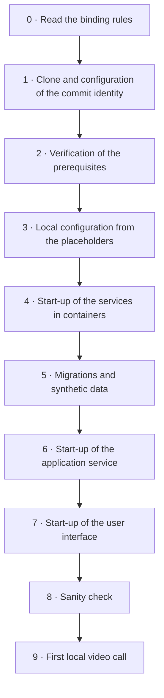
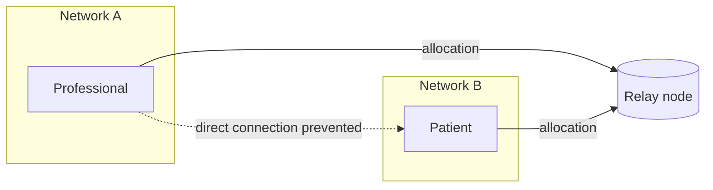
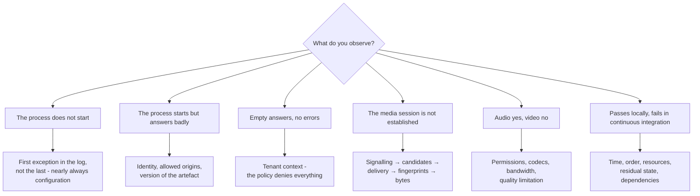

# The development environment

> **What this module is and what it is not.**
> It is the **didactic and operational** version of what the technical area describes in full in
> [`docs/01_technical/`](/01_technical/00-indice.md). It serves whoever sits down for the first
> time and has never seen this set of technologies: it explains **what you install, in what order
> things are switched on, what you must see at each step and what you do when you do not see
> it**. It does not repeat the reasons behind the technical choices - those live in
> [`01-stack-e-motivazioni.md`](/01_technical/01-stack-e-motivazioni.md) - and it does not
> replace the installation manual intended for those who bring the system into live operation,
> which is a different document, with different recipients and different obligations.

> **Warning about the state of the project.** At the date of writing, the repository contains the
> documentation and the governance documents; the build chain and the code are being produced.
> From this follows an editorial rule that this module applies without exception: **where the
> exact name of a command, of a script, of a variable or of a service has not yet been settled,
> the module declares it `[NV]` and states whose job it is to settle it, instead of inventing
> it.** A module that promised non-existent commands would be worse than an incomplete module: it
> would cost every reader an afternoon, and the first afternoon lost is the one on which most
> people give up. The names of the general tools - the version control system, the container
> engine, the database client, the kernel's queueing discipline - are instead real, because they
> do not depend on a decision of the project.

There are two ways of writing a guide to the development environment. The first lists the
commands in sequence and presumes that they work; it is the one found almost everywhere, and it
works as long as the reader's machine resembles the writer's. The second states, for every step,
**what you must observe if it went well, what you observe if it went badly, and what you do in
that case**. It costs five times as much to write and it is the only one that survives contact
with real people on real machines.

This module adopts the second. It has a declared and measurable objective: **a person who has
never seen this set of technologies must be able to reach, unaided, a system that runs locally
and a video call tested over a simulated degraded network.** If they cannot, the defect belongs
to this module, and it is to be reported the way a defect in the code is reported.

By the end you should be able to answer four questions: *what must I install and why*, *what must
happen when I start the system*, *how do I prove that it really works and not just that it
switches on*, and *what do I do when it does not work*.

---

## 1. Prerequisites, stated in full

### 1.1 The criterion that governs this list

Every prerequisite in this list exists for a technical reason written next to it. A list of
installations without reasons produces two unwanted effects: the reader installs things that are
of no use to them and - far worse - when something does not work they have no way of
understanding **which** piece is missing, because they do not know what each piece was for.

There is then a criterion that applies specifically to this project and that must be stated
before everything else. Criterion **C7** of
[`01-stack-e-motivazioni.md`](/01_technical/01-stack-e-motivazioni.md) §2 establishes: **no real
data and no mandatory external service in development**. In practice this means that Telemedic's
development environment must be startable **on a machine disconnected from everything**, without
an account, without a supplier's key, without a remote service answering. An environment that
requires a third party's service in order to work is an environment that imposes test data on
somebody else's system - that is, an environment that violates the project's most important rule
(§5.1) without anyone noticing.

From this criterion follows a practical consequence useful to the reader: **if a procedure in this
module asks you to register somewhere, the procedure is wrong.** Report it. This module states it
as an explicit constraint on all areas (**V-190** on the noticeboard): a start-up procedure that
requires registration with a supplier is a defect, not a configuration.

### 1.2 What you install, and why

| Component | Minimum version | What it is for, in one line | If it is missing |
|---|---|---|---|
| **Version control system** | Recent and maintained | Cloning the repository, branches, sign-off of the origin of the contribution | Nothing starts |
| **Java platform, long-term support release 21** | **21** | It is the service's platform. The threshold is not cosmetic: virtual threads and exhaustive pattern matching are finalised in 21 and are used by the clinical domain | The service does not compile |
| **The project's build tool** | The one declared by the lock file | Compilation, running the tests, production of the artefacts. The project uses the **build tool embedded in the repository** (*wrapper*), so it is not to be installed separately: you use the versioned one | The build is not reproducible |
| **Runtime for the user interface** | The one declared in the lock file of the user interface framework `[NV]` | Building and development server for the web application | The user interface does not start |
| **Container engine with local orchestration** | Composition specification v2 | Starts the database, the federation product, the broker and the relay node without installing them on the machine | Four services have to be installed by hand: practically impossible |
| **Command-line database client** | Matching the engine's major version | Inspection, diagnosis, verification of the row-level security policies | You diagnose blind |
| **Two distinct browser engines** | Current versions | The media tests **must** run on more than one engine: the behaviour diverges, and it is the most expensive source of defects in this area | You learn about the defects from the users |
| **Kernel queueing discipline for network emulation** | Present in the system | Simulation of bandwidth, delay, jitter and loss. On Linux it is part of the system's network configuration | You cannot test degradation, that is, the case that counts |
| **Editor supporting the repository's conventions** | - | The repository contains a versioned editor configuration file: respecting it avoids pointless differences in proposed changes | Line-ending-only differences in every change |

Three clarifications that avoid three frequent mistakes.

**The build tool is not installed.** The project versions in the repository the *launcher of the
build tool*: you invoke that, and it downloads and runs the exact declared version. It is the same
reason why the dependency lock file exists - **the build must be reproducible**, and a build that
depends on which version of the tool you have installed is not. The detail is in
[`09-integrazione-continua-e-rilascio.md`](/01_technical/09-integrazione-continua-e-rilascio.md)
§6.2, where reproducibility is a requirement and not a preference.

**The platform version is fixed in the build chain, not in your environment.** If you have
installed a major version different from the declared one, the build must fail with a clear
message, not compile producing a different artefact. If you happen to compile successfully on a
version different from the declared one, **it is a defect of the build chain**: report it.

**The container engine is there so that the services are not installed.** It is the point that
whoever arrives from another world tends to skip, and then spends two days installing by hand a
database, an identity federation product, an event broker and a relay node. It is not done: they
are started as ephemeral containers, and when they are in an incomprehensible state they are
thrown away and recreated (§4.5). This possibility of **throwing away the state** is half the
value of the tool.

### 1.3 What you do not need to install, and it is worth saying so

- **You do not need a container orchestration cluster.** The local profile is the single-tenant
  one on composition, which is the lowest common denominator. The chart for the orchestrator
  exists, it serves the managed-service profile and **it is not the development environment**.
- **You do not need a separate time-series store.** The time series live inside the relational
  database, by extension or by native partitioning: it is the choice described in
  [`01-stack-e-motivazioni.md`](/01_technical/01-stack-e-motivazioni.md) §7.
- **You do not need any remote third-party service.** See C7, §1.1.
- **You do not need any licence-bound terminology content**, and above all **it must not be
  downloaded** (§7.2 and [`THIRD-PARTY-TERMINOLOGY.md`](https://github.com/fedcal/Telemedic/blob/main/THIRD-PARTY-TERMINOLOGY.md)). The
  system is designed to work without it, and the default configuration of the tests is precisely
  the one without it (constraint **V-03**).
- **You do not need a medical device, a health card reader or a real signing certificate.**
  Everything concerning those chains is tested with test doubles built on the published
  specification.

### 1.4 Memory and disk: the method, not an invented number

`[NV]` - **the project has not measured the resource consumption of the local environment, and
this module does not publish unmeasured figures.** What it does publish is the **method for
calculating them on your own machine**, which is more useful than a wrong figure and remains
valid when the number of services changes.

Consumption is made up of four items, which must be estimated separately because they grow for
different reasons:

1. **The services in containers.** Database, federation product, event broker, relay node. They
   are processes with a relatively stable idle consumption: they are measured once, with the
   container engine's statistics tool, and the number remains valid until the composition
   changes.
2. **The application service running on the platform's virtual machine.** The consumption depends
   on the configured heap size, not on the code: it is a choice, not a fact. In development you
   configure it small.
3. **The user interface toolchain.** The development server with incremental rebuild is typically
   the hungriest item of the whole set for memory, and the one that surprises whoever comes from
   the world of services.
4. **The tests that start ephemeral containers.** They run **in addition** to the environment
   already switched on, and they are the moment at which a machine at its limit gives up. It is
   the case to bear in mind when sizing.

For disk there are three items: the container images, which accumulate silently at every update
and must be pruned (§11.3); the dependency caches of the two ecosystems, which grow and do not
shrink by themselves; the volumes of the local database, which grow with the synthetic data
generated and in particular with the large dataset profiles (§5.8).

**An honest rule of thumb**: measure once, on your machine, with the complete environment switched
on and an integration suite running, and write down the result. It is the only number that
concerns you. If you want to contribute to this module, that number, together with the machine's
model, is a valuable contribution: the question is open on the noticeboard to the technical area
(**Q-191**).

### 1.5 If the machine is modest

It is the most common situation among external contributors, and it is to be treated as the
reference case and not as an exception. Five strategies, in order of effectiveness.

**Do not switch on what you do not need.** The first mistake is starting everything in order to
work on a feature that touches a single context. The start-up profile ought to be **selective by
groups of services** - database alone; database plus application service; the complete set with
media and federation - and every group ought to be startable on its own. `[NV]` - the exact
definition of the groups and their names belong to the technical area together with the writing of
the composition file: the question is open on the noticeboard (**Q-190**).

**Work on the domain without switching anything on.** It is the most underrated practical benefit
of dependency rule no. 5 of [`02-backend.md`](/01_technical/02-backend.md) §1: the domain does
not depend on the infrastructure, therefore **the domain unit tests run in memory, in seconds,
without a database and without containers**. If you are working on invariants, state machines,
policies or calculations, you can spend an entire day without starting a single service. It is
also the way the project wants people to work: the domain tests are the broad base of the pyramid
([`08-qualita-e-test.md`](/01_technical/08-qualita-e-test.md) §1).

**Reduce the synthetic dataset.** The generator has size profiles (§5.8): the minimum profile
serves to make the paths run, the demonstration one to see a populated user interface, the large
one for the capacity tests. The third has nothing to do with daily work and is not to be kept
switched on out of habit.

**Do not keep the user interface development server switched on if you are working on the
service.** And vice versa. They are the two most expensive items and they are rarely needed
together.

**Use a remote machine for the heavy tests.** Media tests over a degraded network and load tests
are not laptop activities. The former can be run locally but they consume; the latter, by
construction, require a dedicated environment
([`08-qualita-e-test.md`](/01_technical/08-qualita-e-test.md) §1) and **must not be run on the
development machine**, because the result would be meaningless and the machine unusable.

### 1.6 Differences between operating systems, where they really exist

Most of the differences between operating systems in a project like this one are irrelevant. The
ones that follow are **not**, and ignoring them costs time.

#### Network emulation

**It is the difference that matters most.** The simulation of bandwidth, delay, jitter and loss
that the media tests need (§6.4) is achieved with the kernel's queueing discipline, which is a
feature **of Linux**. On other operating systems:

- the native equivalent exists in a different form and with a different syntax, and **the profiles
  are not transferable number by number**;
- the practicable and reproducible route is **to run the simulation inside a Linux environment** -
  a container with network privileges, or a virtual machine - and to place at least one of the two
  ends of the session in it.

The operational consequence to accept at once: **the network profiles are shared constants of the
suite** ([`05-media-e-tempo-reale.md`](/01_technical/05-media-e-tempo-reale.md) §9.2) and the
results are comparable only if obtained with the same mechanism. A measurement obtained with a
different emulator is not compared with the others: it is recorded as such.

#### Processor architecture

On machines with an ARM-architecture processor - common among recent laptops - not all container
images exist for that architecture. When one is missing, the engine runs them under emulation,
with two consequences to know about: **appreciable slowdown**, which manifests itself as
integration tests timing out, and **differences in behaviour** in edge cases. The project's rule is
to prefer images available for both architectures; where that is not possible, the fact must be
stated in the documentation of the composition.

#### Line endings and file permissions

On Windows the automatic conversion of line endings produces enormous and contentless differences
in proposed changes and - worse - can make the repository's scripts non-executable. The editor
configuration file versioned in the repository serves exactly this purpose. Check that your editor
respects it **before** the first change, not after the first unreadable proposal.

#### The Linux subsystem on Windows

It is the recommended route on Windows, but it must be known in three respects: filesystem
performance across the boundary between the two worlds is appreciably worse, so **the repository
must be cloned inside the subsystem's filesystem**, not on the host's; the address by which
containers reach a service listening on the host has a form of its own and is not `localhost`;
network emulation works, because it is a real Linux kernel.

#### Secure context and loopback

It applies to all operating systems, and it is the number-one trap for whoever tests a video call
for the first time: **access to the camera and microphone requires a secure context**. In local
development the only origin treated as secure without a certificate is the **loopback** one. If
you open the user interface with the machine's network address instead of the loopback address,
capture fails silently or with an error that looks like a defect of the application, and is not.
It is explained at length in module [08 §13.5](08-webrtc-da-zero.md); here it is enough to know
that it is the **first** check to make.

From this also follows the real problem of testing between **two different devices** on the same
local network - the laptop and a telephone, which is the product's scenario: in that case the
loopback address is of no use, and a certificate for the local origin is needed, obtained from a
local certification authority created after the fact on the development machine. `[NV]` - the
exact procedure adopted by the project has not yet been settled, and it is open on the noticeboard
to the technical area together with the rest of the local composition (**Q-190**).

---

## 2. The first start-up, step by step

### 2.1 The shape of the path



The path is **sequential and cannot be reordered**: every step produces the input state of the
next. If a step does not produce the expected outcome, it is resolved before continuing.
Continuing with a failed step is the number-one cause of long and fruitless diagnostic sessions,
because the symptom appears three steps further on, far from the cause.

### 2.2 Step 0 - Read the binding rules

It is not a courtesy step. Three documents of the repository contain rules which, if violated,
produce consequences that **cannot be cancelled by a later change**:

| Document | What it establishes | Why before and not after |
|---|---|---|
| [`CONTRIBUTING.md`](https://github.com/fedcal/Telemedic/blob/main/CONTRIBUTING.md) | The five non-negotiable rules: no real data, no licence-bound terminology content, no secrets in the code, traceability on changes with clinical risk, accessibility as a requirement | The first three are violable **at the first commit**, and the history of a public repository cannot be cleaned up (§11.4) |
| [`THIRD-PARTY-TERMINOLOGY.md`](https://github.com/fedcal/Telemedic/blob/main/THIRD-PARTY-TERMINOLOGY.md) | What the project does not distribute and does not download, and why | The licence of some code systems **is perfected by downloading**: a single download «just to try» is enough |
| [`NOT-A-MEDICAL-DEVICE.md`](https://github.com/fedcal/Telemedic/blob/main/NOT-A-MEDICAL-DEVICE.md) | That the repository is source code and not a medical device, and what may and may not be done with it | It determines what you can claim about the system you are about to start |

If you have little time, read at least the five rules of `CONTRIBUTING.md`. They are less than two
pages and they are the only ones whose cost of violation is unrecoverable.

### 2.3 Step 1 - Clone and identity of the contribution

```bash
git clone git@github.com:fedcal/Telemedic.git
cd Telemedic
```

Before anything else, configure **the sign-off of the origin of the contribution**. The project
requires every commit to carry the attestation provided for by the *Developer Certificate of
Origin*: it is not an assignment of copyright, it is the declaration that you have the right to
contribute that work under the project's licence.

```bash
git config user.name "Nome Cognome"
git config user.email "indirizzo@esempio.invalid"
# then, on every commit:
git commit -s -m "docs: correggere il refuso nel modulo sui prerequisiti"
```

**Expected outcome**: the commit message contains a `Signed-off-by:` line with your name and your
address. A commit without that line will be rejected at the verification stage, and correcting it
after the fact across a series of commits is tedious: you configure it straight away.

The `.invalid` domain used in the example is reserved by the domain name specification precisely
for examples that must not resolve: in this module, as in the whole project, **the example data
too are synthetic** (§5).

### 2.4 Step 2 - Verification of the prerequisites

`[NV]` - the project provides for a **prerequisite verification script** that checks, in one go,
the presence and the version of each component of §1.2 and states what is missing in
understandable language. Name, location and form belong to the technical area (**Q-190**).

The reason why it is worth having, and why it should be invoked **before** everything else, is
that almost all the failures of the following steps come down to a missing prerequisite or to the
wrong version, and the error message you get from that three steps further on **does not resemble
the cause at all**. A declarative check at the start turns ten different diagnoses into a single
message.

In the meantime, manual verification consists in reading the versions of the components in the
table of §1.2, compared with the «minimum version» column.

### 2.5 Step 3 - Local configuration

The repository contains no secrets, and never will. What it does contain is an **example file of
the local configuration**, explicitly excluded from the exclusion rules of the version control
system - it is the reason why the project's exclusion file lists `.env` among the files never
versioned and `.env.example` among the exceptions.

```bash
cp .env.example .env
```

Then you fill it in. The rules are three, and they are the same ones that will apply to the whole
project:

1. **The values in the example file are placeholders, not values.** They must never resemble real
   values: a placeholder that looks like a real key ends up, sooner or later, in a commit.
2. **Local secrets are generated on the spot**, with a random number generator of the system, and
   they stay on the machine. They are not shared in chat, they are not pasted into a report, they
   are not reused across environments.
3. **No value of the local file is a real secret of a real environment.** If you find yourself
   copying into `.env` a credential taken from a real installation, you are committing the mistake
   that this project regards as the most serious (§11.1).

```bash
# Example of generating a local secret - for the development environment only.
openssl rand -base64 32
```

`[NV]` - the exact list of the variables, their names and their default values are defined by the
example file once the composition is written. This module **does not anticipate them** and does
not invent their names.

### 2.6 Step 4 - Start-up of the services in containers

```bash
docker compose up -d
docker compose ps
```

**Expected outcome**: all the services are running and, where a health check is defined, in a
healthy state. A cyclic restart state is a failure, not a wait: you look at that service's logs
immediately.

```bash
docker compose logs -f <service>
```

What runs, and what it is for:

| Service | Role in the local environment | If it does not start |
|---|---|---|
| Relational database | The pivot of everything: data, outbox, migration register | Nothing else starts |
| Identity federation product | Issuance of the tokens, distinct realms, roles | No authenticated access: the user interface stops at the first step |
| Event broker | Delivery of the events produced by the outbox | The main path works, delivery to third parties does not |
| Relay node | NAT traversal in the media tests | Sessions between two tabs of the same computer work all the same: it is precisely the trap of §6.1 |

The last row of the table deserves emphasis, because it is the most expensive misunderstanding in
the whole module: **locally the video call works even if the relay node is switched off.** That is
not good news: it is the reason why a naïve local test demonstrates almost nothing.

### 2.7 Step 5 - Migrations and synthetic data

Two distinct operations, which must be kept distinct mentally too:

1. **The migrations** bring the schema to the current version. They are versioned, ordered,
   immutable and with a verified fingerprint
   ([`03-persistenza.md`](/01_technical/03-persistenza.md) §3.1). They run first on `platform`
   and `reference`, then on the schemas of each tenant.
2. **The generation of the synthetic data** populates the environment. It is not part of the
   migrations and must never become part of them: a migration that inserted example data would end
   up in live operation.

`[NV]` - the exact commands depend on the migration tool chosen by the technical area and on the
name of the generator, neither of which has yet been settled (**Q-190**). What is already decided
and does not change is the **semantics**: forward-only migrations, never modified after the fact,
with the state recorded per tenant in `platform.migration_state`.

**Expected outcome**: the migration register reports all the versions applied without failures,
and a check query on the database shows the expected schemas.

```sql
-- Manual check, pending the project command.
\dn
-- Expected: platform, reference, and six schemas for each synthetic tenant,
-- in the form t0001_identity, t0001_registry, t0001_encounter, …
```

### 2.8 Step 6 - Start-up of the application service

```bash
./mvnw spring-boot:run
```

The command reflects the **project proposal** to adopt a declarative model-based build tool,
argued in [`01-stack-e-motivazioni.md`](/01_technical/01-stack-e-motivazioni.md) §12; `[NV]` on
the final form of the invocation and on the profile activated for the local environment.

**Expected outcome**: the service reaches the ready state and the two distinct **liveness** and
**readiness** endpoints answer consistently. The distinction between the two is not a formality:
liveness says «the process is alive», readiness says «the process can receive traffic». A process
that is alive but not ready is the normal condition during start-up and during a migration, and it
is the reason why there are two addresses and not one.

```bash
curl -s http://localhost:<port>/actuator/health/liveness
curl -s http://localhost:<port>/actuator/health/readiness
```

`[NV]` - the exact port and paths are defined by the application configuration, which has not yet
been written.

### 2.9 Step 7 - Start-up of the user interface

```bash
npm ci      # reproducible installation from the lock file, not "install"
npm start   # development server with incremental rebuild
```

Two notes that are worth more than the command.

**Reproducible installation is not ordinary installation.** The command that resolves the versions
on the spot produces a dependency tree potentially different from your colleague's and from
continuous integration's, and it makes the build non-reproducible - which is a requirement, not a
preference. You always use the form that **installs exactly the lock file** and fails if the lock
file and the manifest diverge.

**The development server is not the way the application is distributed.** It serves incremental
rebuilding while you write; the build for live operation has other properties. A defect that appears
only in the build for live operation exists and is to be looked for there, not in the development
server.

### 2.10 Step 8 - Sanity check

Not «the user interface opens». Four observable checks, in order:

| # | Check | What it demonstrates |
|---|---|---|
| 1 | The two status endpoints answer and readiness is positive | The service is started and has completed the migrations |
| 2 | Sign-in with a synthetic account of the federation product succeeds | The identity chain is configured: realm, client, roles |
| 3 | An authenticated read returns synthetic data that is **not empty** | The tenant context is resolved and row-level security **is not denying everything** (§4.7) |
| 4 | A write produces a row in the outbox table of the context | The transactional path of the domain and of the outbox is intact |

The third row is the one that catches the most insidious misunderstanding of the whole
environment: an empty list **is not** an environment without data, it is nearly always an
unresolved tenant context. The row-level security policy, in the absence of context, **denies
everything**: it is the intended behaviour
([`03-persistenza.md`](/01_technical/03-persistenza.md) §2.3), and it produces exactly the same
symptom as an empty database.

### 2.11 Step 9 - The first local video call

It is dealt with in §6, because it requires a premise that deserves a section of its own: **the
local case is deceptively easy**, and a video call that works between two tabs of the same browser
demonstrates almost nothing of what the product must guarantee.

### 2.12 Where people usually get stuck

This is the section that is missing from every guide and that decides whether a person carries on
or gives up. The entries are ordered by expected frequency, not by severity.

| # | Symptom observed | Most frequent real cause | How to get out of it |
|---|---|---|---|
| 1 | The camera does not start, or the offer contains no media sections | The user interface is open on a **non-secure** origin: the machine's network address instead of the loopback address | Open the loopback origin; for the test between different devices a local certificate is needed (§1.6) |
| 2 | Every read returns an empty list, with no errors | Unresolved tenant context: the row-level security policy **denies everything** in the absence of context | Check that the request carries the tenant and that the transaction sets the variable with `SET LOCAL` (§4.7) |
| 3 | The database «does not answer» at the first start-up | The service is running but has not finished initialising; or the volume contains the state of a previous failed attempt | Wait for the health check; if it persists, wipe the volume and recreate (§4.5) |
| 4 | The migrations fail with a fingerprint error | A migration already applied has been **modified** - that is forbidden: you write the next one | Wipe the local database and reapply; in a real environment it would be an incident |
| 5 | The service starts and shuts down immediately | Incomplete local configuration: a mandatory property has no value. The typed binding of the configuration fails at start-up **on purpose** | Read the first exception, not the last: it names the missing property |
| 6 | Sign-in fails with an identity error | Realm, client or synthetic accounts not imported; or the issuer expected by the service does not match that of the federation product | Check that the issuer configured in the service and that of the token match **character by character**, scheme and port included |
| 7 | The user interface shows cross-origin errors | The user interface's origin is not allowed by the service's configuration, or the port differs from the expected one | Align the allowed origins; do **not** switch off the checks: it is a shortcut that the live profile check must prevent (§9) |
| 8 | The integration tests time out | Ephemeral containers under emulation on a non-native architecture (§1.6), or a saturated machine because the complete environment is switched on | Switch off what is not needed; check the architecture of the images |
| 9 | The video call «works» but proves nothing | Both ends on the same machine: candidates of the local type, no NAT, practically infinite bandwidth | §6: force the relay path and simulate the network |
| 10 | No candidates beyond the local ones | Relay node unreachable, expired credentials or a shared secret that differs between the service and the node | Check that the relay node's secret and the one with which the service signs the credentials are the same value |
| 11 | The synthetic audio file sounds distorted | Audio processing (echo, noise, gain) is active: it must be switched off when a file is played back | See module [08 §13.1](08-webrtc-da-zero.md): it is a constraint stated upstream, not a defect |
| 12 | The screen-sharing stream goes through without anyone having consented | The flag that automatically accepts **screen capture too** has been used | Use the flag that accepts only camera and microphone: the distinction is verified and documented (§6.7) |
| 13 | The bandwidth throttling set in the browser's developer tools has no effect | It acts at the application layer and **does not touch the media session's traffic** | Simulate at the network layer (§6.4). It is the misconception that costs a whole day |
| 14 | The secrets check blocks the proposed change | There is a credential in the sources **or in the history** | §9: it is not worked around. The secret is removed **and rotated** |
| 15 | The terminologies check blocks the proposed change | Content of a licence-bound code system has got in, often inside an example resource copied from the internet | §7.2 and §9. It is not a false positive to be switched off |
| 16 | A list of clinical codes does not validate | The code system is not enabled in this configuration: **it is the expected behaviour** | §7.3: the system remains fully functional, the validation of those codes does not. It is declared |
| 17 | The build fails citing a component absent from an annotations file | It is the check that prevents an unassessed dependency from getting in | §9, check **G5**: you fill in the component record. You do not add an exclusion |

If your case is not in this table and it cost you more than half an hour, **add it**: one row in
this table is worth more than a rewrite of ten lines of code, because it saves the same half hour
for everyone who comes after.

---

## 3. How the repository tree is made

### 3.1 The criterion: separation by domain, not by technical nature

Before the tree, the rule that explains it. The project does **not** organise the code by technical
nature - all the controllers together, all the services together, all the repositories together -
because that arrangement scatters every feature across five places and does not allow any
dependency to be forbidden: everything sits at the same level as everything else. It is organised
instead by **bounded context**, according to the table of the architectural baseline, and every
context is a module with a real boundary, verified by tests that make the build fail. The full
justification is in [`02-backend.md`](/01_technical/02-backend.md) §1.

The practical consequence for whoever is looking for a file: **you start from the domain, not from
the type of file**. The right question is not «where are the controllers», it is «which context is
responsible for this thing».

### 3.2 The first level

```
Telemedic/
├─ README.md                      intended purpose, limits, quick start
├─ LICENSE / NOTICE               permissive licence and attributions
├─ NOT-A-MEDICAL-DEVICE.md        the repository is not a medical device
├─ DISTRIBUTION-POLICY.md         what distinguishes the repository from the distribution
├─ CONTRIBUTING.md                the five non-negotiable rules
├─ THIRD-PARTY-TERMINOLOGY.md     licensing regimes of the clinical terminologies
├─ SECURITY.md                    confidential reporting of vulnerabilities
├─ GOVERNANCE.md                  who decides what
├─ CODE_OF_CONDUCT.md             code of conduct
├─ .editorconfig                  editor conventions, versioned
├─ .gitignore                     what never enters the repository
├─ .github/                       issue and proposal templates, pipeline definitions
├─ docs/                          the whole documentation, in Italian
└─ .telemedic/                    working material of the orchestration, not published on the site
```

The four documents at the top - intended purpose, non-device, distribution policy, contribution
rules - **are not formalities**. Decision **D51** requires that the statement «this repository is
not a medical device», the intended purpose and the limits of use be present and visible **at
every moment in which the repository is accessible**: not publishable later. They are, literally,
the first thing that was written.

### 3.3 The documentation

```
docs/
├─ 00_overview/       vision, summary, general glossary
├─ 01_technical/      stack, backend, persistence, front end, media, observability,
│                     performance, quality and testing, continuous integration and release
├─ 02_architecture/   contexts, domain, data model, multi-tenancy, events, deployment
├─ 03_functional/     actors, requirements, use cases, rules, alarms, accessibility
├─ 04_protocols/      interoperability, FHIR, clinical documents, messaging, IHE,
│                     project interface, events, identity, real time, conformance
├─ 05_domain/         ubiquitous language, modelled services, documents, parameters,
│                     consent, terminologies, care pathways
├─ 06_security/       threats, identity, data protection, audit trail, real time,
│                     supply chain, measures, responsibilities, incidents
├─ 07_integration/    modes of integration, integrator's first start-up, API, events
├─ 08_compliance/     medical devices, quality, regulation, certification path
├─ 09_roadmap/        technical plan
├─ 10_fondamenti/     this guide
└─ adr/               recorded architecture decisions
```

Two orientation notes that save pointless searching:

- **`docs/10_fondamenti/` explains, `docs/01_technical/` decides.** If you are looking for *why* a
  thing works that way, start from the fundamentals; if you are looking for *which version, which
  constraint, which limit*, go to the technical area. This module is the only one of the
  fundamentals that gives commands, and it gives them in order to put you in a position to read
  the others.
- **`docs/07_integration/02-primo-avvio.md` is not this module.** That one describes the first
  start-up of **whoever integrates Telemedic into another system**; this one describes the first
  start-up of **whoever develops Telemedic**. They are two paths with different recipients,
  prerequisites and objectives, and confusing them is an avoidable waste of time.

### 3.4 The code

The structure that follows is the one declared by the technical area and it is **the map for
finding a file**. At the date of writing the directories are being produced: what matters here is
the arrangement, which is decided, not the state of progress, which changes every week.

```
telemedic/                        the service
├─ platform/                      cross-cutting components, no domain logic
│  ├─ tenancy/                    resolution, propagation and verification of the tenant
│  ├─ security/                   authorisation boundary, token exchange, level of assurance
│  ├─ outbox/                     table, relay, event envelopes
│  ├─ problem/                    catalogue of the errors and their representation
│  └─ observability/              correlation, redaction, measurements
├─ contexts/                      one module per bounded context, thirteen in all
│  ├─ identity/  registry/  scheduling/  encounter/  media-session/
│  ├─ clinical-document/  monitoring/  alerting/  consent/
│  ├─ outbound/  audit/  tenant-admin/
│  └─ terminology/                single point of resolution and validation of
│                                 clinical codes (CTX-10), switchable off per
│                                 code system
├─ interfaces/
│  ├─ rest-api/                   the project's application interface
│  ├─ fhir-facade/                interoperability facade
│  ├─ signaling/                  signalling of the media session
│  └─ webhooks/                   delivery to third-party systems
└─ app/                           assembly, configuration, start-up

web/                              the user interface
├─ core/                          session, network, internationalisation, accessibility,
│                                 tenant configuration, user interface measurements
├─ design-system/                 base components, accessible by construction
├─ features/                      waiting room, consultation, consent, reporting,
│                                 monitoring, administration
├─ embeddable/                    custom element for the integrator
└─ app/                           assembly, routing, start-up
```

**Every context has the same internal shape** - `api`, `domain`, `application`,
`infrastructure` - and the repetition is intended: whoever opens a context they do not know
already knows where to look. `api` is the contract towards the other contexts; `domain` has no
side effects and is tested without infrastructure; `application` is the only layer with the
transaction; `infrastructure` is replaceable by definition.

### 3.5 Where do I look for what

| If you are looking for… | Look in… |
|---|---|
| The rule that decides whether a session may begin | `contexts/media-session/domain/policy/` |
| The point at which the transaction of a use case is opened | `contexts/<context>/application/` |
| The shape of an error returned to a caller | `platform/problem/` |
| How the tenant is resolved and propagated | `platform/tenancy/` |
| Why a call to the outside is refused | The single component for outgoing calls, in `platform/` |
| The schema migrations | The migrations directory, ordered by version `[NV]` |
| The test data factories | The synthetic generator module `[NV]` |
| The network profiles of the media tests | The shared constants of the media suite |
| The configuration of the relay node | The versioned example file, never the real one |
| The catalogue of the error codes | The versioned file from which the catalogue is **generated** |
| The register of third-party components | The versioned annotations file alongside the generated bill of materials |

### 3.6 The two directories that surprise people

**`third-party/`** - it does not exist for convenience. It exists because the project's terminology
policy places some content in a **regime B**: reusable, but with a licence of its own that must be
kept separate from the project's. What is in there **is not under the repository's licence** and
has a licence file of its own. It is not the place to put a handy library.

**`.telemedic/`** - working material of the orchestration: context shared between those who write,
the inter-agent noticeboard, research. It is not published documentation and it does not end up on
the site. It is useful to read it when you wonder *why a decision is the one it is and not another
one*: the answer is nearly always in a row of the noticeboard or in a research document.

---

## 4. The database

### 4.1 What runs locally

A single relational database, containing everything: the domain data, the event outbox, the
migration register and - locally - the immutable audit trail too, which **in live operation is
instead kept separately**, with distinct credentials and backups
([`03-persistenza.md`](/01_technical/03-persistenza.md) §8.2).

This difference between local and live must be known, because it is one of the few in which the
development environment does **not** reproduce the real structure. The reason is the
sustainability of the local environment; the consequence is that the physical separation of the
audit trail **is not proved by local start-up alone**, and must be verified where it is real.

### 4.2 How the schema is organised, and why it concerns you straight away

```
telemedic (database)
├─ platform            tenant catalogue, migration register, keys
├─ reference           non-clinical and non-tenant-specific reference data
├─ t0001_identity      ── one synthetic tenant
├─ t0001_registry
├─ t0001_encounter
├─ t0001_media_session
├─ t0001_clinical_document     (contains outbox for clinical documents)
├─ t0001_monitoring
└─ t0002_…             ── a second synthetic tenant
```

Three properties that you meet on the first day:

1. **One schema per tenant × context pair.** It serves two separations at once: between tenants,
   and between contexts. No context accesses another's database, and the rule is enforced by the
   engine through privileges, not by the discipline of whoever writes.
2. **The schema name uses an opaque ordinal**, not the tenant's name. The name of a tenant may be
   the name of an individual medical practice, that is, personal data, and the schema names appear
   in error messages, in execution plans and in administration tools.
3. **At least two synthetic tenants, always.** A local environment with a single tenant does not
   bring out the isolation defects, which are the most serious class of defect in this system. The
   generation of the synthetic data creates **two or more** by construction (§5.8).

### 4.3 Migrations: the rules before the commands

| Rule | What it means in practice | Why |
|---|---|---|
| **Versioned and ordered** | Every change of the schema is a numbered file | The state of the schema is reconstructible and verifiable |
| **Immutable** | A migration already applied **is never modified**: you write the next one | The verified fingerprint makes retroactive modification impossible, which is the classic cause of divergences between environments |
| **Forward only** | There are no undo migrations | Undoing a change that has already destroyed data is not possible, and its existence creates the opposite illusion |
| **Structure and data separated** | One migration changes the shape, another the content | A data migration on a real clinical table running in a single transaction blocks the system for its whole duration |
| **Expand and contract** | No release is both destructive and functional | Two consecutive versions must be able to coexist on the same database: it is the condition for updating without interruption and for rolling back |
| **Non-blocking** | Indexes created concurrently, constraints added as not validated and validated afterwards | On real data the blocking form stops the system |

The «expand and contract» rule is the one a novice contributor violates first, because it is
counter-intuitive: renaming a column looks like an innocuous change, and it is instead the change
that breaks the coexistence of two versions. The correct form is: **add the new column, write to
both, read from the old one; then read from the new one; only in a third release remove the old
one.**

### 4.4 Migrations across several tenants

With one schema per tenant, every structural migration must be applied to every tenant. Locally,
with two or three synthetic tenants, the process takes seconds; in live operation, with hundreds,
it is a long operation whose **progress must be observed**. The property that counts locally too is
that **failure on one tenant does not block the others**: that tenant is marked as not aligned and
receives no traffic from the new version. It is the reason why the compatibility check between
consecutive versions is not optional - during a long migration, tenants on different schema
versions **coexist by construction**.

### 4.5 Starting again from scratch

It is to be done often, and without hesitation. A dirty local environment is the cause of a whole
family of pointless diagnoses: tests that pass because of the residue of a previous state, tests
that fail because of a leftover row, behaviours that nobody else manages to reproduce.

```bash
docker compose down -v      # stops the services AND DELETES the volumes
docker compose up -d        # recreates from scratch
# then: migrations, then generation of the synthetic data
```

The option that deletes the volumes is the one that distinguishes «restarting» from «starting
again». Without it, the database keeps the previous state - including the partially applied
migrations of the failed attempt, which are precisely the residue that produces the fingerprint
error of row 4 of §2.12.

**Rule of thumb**: if you are about to write a message that begins with «it does not work for me
but I do not understand why», recreate the environment first. In half the cases the conversation
ends there.

### 4.6 Inspecting

```bash
docker compose exec <database-service> psql -U <user> -d telemedic
```

The queries that are really needed on the first day:

```sql
-- Which schemas exist: the synthetic tenants and the two cross-cutting schemas are visible.
\dn

-- The outbox queue of the clinical documentation context of tenant t0001: rows not yet published.
SELECT tipo, chiave, creato_il, tentativi, ultimo_errore
FROM t0001_clinical_document.outbox
WHERE pubblicato_il IS NULL
ORDER BY creato_il
LIMIT 20;

-- Are the row-level security policies active on the table?
SELECT relname, relrowsecurity, relforcerowsecurity
FROM pg_class
WHERE relname = 'prestazione';

-- The remote monitoring measurements of a synthetic subject, in order of measurement.
SET LOCAL app.tenant_id = '<synthetic-tenant-uuid>';
SELECT occurred_at, recorded_at, parametro_code, valore, unita_ucum, stato, origine
FROM t0001_monitoring.misura
WHERE soggetto_id = '<synthetic-uuid>'
ORDER BY occurred_at DESC
LIMIT 50;
```

Three things to note in these lines, because they are the whole mental model of the project's
persistence in miniature:

- **`occurred_at` and `recorded_at` are two different columns.** When the fact happened and when
  the system learnt of it are not the same thing: a measurement taken at 8:00 and synchronised at
  19:00 is normal data in remote monitoring, and confusing them produces a clinically wrong
  assessment.
- **The status may be «expected, not received».** The absence of data is clinical information
  (constraint **V-09**): silence is never treated as normality, and in the schema this rule becomes
  **a row that exists** instead of a row that is missing.
- **The unit of measurement sits next to the value.** A number without a unit, in a clinical
  context, is not a datum: it is a risk.

The two control columns of row-level security must be read together: `relrowsecurity` says that
the policy exists, `relforcerowsecurity` says that **it applies to the owner of the table too**.
Without the second, the owner is exempt and the policy protects nothing: it is the configuration
error that silently defeats the entire isolation model, and it must be verified by querying the
system catalogue, not by trusting.

### 4.7 The typical local errors, and how they are recognised

| Symptom | Cause | Immediate check |
|---|---|---|
| Every read returns zero rows | Tenant context not set: the policy **denies everything** | `SELECT current_setting('app.tenant_id', true);` inside the same transaction |
| The reads work but they «see too much» | The policy is not forced on the owner, or the application role **is** the owner | The two columns of §4.6, plus verification of the owner of the objects |
| The data of one tenant appear in another | Context set with `SET` instead of `SET LOCAL`: it stays attached to the connection and the next connection inherits it | It is the most insidious leak there is, because **it produces no errors**: it produces wrong results. The test that exhausts the pool exists for exactly this |
| Migration blocked | Creation of an index concurrently executed inside a transaction, which the engine does not allow | The migration must be marked as non-transactional |
| Fingerprint error on the migrations | A migration already applied has been modified | The local environment is wiped (§4.5). In live operation it would be an incident, not a nuisance |
| The outbox grows and does not empty | The relay is not running, or the broker is unreachable | The source of truth is the table: the events **are not lost**, they are late |

---

## 5. Synthetic data

### 5.1 The rule, which is absolute

**In the repository, in the issue reports, in the proposed changes, in the logs, in the
screenshots, in the test datasets, in the development and acceptance environments, in the
documentation and in the examples, only synthetic data appears.**

It is the only rule in this guide formulated in absolute terms. Module
[03 §10](03-il-dato-clinico.md) explains its legal basis and dismantles one by one the attenuated
forms - «it is only one patient», «I have removed the name», «it is only a test environment», «it
is a screenshot» - and **it is not repeated here**. Here we stay on the operational plane: **how
data that is both synthetic and useful is generated**, which is the real problem.

One clarification that closes the recurring discussion in advance: the project's rule is **you
generate, you do not anonymise**. The anonymisation of longitudinal clinical data is, in practice,
far less effective than is believed, and re-identification starting from combinations of attributes
is a well-established result. Populating an acceptance environment with an «anonymised» production
export is, in real casuistry, **one of the most frequent modes of breach of all**, because
acceptance testing has weaker access controls, less logging and more people with privileges. The
generative rule is simpler, more verifiable and does not require trusting a statistical assessment.

### 5.2 What «realistic» means

The serious objection to the use of synthetic data is that it is not realistic, and that therefore
the tests do not catch the real defects. The answer is not to give up the rule: it is **to invest
in the generator**. Six properties, each with the technical reason why it exists.

| Property | What it means | What defect it brings out if present, or hides if absent |
|---|---|---|
| **Deterministic** | Same seed, same dataset | Without it, an intermittent defect does not reproduce and an unstable test cannot be diagnosed |
| **Referentially consistent** | The report refers to a service that exists, whose date precedes it, signed by a professional who has the role to do so | Without it, the tests fail because of inconsistencies in the generator and people stop believing the failures |
| **Clinically plausible** | Realistic distributions of age, services, values, trends | Without it, the defects of charts, thresholds, aggregates and alarms do not emerge |
| **Localised** | Italian names, municipalities, addresses and formats | Without it, the defects of collation, sorting, rendering of accented characters and field width do not emerge |
| **Non-attributable** | No generated identifier can belong to a real person | Without it, **personal data is produced unintentionally**, in good faith |
| **Marked** | Every record carries an explicit synthetic attribute, persisted in the data | Without it, it cannot be demonstrated with a single query that an environment contains no real data |

The last property is the one that is always forgotten and that is worth the most on the day it is
needed. A persisted synthetic attribute turns the question «does this environment contain real
data?» from an investigation into a query. The project states it as a **constraint on the areas
that define the data model** (noticeboard, **V-192**).

### 5.3 Consistent demographic records

Useful synthetic demographic data is not a list of random strings. The properties to be reproduced
are those the system will really encounter:

- **Italian forenames and surnames with the real distribution of the difficult forms.**
  Apostrophes, internal spaces, double surnames, accents, very short and very long surnames,
  characters not present in the basic alphabet. A dataset of Anglo-Saxon names brings out no defect
  of sorting, of comparison or of typographic rendering.
- **No real person's name, not even a commonly invented one.** The criterion is stated in
  [`08-qualita-e-test.md`](/01_technical/08-qualita-e-test.md) §4.2 and it applies to «obviously
  made-up» names too: a name that is obvious to the writer may be somebody's name.
- **Consistency between the attributes.** If the demographic record declares a date of birth, the
  derived age must be consistent with the service, with the parameters and with the monitoring
  plan. An eighty-year-old with a series of parameters belonging to a twenty-year-old athlete is
  not a useful edge case: it is noise that hides the real edge cases.
- **Particular populations must be represented, not avoided.** Patients who are foreign nationals
  temporarily present, minors with delegation to the parent, people with a support administrator,
  people without a digital identity. They are the cases the system must handle and that no «clean»
  dataset contains.
- **Professionals with roles that have temporal validity.** The role is a relationship between a
  person and an organisation with validity in time, not an attribute of the person. A generator
  that assigns permanent roles never brings out the defects on the expiry of the authorisation,
  which are the ones that count.

### 5.4 Syntactically valid but non-attributable identifiers

It is the delicate point of the whole chapter, and it must be understood exactly.

**The problem.** The Italian tax code (codice fiscale) is derived deterministically from forename,
surname, date and place of birth. Generating «valid» tax codes starting from plausible names means,
with non-negligible probability, **generating the tax code of an existing person**. It is not a
theoretical risk and it is a mistake made in good faith, typically by using a library that
«generates valid tax codes» because the format validation had to be passed.

**The techniques for avoiding it**, in order of robustness:

1. **An unassigned municipality code** in the position of the cadastral code. The code turns out to
   be formally well-formed and passes syntactic validation, but **it corresponds to no real place**,
   so it cannot coincide with a real person's.
2. **Dates of birth impossible for a living registered person**, where the system under test allows
   it.
3. **Use of the ranges reserved for temporary demographic registrations** - the codes for foreign
   nationals temporarily present and for non-registered EU citizens - which have formats of their
   own and which the system **must be able to handle anyway**. It is in fact the opportunity to test
   a real case that is often neglected, instead of a fake one.
4. **A persisted synthetic marker** next to the identifier, as per §5.2.

**What is never done**: using your own tax code, a colleague's, or one found in a public document.
The same applies to the national health card number, to the integrator's identifiers and to email
addresses: the examples use the domains reserved for examples, which do not resolve and do not
deliver.

**The return constraint on the generator.** Pipeline check **G10** looks for recognisable forms of
real identifier in the sources, in the fixtures and in the examples. The generator must therefore
produce identifiers that are both **syntactically valid** and **recognisably synthetic**, which is
not a contradiction but a precise requirement: it is exactly what the unassigned municipality code
technique achieves. Verification that the two needs are compatible in the implementation is open on
the noticeboard (**Q-194**).

### 5.5 Parameter series with a plausible trend

It is the part in which naïve generators fail most conspicuously, and it is also the one that
determines whether remote monitoring is genuinely tested.

**The typical defect**: drawing every value from a uniform distribution within the reference range.
It produces white noise. On white noise **nothing is visible** of what has to work: a chart that
shows no trends, thresholds that trigger at random, meaningless aggregates, alarms that have
nothing to detect.

**The correct form** composes four contributions, and each serves to test something different:

| Contribution | What it represents | What it brings out |
|---|---|---|
| **Baseline value per subject** | Every person has their own habitual level | That the system compares against the subject's history and not against a generic table |
| **Circadian rhythm** | Many parameters vary with the time of day in a predictable way | Defects of time zone, of hourly aggregation and of thresholds applied at the wrong hour |
| **Slow drift** | A worsening or an improvement over time | Trend detection, which clinically matters more than the individual value |
| **Noise and measurement artefacts** | Instrument errors, badly taken measurements | The robustness of the aggregates and the handling of outliers |

To these must be added the **events**, which are the most precious part of the dataset because they
are the reason why remote monitoring exists: an acute worsening superimposed on the drift, an
isolated episode that resolves, a measurement off the scale due to a use error.

**And above all the absences must be generated.** A complete series, with all the expected
measurements punctually received, is the least realistic series there is and it does not bring out
the behaviour that constraint **V-09** requires: *the absence of data is information*. The generator
must produce incomplete adherence, gaps of several days, resumptions, measurements entered in bulk
after the fact. In the schema, let us remember, the measurement expected and not received **is a row
with that status**, not a missing row.

Finally, **the synchronisation delay**. The two time columns of §4.6 exist for this: the generator
must produce cases in which the instant of measurement and the instant at which the system learns
the datum are hours or days apart, and cases in which the data arrive **out of order**. It is the
normal behaviour of a home gateway that reconnects, and it is the condition in which threshold
assessments written assuming chronological arrival break.

The clinical properties of the individual parameters - what they measure, in what units, what traps
they have, what must accompany every measurement to make it usable - are in module
[09 §3](09-fondamenti-clinici.md) and are not repeated. Whoever writes a series generator **must**
read that section first: without it, they will produce numbers that are correct and clinically
senseless.

### 5.6 Example documents and attachments

They are needed, and they are the category in which real data most easily gets in because «it is
only an attachment».

- **Synthetic clinical documents**: generated by the generator, with a structure conforming to the
  model and synthetic textual content. The text must contain the difficult forms the system will
  encounter: very long texts, lists, accented characters, empty lines, typographic apostrophes.
- **Synthetic binary attachments**: produced on the spot and of declared size, to test upload
  limits, disallowed types and behaviour on a corrupted file. The corrupted file case must be
  generated **on purpose**: the components that handle content coming from outside are one of the
  three classes of greatest concern in the register of third-party components.
- **No real clinical image.** Never, in any form, not even «found on the internet»: an image found
  on the internet has a rights holder and, if it is a clinical image, it also has a data subject.
- **No trade mark, no logo, no real organisation's name.** Confidentiality rule **R0** applies to
  test data too, and check **G11** verifies it automatically.

### 5.7 Why data that is too clean is a problem

This is the section that justifies all the preceding ones. **A system tested only on perfect data
fails on the first real case**, and it fails all the more expensively the more delicate the domain
is.

A «clean» dataset - short names without accents, one identifier per person, punctual and complete
measurements, short documents, a single address, dates far from the boundaries - hides the whole of
the following class of defects:

| Defect that stays hidden | What brings it out |
|---|---|
| Wrong sorting and comparison on accented characters | Surnames with accents, apostrophes and accented capitals |
| Fields truncated in the user interface and in the documents | Long names, long organisation names, reports of thousands of characters |
| Reconciliation that duplicates instead of recognising | The same person with identifiers from different domains, and with the identifier absent |
| Wrong threshold assessment | Measurements out of order, arrived late, with units differing between them |
| Meaningless aggregates | Series with gaps, with duplicated values, with several measurements in the same minute |
| Wrong behaviour on silence | Incomplete adherence: if you do not generate it, the system will treat silence as normality |
| Time zone defects | Measurements straddling the daylight-saving change, and patients in a different time zone from the server's |
| Pagination and performance errors | Long lists, not lists of ten items |
| Accessibility defects | Long texts, empty lists, error states, loading states: the states nobody looks at |
| Isolation defects between tenants | Several tenants with **similar** data: if the data is obviously different, a leak is noticed; if it is similar, it is not |

The last row deserves separate consideration. The tenant isolation tests are the most important of
the whole suite, because a leak between tenants in a healthcare system is not a defect: it is a
notifiable breach. A dataset in which tenant `t0001` contains «Mario» and tenant `t0002` contains
«Anna» makes any leak obvious; a dataset in which the two tenants contain **statistically
indistinguishable** demographic records makes the leak visible only to whoever looks for it with a
deliberate test. The second form is the correct one.

**The operational conclusion**: alongside the ordinary profiles, the generator must have an
**adverse data** profile - the systematic collection of the difficult cases - and that profile must
be used in the tests, not kept as a curiosity. A difficult case that never enters a test is not
covered.

### 5.8 How the generator is used

`[NV]` - the name of the command, the form of the arguments and the names of the profiles belong to
the technical area (**Q-190**). What this module does settle is **the semantics the generator must
have**, because that is what concerns whoever uses it:

| Element | Required behaviour |
|---|---|
| **Seed** | Explicit and recorded. The same seed produces the same dataset, on any machine |
| **Size profile** | At least three: minimum to make the paths run, demonstration to see a populated user interface, extended for the capacity tests |
| **Adverse profile** | The difficult cases of §5.7, activatable in addition to any profile |
| **Number of tenants** | At least two, with demographic records indistinguishable from one another |
| **Idempotency** | Running it twice must not produce an inconsistent environment: either it is restartable, or it refuses to run on an already populated environment |
| **Marking** | Every record carries the synthetic marker (§5.2) |

The recorded seed is what makes an issue report usable: «with seed *X* and profile *Y*, on the third
day of the series, the alarm does not fire» is reproducible by anyone. «It does not work with my
data» is not.

### 5.9 What the generator must not do

- **It must not produce content of licence-bound code systems.** This applies to the designations,
  the hierarchies, the relationships and the expanded value sets. The code and the system identifier
  are allowed because they are identifiers, not content (§7.2).
- **It must not download anything in order to work.** A generator that at run time downloads a list
  of municipalities, of names or of codes violates criterion C7 and, depending on what it downloads,
  the terminology policy too.
- **It must not produce clinically incorrect values presented as correct.** A generator that
  produces a saturation of 250 per cent is useful **only** if the case is labelled as adverse: an
  impossible value that is not labelled enters the tests as though it were normal, and somebody will
  end up writing a threshold to accommodate it.
- **It must not create the impression of a real clinical case.** The data is synthetic and must be
  written so that this is evident: it is also a protection for whoever looks at the environment from
  outside.

---

## 6. Testing a video call locally

### 6.1 Why the local case is deceptively easy

You open two tabs of the same browser on the same machine, you start a session, and it works.
First time. With no relay node switched on, with no configuration, with no surprises.

**That is not good news.** It is the most misleading situation in the whole development
environment, because every difficult condition of the real world has been eliminated:

| Real condition | What happens locally |
|---|---|
| The two ends are behind different address translations | They are the same host: the candidates of the local type pair up immediately |
| Bandwidth is limited and asymmetric | The bandwidth is that of the loopback interface, that is, practically unlimited |
| Delay exists | The delay is of the order of fractions of a millisecond |
| There is loss and jitter | There is neither |
| The two ends use different browsers and systems | They are the same browser, the same version, the same platform |
| A network appliance filters the traffic | No appliance |
| The patient's device is modest | It is your development machine |

From this follows the rule that governs this whole section: **a session that works locally
demonstrates that the signalling code is not broken. It demonstrates nothing else.** Everything the
product promises - that the connection is established behind NAT, that it degrades
understandably over a poor network, that it warns when conditions are not suitable - is tested
**only** by making the local case artificially difficult.

The fundamentals of what follows - what a candidate is, why a relay is needed, how the security of
the stream is negotiated, what the statistics say - are in module
[08 - WebRTC from scratch](08-webrtc-da-zero.md), which is to be read first. Here we stay on
operations.

### 6.2 What is needed

1. **A secure context.** The loopback origin in development; a local certificate if you are testing
   between two devices (§1.6). It is check number one.
2. **Two independent browsing contexts in the same run**, one for the professional and one for the
   patient, with **verification of convergence by reading the statistics from both sides**. Reading
   from one side only is the most common way of declaring functional a session that the other side
   is not receiving.
3. **Deterministic synthetic audio and video sources**, because a real webcam makes the test
   irreproducible: the framing changes, the light changes, the result is not comparable with
   anything.
4. **The relay node switched on and configured**, otherwise nothing that counts can be tested.
5. **A way of degrading the network**, which is the next point.

### 6.3 Synthetic sources

The options verified engine by engine, with the accepted formats and the constraints, are in module
[08 §13.1](08-webrtc-da-zero.md) and **are not repeated**. Here we record the three facts that
change the way the suite is written, and that the technical area has taken up as constraints:

**The correct flag is not the most used one.** There is an option that automatically accepts camera
and microphone permissions **without** accepting screen capture, and a better-known option that
accepts that too. The project uses the first, because the flow of consent to screen sharing - «I
show the report to the patient» - is a real use case of the product and must be tested, not
circumvented. Using the second produces **false positives precisely on consent**.

**Formats and constraints are not interchangeable.** Synthetic video from a file and synthetic audio
from a file accept specific uncompressed formats that differ from each other; playing back the audio
requires audio processing to be disabled, otherwise the file is heard distorted, and it must be
combined with the activation of the synthetic devices. There is a form that plays the file once only
instead of in a loop, and it is the one needed when the file contains a time reference.

**The asymmetry between engines must be declared, not circumvented.** One of the three engines has
no equivalent whatsoever of playback from a file: it produces a stream generated by the engine
itself. The consequence is concrete and unpleasant: **automatic measurement of camera-to-display
latency, based on a file with a time counter burnt into it, is achievable on one engine only.** On
the others a different strategy is needed or coverage must be limited **and declared**, instead of
letting people believe that it is uniform
([`08-qualita-e-test.md`](/01_technical/08-qualita-e-test.md) §5).

### 6.4 Simulating degraded networks

**The misconception to dismantle before anything else**: the bandwidth throttling offered by the
browser's developer tools acts at the application layer and **does not touch the media session's
traffic**. It cannot be used for these tests. It is written here, in the technical area and in
module 08 because it is the mistake that costs a whole day to anyone who makes it, and the
repetition is deliberate.

The correct simulation happens **at the network layer**, with the kernel's queueing discipline,
applicable inside a container too. Module [08 §13.2](08-webrtc-da-zero.md) contains the commands and
the values of the profiles; what matters here are three rules of use.

**The profiles are shared constants, not numbers chosen on the spot.** If every test chooses its own
values, the results are comparable neither between tests nor between runs, and the suite stops
saying anything about the trend over time. The set of profiles is declared once and reused: home
fibre, asymmetric copper access, mobile on the move, congested cell, crowded corporate network, and
the **worst-case degraded** profile.

**The worst-case profile is not there to verify that the system works well.** It is there to verify
that it **degrades gracefully and says so to the user**: that audio is preserved before video, that
the warning about unsuitable conditions is issued, that the corresponding risk control is recorded.
It is the profile that gives the greatest value and the one that is skipped first.

**Where the degradation is applied matters.** Applying it on the wrong interface - for instance on
the loopback one when the traffic goes through another - produces a test that degrades nothing and
that always passes. It is worth verifying, the first time, that the degradation has an effect: you
look at a statistic that must get worse, you do not take it for granted.

On systems other than Linux, what was said in §1.6 applies: the reproducible route is to run at
least one end inside a Linux environment.

### 6.5 The difficult case: NAT

The case the product must guarantee is the one in which the two ends are behind address
translations that do not allow a direct connection - the ordinary condition of a patient on a
mobile network and of a professional inside an organisation's network. Locally it never arises
spontaneously, and it has to be constructed. Two approaches, **complementary and not
alternative**.

**The first, quick one: forcing the relay path.** The transport policy of the negotiation is
configured so that the browser discards all candidates that are not relay ones. If the session is
established all the same, the path through the relay works. **Mandatory check**: both candidate
types of the selected pair must turn out to be relay ones - checking only one is the shortcut that
lets a false test through. It is quick enough to run on every proposed change.

**The second, realistic one: separate networks.** In a container environment the two ends are placed
on distinct networks and direct traffic between them is blocked, leaving open only the path towards
the relay. This verifies the **actual** behaviour of the negotiation - that it tries, fails and
falls back - and not a path forced upstream. It is a scheduled-tier integration test, not one to be
run on every change.

**Both are needed**, and for different reasons: the first says that the relay is reachable and
correctly configured; **only the second says that the negotiation behaves as expected when it has no
choice**.



### 6.6 Verifying that the relay is actually used

«The relay is configured» and «the stream went through the relay» are two different statements, and
the first does not imply the second. The checks, in order of increasing strength:

| # | Check | What it demonstrates |
|---|---|---|
| 1 | The ephemeral credential issued by the service allows **a real allocation** on the node | That the shared secret, the algorithm and the expiry are consistent between the two sides. It fails the build if they are not |
| 2 | In the selected candidate pair **both** types are relay ones | That the relayed path works end-to-end |
| 3 | The inbound bytes on the receiving side **grow** | That real traffic is passing and not just the control traffic. It is the case of the connection that turns out to be established but stays at zero bytes |
| 4 | The session turns out to be marked as relayed **in the project's audit trail** | That the measurement gets as far as where it is needed, that is, to sizing and diagnosis |
| 5 | With a valid credential, attempts to reach internal addresses **all fail** | That the node is confined. It is a security test linked to the risk management file, not a test like the others |

The last row deserves to be taken seriously locally too. The family of vulnerabilities that
historically afflicts relay nodes is always the same - forwarding towards internal addresses
obtained by circumventing the lists of forbidden addresses with alternative or non-normalised forms
- and it has produced **six distinct vulnerabilities in eight years**, four of them in the last
eight months. From this follows the project's constraint, which must be known because it conditions
the local configuration too: **the list of forbidden addresses is defence in depth; the primary
defence is the node's egress network isolation**, applied by the infrastructure and not by the
configuration file. Locally this means that the relay node **must not be left free to reach your
machine's internal network**. The exact ranges to be forbidden are the responsibility of the
security area (**Q-196** on the noticeboard).

There is then a fact about the configuration that surprises whoever reads it for the first time and
that is worth knowing before making a mistake: **the default behaviour of the lists is to allow**,
and an allow rule **always prevails** over a deny rule. There is no global deny switch: the
project's reference configuration **does not use allow rules at all**, because a single permissive
line would cancel out any denial.

### 6.7 The verified traps

**The recording container is negotiated at run time, it is not assumed.** It is constraint **V-11**,
extended by constraint **V-115** to server-side recording too. The resulting container depends on the
**codecs actually negotiated in the session**, which vary by browser, by platform and by conditions:
a container assumed in advance is a statement that will be false for part of the installed base. The
correct implementation reads the negotiated codecs, chooses the compatible container **without
transcoding**, and **records the actual container and codecs in the metadata**. The consequence for
whoever tests locally is direct: **do not write a test that asserts a fixed format.** Assert that the
format recorded in the metadata matches the codecs negotiated in that session. A test that asserts a
fixed format passes on your machine and fails on a colleague's engine, and an afternoon is lost
looking for the wrong cause.

**Screen capture does not behave like the camera stream.** Two practical differences in automated
tests. The first is the one in §6.3: there are two flags for automatic acceptance of permissions, and
only one **does not** touch screen capture - using the other falsifies precisely the consent test.
The second concerns the stream itself: a screen-capture source has different characteristics from a
camera one - variable and often low refresh rate, resolution tied to the captured surface, static
content for long stretches - and the browser's quality controller reacts accordingly. Assertions on
frames per second and on freezes calibrated on the camera stream **do not hold** for screen sharing,
and a test that reuses them fails in an apparently random way.

**Key verification must be tested, not skipped.** The short verification string derived from the
fingerprints is mandatory by default (**D22**) and is, at once, what makes the end-to-end encryption
property demonstrable and a traceable risk control. Locally it is tempting to skip it; it must not be
skipped, because it is one of the few points at which a silent regression changes a security property
that has been declared publicly.

**The cipher suite is observed, not declared.** There are protection profiles that authenticate
without encrypting, and negotiation happens in the browser, not in the application. The correct
defence is to read at run time from the statistics the suite actually negotiated and **make the test
fail if it does not encrypt**. It is a check at practically zero cost that turns a security statement
into a fact verified at every run.

### 6.8 What a local test cannot demonstrate

It must be written down, because the temptation to conclude too much is strong:

- **it does not demonstrate real latency**, which depends on camera, computation, display, network
  and the state of the jitter buffer - factors almost all outside the project's control. The system
  **measures** and records it, it does not guarantee it;
- **it does not demonstrate the proportion of sessions that will end up on the relay**, which depends
  on the customers' network estate and which the project measures on its own traffic instead of
  quoting other people's estimates;
- **it does not demonstrate the behaviour on a modest device**, which is the reference device of the
  product's population and not the development machine;
- **it does not demonstrate accessibility**, of which the automatable part is a minority (§8.6).

---

## 7. Testing interoperability

### 7.1 Validating resources locally

The project's canonical data model is profiled according to the Italian implementation guides,
which **prevail** in case of divergence with the generic model. «Validating a resource» therefore
means two distinct things, and confusing them is the source of the most common misunderstanding in
this area:

1. **Conformance to the base standard** - the resource is well-formed and respects the general
   rules of the type;
2. **Conformance to the profile** - the resource respects the additional constraints of the
   declared implementation guide: cardinalities, value sets, extensions, mandatory elements.

A resource can pass the first and fail the second, and it is precisely the case that counts,
because it is what happens when an integrator sends «valid» data that the regional system rejects.

Two project rules govern local validation:

- **The profiles are pinned by version as a build artefact**
  ([`09-integrazione-continua-e-rilascio.md`](/01_technical/09-integrazione-continua-e-rilascio.md)
  §5.1). An upstream change **cannot** change the outcome of a validation already performed: it is a
  traceability requirement, not a convenience. In practice: local validation uses the profiles
  pinned in the repository, it does not download them on the spot.
- **The validation tool is itself a component to be qualified.** A tool that validates regulatory
  artefacts enters the inventory of third-party components with its exact version. `[NV]` - name,
  version and mode of invocation **have not yet been settled** and this module does not invent them:
  the question is open from the protocols area (**Q-163**) and taken up here as a need of the
  contributor (**Q-193**).

### 7.2 A terminology server for development

It serves to resolve codes, to validate that a code belongs to a value set and to expand a value
set. Locally an instance of one's own is used, and **three non-negotiable prohibitions** apply,
followed by what may instead be used without any problem at all.

**No licence-bound content is downloaded.** It is the point on which the project's entire position
rests: the licence of some code systems **is perfected by downloading or accessing** the content. As
long as nobody downloads it, the project is not bound by it. There is no «just to try locally»: it is
the exact formula that
[`THIRD-PARTY-TERMINOLOGY.md`](https://github.com/fedcal/Telemedic/blob/main/THIRD-PARTY-TERMINOLOGY.md) forbids word for word. Check
**G3** in the pipeline verifies the repository; personal discipline verifies your machine, and the
check cannot do that for you.

**No cache persisted to disk** for the systems whose licence does not allow derivatives. A persistent
cache of responses is, under that regime, a subset, that is, a derivative. The terminology gateway is
designed accordingly: single point of access, deactivation per code system, non-persisted cache.

**No patient identifier in the queries.** The terminology server is a third-party component at run
time; if it is established outside the Union, a query carrying an identifier referable to a person
would be a transfer. Sovereignty, here, **is satisfied by the absence of the datum**, not by
location: you ask «does this code belong to this set», not «this code of patient *X*».

**What can be used locally without problems** is the content under the regime of full coexistence -
the code systems of the core of the standard and those reusable with attribution - plus the content
under the regime of reuse with its own licence that the project places in `third-party/`. The
complete picture, terminology by terminology, is in the policy document.

### 7.3 Behaviour with the terminologies switched off

**It is the default configuration of the tests, and it is not a fallback.**

Constraint **V-03** establishes that the system is fully functional without the licence-bound code
systems: no main path may require them. It is not a statement of principle, it is a property that
must be **kept alive**, and the way the project keeps it alive is simple and effective: **the suite
runs, at every execution, with the gateway in degraded mode for the systems that are not enabled**. A
degraded mode that runs at every execution is a mode that really works; a degraded mode tested once a
year is a hope.

What must happen, concretely, when a code system is switched off:

| Aspect | Required behaviour |
|---|---|
| Main paths | **They all work.** Booking, session, reporting, monitoring, sending |
| Resolution of the code | Returns the code with its own system identifier |
| Official label of the code | **Not available.** The code is shown with its system, **never** a convenience translation written by the project: that would be an unauthorised derivative and an untraceable clinical statement |
| Validation of membership of a value set | **Not performed** for that system, and the fact is **declared**, not silent |
| Declared cost | A set of several thousand codes of a specific binding does not validate. It is the price of the choice, and it is written down |

The last row is the honest part of the matter and must be known by whoever develops: the project does
not maintain that switching off the licence-bound terminologies is free. It maintains that the cost is
**declared, limited and preferable** to the alternative, which would entail licensing obligations
incompatible with a public repository and with the chosen licence.

**How it is tested.** With two runs of the suite: one in the default configuration - without the bound
systems - and one with a system enabled against a local instance, to verify that the complete path
works when the content is there. The first is the one that always runs.

### 7.4 The rest of interoperability locally

Towards the external systems - federation product, terminology gateway, regional systems - the tests
use **test doubles built on the published specification, not on empirical observation**. The
difference is not philosophical: a double built by observing what the real system did that day
encodes its defects and its tolerances too, and when the real system changes the double carries on
passing. A double built on the specification **fails when the specification changes**, which is
exactly what needs to be known.

A practical consequence for whoever develops locally: if you notice that your test double accepts
something the specification does not provide for, **it is not a convenience: it is a defect of the
test**.

---

## 8. Running the tests

### 8.1 The overall picture

In an ordinary project the suite serves to avoid breaking what works. Here it also serves to
**demonstrate**: traceability from the requirement to the test is a condition of certifiability and
is not reconstructible after the fact. It is the reason why this section has rules that elsewhere
would seem excessive.

| Level | What it tests | Where it runs | How long it takes | When you run it |
|---|---|---|---|---|
| **Domain unit** | Invariants, state machines, policies, calculations | In memory, without containers | Seconds for the whole suite | **Continuously**, while you write |
| **Component** | One use case with its ports simulated | In memory | Seconds | While you write |
| **Integration** | Persistence, migrations, isolation between tenants, outbox, row-level security | Ephemeral containers | Minutes | Before proposing the change |
| **Contract** | Compatibility of the public interfaces | Against versioned schemas | Seconds | If you touch a public interface |
| **End-to-end** | Complete user paths | Real browser, complete environment | Minutes | If you touch a user path |
| **Media** | Session, quality, degradation, relay | Real browsers, simulated network | Minutes | If you touch the media area |
| **Accessibility** | Automatable criteria | On the rendered DOM | Seconds | If you touch the user interface |
| **Security** | Static and dynamic analysis, dependencies, secrets, abuse | Pipeline | Minutes | Automatic, and locally before the proposal |
| **Load and endurance** | Capacity and degradation | **Dedicated environment** | Hours | Never on the development machine |

**The shape of the pyramid is not an aesthetic: it is a cycle-time constraint.** If the tests that
run at every change take more than a few minutes, they stop running at every change, and the suite
becomes an end-of-day ritual instead of a working tool. It is the reason why the slow tests exist but
sit in different tiers: quick at every push, complete at every proposed change, extended on a
schedule, release-level on an explicit procedure.

### 8.2 The daily cycle it is worth adopting

1. **Domain tests running continuously** while you write. They run in seconds because the domain
   depends on nothing: it is precisely the benefit of the dependency rule that forbids the domain any
   infrastructural annotation.
2. **Integration tests of the context you are touching**, not the whole suite, before you stop.
3. **Complete suite plus the mandatory checks** before opening the proposed change (§9).
4. **Media and end-to-end tests** only if you have touched those areas - they are the slowest and the
   most fragile with respect to the environment.

Always running everything is an elegant way of never running anything: the cycle becomes so long that
you stop running it.

### 8.3 Integration tests: how they really work

They run against **ephemeral containers**, started by the suite and destroyed at the end. Three
properties that must be understood because they determine the whole diagnosis of the failures:

- **The container is per test class and the schema is recreated.** Every test starts from a known
  state and leaves no residue. A test that depends on the state left by another is a test that will
  fail as soon as the execution order changes.
- **They are the tests that verify what the engine enforces**, not what the code believes: the
  migrations, the isolation between tenants, the row-level security policies, the outbox. They are
  the only level at which these behaviours can be verified, because in memory they do not exist.
- **They are the first to suffer from a saturated machine** (§1.5): a failure by timeout, locally, is
  more often a resource problem than a defect.

### 8.4 Contract tests: two directions, not one

The perimeter of what is «public contract» is defined and closed: paths, methods, parameters and
schemas of the application interface; published clinical profiles and capability statement; event
types and their schemas; authorisation scopes; problem type identifiers and outcome codes; interfaces
of the replaceable modules; messaging protocol of the embeddable component and the closed set of theme
properties. **What is contract has a contract test; what is not has none and may change.** Extending
the contract tests beyond the perimeter means freezing internal details by mistake, and it is an
expensive error because it is irreversible in practice.

**As a provider**, the suite verifies that the exposed interface matches the versioned document and
that the changes are **additive**. A non-additive difference - removal of a field, narrowing of a
type, addition of an obligation, removal of a value from an enumeration - **makes the build fail**,
unless the change explicitly declares a new major version. If it happens to you, the right question is
not «how do I switch off the check»: it is «does this change break somebody?». Almost always the
answer is yes.

**As a consumer**, the tests verify that the project's **assumptions** about the external systems are
explicit and tested against doubles built on the specification (§7.4).

### 8.5 Media tests

The organisation is in §6 and in [`05-media-e-tempo-reale.md`](/01_technical/05-media-e-tempo-reale.md)
§9. What matters here is **what is asserted**, because it is the point at which a test becomes useful
or useless.

You do not assert «the call works». You assert on observable facts: connection state reached within
the declared limit; type of the candidates of the selected pair consistent with the simulated network
scenario; **cipher suite present and not degenerate**; inbound video bytes growing; quality warning
issued **when and only when** the threshold is exceeded; corresponding row present in the audit trail.

The formula «when and only when» deserves attention: half the value of that test lies in verifying
that the warning is **not** issued when it is not needed. A system that always warns is exactly as
useless as a system that never warns, and in a clinical setting it is worse, because it produces
alarm habituation.

### 8.6 Accessibility

Three levels, and the first is not enough.

**Automatic.** Rules applied to the rendered DOM of every screen **and of every significant state** -
not only the initial state: modal open, error shown, empty list, long list, loading in progress. It
runs on every proposed change and **blocks**.

**Structured manual.** Complete paths with the keyboard alone; complete paths with a real screen
reader; verification at magnification; verification with the system preferences active. It has a
versioned checklist and a recorded outcome per release.

**With representative users.** It is the usability engineering required by the applicable standard and
made mandatory by the product's classification: formative evaluation during development and summative
evaluation before release. The representative users **include elderly patients and people with
disabilities**: they are not an edge case, they are the reference population.

**What automation does not catch**, and which must be written down because it is the reason why the
three levels exist: a traversal order that is technically correct but incomprehensible; an alternative
text that is present but useless; a dynamic announcement that arrives at the wrong moment; a label that
is correct but in language the user does not understand; a sequence that is formally accessible but
cognitively unsustainable; an error that says **what** is wrong but not **how** to correct it. They are
exactly the defects that make a service unusable for those who need it most.

### 8.7 Load and endurance

They are not run on the development machine. The result would be meaningless - the machine is
saturated, shared with the development environment, and the numbers are not comparable - and the
machine would be unusable for hours. They run in a dedicated environment, on a schedule, and they serve
to determine limits that the project then **declares**, such as the number of tenants per installation
or the partitioning interval of the time series, both today `[NV]` because not yet measured.

### 8.8 How to write a test that is really of use

The project's six writing rules, with the reason for each:

1. **Deterministic.** No dependency on the system time, on the execution order, on shared state, on an
   external resource, on an unseeded random number. **A test that fails intermittently must be repaired
   or removed on the same day**, not annotated: an unstable test teaches people to ignore failures, and
   this costs more than the test is worth.
2. **Injected clock.** No direct call to the current time in production code. It is what makes testable
   the expiries, the waiting windows, the temporal validity of consents and of roles - that is, a large
   part of this project's domain.
3. **No fixed-time waiting.** You wait for a **condition**, with a limit. A fixed-time wait is
   guaranteed instability on a machine slower than yours, and the continuous integration machine is
   almost always slower than yours.
4. **Real isolation.** You start from a known state and you leave no residue.
5. **The name describes the behaviour**, not the method invoked. It is the documentation that gets read
   when the test fails, often months later, often by another person.
6. **One test, one conceptual assertion.** A test that verifies five things fails on the first and hides
   the other four.

To these are added three things specific to this project.

**Traceability is part of the test.** Every test that verifies a requirement carries its identifier as a
structured annotation; the traceability matrix is **generated** by the execution of the suite, not
compiled by hand. And there is a check that is worth knowing about before meeting it: **a requirement
identifier cited in a test but non-existent in the register makes the build fail.**

```java
// Illustrative.
@Test
@Requisito({"RF-0142", "RNF-0031"})
@ControlloDiRischio("RC-0007")
void avvisa_il_professionista_quando_la_qualita_scende_sotto_la_soglia_di_inidoneita() {
    // ...
}
```

**Tests that verify a prohibition are worth as much as those that verify a capability.** Two real
examples from the project: the test that **attempts to conceal the recording indicator** by every means
provided for by the configuration, and must fail in all of them; and the test that **attempts to save a
theme configuration that degrades contrast**, and must be **refused at save time**, not accepted with a
warning. They are tests asserting that something **cannot** be done, and they are the ones that protect
the publicly declared properties.

**Coverage is a necessary condition, not a sufficient one.** It measures which lines were executed, not
whether the behaviour was verified: a suite that executes all the code without asserting anything
achieves excellent coverage and proves nothing. The project's threshold is **differentiated**, not
uniform - substantially total on the decision path of the authorisation boundary, high with branch
coverage on the clinical domain, general elsewhere - and on the critical modules **mutation coverage** is
added, which introduces automatic changes to the code and verifies that the tests detect them. It is the
only measure that distinguishes a suite that verifies from a suite that executes.

---

## 9. The checks that must pass

### 9.1 What a mandatory check is

**A mandatory check blocks.** It does not produce a warning, it does not open a task, it does not end
up in a report that somebody will read: it prevents integration. A check that can be ignored is not a
check, it is a statistic.

The distinction to bear in mind: the mandatory checks are **conditions of admissibility**, not quality
verifications. For this reason they remain in the tier that runs at every proposed change **regardless
of their cost**, while the quality verifications that cost too much drop to a lower tier.

### 9.2 The checks, with the reason and the way out

| # | Check | What it verifies | Why it exists | What you do if it fails |
|---|---|---|---|---|
| **G1** | **Secrets** | Credentials, keys or tokens in the sources **and in the history** | A secret in a public repository is compromised from the moment it was pushed | Remove **and rotate** the secret. Removal alone is not enough: §11.4 |
| **G2** | **Licences** | Dependencies with an incompatible or indeterminable licence | An incompatible licence transfers the problem to the integrator, which is what the choice of licence was meant to avoid | Replace the component or open the assessment. It is not a decision to be made by configuration: it is a legal assessment |
| **G3** | **Terminologies** | Content of licence-bound code systems | The licence is perfected **by accessing** the content, and the confidentiality clause is incompatible with a public repository | Remove the content; the code and the system identifier remain allowed. If you believe it is a false positive, **discuss it in the proposal**, do not circumvent it |
| **G4** | **Accessibility** | Violation of the automatable rules on any screen **and state** | Accessibility is a functional requirement of the product, not a finishing touch | Correct the screen. The correction is almost always simpler than the discussion |
| **G5** | **Bill of materials** | A component present in the bill of materials and absent from the annotations | It is the mechanism that prevents a dependency from getting in **without having been assessed** | Fill in the component record: function in the system, known alternative, advisory channel, impact on risk |
| **G6** | **Contract compatibility** | Non-additive change to an element of the contractual perimeter | A change that breaks a consumer must be declared, not discovered by them | Make the change additive, or declare the new major version |
| **G7** | **Coverage** | Below the threshold for the scope | See §8.8: necessary, not sufficient | Write the missing tests. Do not lower the threshold |
| **G8** | **Language divergence** | Italian document changed without the corresponding English one | It is not a translation risk: it is **different normative content in two languages**, which in a medical device is a documentation defect | Update the English too. A proposal that touches the Italian content is not complete without it |
| **G9** | **Internal references** | Broken internal link | A documentation site with broken links is not navigable, and navigability is a condition for closing an area | Correct the link or remove it |
| **G10** | **Non-synthetic data** | Recognisable forms of real identifier in the sources, in the fixtures and in the examples | It is the last net before personal data enters the history | Replace with generated data (§5). If it is a false positive of the generator, it is the generator that must be corrected |
| **G11** | **Confidentiality rule** | Names of companies, trade marks, commercial products or domains on the forbidden list | Automated translation of rule **R0**: there are reasons of confidentiality that are not yours to assess | Reformulate as a generic category: «a cloud healthcare practice management system», «the integrator» |
| **G12** | **Live profile** | Image configuration that activates a development shortcut | A shortcut that is convenient locally is a vulnerability in live operation | Make the shortcut conditional on the development profile, never active elsewhere |
| **G13** | **Dependency rules** | Violation of the boundaries between the modules of the service and of the user interface | The boundaries between contexts are the structure of the system: if they erode, they erode silently | Communicate by interface or by event, not by direct access |

### 9.3 The three notes that are worth more than the table

**G1 checks the history, not only the current state.** A secret removed by a later change **stays in
the history** of a public repository, and that is where it is found - by automated tools, within minutes
of publication. The operational consequence is that detection is not enough: **rotation** of the exposed
secret is needed, and it is a documented procedure, not a decision of the moment.

**G3 is not a style check.** If it blocks your proposal, it means that the contribution introduces
content whose provenance contradicts the licence declared by the project - the exact thing a commercial
integrator checks before adopting, and which if found kills the adoption. The cost of removing it now is
a change; the cost of removing it later is a rewriting of the history and a communication to those who
have already installed.

**G5 is what makes the component inventory real.** Taking stock of the third-party components after the
fact costs several times as much, and in a regulatory path it is one of the activities that are
**retroactively unrecoverable**: it is not reconstructible. This is why the bill of materials is generated
**by the first pipeline**, and why an unannotated component stops the build.

### 9.4 Why they are not circumvented

Three reasons, in order of strength.

**Because they are conditions of admissibility, not judgements.** Circumventing a quality check produces
worse code; circumventing a condition of admissibility produces an artefact that **could not have been
produced**, and that carries a false declaration with it.

**Because the cost grows over time in a non-linear way.** A secret removed today is a change; in a
month's time it is a rotation, a communication and an incident. A component not assessed today is a
record to be filled in; in a year's time it is a retrospective analysis of a dependency nobody remembers
the reason for.

**Because the circumvented check protects nobody, but continues to look as though it does.** It is the
worst form: the pipeline is green, the declaration is published, and the property does not hold.

**What is done instead.** If a check legitimately blocks legitimate development, **the check is to be
corrected through the review procedure provided for**, not switched off for one's own proposal. The
allow-list of the terminologies check, for example, is versioned and modifying it requires the review
provided for compliance material: it is not a file that is updated to let one's own change through. This
module states as an explicit constraint, on the noticeboard, that **no documented procedure of the
development environment may contain the circumvention of a mandatory check** (**V-191**).

### 9.5 Running them locally, before proposing

The rule of thumb is simple: **everything that blocks in the pipeline must be runnable beforehand**.
Discovering a block after opening the proposal costs you a waiting cycle and the reviewer a
notification.

`[NV]` - the aggregate command that runs the set of mandatory checks locally is provided for but not yet
settled (**Q-190**). In the meantime, the minimum sequence before proposing is: complete build, test
suite of the perimeter touched, secrets check, terminologies check, automatic accessibility check if you
have touched the user interface, and - if you have touched an Italian document - **the update of the
corresponding English one**.

---

## 10. Diagnosing when it does not work

### 10.1 The method, before the cases

Four rules that apply to every failure and that reduce diagnosis time more than any tool.

1. **Start from the observable outcome, not from the hypothesis.** «It does not work» is not an
   observable outcome; «the request answers with an authorisation error», «the list is empty with no
   errors», «the connection state stays in checking» are.
2. **Change one thing at a time.** Two changes together make the result unusable, because you do not
   know which of the two acted, and it is the most effective way of turning twenty minutes into three
   hours.
3. **Look at the build identifier and the correlation identifier.** Every artefact carries an identifier
   that includes the version, the exact revision of the code and the instant of the build, and it is
   exposed by the application and present in every log line. Linking an observed behaviour to a precise
   artefact is **the first question of every investigation**, not the last.
4. **Recreate the environment before asking for help** (§4.5). In half the cases the conversation ends
   there, and in the other half the report is far more useful.



### 10.2 The system does not start

In order of probability:

1. **Incomplete configuration.** The typed binding of the configuration fails at start-up **on
   purpose**: it is better not to start than to start with half a configuration. Read **the first**
   exception in the chain, not the last: the first names the missing property, the last is a generic
   wrapper.
2. **The database is not ready yet.** The application service starts first; the start-up order and the
   health checks of the composition serve this purpose. A failure on the first attempt with success on
   the second is nearly always this.
3. **The migrations fail.** See §4.7. The fingerprint error means that an applied migration has been
   modified.
4. **A port is already occupied** by a previous run that did not terminate. Check that there are no
   leftover processes before concluding that «it does not start».
5. **Platform version different from the declared one.** If the build succeeds with a different major
   version, it is a defect of the build chain: report it.

### 10.3 The database does not answer, or answers empty

**They are two different failures with the same apparent symptom, and the distinction must be made at
once.**

*It does not answer*: the service is not started, the volume is in an inconsistent state from a previous
attempt, or the connection pool is exhausted by a run that did not release the connections. In the last
case the typical symptom is a long wait followed by a timeout error, not an immediate refusal.

*It answers empty*: nearly always **the tenant context is not resolved**, and the row-level security
policy **denies everything** - which is the intended behaviour. The check is the one in §4.7: read the
context variable inside the same transaction. If it is null, the problem is not in the data: it is in the
path that ought to have set it.

A third case, rarer and more insidious: **the data is there but belongs to another tenant**. If it appears
in a read, the defect is one of isolation, and it is the most serious class of defect in the system: it is
reported through the confidential channel, not with a public issue.

### 10.4 The video call is not established

The order of investigation, from the most probable to the least probable, is that of module
[08 §13.5](08-webrtc-da-zero.md) and must be followed **in order**, because every step presupposes the
previous one:

1. **Is the signalling arriving?** If the messages do not get through, there is nothing to negotiate. You
   look at the signalling channel before anything else.
2. **Does the offer contain media sections?** If it does not, capture from camera and microphone has
   failed: permissions denied, device busy, or - the most frequent case in development - **a non-secure
   context** (§1.6).
3. **Are candidates being produced?** If only the local type appears, the relay node is unreachable or the
   credentials have expired or are signed with a different secret.
4. **Do the candidates reach the other side, once only and in order?** It is the requirement of
   exactly-once delivery in the same order, and a defect here produces sessions that «sometimes» are not
   established - the most expensive type of defect to diagnose, because it depends on load.
5. **Do the fingerprints match?** A handshake that fails because of mismatched fingerprints means that
   something has altered the description along the way or - far more often - that the code has applied two
   descriptions belonging to **different negotiations**. See also the rule on generations: after the end of
   gathering no further candidates are sent for that generation, and candidates of different generations
   are not mixed.
6. **Does the state reach connected but the bytes stay at zero?** A network filter that lets the control
   traffic through and blocks the data. It is the case in which the «inbound bytes growing» check of §6.6
   demonstrates its value.

### 10.5 There is audio and no video

It is a case of its own because it has causes of its own and because, in this product, **it is also
intended behaviour in certain conditions**.

| Cause | How it is recognised | What it means |
|---|---|---|
| **Intended degradation** | The estimated bandwidth is low, quality limitation is active, the user interface shows the warning | **It is not a defect**: the project's rule is *audio before video*, always. If it happens without a warning, the defect is the missing warning |
| Video permission denied, audio granted | The capture has a single track | Use error or a browser profile with permissions persisted from a previous test |
| Video codec not negotiated | The descriptions contain no common choice | Typical between different engines or very distant versions |
| Badly configured synthetic source | Video track present but no frames | Wrong file format, or the synthetic devices option not activated together with playback from a file |
| Track replaced and not renegotiated | The stream is interrupted at the moment the source is changed | Replacing the track is preferable to adding one, but **only** when the encoding is compatible |
| Screen capture mistaken for the camera | The frames per second are extremely low and the content is static | §6.7: assertions calibrated on the camera do not hold here |

The first row is the most important to internalise: **in this product, losing the video and keeping the
audio is the correct degradation.** What must be verified is not that it does not happen, but that it
happens in an understandable and announced way.

### 10.6 It passes locally and fails in continuous integration

The most frustrating family of failures, and nearly always attributable to eight causes.

| Cause | How it manifests itself | Remedy |
|---|---|---|
| **Dependency on the time or the time zone** | Fails at certain hours, or only on a machine configured with a different time zone | Injected clock, never the current time in production code |
| **Dependency on the execution order** | Fails only when the suite runs in full, or in parallel | Real isolation: known state on entry, no residue on exit |
| **Fixed-time waiting** | Fails on a slower machine | Wait for a condition with a limit, never for a duration |
| **Residual state locally** | It passes for you because yesterday's data is still there | Recreate the environment (§4.5) and try again **before** opening the proposal |
| **Insufficient resources** | Timeouts, ephemeral containers that do not start | Fewer services switched on; check the architecture of the images (§1.6) |
| **Unpinned dependencies** | The build resolves different versions | Versioned lock file and reproducible installation (§2.9) |
| **Differences of graphical environment** | The user interface tests fail only in windowless execution | Make the windowless mode the normal mode locally too |
| **Line endings and permissions** | Non-executable scripts, enormous and empty differences | Respect the versioned editor configuration file (§1.6) |

### 10.7 What to attach to an issue report, and what never to attach

**Attach**: what you expected, what happened, how to reproduce it, **the seed and the profile of the
generator** (§5.8), the version and the build identifier, the operating system and the browser, and - for
audio-video communication problems - the type of network and the statistics of the session.

**Never attach**: data of real people, not even partial, not even your own; unredacted logs that might
contain it; screenshots of a real installation; credentials of any environment; database exports. If you
realise you have done so, **do not merely edit the message**: the history remains, and the procedure to
follow is that for security incidents, not that for typos.

---

## 11. Development hygiene

### 11.1 Secrets

**Never in the code. Never.** Keys, certificates, passwords, tokens, relay node credentials: only
environment variables or a secret manager. The repository's exclusion file lists the most common
extensions, but **it is not a safety net**: it is a reminder. The safety net is check **G1**, and even
that comes after you have written the file.

Four operational rules:

1. **In the examples explicit placeholders are used**, never values that look real. The project's
   example configuration of the relay node does this in a declared way: every sensitive value is a
   reference resolved by the secret manager, not a value.
2. **Local secrets are generated on the machine** and are not shared. A secret shared in a chat is a
   public secret.
3. **No secret is reused between environments.** The development secret is not the acceptance secret,
   which is not the live one.
4. **An exposed secret is rotated**, even if «it was only a development one» and even if «I removed it
   straight away». Removal does not cancel the exposure.

### 11.2 Separate environments

| Environment | Purpose | Data |
|---|---|---|
| Development | Daily work | **Synthetic, generated** |
| Integration | Complete tier of the tests | **Synthetic, generated** |
| Acceptance | Extended tier, manual accessibility verification, the deployer's verification | **Synthetic. Never production exports** |
| Live | Delivery of care | Real |

**The delivery environment has one name only, and it is «live».** The module does not use
«production» as a synonym: there is no «production profile» distinct from the live profile, and no
«production build» distinct from the build for live operation. The only two locutions in which the
word survives - «production code», which is opposed to test code and does not name an environment,
and «never production exports» - are reported word for word from
[`08-qualita-e-test.md`](/01_technical/08-qualita-e-test.md) §2 and from
[`09-integrazione-continua-e-rilascio.md`](/01_technical/09-integrazione-continua-e-rilascio.md)
§9, where the same rule is written with those words: changing them here and not there would open
between two areas the very divergence this alignment exists to close.

**The acceptance row is the one that gets violated**, and that is why it must be repeated everywhere.
Acceptance populated with an «anonymised» export of live operation is, statistically, one of the most
common ways in which health data leaves a controlled perimeter: acceptance has weaker access controls,
less logging and more people with privileges.

The principle of promotion also applies: **you promote the artefact, you do not rebuild it**. What has
been tested is exactly what moves forward, byte for byte. Rebuilding for the next environment means
putting into live operation an artefact that nobody has tested.

And check **G12** applies: **no development shortcut may survive the live profile**. Shortcuts are
legitimate locally - a preloaded account, a relaxed check, a simulated service - provided that they are
conditional on the profile and that a check ascertains this at start-up and in the pipeline.

### 11.3 How to clean up

```bash
# Application environment: the state is thrown away, it is recreated.
docker compose down -v

# Images and volumes no longer referenced: they grow silently.
docker system prune

# Build artefacts of the two ecosystems: they are regenerated.
rm -rf target/ dist/ node_modules/
```

Three observations:

- **Cleaning up is an ordinary operation, not an admission of defeat.** An environment recreated
  periodically is an environment in which the defects are reproducible.
- **The dependency caches grow and do not shrink by themselves.** They are often the largest disk item
  after a few months.
- **Before cleaning up, check that you have no unsaved work in a volume.** It is the only way in which a
  clean-up can do damage.

### 11.4 What never to commit, and why the history cannot be cleaned up

| Do not commit | Why |
|---|---|
| Secrets in any form | §11.1. Compromised from the moment of publication |
| Data of real people, even partial | A breach, potentially notifiable |
| Database exports | They nearly always contain both of the preceding things |
| Recordings of sessions with real people | Health data in audiovisual form |
| Content of licence-bound code systems | §7.2 and check G3 |
| Names of companies, trade marks or domains of potential partners | Rule **R0** and check G11 |
| Local configuration files with real values | The exclusion file covers them, but only if you respect the expected names |
| Build artefacts and caches | Noise, conflicts, and unreliable bills of materials |
| A lock file **not** updated together with the manifest | It makes the build non-reproducible |

**Why the history cannot easily be cleaned up.** A commit pushed to a public repository is, in practice,
permanent: it is replicated by the clones, indexed, archived by third parties and kept in the copies of
anyone who has synchronised. Rewriting the history is possible but:

- **it does not eliminate the copies already distributed**, which are the real problem;
- **it invalidates the references** of anyone who has worked on top of it, with a real coordination cost;
- **it does not cancel the exposure** of a secret, which must be rotated anyway, nor the breach possibly
  produced by personal data, which must be handled as an incident anyway.

The operational conclusion is simple and it is worth bearing in mind every time you write a command that
writes: **the only moment at which this problem is free is before the commit.**

### 11.5 Hygiene of daily work

- **One branch per change**, starting from the main branch.
- **Tests before the implementation.** The coverage threshold is not the objective: the objective is that
  the behaviour be specified.
- **Commits signed with the attestation of origin** (§2.3), the message in the conventional format, and
  the body explaining **why** and not **what**: the what is read in the diff.
- **A proposal that touches Italian content is not complete until it updates the English** (check G8).
- **If you touch an area with clinical risk** - thresholds and alarms, content of the clinical documents,
  consent and identification, audit trail, media encryption and session verification - the proposal
  template will ask you explicitly. It does not mean that the contribution is unwelcome: it means that a
  description of the impact is needed and that the review will also involve the regulatory side.
- **If something does not add up for you, ask before circumventing.** In this project, a silent
  circumvention costs more than a question.

---

## 12. Unverified points of this module

A recap of the `[NV]`s, so that they do not have to be looked for in the text. Each indicates whose
decision it is.

| Reference | What is not settled | Whose it is |
|---|---|---|
| §1.2, §2.4-§2.9 | Names and form of the commands for verifying the prerequisites, for migration, for data generation and for selective start-up of the services | Technical area (**Q-190**) |
| §1.4 | Real memory and disk consumption of the local environment: **not measured** | Technical area (**Q-191**) |
| §1.6 | Procedure adopted for the local certificate in the test between two devices | Technical area (**Q-190**) |
| §2.5 | List and names of the variables of the local configuration | Defined by the example file, not yet written |
| §2.8 | Exact ports and paths of the status endpoints | Application configuration |
| §5.4 | Compatibility between syntactically valid identifiers and the check on non-synthetic data | Open on the noticeboard (**Q-194**) |
| §6.6 | Ranges of forbidden addresses for the relay node confinement test | Security area (**Q-196**) |
| §7.1 | Name, version and invocation of the tools for validating the clinical profiles | Opened by the protocols area (**Q-163**), taken up here (**Q-193**) |
| §8.7 | Limits to be measured: number of tenants per installation, partitioning interval of the time series | Capacity tests, not yet performed |
| §9.5 | Aggregate command for running the mandatory checks locally | Technical area (**Q-190**) |

---

## What you must remember

1. **The development environment must work on a machine disconnected from everything.** No account, no
   third-party key, no remote service. If a procedure asks you to register somewhere, the procedure is
   wrong: report it.
2. **The first check, always, is the secure context.** Camera and microphone do not work outside a secure
   origin, and locally the only secure one without a certificate is the loopback one. It is the number-one
   cause of the first day's «it does not work».
3. **An empty list is not an environment without data: it is nearly always an unresolved tenant.** The
   row-level security policy denies everything in the absence of context, and it does so on purpose.
4. **`SET LOCAL`, not `SET`.** A context set without `LOCAL` stays attached to the connection and the next
   connection - of another tenant - inherits it. It is the most insidious leak there is, because it
   produces no errors: it produces wrong results.
5. **An applied migration is never modified.** You write the next one. And no release is both destructive
   and functional: two consecutive versions must be able to coexist on the same database.
6. **Starting again from scratch is an ordinary operation.** Before writing «it does not work for me»,
   recreate the environment: in half the cases the conversation ends there.
7. **You do not anonymise: you generate.** And the generator is worth what its properties are worth:
   deterministic, referentially consistent, clinically plausible, localised, non-attributable, marked.
8. **A «valid» tax code generated from a plausible name may be that of a real person.** Unassigned
   municipality codes, temporary demographic registrations and synthetic markers are used. It is a mistake
   made in good faith, and it is unintentional personal data all the same.
9. **Data that is too clean is a problem.** A system tested only on perfect data fails on the first real
   case: incomplete adherence, measurements out of order, difficult names, long documents, and two tenants
   with indistinguishable demographic records are needed.
10. **Locally the video call works even with the relay switched off, and it demonstrates nothing.** The
    local case is deceptively easy: it must be made artificially difficult with a simulated network and a
    constructed NAT.
11. **The browser's bandwidth throttling does not touch the media session's traffic.** You simulate at the
    network layer. It is the mistake that costs a day to anyone who makes it.
12. **The recording container is negotiated at run time, it is not assumed**, and screen capture does not
    behave like the camera stream: two verified traps, not opinions.
13. **The system must work with the licence-bound terminologies switched off**, and the suite runs in that
    configuration at every execution: that is how the degraded mode stays alive instead of being a
    declaration.
14. **A mandatory check blocks and is not circumvented.** If it legitimately blocks legitimate development,
    the check is corrected through the review provided for; it is not switched off for one's own proposal.
15. **A removed secret stays in the history, and must be rotated.** The only moment at which the problem is
    free is before the commit.

---

## Terms introduced in this module

| Term | Short definition |
|---|---|
| **Ephemeral environment** | Service started in a container for the duration of a test suite and destroyed at the end, with the state recreated from scratch |
| **Attestation of the origin of the contribution** | Declaration attached to every commit by which the contributor states that they have the right to contribute it under the project's licence; it is not an assignment of copyright |
| **Non-persisted cache** | Working memory that does not write to disk; a requirement for the code systems whose licence does not allow derivatives |
| **Secure context** | Condition required by the browser for access to camera, microphone and screen; in local development it is satisfied by the loopback origin |
| **Ephemeral containers** | See *ephemeral environment* |
| **Mandatory check (pipeline)** | Verification that **blocks** integration instead of issuing a warning; it is a condition of admissibility, not a judgement of quality |
| **Mutation coverage** | Measure that introduces automatic changes to the code and verifies that the tests detect them; it distinguishes a suite that verifies from one that executes |
| **Reproducible build** | Property whereby two builds of the same revision, on different machines and at different times, produce artefacts identical byte for byte |
| **Adverse data (profile)** | Set of deliberately difficult synthetic data - names with accents, series with gaps, measurements out of order - used in the tests and not kept as a curiosity |
| **Synthetic datum** | Datum generated by the project, not derived from real people; the only one allowed in every artefact and in every non-live environment |
| **Determinism of the generator** | Property whereby, given the same seed, the dataset produced is identical; it is what makes an issue report reproducible |
| **Queueing discipline (network emulation)** | Kernel mechanism that introduces delay, variability, loss and a bandwidth limit; the tool with which degraded networks are simulated |
| **Bill of materials** | Machine-readable list of all the components of an artefact, with version, licence and fingerprint; generated at every build |
| **Test double** | Substitute for an external system used in the tests; in the project it is built **on the published specification**, not on empirical observation |
| **Expand and contract** | Rule for schema evolution in three releases - add, migrate the read, remove - which allows two versions of the application to coexist |
| **Test data factory** | Versioned component that builds test objects with sensible default values and explicit substitution of what the test verifies |
| **Pipeline tier** | Grouping of the verifications by execution time: quick at every push, complete at every proposal, extended on a schedule, release-level on a procedure |
| **Dependency lock file** | Versioned file that pins the exact versions, direct and transitive; without it, the build is not reproducible |
| **Build identifier** | Marking that includes the version, the exact revision of the code and a normalised instant; it links an observed behaviour to a precise artefact |
| **Migration fingerprint** | Checksum of an applied migration, verified at every execution; it makes retroactive modification impossible |
| **Isolation between tenants (tests of)** | Tests that **actively** attempt illegitimate access to another tenant's data, for every context and for every interface |
| **Allow-list (of the terminology check)** | Versioned list of what the check permits; modifying it requires the review provided for compliance material |
| **Loopback** | The machine's local network interface; the only origin treated as secure in development without a certificate |
| **Synthetic marker** | Attribute persisted in the data that declares the record as generated; it makes it possible to verify with a single query that an environment contains no real data |
| **Degraded mode (of the terminology gateway)** | Behaviour of the system when a code system is switched off: main paths working, validation of those codes not performed and declared |
| **Opaque tenant ordinal** | Sequential number used in the schema names in place of the tenant's name, which may be personal data |
| **Transactional outbox** | Table in which the event is written in the same transaction as the datum; the only source of outgoing events |
| **Transport policy forced to relay** | Configuration of the negotiation that discards non-relay candidates; a quick test that the relayed path works |
| **Dataset size profile** | Selection of the quantity of data generated: minimum for the paths, demonstration for the user interface, extended for the capacity tests |
| **Readiness and liveness** | Two distinct indicators of a service's state: *alive* means that the process exists, *ready* that it can receive traffic |
| **Contract test** | Verification that a public interface matches its own versioned document and that the changes are additive |
| **Test that verifies a prohibition** | Test whose expected outcome is the **failure of an attempt**, for example concealing the recording indicator or saving a theme that degrades contrast |
| **Secret rotation** | Replacement of an exposed credential; necessary even after removal, because the history and the copies remain |
| **Generator seed** | Value that determines the dataset produced; it must be recorded in every issue report because it makes the case reproducible |
| **Row-level security** | Policy enforced by the database engine that filters the visible rows; in the absence of context it **denies everything**, on purpose |
| **Synthetic media source** | Deterministic audio or video stream that replaces camera and microphone in the automated tests |
| **Short key verification string** | Code derived from the fingerprints of the certificates, compared aloud by the two interlocutors; mandatory by default |
| **Traceability requirement → test** | Link between a requirement identifier and the tests that verify it, generated by the execution of the suite and not compiled by hand |

---

**Continues in**: [18 - Contributing, area by area](18-contribuire-per-area.md), which says,
area by area, what knowledge is needed before touching it. For the technical detail of what this module
puts into practice: [`docs/01_technical/08-qualita-e-test.md`](/01_technical/08-qualita-e-test.md)
and [`docs/01_technical/09-integrazione-continua-e-rilascio.md`](/01_technical/09-integrazione-continua-e-rilascio.md).
