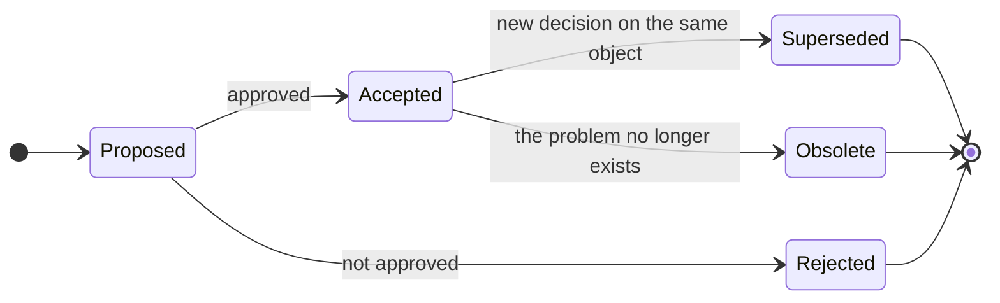

# Architectural Decision Records Register

This register contains the structural decisions of Telemedic: those that are costly to change afterwards, those that constrain more than one area, those whose violation does not produce a local defect but a systemic defect.

An ADR is not meant to say what was decided: it is meant to say **why**, which alternatives were rejected and at what cost. A register that lists decisions without reconstructing their motivation is useful to no one six months later, when someone will propose in good faith the alternative already rejected and no one will remember why.

## Format

Each ADR has five mandatory parts.

| Part | Content |
|---|---|
| **Context** | The problem, the forces at play, the constraints that restrict the solution space |
| **Alternatives evaluated** | Each with its own advantages **and** its own trade-offs. An alternative presented without advantages has not been evaluated: it has been used as a contrast |
| **Decision** | What was chosen, in a verifiable form |
| **Consequences** | Positive **and** negative. The negative ones are the most important: they are what has been accepted to pay |
| **Status** | `proposed` · `accepted` · `superseded by ADR-NNNN` · `obsolete` |

Writing rules:

- **Decisions are not deleted or rewritten.** A superseded decision changes status and refers to the one that replaces it. The chronology of decisions is part of traceability.
- **Every normative statement cites the source** and every unverified statement is marked `[NV]` with the recipient of the request.
- **Confidentiality rule**: no company names, brands, commercial products or domains of potential partners. It always says «the integrator», «a third-party healthcare management system», «a third-party EHR system».

## Lifecycle

A decision in `proposed` status **is not binding**, and the document containing it declares this together with the interim status in effect. This is the case with ADR-0023.

## Index

### Model and Boundaries

| # | Decision | Status |
|---|---|---|
| [0001](0001-separazione-prestazione-sessione-media.md) | Separation between clinical service and media session | accepted |
| [0003](0003-dominio-indipendente-dallo-standard.md) | The domain model does not know the interoperability standard | accepted |
| [0023](0023-contesto-della-rendicontazione.md) | The context of billing: proposal for deviation from the base | **proposed** |

### Data Model and Interoperability

| # | Decision | Status |
|---|---|---|
| [0002](0002-fhir-r4-profilato-guide-italiane.md) | FHIR R4 profiled on Italian guides as the canonical exchange model | accepted |
| [0004](0004-composizione-documentale-artefatto-primario.md) | Documentary composition as the primary artefact of the report | accepted |
| [0005](0005-dataset-canonico-serializzazioni-sostituibili.md) | Canonical dataset of documents and interchangeable serialisations | accepted |
| [0017](0017-uri-del-codice-fiscale.md) | Tax code system identifier and boundary translation | accepted |
| [0018](0018-catalogo-prestazioni-struttura-nel-prodotto.md) | Service catalogue: structure in the product, content per tenant | accepted |
| [0020](0020-serie-temporali-in-archivio-dedicato.md) | Time series in dedicated storage; channel metrics are not clinical observations | accepted |

### Terminologies

| # | Decision | Status |
|---|---|---|
| [0016](0016-gateway-terminologico-unico-e-disattivabile.md) | Single terminology gateway, disableable, without persistent cache and without identifiers | accepted |
| [0019](0019-separazione-stringhe-di-interfaccia-ed-etichette-ufficiali.md) | Separation between interface strings and official terminology labels | accepted |

### Interfaces and Exposition

| # | Decision | Status |
|---|---|---|
| [0006](0006-due-piani-di-esposizione.md) | Two exposition planes above a single domain model | accepted |
| [0021](0021-convenzioni-delle-interfacce-pubbliche.md) | Conventions of public interfaces | accepted |
| [0025](0025-formato-dei-token-verso-l-esterno.md) | Format of tokens to the outside | accepted |

### Events and Processes

| # | Decision | Status |
|---|---|---|
| [0008](0008-outbox-transazionale-unica-sorgente.md) | Transactional outbox as the sole source of events | accepted |
| [0009](0009-relay-outbox-per-interrogazione-periodica.md) | The outbox relay reads by periodic polling | accepted |
| [0010](0010-buste-cloudevents-consegna-e-idempotenza.md) | CloudEvents envelopes, at-least-once delivery, idempotency by construction | accepted |
| [0011](0011-eventi-magri-senza-contenuto-clinico.md) | Lean events: no clinical content in messages to the outside | accepted |
| [0012](0012-segnalamento-fuori-dal-piano-degli-eventi.md) | Session signalling does not pass through the outbox or the broker | accepted |
| [0022](0022-orchestrazione-dei-processi-clinici.md) | Explicit orchestration of critical clinical processes | accepted |

### Isolation, Identity, Demonstrability

| # | Decision | Status |
|---|---|---|
| [0007](0007-schema-per-tenant-con-sicurezza-di-riga.md) | One schema per tenant with row-level security as defence in depth | accepted |
| [0013](0013-registro-immutabile-a-quattro-strati.md) | Four-layer immutable register | accepted |
| [0015](0015-delega-esplicita-mai-impersonificazione.md) | Explicit delegation, never impersonation | accepted |
| [0029](0029-registro-di-fiducia-unico-per-tenant.md) | Single trust register per tenant | accepted |
| [0027](0027-modalita-a-non-conservazione-del-contenuto-clinico.md) | Operating mode with no retention of clinical content | accepted |

### Real-time Media

| # | Decision | Status |
|---|---|---|
| [0014](0014-due-modalita-di-sessione-media.md) | Two media session modes and their effects on the model | accepted |
| [0028](0028-limite-dichiarato-di-partecipanti.md) | Declared limit of media session participants | **partially accepted**: the number is deferred to a measurement |

### Telemonitoring

| # | Decision | Status |
|---|---|---|
| [0026](0026-regole-del-piano-di-telemonitoraggio.md) | Representation and execution of telemonitoring plan rules | accepted |
| [0030](0030-due-proiezioni-del-piano-da-una-sola-fonte.md) | The two projections of the plan derive from a single source | accepted |
| [0024](0024-punteggi-di-scale-cliniche-esclusi-in-via-cautelativa.md) | Scores of clinical scales and questionnaires excluded as a precaution | accepted, provisional |

## Mapping between decisions and project constraints

| Constraint | Decisions that implement it |
|---|---|
| **V1** - Data sovereignty | 0016 (sovereignty by absence of data) · 0009 (no additional component) |
| **V2** - Separation between vehicle and interpretation | 0004 · 0020 · 0024 |
| **V3** - Total integrability | 0006 · 0021 |
| **V4** - Tenant awareness | 0007 · 0008 (outbox per tenant) · 0010 (tenant mandatory in envelope) · 0013 (chain per tenant) |
| **V5** - Immutable auditability | 0013 · 0015 |
| **V6** - Usability, accessibility, mobile first | 0014 (indicator not concealable) · 0019 (adaptable strings) · 0028 (declared limit instead of silent degradation) |

## Constraints from Other Areas Adopted in ADRs

| Constraint | From | Adopted in |
|---|---|---|
| V-111 expand and contract on every migration | `TECH` | 0007 |
| V-112 tenant context inside the transaction | `TECH` | 0007 |
| V-113 no raw cumulative counter as an indicator | `TECH` | 0020 |
| V-121 the alarm is a sequence of immutable events | `FUNC` | 0026 |
| V-123 the threshold field starts empty and mandatory | `FUNC` | 0026 |
| V-124 measurement instant and reception instant distinct | `FUNC` | 0020 · 0026 |
| V-126 typed outcomes are not error codes | `FUNC` | 0021 |
| V-131 delivery of candidates exactly once and in order | `PROTO` | 0012 |
| V-134 no dedicated header for content type | `PROTO` | 0010 |
| V-135 loading of events with references only | `PROTO` | 0011 |
| V-136 no hardcoded documentary model | `PROTO` | 0005 |
| V-137 session key and room address are credentials | `PROTO` | 0025 |
| V-142 normalisation of identifiers at the boundary | `DOM` | 0017 |
| V-144 formulation of the intended purpose of telemonitoring | `DOM` | 0026 |
| V-146 five distinct objects of consent | `DOM` | 0014 |
| V-147 no care pathway in code | `DOM` | 0026 |
| V-149 obscuration applied by the authorisation engine | `DOM` | 0027 |
| V-151 no patient identifier to the terminology service | `SEC` | 0016 |
| V-156 no static declaration of negotiated suites | `SEC` | 0014 |
| V-157 single outbound mediator | `SEC` | 0029 |
| V-161 no clinical content in outbound messages | `INTEG` | 0011 |
| V-166 administrative payer profile by construction | `INTEG` | 0023 |

## Mapping between Decisions and Noticeboard Questions

| Question | Resolved by |
|---|---|
| Service catalogue included or referenced | 0018 |
| Separation between internationalisation and official labels | 0019 |
| Terminology server as third-party component, residual part | 0016 |
| Divergence of tax code URIs | 0017 |
| Server-side recording and encryption to the endpoints | 0014 |
| Licences for clinical scales and questionnaires, precautionary measure | 0024 |
| Ten conventions of public interfaces | 0021 |
| Immutable register technique | 0013 |
| Orchestration against choreography | 0022 |
| Mode of outbox relay | 0009 |
| Signalling must not pass through the outbox | 0012 |
| Switches and quotas per tenant, not global | 0008 · 0021 |
| Isolation: schema per tenant or row-level security | 0007 |
| Topology of the signal across multiple instances | 0012 |
| Distribution of session state with ordered delivery | 0012 |
| Declared limit of participants | 0028 |
| Format of tokens to the outside | 0025 |
| Representation and execution of plan rules | 0026 |
| Where the alarm history lives with no content retention | 0027 |
| Operating mode with no retention of clinical content | 0027 |
| Single trust register per tenant | 0029 |
| The two projections of the telemonitoring plan | 0030 |
| Anchor point and frequency of the register | 0013 |

## How to Propose a Change

1. It is verified whether the object is already handled: a decision made is **superseded**, not circumvented.
2. It is verified whether it falls among the [deferred decisions](../02_architecture/09-decisioni-rinviate.md): in that case no decision is made in a pull request, a voice is opened on the inter-agent noticeboard.
3. A new ADR is written with `proposed` status, referring to the one it intends to supersede.
4. It is declared on the noticeboard, indicating the constrained areas.
5. Upon approval, the superseded ADR changes status and refers to the new one. **It is not deleted.**

## What Does Not Enter This Register

Library choices, build module structure and code conventions belong to the technical area; safety measures and their configuration to the security area; contracts towards third-party systems to the integration area. Only decisions that **constrain more than one area** or that are **costly to change** enter here.

The operational criterion: if the decision can be changed by a single team in a single pull request without coordination, it is not an ADR.
